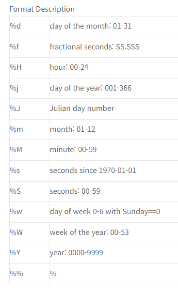

# SQL (SQLite) - Field에서 연도 추출하기 - strftime Function

## [3054. SQL 그룹화 조회 - invoices 2](DB - 2차. SQL 2)

* 문제

    1. 'BillingCountry'를 기준으로 그룹화하고, 각 나라별 총판매액을 계산하여 조회하시오.

    2. 'InvoiceDate'를 연도별로 그룹화하고, 각 연도별 총판매액을 계산하여 조회하시오.

    3. 'BillingCountry'이 'USA'이고 'InvoiceDate'가 2010년 01월 01일 이후인 레코드를 'BillingState'를 기준으로 그룹화하고, 각 주별로 총 주문 금액을 계산하여 조회하시오.

    4. 'BillingCountry'이 'Germany'이거나 'BillingCountry'이 'France'인 레코드를 'BillingCountry'를 기준으로 그룹화하고, 각 나라별로 최대 주문 금액을 계산하여 조회하시오.

* 제출답안

    ```SQL
    -- 1.
    SELECT BillingCountry, SUM(Total) FROM invoices GROUP BY BillingCountry;

    -- 2.
    -- string format - time
    -- strftime(time_format, field) : 지정된 형식에 따라 datetime 값을 형식화하는 데 이용
    SELECT strftime('%Y', InvoiceDate) AS YEAR, SUM(Total) FROM invoices GROUP BY strftime('%Y', InvoiceDate);

    -- 3.
    SELECT BillingState, SUM(Total) FROM invoices WHERE BillingCountry = 'USA' AND InvoiceDate > '2010-01-01' GROUP BY BillingState;

    -- 4.
    SELECT
        BillingCountry, MAX(Total)
    FROM
        invoices
    WHERE
        BillingCountry IN ('Germany', 'France')
    GROUP BY
        BillingCountry;
    ```

* 참고자료 - Format Description

    

    [Link](https://www.sagein.net/669)