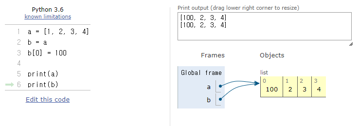
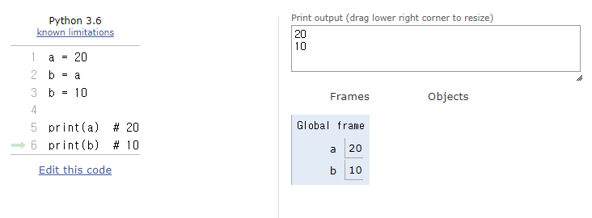
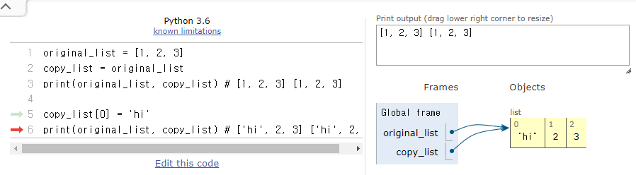
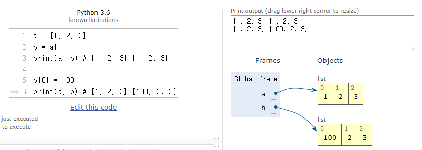
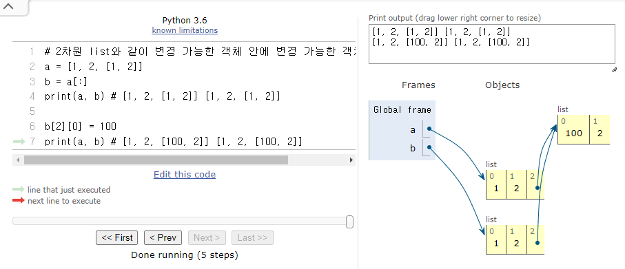
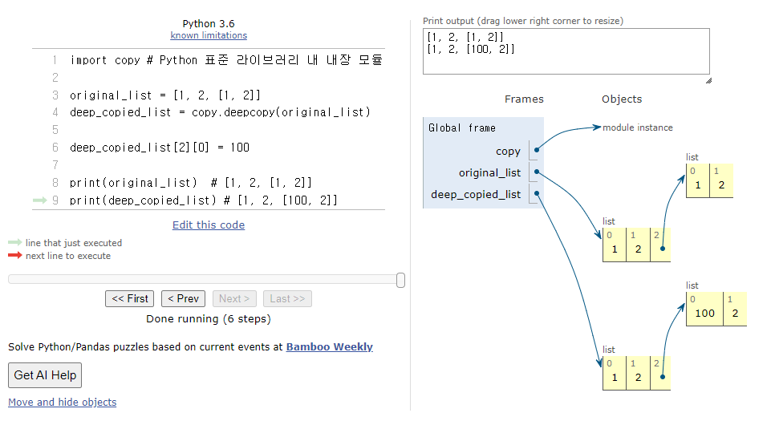
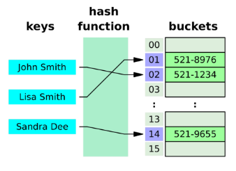

# Data Structures

<div style="text-align: right"> 24. 01. 22. ~ 24. 01. 23. </div>

## 1. 데이터 구조  

* 데이터 구조(Data Structure) 

    * 여러 데이터를 효과적으로 사용, 관리하기 위한 구조

    * str, list, dict 등
    
* 자료 구조
  
    * 각 데이터의 효율적인 저장, 관리를 위한 구조를 나눠 놓은 것

    ```python
    '자료구조' = {
        '단순 구조': {
            '정수', '실수', '문자', '문자열'
        },
        '선형 구조': {
            '순차 리스트',
            '연결 리스트': {
                '단순 연결 리스트', '이중 연결 리스트', '원형 연결 리스트'
            },
            '스택',
            '큐',
            '덱'
        },
        '비선형 구조': {
            '트리': {
                '일반 트리', '이진 트리'
            }, 
            '그래프': {
                '방향 그래프', '무방향 그래프'
            }
        },
        '파일 구조': {
            '순차 파일', '색인 파일', '직접 파일'
        }
    }
    ```

## 2. 메서드

* 객체에 속한 함수로, 객체의 상태를 조작하거나 동작을 수행

* **method는 class 내부에 정의되는(class 어딘가에 속해 있는) 함수**

* **각 data type별로 다양한 기능을 가진 method가 존재**

* 예를 들어 help 함수를 통해 str을 호출해보면 class 였다는 것을 확인 가능

    ```python
    print(help(str))

    """
    Help on class str in module builtins:

    class str(object)
    |  str(object='') -> str
    |  str(bytes_or_buffer[, encoding[, errors]]) -> str
    |
    |  Create a new string object from the given object. If encoding or
    |  errors is specified, then the object must expose a data buffer
    |  …
    """
    ```

* method 호출 방법 및 예시

    ```python
    data_type.method()

    # string method
    'hello'.capitalize()  # Hello

    # list method
    numbers = [1, 2, 3]
    numbers.append(4)

    print(numbers)  # [1, 2, 3, 4]
    ```


## 3. 시퀀스 데이터 구조(Sequence Data Structure) - string, list

* string 조회/탐색 및 검증 method  

    | method | 설명 |
    | :------------------: | :-----------------------------------------------------------------------------------: |
    | s.find(x) | x의 첫 번째 위치를 반환. 없으면, -1을 반환 	|
    | s.index(x) | x의 첫 번째 위치를 반환. 없으면, 오류 발생 |
    | s.isalpha() | 알파벳 문자 여부<br>* 단순 알파벳이 아닌 유니코드 상 Letter (한국어도 포함) 	|
    | s.isupper() | 대문자 여부 |
    | s.islower() | 소문자 여부 |
    | s.istitle() | 타이틀 형식 여부 |
    | |  

    ```python
    # .index(x)
    # x의 첫 번째 위치를 반환. 없으면 오류 발생 반환
    print('banana'.index('a'))  # 1
    print('banana'.index('z'))  # ValueError: substring not found

    # .find(x)
    # x의 첫 번째 위치를 반환. 없으면 -1을 반환
    print('banana'.find('a')) # 1
    print('banana'.find('z')) # -1

    # .isupper(x) / .islower(x)
    string1 = 'HELLO'
    string2 = 'Hello'
    print(string1.isupper()) # True
    print(string2.isupper()) # False
    print(string1.islower()) # False
    print(string2.islower()) # False

    # .isalpha(x)
    # 문자열이 알파벳으로만 이루어져 있는지 확인
    string1 = 'Hello'
    string2 = '123'
    print(string1.isalpha()) # True
    print(string2.isalpha()) # False
    ```

* string 조작 method  

    | method | 설명 |
    |:---------------------------------------: | :--------------------------------------------------------------------------------------------:	|
    | s.replace(old, new[,count]) | 바꿀 대상 글자를 새로운 글자로 바꿔서 반환 |
    | s.strip([chars]) | 공백이나 특정 문자를 제거 |
    | s.split(sep = None, maxsplit = -1) | 공백이나 특정 문자를 기준으로 분리 	|
    | 'separator'.join(iterable) | 구분자로 iterable을 합침 	|
    | s.capitalize() | 가장 첫 번째 글자를 대문자로 변경 	|
    | s.title() | 문자열 내 띄어쓰기 기준으로 각 단어의 첫 글자는 대문자로, 나머지는 소문자로 변환 |
    | s.upper() | 모두 대문자로 변경 	|
    | s.lower() | 모두 소문자로 변경 |
    | s.swapcase() | 대↔소문자 서로 변경	|
    | |  

    ```python
    # .replace(old, new[, count]) : 바꿀 대상 글자를 새로운 글자로 바꿔 반환
    text = 'Hello, world'
    new_text = text.replace('world', 'Python')
    print(new_text) # Hello, Python!

    # .strip([chars]) : str의 시작과 끝에 있는 공백 혹은 지정한 문자 제거
    text = '   Hello, world!   '
    new_text = text.strip()
    print(new_text) # Hello, world!

    # .split(sep = None, maxsplit = -1) : 지정한 문자를 구분자로 문자열을 분리하여 str의 list로 반환
    test = 'Hello, world!'
    words = text.split(',')
    print(words)  # ['Hello', ' world!']

    # 'separator'.join(iterable) : iterable 요소들의 원래의 str을 구분자로 이용해 하나의 문자열로 연결
    words = ['Hello', 'world!']
    text = '-'.join(words)
    print(text) # Hello-world!
    ```

    * string 조작 - 기타 method  

        ```python
        text = 'heLLo, woRld!'
        new_text1 = text.capitalize()
        new_text2 = text.title()
        new_text3 = text.upper()
        new_text4 = text.swapcase()

        print(new_text1)  # Hello, world!
        print(new_text2)  # Hello, World!
        print(new_text3)  # HELLO, WORLD!
        print(new_text4)  # HEllO, WOrLD!

        # method 이어서 사용하기
        new_text = text.swapcase().replace('l', 'z')
        print(new_text) # HEzzO, WOrLD!
        ```  

* list 값 추가 및 삭제 method  

    | method | 설명 |
    | :-----------------------: | :-------------------------------------------------------------------------------------------------------:	|
    | L.append(x) | 리스트 마지막에 항목 x를 추가 |
    | L.extend(m) | Iterable m의 모든 항목들을 리스트 끝에 추가 (+=과 같은 기능) |
    | L.insert(i, x) | 리스트 인덱스 i에 항목 x를 삽입 	|
    | L.remove(x) | 리스트 가장 왼쪽에 있는 항목(첫 번째) x를 제거<br>항목이 존재하지 않을 경우, ValueError |
    | L.pop() | 리스트 가장 오른쪽에 있는 항목(마지막)을 반환 후 제거 |
    | L.pop(i) | 리스트의 인덱스 i에 있는 항목을 반환 후 제거 |
    | L.clear() | 리스트의 모든 항목 삭제	|
    | |

    ```python
    # .append(x) : list 마지막에 항목 x를 추가
    my_list = [1, 2, 3]
    my_list.append(4)
    print(my_list)  # [1, 2, 3, 4]

    # .extend(iterable) : list에 다른 반복 가능한 객체의 모든 항목을 추가
    my_list = [1, 2, 3]
    my_list.extend([4, 5, 6])
    print(my_list)  # [1, 2, 3, 4, 5, 6]

    # .insert(i, x) : list의 지정한 인덱스 i 위치에 항목 x를 삽입
    my_list [1, 2, 3]
    my_list.insert(1, 5)
    print(my_list)  # [1, 5, 2, 3]

    # .remove(x) : list에서 첫 번째로 일치하는 항목을 삭제
    my_list = [1, 2, 3]
    my_list.remove(2)
    print(my_list)  # [1, 3]

    # .pop(i)
    # list에서 지정한 인덱스의 항목을 제거하고 반환
    # i를 작성하지 않을 경우 마지막 항목을 제거
    my_list = [1, 2, 3, 4, 5]

    item1 = my_list.pop() # my_list에서 5 제거, 제거된 5가 item1 변수에 반환
    item2 = my_list.pop(0)  # my_list에서 1 제거, 제거된 1이 item2 변수에 반환

    print(item1)  # 5
    print(item2)  # 1
    print(my_list)  # [2, 3, 4]

    # .clear() : list의 모든 항목 삭제
    my_list = [1, 2, 3]
    my_list.clear()
    print(my_list)  # []
    ```  

* list 탐색 및 정렬 method  

    | 문법 | 설명 |
    | :-------------------------------: | :----------------------------------------------------------------------: |
    | L.index(x, start, end) | 리스트에 있는 항목 중 가장 왼쪽에 있는 항목 x의 인덱스를 반환 |
    | L.reverse() | 리스트의 순서를 역순으로 변경 (정렬 X) |
    | L.sort() | 리스트를 정렬 (매개변수   이용가능) |
    | L.count(x) | 리스트에서 항목 x의 개수를 반환 |
    | |

    ```python
    # .index(x) : list에서 첫 번째로 일치하는 항목의 인덱스 반환
    my_list = [1, 2, 3]
    index = my_list.index(2)
    print(index)  # 1

    # .count(x) : list에서 항목 x가 등장하는 횟수를 반환
    my_list [1, 2, 2, 3, 3, 3]
    count = my_list.count(3)
    print(count)  # 3

    # .sort() : 원본 리스트를 오름차순으로 정렬
    my_list = [3, 1, 2]
    my_list.sort()
    print(my_list)  # [1, 2, 3]

    # .reverse() : list의 순서를 역순으로 변경(정렬 X)
    my_list = [1, 3, 2, 8, 1, 9]
    my_list.reverse()
    print(my_list)  # [9, 1, 8, 2, 3, 1]
    ```

## 4. 복사

* 데이터 타입과 복사  

    * Python에서는 데이터의 분류에 따라 복사가 달라짐

    * *변경 가능한 데이터 타입*과 *변경 불가능한 데이터 타입*을 다르게 다룸

* 변경 가능한 데이터 타입의 복사

    ```python
    a = [1, 2, 3, 4]
    b = a
    b[0] = 100

    print(a)  # [100, 2, 3, 4]
    print(b)  # [100, 2, 3, 4]
    ```

    

* 변경 불가능한 데이터 타입의 복사

    ```python
    a = 20
    b = a
    b = 10

    print(a)  # 20
    print(b)  # 10
    ```

    

* 복사 유형

    1. 할당(assignment)

        ```python
        original_list = [1, 2, 3]
        copy_list = original_list
        print(original_list, copy_list) # [1, 2, 3] [1, 2, 3]

        copy_list[0] = 'hi'
        print(original_list, copy_list) # ['hi', 2, 3] ['hi', 2, 3]
        ```

        

        * 할당 연산자(=)를 통한 복사는 해당 객체에 대한 **객체 참조를 복사**

    2. 얕은 복사(shallow copy)

        ```python
        a = [1, 2, 3]
        b = a[:]
        print(a, b) # [1, 2, 3] [1, 2, 3]

        b[0] = 100
        print(a, b) # [1, 2, 3] [100, 2, 3]
        ```

        

        * 슬라이싱을 통해 생성된 객체는 원본 객체와 독립적으로 존재

        * 얕은 복사의 한계

            ```python
            # 2차원 list와 같이 변경 가능한 객체 안에 변경 가능한 객체가 있을 경우
            a = [1, 2, [1, 2]]
            b = a[:]
            print(a, b) # [1, 2, [1, 2]] [1, 2, [1, 2]]

            b[2][0] = 100
            print(a, b) # [1, 2, [100, 2]] [1, 2, [100, 2]]
            ```

            

            * a와 b의 주소는 다르지만 내부 객체의 주소는 같기 때문에 함께 변경됨
    
    3. 깊은 복사(deep copy)

        ```python
        import copy # Python 표준 라이브러리 내 내장 모듈

        original_list = [1, 2, [1, 2]]
        deep_copied_list = copy.deepcopy(original_list)

        deep_copied_list[2][0] = 100

        print(original_list)  # [1, 2, [1, 2]]
        print(deep_copied_list) # [1, 2, [100, 2]]
        ```

        

        * 내부에 중첩된 모든 객체까지 새로운 객체 주소를 참조하도록 함

## 5. 비시퀀스 데이터 구조 (非Sequence Data Structure) - set, dictionary

* set

    * 집합 연산에서 자주 활용

    * 데이터에 중복이 없고(고유하고), 정렬되지 않은(Non-sequence, 인덱싱으로 접근이 불가능한) collection

    | Method | 설명 |
    | :---: | :---: |
    | s.add(x) | set s에 항목 x를 추가. 이미 x가 있다면 변화 없음 |
    | s.clear() | set s의 모든 항목을 제거 |
    | s.remove(x) | set s에서 항목 x를 제거.<br>항목 x가 없을 경우 Key error |
    | s.pop(x) | set s에서 랜덤하게 항목을 반환하고, 해당 항목을 제거<br>요소간 확률에 차이가 발생함(후술) |
    | s.discard(x) | set s에서 항목 x를 제거.<br>remove와 달리 error가 없음 |
    | s.update(iterable) | set s에 다른 iterable 요소를 추가 |
    | |

    ```python
    # .add(x) : set에 x를 추가
    # 이미 x가 있다면 변화 없음
    my_set = {'a', 'b', 'c', 1, 2, 3}

    my_set.add(4)
    print(my_set) 
                      
    my_set.add(4)
    print(my_set)

    # .clear() : set의 모든 항목 제거
    my_set = {'a', 'b', 'c', 1, 2, 3}

    my_set.clear()
    print(my_set)

    # .remove(x) : set에서 항목 x를 제거
    # 항목 x가 없을 경우 Key error
    my_set = {'a', 'b', 'c', 1, 2, 3}

    my_set.remove(2)
    print(my_set) 

    my_set.remove(10)
    print(my_set) 

    # .discard(x) : set s에서 항목 x를 제거. remove와 달리 error가 없음
    my_set = {1, 2, 3}

    my_set.discard(2)
    print(my_set)

    my_set.discard(10)

    # .pop() : set에서 임의의 요소를 제거하고 반환
    my_set = {'a', 'b', 'c', 1, 2, 3}

    element = my_set.pop()

    print(element)
    print(my_set) 

    # .update(iterable) : set에 다른 iterable 요소 추가
    my_set = {'a', 'b', 'c', 1, 2, 3}

    my_set.update([1, 4, 5])
    print(my_set)
    ```

    * set의 집합 method

        | Method | 설명 | 연산자 |
        | :---: | :---: | :---: |
        | set1.difference(set2) | set1에는 들어있지만 set2에는 없는 항목으로 세트를 생성 후 반환 | set1 – set2 |
        | set1.intersection(set2) | set1과 set2 모두 들어있는 항목으로 세트를 생성 후 반환 | set1 & set 2 |
        | set1.issubset(set2) | set1의 항목이 모두 set2에 들어있으면 True를 반환 | set1 <= set2 |
        | set1.issuperset(set2) | set1가 set2의 항목을 모두 포함하면 True를 반환 | set1 >= set2 |
        | set1.union(set2) | set1 또는 set2에(혹은 둘 다) 들어있는 항목으로 세트를 생성 후 반환 | set1 \| set2 |

        ```python
        set1 = {0, 1, 2, 3, 4}
        set2 = {1, 3, 5, 7, 9}

        print(set1.difference(set2))  # {0, 2, 4}
        print(set1.intersection(set2))  # {1, 3}
        print(set1.issubset(set2))  # False
        print(set1.issuperset(set2))  # False
        print(set1.union(set2)) #{0, 1, 2, 3, 4, 5, 7, 9}
        ```

* dictionary

    * 고유한 항목들(중복이 없는)의, 정렬되지 않은 key - value형 data collection

    | Method | 설명 |
    | :---: | :---: |
    | D.clear() | 딕셔너리 D의 모든 키/값 쌍을 제거 | | D.get(k) | 키 k에 연결된 값을 반환<br>(키가 없으면 None을 반환) |
    | D.get(k, v) | 키 k에 연결된 값을 반환하거나 키가 없으면 None 혹은 기본 값으로 v를 반환 |
    | D.keys() | 딕셔너리 D의 키를 모은 객체를 반환<br>type(D.keys()) : dict_keys → list(D.keys())로 변환 가능 |
    | D.values() | 딕셔너리 D의 값을 모은 객체를 반환 |
    | D.items() | 딕셔너리 D의 키/값 쌍을 모은 객체를 반환 |
    | D.pop(k) | 딕셔너리 D에서 키 k를 제거하고 연결됐던 값을 반환 (없으면 오류) |
    | D.pop(k, v) | 딕셔너리 D에서 키 k를 제거하고 연결됐던 값을 반환<br>(없으면 v를 반환) |
    | D.setdefault(k) | 딕셔너리 D에서 키 k와 연결된 값을 반환 |
    | D.setdefault(k, v) | 딕셔너리 D에서 키 k와 연결된 값을 반환<br>k가 D의 키가 아니면 값 v와 연결한 키 k를 D에 추가하고 v를 반환 |
    | D.update(other) | other 내 각 키에 대해 D에 있는 키면 D에 있는 그 키의 값을 other에 있는 값으로 대체.<br>other에 있는 각 키에 대해 D에 없는 키면 키/값 쌍을 D에 추가 |
    | |


## 6. 참고 자료

* 문자열에 포함된 문자들의 유형을 판별하는 method
  
    * is~로 시작하는 method : return이 T/F

    * isdecimal()

        * 문자열이 모두 숫자 문자(0 ~ 9)로만 이루어져 있어야 True

    * isdigit()

        * isdecimal()과 비슷하지만, 유니코드 숫자도 인식('①'도 숫자로 인식)

    * isnumeric()

        * isdigit()과 비슷하지만, 몇 가지 추가적인 유니코드 문자들을 인식

        * 분수, 지수, 루트 기호도 숫자로 인식

* 해시 테이블 (Hash Table)

    * 해시 함수를 사용해, 변환한 값을 인덱스로 삼아 key와 data(value)를 저장하는 자료 구조

    * data를 효율적으로 저장하고 검색하기 위해 사용

        ```python
        dict = {
          'John': '521-1234',
          'Lisa': '521-8976',
          'Sandra': '521-9655'
        }
        ```

        

        * key를 해시 함수를 통해 해시 값으로 변환하고, 이 해시 값을 인덱스로 사용해 데이터를 저장하거나 검색

        * 데이터 검색이 매우 빠르게 이루어짐

    * 해시 (Hash)

        * 임의의 크기를 가진 데이터를, 고정된 크기의 고유한 값으로 변환하는 것

        * 이렇게 생성한 고유값은 주로 해당 데이터를 식별하는 데 사용될 수 있음 → 일종의 '지문' 역할

        * Python에서는 해시 함수를 사용해 데이터를 해시 값으로 변환하며, 이 해시 값은 정수로 표현됨

    * 해시 함수 (Hash function)

        * 임의의 길이의 데이터를 입력받아, 고정된 길이의 데이터(해시 값)를 출력하는 함수

        * 주로 해시 테이블 자료구조에 사용되며, 매우 빠른 데이터 검색을 위한 컴퓨터 SW에서 유용하게 사용

    * set의 요소 & dictionary의 key와 해시 테이블 관계

        * Python에서 set의 요소와 dictionary의 key는 해시 테이블을 이용해 중복되지 않는 고유한 값을 저장

            * set 내 각 요소는 해시 함수를 통해 해시 값으로 변환되고, 이 해시 값을 기반으로 해시 테이블에 저장

            * dictionary의 key는 고유해야 하므로, key를 해시 함수를 통해 해시 값으로 변환해 해시 테이블에 저장 → dictionary의 key는 매우 빠른 탐색 속도를 제공하며, 중복값을 허용하지 않음

    * Python에서의 해시 함수

        | case | explanation |
        | :--- | :--- |
        | 정수 | ■ 같은 정수는 항상 같은 해시 값을 가짐<br> ■ 해시 테이블에 정수를 저장할 때 효율적인 방법<br> ■ 예를 들어, hash(1)과 hash(2)는 항상 서로 다른 해시 값을 갖지만, hash(1)은 항상 동일한 해시 값을 갖게 됨 |
        | 문자열 | ■ 문자열은 가변적인 길이를 갖고 있고, 문자열에 포함된 각 문자들의 유니코드 코드 포인트 등을 기반으로 해시 값 계산<br> ■ 이로 인해, 문자열의 해시 값은 실행 시마다 다르게 계산됨 |
        | |

    * set의 pop method의 결과와 해시 테이블의 관계

        * pop method는 set에서 임의의 요소를 제거하고 반환

        * 실행할 때마다 다른 요소를 얻는다는 의미에서의 *무작위*가 아니라, *"임의"*라는 의미에서의 *"무작위"* → By "arbitrary" the docs don't mean "random"

        * 해시 테이블에 나타나는 순서대로 반환하는 것

    * hashable

        * hash() 함수의 인자로 전달해서 결과를 반환받을 수 있는 객체를 hashable이라고 함

        * 대부분의 불변형 데이터 타입은 hashable

        * 단, tuple의 경우 불변형이지만 해시 불가능한 객체를 참조할 때는 tuple 자체도 해시 불가능해지는 경우가 있음

        ```python
        print(hash(1))
        print(hash(1.0))
        print(hash('1'))
        print(hash((1, 2, 3)))

        # TypeError: unhashable type: 'list'
        print(hash((1, 2, [3, 4])))
        ```

        * *해시 테이블의 키는 불변해야 함* → 객체 생성 후에 그 값을 변경할 수 없어야 함

        * 불변 객체는 해시 값이 변하지 않으므로, 동일한 값에 대해 일관된 해시 값을 유지할 수 있음

            * 단, "hash 가능하다 != 불변하다"

        * 가변형 객체가 hashable하지 않은 이유
          
            * 값이 변경될 수 있기 때문에, 동일한 객체에 대한 해시 값이 변경될 가능성이 있음 → 해시 테이블의 무결성 유지 불가

            * 가변형 객체가 변경되면 해시 값이 변경되기 때문에, 같은 객체에 대한 서로 다른 해시 값이 반환될 수 있음 → 해시 값의 일관성 유지 불가
      
                ```python
                # TypeError: unhashable type: 'list'
                print(hash([1, 2, 3]))

                # TypeError: unhashable type: 'list'
                my_set = {[1, 2, 3], 1, 2, 3, 4, 5}

                # TypeError: unhashable type: 'set'
                my_set = {{3, 2}: 'a'}
                ```

    * hashable 객체가 필요한 이유

        1. 해시 테이블 기반 자료 구조 사용

            * set와 dict의 key

            * 중복 값 방지

            * 빠른 검색과 조회

        2. 불변성을 통한 일관된 해시 값

        3. 안정성과 예측 가능성 유지

## 7. 참고

* [배커스-나우르 표기법(Backus-Naur form, BNF)](https://en.wikipedia.org/wiki/Backus%E2%80%93Naur_form)

    * 당신이 어떤 프로그래밍 언어(문법)을 쓰던 간에 이 표기법을 활용해 설명하자(표기법).

    * 기계가 읽을 수 있는(machine-readable) 형식의 문법을 명확히 정의 또는 표준화하기 위해 사용된다.

* 해시

    * set / dictionary → 검색 성능
    
    * 자료 수가 증가하면 → 검색 시간 또한 자료 수에 비례해 증가

        ```python
        lst = {10, 1, 4, 5, 9, 123, ...}
        key = 4653

        # 내부에서 for문이 도는 case → 자료가 10만, 100만 개가 되면 시간이 오래 걸릴 것
        for val in lst:
          if key == val:
            print('찾았다')

        # key 값을 hash로 찾는 경우
        if key in lst:  # membership 연산자
          print('찾았다')
        # list에서 membership을 사용하는 경우는 for문을 사용하는 것과 같기 때문에 시간이 오래 걸릴 것
        
        ```