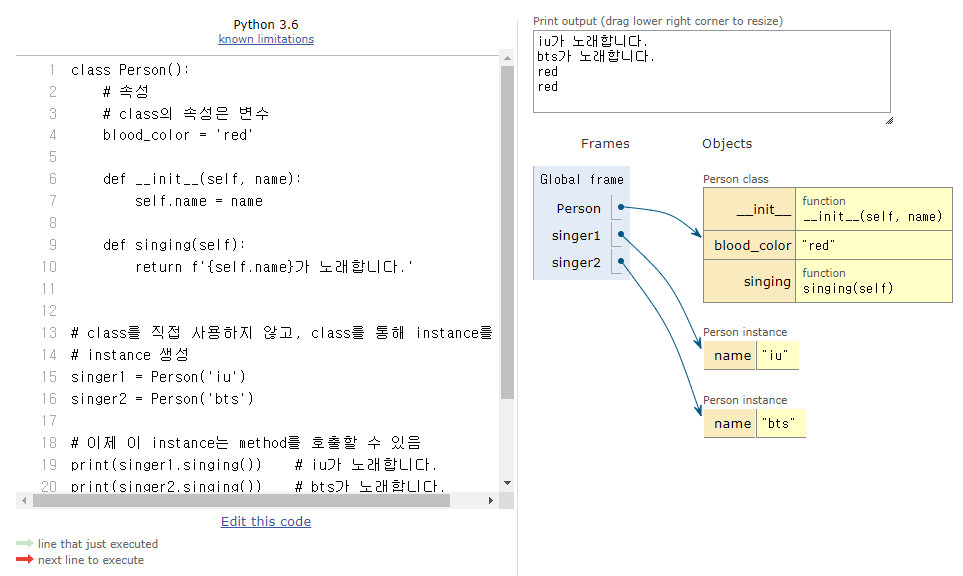

# OOP

<div style="text-align: right"> 24. 01. 24. ~ 24. 01. 25. </div>

## 1. 절차 지향 프로그래밍

* 절차 지향 프로그래밍 (Procedural Programming)

    * 프로그램을 '데이터'와 '절차'로 구성하는 방식의 프로그래밍 패러다임

    * '데이터'와, 해당 데이터를 처리하는 '함수(절차)'가 분리되어 있으며, 함수 호출의 흐름이 중요

    * 코드의 순차적인 흐름과 함수 호출에 의해 프로그램이 진행

    * 실제로 실행되는 내용이 무엇이 무엇인가가 중요함

    * 데이터를 다시 재사용하거나 하기보다는 처음부터 끝까지 실행되는 결과물이 중요한 방식

* 소프트웨어 위기 (Software Crisis)

    * 하드웨어의 발전으로 컴퓨터 계산용량과 문제의 복잡성이 급격히 증가함에 따라 소프트웨어에 발생한 충격

## 2. 객체 지향 프로그래밍

* 객체 지향 프로그래밍 (Object Oriented Programming, **OOP**)

    * 데이터와 해당 데이터를 조작하는 메서드를 *하나의 객체로 묶어(Class)* 관리하는 방식의 프로그래밍 패러다임
    
        | 지향성 | 설명 |
        | :---: | :--- |
        | 절차 지향 | 데이터와 해당 데이터를 처리하는 함수(절차)가 분리<br>함수 호출의 흐름이 중요 |
        | 객체 지향 | 데이터와 해당 데이터를 처리하는 method(메시지)를 하나의 객체(class)로 묶음<br>객체 간 상호작용과 메시지 전달이 중요 |
        | |

## 3. 객체

* 클래스 (Class)

    * Python에서 타입을 표현하는 방법

        * 객체를 생성하기 위한 설계도(청사진, blueprint)

        * 데이터와 기능을 함께 묶는 방법을 제공

* 객체 (Object)

    * Class에서 정의한 것을 토대로 메모리에 할당된 것

    * '속성(variable)'과 '행동(method)'으로 구성된 모든 것

    * Class A로 만든 객체를 Class A의 인스턴스(instance)라고도 함

    
    ```python
    name = 'Alice'

    print(type(name)) # <class 'str'>

    # 변수 name의 type은 'str class'이다.
    # 변수 name은 str class의 instance이다.
    # 우리가 사용해왔던 data type은 모두 class였다.
    # str type의 변수는, str class로 만든 'instance'이다.

    lst = [1, 2, 3]
    # list type(class)의 object(instance)
    ```

* instance와 method

    * instance는 class 내 method를 호출할 수 있음

    ```python
    # class str 내에 upper 함수가 존재함
    # class 안에 존재하는 함수를 method라고 함

    'hello'.upper()

    # 함수 호출 방식이 def와 다름
    # 문자열.대문자로()
    # 객체.행동()
    # instance.method()

    # class list 내 sort 함수

    [1, 2, 3].sort()

    # 리스트.정렬해()
    # 객체.행동()
    # instance.method()
    ```

* 하나의 객체는 특정 타입의 인스턴스이다.

    * 123, 900, 5는 모두 int의 instance

    * 'hello', 'bye'는 모두 str의 instance

    * [1, 2, 3]은 list의 instance

* 객체의 특징

    * 타입 (type) : 어떤 연산자(operator)와 조작(method)이 가능한가?

    * 속성 (attribute) : 어떤 상태(데이터)를 가지는가?

    * 조작법 (method) : 어떤 행위(함수)를 할 수 있는가?

* Python에서의 객체와 클래스

    * 객체(Object) = 속성(Attribute) + 기능(Method)

## 4. 클래스

* 클래스 (Class) (반복)

    * Python에서 타입을 표현하는 방법

        * 객체를 생성하기 위한 설계도(청사진, blueprint)

        * 데이터와 기능을 함께 묶는 방법을 제공

    * 클래스 구조

    ```python
    # 클래스 정의
    # 클래스 선언 시 Style Guide 상 Pascal case(Upper camel case) 사용이 권장됨
    # 언더바를 붙이지 않고, 키워드마다 대문자를 사용함
    # 별도로 들어오는 값이 없다면 소괄호를 생략 가능

    class Person: 
        pass

    # 클래스를 통해 인스턴스를 찍어냄
    # 인스턴스 생성
    iu = Person()

    # 메서드 호출
    iu.메서드()

    # 속성(변수) 접근
    iu.attribute
    ```

    * 클래스 기본 활용

      * 생성자 함수 (\_\_init\_\_(self, name))

        * \_\_init\_\_ (생성자 함수) : 객체를 생성할 때 자동으로 호출되는 특별한 메서드

        * 생성자 함수를 통해 인스턴스를 생성하고 필요한 초기값을 설정

      * 인스턴스 변수

        * 인스턴스(객체)마다 별도로 유지되는 변수

        * 인스턴스마다 독립적인 값을 가지며(서로 공유하지 않음), 인스턴스가 생성될 때마다 초기화됨

      * 클래스 변수(클래스 속성)

        * 클래스 내부에 선언된 변수

        * 클래스로 생성된 모든 인스턴스들이 공유하는 변수

      * 인스턴스 메서드

        * 각각의 인스턴스에서 호출할 수 있는 메서드

        * 인스턴스 변수에 접근하고 수정하는 등의 작업을 수행

            ```python
            class Person():
                # 클래스 변수(속성)
                blood_color = 'red'

                # 생성자 함수
                def __init__(self, name):
                    # 인스턴스 변수
                    self.name = name

                # 인스턴스 메서드
                def singing(self):
                    return f'{self.name}가 노래합니다.'
            
            # class를 직접 사용하지 않고, class를 통해 instance를 생성
            # instance 생성
            singer1 = Person('iu')
            singer2 = Person('bts')

            # 이제 이 instance는 method를 호출할 수 있음
            print(singer1.singing())    # iu가 노래합니다.
            print(singer2.singing())    # bts가 노래합니다.

            # 속성 접근
            print(singer1.blood_color)  # red
            print(singer2.blood_color)  # red
            ```

    * 인스턴스와 클래스 간의 이름 공간(namespace)

        * 클래스를 정의하면, 클래스와 해당하는 이름 공간 생성

        * 인스턴스를 만들면, 인스턴스 객체가 생성되고 독립적인 이름 공간 생성

        * 인스턴스에서 특정 속성에 접근하면, 인스턴스 → 클래스 순으로 탐색

    

    * 독립적인 이름공간을 가지는 이점

        * 각 인스턴스는 *독립적인 메모리 공간*을 가지며, 클래스와 다른 인스턴스 간에는 *서로의 데이터나 상태에 직접적인 접근이 불가능*함

        * *객체 지향 프로그래밍의 중요한 특성* 중 하나로, 클래스와 인스턴스를 모듈화하고 각각의 객체가 독립적으로 동작하도록 보장

        * 이를 통해 클래스와 인스턴스는 다른 객체들과의 상호작용에서 서로 충돌이나 영향을 주지 않으면서 독립적으로 동작할 수 있음

        * 코드의 가독성, 유지보수성, 재사용성을 높이는 데 도움

            ```python
            class Person():
                name = 'unknown'

                def talk(self):
                    print(self.name)

            p1 = Person()
            p1.talk()   # 변수 입력이 없음 → instance가 속해 있던 class 내에서 변수를 찾아 실행한다.

            p2 = Person()
            p2.name = 'Kim'
            p2.talk()   # name을 선언하며 class를 통해 instance 생성 → 별도의 name 존재, class 변수로 접근할 수 없음

            print(Person.name)
            print(p1.name)
            print(p2.name)

            # 기본적으로 생성된 instance는 class와 독립적 공간 → 별도의 행동 가능
            p2.ssafy = 11
            print(p2.ssafy)
            ```

## 5. 인스턴스 변수와 클래스 변수

* 인스턴스가 생성될 때마다 클래스 변수가 늘어나도록 설정할 수 있음

    ```python
    class Person:
        # 클래스 변수
        count = 0

        def __init__(self, name):
            # 인스턴스가 생성될 때마다(= __init__ 함수가 호출될 때마다) 클래스 변수 count가 변동
            self.name = name
            Person.count += 1

    person1 = Person('iu')
    person2 = Person('bts')
    ```

* 클래스 변수를 변경할 때는 항상 *클래스.클래스변수* 형식으로 변경

    ```python
    class Circle():
        
        pi = 3.14

        def __init__(self, r):
            self.r = r

    c1 = Circle(5)
    c2 = Circle(10)

    print(Circle.pi)  # 3.14
    print(c1.pi)  # 3.14  → pi값이 c1에게 없어, class Circle로 거슬러 올라가 찾음
    print(c2.pi)  # 3.14
    print()

    c2.pi = 5
    print(Circle.pi)  # 3.14
    print(c1.pi)  # 3.14
    print(c2.pi)  # 5
    # c2 인스턴스 변수 pi를 할당
    # c2 인스턴스 변수가 기존에 존재했던 것이 아니기 때문에 c2 인스턴스 변수를 변경하는 것이 아니고, 
    # 인스턴스가 생성된 class Ciecle의 변수를 변경하는 것도 아님
    ```

## 6. 메서드

* 메서드 종류

    * 인스턴스 메서드

    * 클래스 메서드

    * 정적 메서드

* 인스턴스 메서드 (Instance method)

    * 클래스로부터 생성된 각 인스턴스에서 호출할 수 있는 메서드  

    * 인스턴스의 상태를 조작하거나 동작을 수행

        * 클래스를 조작하지 않음

    * 인스턴스 메서드의 구조

        * 클래스 내부에 정의되는 메서드의 기본

        * 반드시 첫 번째 매개변수로 인스턴스 자신(self)을 전달받음

            ```python
            class MyClass:

              def instance_method(self, arg1, ...):
                pass
            ```

        * self 동작 원리

            ```python
            # upper 메서드를 사용해 문자열 'hello'를 대문자로 변경
            'hello'.upper()

            # 하지만, 실제 Python 내부 동작은 다음과 같이 이루어진다.
            str.upper('hello')

            # str 클래스가 upper 메서드를 호출했고
            # 그 첫번째 인자로 문자열 인스턴스가 들어간 것

            # 인스턴스 메서드의 첫번째 매개변수가 반드시 인스턴스 자기 자신인 이유

            # 'hello'.upper() 은 str.upper('hello')를 객체 지향 방식의 메서드로 호출하는 표현(단축형 호출)

            # 'hello'라는 문자열 객체가 단순히 어딘가의 함수로 들어가는 인자가 아닌, 객체 스스로 메서드를 호출하여 코드를 동작하는 객체 지향적 표현이다.
            ```

* 생성자 메서드 (Constructor method)

    * 인스턴스 객체가 생성될 때 자동으로 호출되는 메서드

    * 인스턴스 변수들의 초기값을 설정

        ```python
        class Person:
          
          def __init__(self):
            print('인스턴스가 생성되었습니다.')

        person1 = Person()  # 인스턴스가 생성되었습니다.
        ```

        ```python
        class Person:

          def __init__(self, name):
            print(f'인스턴스가 생성되었습니다. {name}')

        person1 = Person('지민')  # 인스턴스가 생성되었습니다. 지민
        ```

* 클래스 메서드 (Class method)

    * 클래스가 호출하는 메서드

    * 클래스 변수를 조작하거나, 클래스 레벨의 동작을 수행

    * 클래스 메서드 구조

        * @classmethod 데코레이터를 사용해 정의

        * 호출 시, 첫번째 인자로 호출하는 클래스(cls)가 전달됨

            ```python
            class MyClass:

              # @classmethod 데코레이터를 사용해 정의
              # 이게 없으면 아래 def는 인스턴스 메서드가 된다
              # def 함수를 기능적으로 +@해주는 함수라고 생각
              @classmethod
              # 호출 시, 첫번째 인자로 호출하는 클래스(cls)가 전달됨
              def class_method(cls, arg1, ...):
                  pass
            ```

            ```python
            class Person:
                count = 0

                def __init__(self, name):
                    self.name = name
                    Person.count += 1

                @classmethod
                def number_of_population(cls):
                    print(f'인구수는 {cls.count}입니다.')

            person1 = Person('iu')
            person2 = Person('bts')

            Person.number_of_population() # 인구수는 2입니다.
            ```

* 스태틱 메서드 (정적 메서드, Static method)
  
    * 클래스 / 인스턴스와 상관없이 독립적으로 동작하는 메서드

    * 반드시 첫번째 인자로 클래스 / 인스턴스를 자기 자신으로 받는 클래스 / 인스턴스 메서드와 별개로, 이런 규칙을 따르지 않는 일반 함수가 필요할 때가 있음. 이 때 사용함

    * 주로 클래스와 관련이 있지만, 인스턴스와 상호작용이 필요하지 않은 경우에 사용

    * 스태틱 메서드 구조

        * @staticmethod 데코레이터를 사용해 정의

        * 호출 시 필수적으로 작성해야 할 매개변수가 없음

        * 즉, 객체 상태나 클래스 상태를 수정할 수 없으며, 단지 기능(행동)만을 위한 메서드로 사용

            ```python
            class MyClass:

                @staticmethod
                def static_method(arg1, ...):
                    pass
            ```

            ```python
            class StringUtils:
                @staticmethod
                def reverse_string(string):
                    return string[::-1]

                @staticmethod
                def capitalize_string(string):
                    return string.capitalize()

            text = 'hello, world'

            # static method는 반드시 class로 호출함
            reversed_text = StringUtils.reverse_string(text)
            print(reversed_text)  # dlrow, olleh

            capitalized_text = StringUtils.capitalize_string(text)
            print(capitalized_text) # Hello, world
            ```

## 7. 메서드 정리

| Method | Explanation |
| :---: | :--- |
| 인스턴스 메서드 | 인스턴스의 상태를 변경하거나, 해당 인스턴스의 특정 동작을 수행 |
| 클래스 메서드 | 인스턴스의 상태에 의존하지 않는 기능을 정의<br>클래스 변수를 조작하거나 클래스 레벨의 동작을 수행 |
| 스태틱 메서드 | 클래스 및 인스턴스와 관련이 없는 일반적인 기능 수행 |
| |

| 각자의 역할 | |
| :---: | :---: |
| 클래스가 사용해야 할 것 | 클래스 메서드<br>스태틱 메서드 |
| 인스턴스가 사용해야 할 것 | 인스턴스 메서드 |
| |

* *사용할 수 있는 것*이 아님에 유의

```python
class MyClass:

    def instance_method(self):
        return 'instance method', self

    @classmethod
    def class_method(cls):
        return 'class method', cls

    @ staticmethod
    def static_method():
        return 'static method'

instance = MyClass()

print(MyClass.instance_method(instance))  # ('instance method', <__main__.MyClass object at 0x...028F10>)
# instance에 MyClass()를 할당했기 때문에 문법적으로(구조상으로, 기능적으로) 문제는 없으나, 하지 말자는 것
# 클래스는 모든 메서드를 호출할 수 있음, <하지만 클래스는 클래스 메서드와 스태틱 메서드만 사용하도록 한다.>

print(MyClass.class_method())  # ('class method', <class '__main__.MyClass'>)
# 인스턴스는 모든 메서드를 호출할 수 있음, <하지만 인스턴스는 인스턴스 메서드만 사용하도록 한다.>

print(MyClass.static_method())  # static method
```

* 프로그래밍 언어에 따라, 이를 막아놓은(문법적으로 빡빡한) 경우도 있음

* Python은 이를 막아놓지는 않아, 경우에 따라 좀 더 유연한 코딩이 가능하게 함

## 8. 상속 (Inheritance)

* 기존 클래스의 속성과 메서드를 물려받아 새로운 하위 클래스를 생성하는 것

* 상속이 필요한 이유

    1. 코드 재사용
    
        * 상속을 통해 기존 클래스의 속성과 메서드를 재사용 가능

        * 새로운 클래스를 작성할 때 기존 클래스의 기능을 그대로 활용할 수 있고, 중복된 코드를 줄일 수 있음

    2. 계층 구조

        * 상속을 통해 클래스들 간의 계층 구조를 형성

        * 부모 클래스와 자식 클래스 간의 관계를 표현하고, 더 구체적인 클래스를 만들 수 있음

    3. 유지 / 보수의 용이성

        * 상속을 통해 기존 클래스의 수정이 필요한 경우, 해당 클래스만 수정하면 되므로 유지 / 보수가 용이

        * 코드의 일관성을 유지하고, 수정이 필요한 범위를 최소화

            ```python
            # 상속 없이 구현하는 경우
            class Person:
              def __init__(self, name, age):
                self.name = name
                self.age = age

              def talk(self):
                print(f'반갑습니다. {self.name}입니다')

            s1 = Person('김학생', 23)
            s1.talk() # 반갑습니다. 김학생입니다.

            p1 = Person('박교수', 59)
            p1.talk() # 반갑습니다. 박교수입니다.
            ```

            ```python
            # 상속을 활용하는 경우
            class Person:
                def __init__(self, name, age):
                    self.name = name
                    self.age = age

                def talk(self):
                    print(f'반갑습니다. {self.name}입니다.')

            class Professor(Person):
                def __init__(self, name, age, department):
                    self.name = name
                    self.age = age
                    self.department = department

            class Student(Person):
                def __init__(self, name, age, gpa):
                    self.name = name
                    self.age = age
                    self.gpa = gpa

            p1 = Professor('박교수', 59, '컴퓨터공학과')
            s1 = Student('김학생', 20, 3.5)

            print(p1.department)  # 컴퓨터공학과
            print(s1.gpa) # 3.5

            # 클래스 간 상속도 마찬가지로, 자식 클래스의 인스턴스 내에 함수 / 요소가 없다면
            # 부모 클래스에서 해당 요소를 찾아 실행한다.
            p1.talk() # 반갑습니다. 박교수입니다.
            s1.talk() # 반갑습니다. 김학생입니다.

            # 상속 관계가 없었다면, Professor / Student 클래스 각각에 talk 함수를 일일이 만들었어야 했을 것
            ```

* super()

    * 부모 클래스 객체를 반환하는 내장함수

    ```python
    class Person:
        def __init__(self, name, age, number, email):
            self.name = name
            self.age = age
            self.number = number
            self.email = email

    # super()을 사용하지 않을 경우 - 부모 클래스의 모든 인자들을 입력해야 함
    class Student(Person):
        def __init__(self, name, age, number, email, student_id):
            self.name = name
            self.age = age
            self.number = number
            self.email = email
            self.student_id = student_id

    # super()을 사용할 경우
    class Student(Person):
        # Python 문법에 따라 위치 인자는 생략할 수 없어 모두 설정해줘야 함
        def __init__(self, name, age, number, email, student_id):
          # 부모 클래스의 생성자 함수를 끌어온다
          super().__init__(name, age, number, email)
          # Person().__init__(name, age, number, email)
          # 상속 시 부모 클래스의 이름을 사용하지 않는 이유
          # 1)부모 클래스의 이름이 바뀌는 경우, 2)다중상속 시 상속 순서 문제를 해결
          self.student_id = student_id
    ```

## 9. 다중상속

* 둘 이상의 상위 클래스로부터 여러 행동이나 특징을 상속받을 수 있는 것

* 상속받은 모든 클래스의 요소를 활용 가능함

* 중복된 속성이나 메서드가 있는 경우 상속 순서에 의해 결정됨

    ```python
    class Person:
      def __init__(self, name):
          self.name = name

      def greeting(self):
          return f'안녕, {self.name}'


    class Mom(Person):
        gene = 'XX'

        def swim(self):
            return '엄마가 수영'


    class Dad(Person):
        gene = 'XY'

        def walk(self):
            return '아빠가 걷기'


    class FirstChild(Dad, Mom):
        def swim(self):
            return '첫째가 수영'
        
        def cry(self):
            return '첫째가 응애'
        
    baby1 = FirstChild('김싸피')
    # 본인의 instance가 잘 동작하는지 확인
    print(baby1.swim()) # 첫째가 수영
    print(baby1.cry())  # 첫째가 응애

    # 본인의 instance에 없는 함수 → 부모 클래스로 찾아올라감
    print(baby1.walk()) # 아빠가 걷기

    # 본인의 instance에 없는 함수 → 부모 클래스 양쪽 모두에 있다면
    print(baby1.gene)   # XY

    # 중복된 속성이나 메서드가 있는 경우 상속 순서에 의해 결정됨
    # 이 경우, class FirstChild 설정 시 Dad가 먼저 상속 순서에 들어갔기 때문에 XY가 print out됨
    ```

* 다이아몬드 문제 (The Diamond Problem)

    * 두 클래스 B와 C가 A에서 상속되고, 클래스 D가 B와 C 모두에서 상속될 때 발생하는 모호함

    * B와 C가 재정의한 메서드가 A에 있고 D가 이를 재정의하지 않은 경우라면, D는 B의 메서드 중 어떤 버전을 상속할 것인가? 아니면 C의 메서드 버전을 상속하는가?

* Python 에서의 다이아몬드 문제 해결책 - MRO (Method Resolution Order) 알고리즘

    * 부모 클래스로부터 상속된 속성들의 검색을 깊이 우선으로, 왼쪽에서 오른쪽으로, 계층 구조에서 겹치는 같은 클래스를 두 번 검색하지 않음

    * 그래서, 속성이 D에서 발견되지 않으면 B에서 찾고, B에서도 발견되지 않으면 C에서 찾는 식으로 진행

        ```python
        class ParentA:
            def __init__(self):
                self.value_a = 'ParentA'

            def show_value(self):
                print(f'Value from ParentA: {self.value_a}')


        class ParentB:
            def __init__(self):
                self.value_b = 'ParentB'

            def show_value(self):
                print(f'Value from ParentB: {self.value_b}')


        class Child(ParentA, ParentB):
            def __init__(self):
                super().__init__()  # MRO 알고리즘에 기반해 ParentA의 생성자 함수를 가져온다.
                self.value_c = 'Child'

            def show_value(self):
                super().show_value()
                print(f'Value from Child: {self.value_c}')


        child = Child() # Value from ParentA: ParentA
        child.show_value()  # Value from Child: Child
        print(child.value_c)    # Child
        print(child.value_a)    # ParentA

        # class 변수가 아닌, ParentB의 생성자 함수를 이용해 만들어진 값
        # ParentA의 생성자 함수를 사용하지 않았기 때문제 Error 발생
        print(child.value_b)    # Error
        ```

    * super() : 다중 상속 시 MRO를 기반으로, 현재 클래스가 상속하는 모든 부모 클래스 중 다음에 호출될 메서드를 결정해 자동으로 호출

        * 호출이 끝난 이후 반환은 역순으로 이루어짐 (콜스택, 재귀함수를 생각해보면 됨)

        * super()의 사용 사례

            1. 단일 상속 구조

                * 명시적으로 이름을 지정하지 않고 부모 클래스를 참조할 수 있으므로, 코드를 더 유지 관리하기 쉽게 만들 수 있음

                * 클래스 이름이 변경되거나 부모 클래스가 교체되어도, super()를 사용하면 코드 수정이 더 적게 필요

            2. 다중 상속 구조

                * MRO를 따른 메서드 호출

                * 복잡한 다중 상속 구조에서 발생할 수 있는 문제 방지

    * mro() 메서드

        * 해당 인스턴스의 클래스가 어떤 부모 클래스를 가지는지 확인하는 메서드

        * 기존의 인스턴스 → 클래스 순으로 이름 공간을 탐색하는 과정에서 상속 관계에 있으면 인스턴스 → 자식 클래스 → 부모 클래스로 확장

            ```python
            class A:
                def __init__(self):
                    print('A Constructor')


            class B(A):
                def __init__(self):
                    super().__init__()
                    print('B Constructor')


            class C(A):
                def __init__(self):
                    super().__init__()
                    print('C Constructor')


            class D(B, C):
                def __init__(self):
                    super().__init__()
                    print('D Constructor')


            obj = D() # A, C, B, D 순으로 반환(print out)
            print()
            print(D.mro())  # [D, B, C, A] 순으로 호출
            ```

* MRO가 필요한 이유

    * 부모 클래스들이 여러 번 액세스되지 않도록
    
        1. 각 클래스에서 지정된 왼쪽에서 오른쪽으로 가는 순서를 보존하고
        
        2. 각 부모를 오직 한 번만 호출하고
        
        3. 부모들의 우선순위에 영향을 주지 않으면서 서브 클래스를 만드는 단조적 구조 형성

    * 프로그래밍 언어의 신뢰성있고 확장성있는 클래스를 설계할 수 있도록 도움

    * 클래스 간 메서드 호출 순서가 예측 가능하게 유지되며, 코드의 재사용성과 유지보수성이 향상

## 10. 에러와 예외

* 버그 (Bug), 디버깅 (Debugging)

    * SW에서 발생하는 오류 또는 결함, 프로그램의 예상된 동작과 실제 동작 간 불일치

    * SW에서 발생하는 버그를 찾아내고 수정하는 과정이 디버깅

* 에러 (Error)

    * 프로그램 실행 중 발생하는 예외 상황

        | Error Type | Explanation |
        | :---: | :---: |
        | 문법 에러<br>(Syntax Error) | 프로그램 구문이 올바르지 않은 경우 발생<br>(오타, 괄호 및 콜론 누락 등 문법적 오류) |
        | 예외<br>(Exception) | 프로그램 실행 중 감지되는 에러 |
        | |

    * 문법 에러 예시

        | Syntax Error Type | Explanation |
        | :---: | :--- |
        | Invalid Syntax | 문법 오류 |
        | assign to literal | 잘못된 할당 |
        | EOL | End of Line |
        | EOF | End of File |
        | |

* 예외 (Excention)

    * 프로그램 실행 중 감지되는 에러

    * [내장 예외 (Built-in Exceptions)](https://docs.python.org/ko/3/library/exceptions.html#built-in-exceptions)

        * 예외 상황을 나타내는 예외 클래스들

        * Python에서 이미 정의되어 있으며, 특정 예외 상황에 대한 처리를 위해 사용

            | Exception Error Type | Explanation |
            | :---: | :--- |
            | ZeroDivisionError | 나누기 또는 모듈로 연산의 두 번째 인자가 0일 때 |
            | TypeError | 타입 불일치, 인자 누락, 인자 초과, 인자 타입 불일치 등 |
            | ValueError | 연산이나 함수에 문제는 없지만 부적절한 값을 가진 인자를 받았고,<br>상황이 IndexError처럼 더 구체적인 예외로 설명되지 않는 경우 |
            | IndexError | Sequence 인덱스가 범위를 벗어날 때 |
            | KeyError | dictionary에 해당 key가 존재하지 않는 경우 |
            | ModuleNotFoundError | module을 찾을 수 없을 때 |
            | ImportError | import하려는 이름을 찾을 수 없을 때 |
            | KeyboardInterrupt | 사용자가 Control-C 또는 Delete를 누를 때 발생<br>무한루프 시 강제 종료 |
            | IndentationError | 잘못된 들여쓰기와 관련된 문법 오류 |
            | |

* 예외 처리 - try & except

    * Python 에서는 try문과 except 절을 사용해 예외 처리

        * try 블록 안에는 예외가 발생할 수 있는 코드를 작성

        * except 블록 안에는 예외가 발생했을 때 처리할 코드를 작성

        * 예외 발생 시 프로그램 흐름은 try 블록을 빠져나와 해당 예외에 대응하는 except 블록으로 이동

            ```python
            try:
                # 예외가 발생할 수 있는 코드

            except 예외:
                # 예외 처리 코드
            ```

    * 복수 예외 처리

        ```python
        # 100을 사용자가 입력한 값으로 나누고 출력하는 코드
        # 발생할 수 있을 Error 예상하기 - 숫자가 아님, 0으로 나눔

        try:
            num = int(input('100을 나눌 숫자를 입력하시오: '))
            print(100 / num)
            
        except ValueError:
            print('숫자가 아닙니다.')

        except ZeroDivisionError:
            print('0으로 나눌 수 없습니다.')

        # 경우에 따라 묶어서 표현할 수도 있음
        # except (ValueError, ZeroDivisionError):
        # print('')

        except:
            print('알 수 없는 Error')
        ```

        ```python
        # 내장 예외 클래스는 상속 계층구조를 가지기 때문에
        # except 절로 분기 시 반드시 하위 클래스를 먼저 확인할 수 있도록 작성해야 함
        try:
            num = int(input('100을 나눌 숫자를 입력하시오:'))
            print(100 / num)

        except BaseException:
            print('')

        # BaseException이 ZeroDivision보다 상위 클래스이기 때문에 아래 코드에서 문제가 발생함
        except ZeroDivision:
            print('')
        ```

* as 키워드

    * 에러 메시지를 except 블록에서 사용할 수 있음

        ```python
        my_list = []

        try:
            number = my_list[1]

        except IndexError as error:
            print(f'{error}가 발생했습니다.')
        ```

## 11. 참고

* 매직 메서드 (스페셜 메서드) (01/24)

    * 굳이 따지면, 인스턴스 메서드에 속함

    * 일반적인 인스턴스 메서드와 달리 특정 상황에 자동으로 호출되는 메서드, 직접 사용할 일은 많지 않음

    * Double underscore(\_\_)가 있는 메서드는 특수한 동작을 위해 만들어진 메서드

    * 무조건 첫 번째 인자로 자기 자신을 받음

        ```python
        class Circle:

          def __init__(self, r):
            self.r = r

          def area(self):
            return 3.14 * self.r * self.r

          # 인스턴스를 print할 때 유용하게 사용 가능
          def __str__(self):
            return f'[원] radius: {self.r}'

        c1 = Circle(10)
        c2 = Circle(1)

        print(c1) # [원] radius: 10
        print(c2) # [원] radius: 1
        ```

* 데코레이터 (decorator) (01/24)

    * 다른 함수의 코드를 유지한 채로 수정하거나 확장하기 위해 사용되는 함수

        ```python
        def my_decorator(func):
          def wrapper():
            # 함수 실행 전에 수행할 작업
            print('함수 실행 전')
            # 원본 함수 호출
            result = func()
            # 함수 실행 후에 실행할 작업
            print('함수 실행 후')
            return result
          return wrapper
        ```

        ```python
        @my_decorator
        def my_function():
          print('원본 함수 실행')

        my_function()

        """
        함수 실행 전
        원본 함수 실행
        함수 실행 후
        """
        ```

* EAFP & LBYL - 예외처리와 값 검사에 대한 2가지 접근방식

    * EAFP (Easier to Ask for Forgiveness than Permission)

        * 일단 실행 후, 예외처리를 중심으로 코드를 작성하는 접근 방식 (try - except)

    * LBYL (Look Before You Leap)

        * 실행 전 값 검사를 중심으로 코드를 작성하는 접근 방식 (if - else)

        ```python
        # dict에서 key를 조회할 때 key가 없다는 상황을 가정
        my_dict = {}

        # EAFP (try - except)
        try:
            result = my_dict['a']
            print(result)
        except KeyError:
            print('Key가 존재하지 않습니다.')

        # LBYL (if - else)
        # 문제 해결에 적합한 구조이기 때문에 좀 더 익숙할 것
        if 'a' in my_dict:
            result = my_dict['a']
            print(result)
        else:
            print('Key가 존재하지 않습니다.')
        ```

* 접근 방식 비교

    | EAFP | LBYL |
    | :---: | :---: |
    | '일단 실행하고 예외 처리' | '실행 전 조건을 검사' |
    | 코드를 실행하고 예외가 발생하면 예외 처리 수행 | 코드 실행 전 조건문 등을 사용해 예외 상황을 미리 검사하고, 예외 상황을 피하는 방식 |
    | 코드에서 예외가 발생할 수 있는 부분을 미리 예측해 대비하는 것이 아니라, 예외가 발생한 후에 예외를 처리 | 코드가 좀 더 예측 가능한 동작을 하지만, 코드가 더 길고 복잡해질 수 있음 |
    | 예외 상황을 예측하기 어려운 경우 유용 | 예외 상황을 미리 방지하고 싶을 때 유용 |
    | |

* [파이썬 자습서 ~ 9.5까지의 내용](https://docs.python.org/ko/3/tutorial/index.html)

<script type="text/javascript" src="http://cdn.mathjax.org/mathjax/latest/MathJax.js?config=TeX-AMS-MML_HTMLorMML"></script>
<script type="text/x-mathjax-config">
  MathJax.Hub.Config({
    tex2jax: {inlineMath: [['$', '$']]},
    messageStyle: "none",
    "HTML-CSS": { availableFonts: "TeX", preferredFont: "TeX" },
  });
</script>