# Algorithm

<div style="text-align: right"> 24. 02. 07. ~  24. 02. 16. </div>

## 1. Queue

### 1. Queue

* 큐(Queue)의 특성

    * 스택과 마찬가지로 삽입 / 삭제의 위치가 제한적인 자료구조

    * 큐의 뒤에서는 삽입만 하고, 큐의 앞에서는 삭제만 이루어지는 구조

    * 선입선출구조 (FIFO - First In First Out)
    
    * 큐에 삽입한 순서대로 원소가 저장, 가장 먼저 삽입(First In)된 원소는 가장 먼저 삭제(First Out)
    
    * 스택 : 후입선출구조 (LIFO)

* 큐의 구조 및 기본 연산

    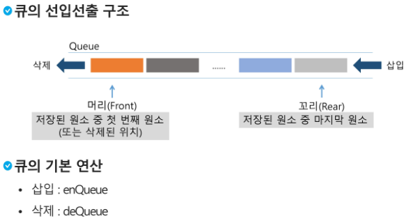

* 머리 (Front, Head) - 저장된 원소 중 첫 번째 원소 (또는 삭제된 위치)

* 꼬리 (Rear, Tail) - 저장된 원소 중 마지막 원소 (또는 마지막 저장 위치)

    * 스택의 top과 의미가 같다

* 삽입 (enQueue)

* 삭제 (deQueue)

    | 연산 | 기능 |
    | :---: | :---: |
    | enQueue(item) | 큐의 뒤쪽(Rear 다음)에 원소를 삽입하는 연산 |
    | deQueue() | 큐의 앞쪽(Front)에서 원소를 삭제하고 반환하는 연산 |
    | createQueue() | 공백 상태의 큐를 생성하는 연산 |
    | isEmpty() | 큐가 공백상태인지를 확인하는 연산 |
    | isFull() | 큐가 포화상태인지를 확인하는 연산 |
    | Qpeek() | 큐의 앞쪽(Front)에서 원소를 삭제 없이 반환하는 연산 |
    | |

    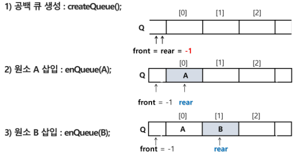

    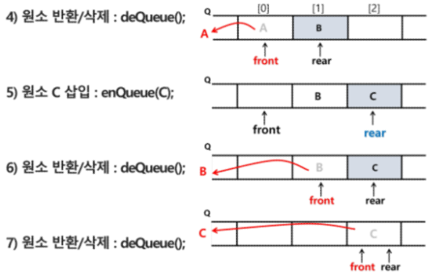

* front와 rear가 같다 == 큐가 비었다고 판단

    ```python
    def isEmpty():
        return front == rear
    ```

### 2. 큐의 구현

1. 선형큐

    * 1차원 배열을 이용한 큐
    
    * 큐의 크기 = 배열의 크기

    * front : 마지막으로 원소가 꺼내진(삭제된) 인덱스(위치)

    * rear : 저장된 마지막 원소의 인덱스

        | 상태 표현 | notation |
        | :---: | :---: |
        | 초기 상태 | front = rear = -1 |
        | 공백 상태 | front == rear |
        | 포화 상태 | rear == n - 1 |
        | |

    * n : 배열의 크기

    * n - 1 : 배열의 마지막 인덱스

    1. 초기 공백 큐 생성

    * 크기 n인 1차원 배열 생성

    * front와 rear를 -1로 초기화

    2. 삽입 : enQueue(item)

    * 마지막 원소 뒤에 새로운 원소 삽입을 위해

    1. rear 값을 하나 증가시켜 새로운 원소를 삽입할 자리 마련

    2. 그 인덱스에 해당하는 배열 원소 Q[rear]에 item 저장

        ```python
        def enQueue(item):
            global rear
            if isFull():
                print('Queue_Full')
            else:
                rear += 1
                Q[rear] = item
        ```

    3. 삭제 : deQueue()

        * 가장 앞에 있는 원소를 삭제하기 위해

        1. front 값을 하나 증가시켜 큐에 남아있는 첫 번째 원소 이동

        2. 새로운 첫 번째 원소를 리턴함으로써 삭제와 동일한 기능

            ```python
            def deQueue():
                if(isEmpty()):
                    Queue_Empty()
                else:
                    front += 1
                    return Q[front]
            ```

    4. 공백 및 포화상태 검사

        ```python
        def isEmpty():
            return front == rear

        def isFull():
            return rear == len(Q) - 1
        ```

    5. 검색

        * 가장 앞에 있는 원소를 검색해 반환하는 연산

        * 현재 front의 한자리 뒤(front + 1)에 있는 원소, 즉 큐의 첫 번째에 있는 원소를 반환

            ```python
            def Qpeek():
                if isEmpty():
                    print('Queue_Empty')
                else:
                    return Q[front + 1]
            ```

2. 원형큐 (Circular Queue, 순환큐)

    * 선형 큐 이용시의 문제점 - 잘못된 포화 상태 인식

    * 선형 큐를 이용해 원소의 삽입 / 삭제를 반복할 경우, 배열의 앞부분에 활용할 수 있는 공간이 있음에도 불구하고 rear = n - 1 상태, 즉 포화상태로 인식해 더 이상의 삽입을 수행하지 않게 됨

    * 해결방법

        1. 매 연산이 이루어질 때마다 저장된 원소들을 배열의 앞부분으로 모두 이동시킴

            * 원소 이동에 많은 시간이 소요되어 큐의 효율성이 급격히 떨어짐

        2. 1차원 배열을 사용하되, 논리적으로는 배열의 처음과 끝이 연결되어 원형 형태의 큐를 이룬다고 가정해 사용

            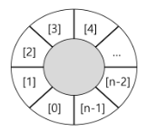

    * 초기 공백 상태

        * front = rear = 0

    * Index의 순환

        * front와 rear의 위치가 배열의 마지막 인덱스인 n - 1을 가리킨 후, 그 다음에는 논리적 순환을 이루어 배열의 처음 인덱스인 0으로 이동해야 한다.

        * 이를 위해 나머지 연산자 mod를 이용함

    * front 변수

        * 공백 상태 / 포화 상태 구분을 쉽게 하기 위해 front가 있는 자리는 사용하지 않고 항상 빈 자리로 둠

            | | 삽입 위치 | 삭제 위치 |
            | :---: | :---: | :---: |
            | 선형큐 | rear = rear + 1 | front = front + 1 |
            | 원형큐 | rear = (rear + 1) mod n | front = (front + 1) mod n |
            | |

            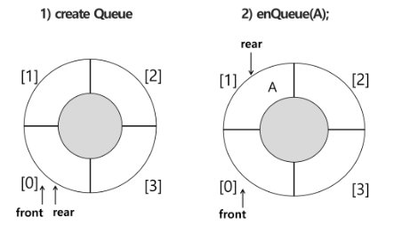

            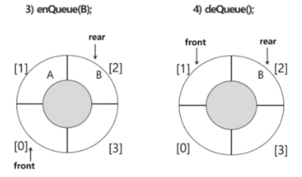

            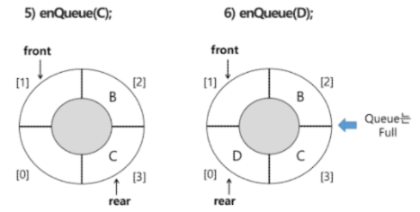

    1. 초기 공백 큐 생성

        * 크기 n인 1차원 배열 생성

        * front와 rear를 0으로 초기화

    2. 공백 / 포화 상태 검사

        * 공백 상태 : front == rear

        * 포화 상태 : 삽입할 rear의 다음 위치 == 현재 front

            * (rear + 1) mod n == front

            ```python
            def isEmpty():
                return front == rear

            def isFull():
                return front == (rear + 1) % len(cQ)
            ```

    3. 삽입 : enQueue(item)

        * 마지막 원소 뒤에 새로운 원소를 삽입하기 위해

        1. rear 값을 조정해 새로운 원소를 삽입할 자리 마련

            * rear = (rear + 1) % n

        2. 그 인덱스에 해당하는 배열 원소 cQ[rear]에 item을 저장

            ```python
            def enQueue(item):
                global rear
                if isFull():
                    print('Queue_Full')
                else:
                    rear = (rear + 1) % len(cQ)
                    cQ[rear] = item
            ```

    4. 삭제 : deQueue(), delete()

        * 가장 앞에 있는 원소를 삭제하기 위해

        1. front 값을 조정하여 삭제할 자리 준비

        2. 새로운 front 원소를 리턴함으로써 삭제와 동일한 기능

            ```python
            def deQueue():
                global front
                if isEmpty():
                    print('Queue_Empty')
                else:
                    front = (front + 1) % len(cQ)
                    return cQ[front]
            ```

3. 연결큐 (Linked Queue)

    * 단순 연결 리스트(Linked List)를 이용한 큐

        * 큐의 원소 : 단순 연결 리스트의 노드

        * 큐의 원소 순서 : 노드의 연결 순서 - 링크로 연결되어 있음
        
        * front : 첫 번째 노드를 가리키는 링크

        * rear : 마지막 노드를 가리키는 링크

    * 상태 표현

        * 초기 상태 : front = rear = null

        * 공백 상태 : front = rear = null

            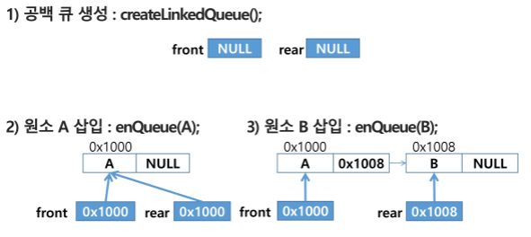

            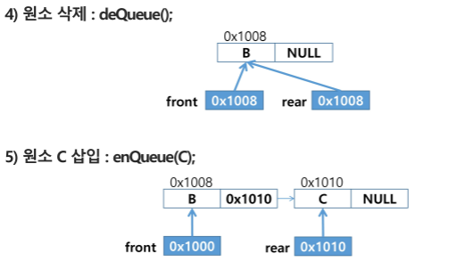
            
            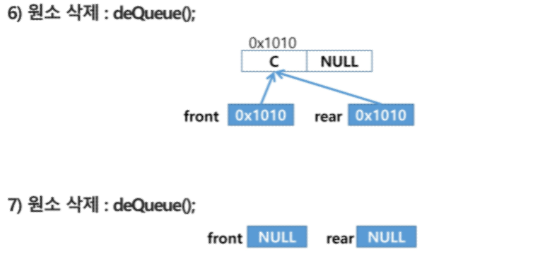
            
4. 참고 : 덱 (deque)

    * 컨테이너 자료형 중 하나

    * deque 객체

        * 양쪽 끝에서 빠르게 추가와 삭제를 할 수 있는 리스트류 컨테이너

    * 연산

        * append(x) : 오른쪽에 x를 추가

        * popleft() : 왼쪽에서 요소를 제거하고 반환. 요소가 없으면 IndexError

            ```python
            from collections import deque

            q = deque()
            q.append(1)     # enqueue()
            t = q.popleft() # dequeue()
            ```

5. 우선순위 큐 (Priority Queue) - 구현은 트리에서

    * 우선순위 큐의 특성

        * 우선순위를 가진 항목들을 저장하는 큐

        * FIFO 순서가 아니라 우선순위가 높은 순서대로 먼저 나가게 된다.

    * 우선순위 큐의 적용 분야

        * 시뮬레이션 시스템

        * 네트워크 트래픽 제어

        * 운영체제의 태스크 스케쥴링

    * 우선순위 큐의 구현 - 배열 / 리스트를 이용한 우선순위 큐

        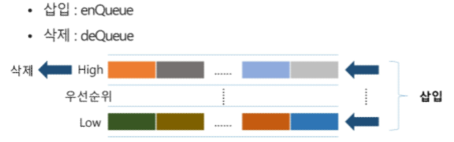

    * 배열을 이용해 우선순위 큐 구현

        * 배열을 이용해 자료 저장

        * 원소를 삽입하는 과정에서 우선순위를 비교해 적절한 위치에 삽입하는 구조

        * 가장 앞에 최고 우선순위의 원소가 위치

        * 배열을 사용하므로, 삽입이나 삭제 연산이 일어날 때 *원소의 재배치가 발생*하여, 이에 소요되는 시간이나 메모리 낭비가 큼

### 3. 버퍼 (Buffer)

* 버퍼

    * 데이터를 한 곳에서 다른 한 곳으로 전송하는 동안 일시적으로 그 데이터를 보관하는 메모리 영역

    * 버퍼링 : 버퍼를 활용하는 방식 또는 버퍼를 채우는 동작

* 버퍼의 자료 구조

    * 버퍼는 일반적으로 입출력 및 네트워크와 관련된 기능에서 이용됨

    * 순서대로 입력 → 출력 → 전달되어야 하므로, FIFO 방식의 자료구조인 큐가 활용됨

        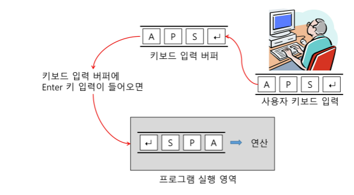

### 4. BFS (Breadth First Search, 너비 우선 탐색)

* 그래프 탐색 방법 2가지 - 깊이우선탐색(DFS), 너비우선탐색(BFS)

* 너비우선탐색

    * 탐색 시작점의 *인접 정점들을 먼저 모두 방문* 후, 방문했던 정점을 시작점으로 하여 다시 인접 정점들을 차례로 방문하는 방식

    * 인접 정점들에 대해 탐색 진행 후, 차례로 다시 너비우선탐색을 진행해야 하므로, 선입선출 형태 자료인 큐를 활용함
    
    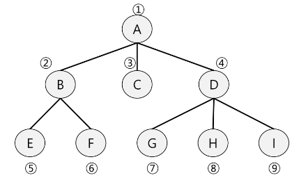

    * 탐색 순서 : A → (B → C → D) → (E → F) → (G → H → I)

        0. visited 배열 초기화, 큐 생성

        1. 탐색 시작 → 큐에 시작점 A를 enQueue

        2. deQueue A → A 방문 표시, 동시에 A의 인접 정점 B, C, D를 enQueue

        3. deQueue B → B 방문 표시, 동시에 B의 인접 정점 E, F를 enQueue

        4. deQueue C → C 방문 표시, 동시에 C의 인접 정점을 enQueue (→ 인접 정점이 없음)

        5. deQueue D → D 방문 표시, 동시에 D의 인접 정점 G, H, I를 enQueue

        6. ...

        7. 모든 곳을 방문했다면 큐가 비었으므로 탐색 종료

            * 꺼낸 후에 visited를 표시하는 방법과, enQueue와 동시에 visited를 입력하는 방법을 상황에 맞춰 고려해야 할 필요가 있음

        ```python
        def BFS(G, v):                      # 그래프 G, 탐색 시작점 v
            visited = [0] * (n + 1)         # n : 정점의 개수
            queue = []                      # 큐 생성
            queue.append(v)                 # 시작점 v를 큐에 삽입
            while queue:                    # 큐가 비어있지 않은 경우
                t = queue.pop(0)            # 큐의 첫번째 원소 반환
                if not visited[t]:          # 방문하지 않은 곳이라면
                    visited[t] = True       # 방문한 것으로 표시
                    visit(t)                # 정점 t에서 할 일
                    for i in G[t]:          # t와 연결된 모든 정점에 대해
                        if not visited[i]:  # 방문되지 않은 곳이라면
                            queue.append(i) # 큐에 넣기
        ```
        
        ```python
        def BFS(G, v, n):                   # 그래프 G, 탐색 시작점 v
            visited = [0] * (n + 1)         # n : 정점의 개수
            queue = []                      # 큐 생성
            queue.append(v)                 # 시작점 v를 큐에 삽입
            visited[v] = 1
            while queue:                    # 큐가 비어있지 않은 경우
                t = queue.pop(0)            # 큐의 첫번째 원소 반환
                visit(t)
                for i in G[t]:              # t와 연결된 모든 정점에 대해
                    if not visited[i]:      # 방문되지 않은 곳이라면
                        queue.append(i)     # 큐에 넣기
                        visited[i] = visited[t] + 1     # n으로부터 1만큼 이동
        ```

    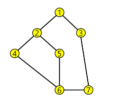

        * DFS : 1 → 2 → 4 → 6 → 7 → 3 → 5 (간선의 방향성이 없는 무향 그래프의 경우)

        * BFS : 1 → 2 → 3 → 4 → 5 → 7 → 6

### 0. 참고

* Pycharm의 콘솔 버퍼는 circular buffer이며 기본 크기는 1MB이기 때문에, 1MB가 넘는 자료를 입력하게 되면 앞의 자료를 뒤의 자료가 덮어씌우는 현상이 발생하게 된다.

<script type="text/javascript" src="http://cdn.mathjax.org/mathjax/latest/MathJax.js?config=TeX-AMS-MML_HTMLorMML"></script>
<script type="text/x-mathjax-config">
  MathJax.Hub.Config({
    tex2jax: {inlineMath: [['$', '$']]},
    messageStyle: "none",
    "HTML-CSS": { availableFonts: "TeX", preferredFont: "TeX" },
  });
</script>