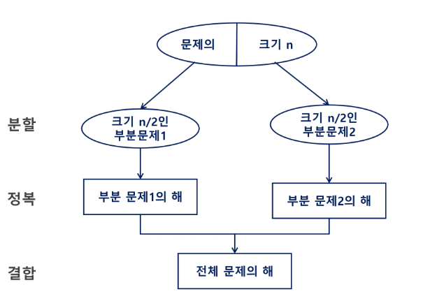
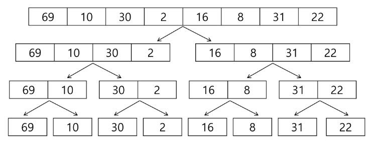
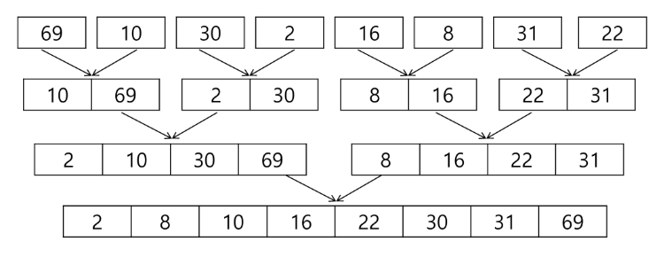
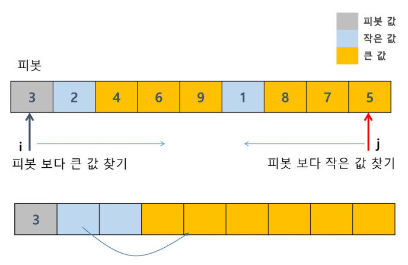
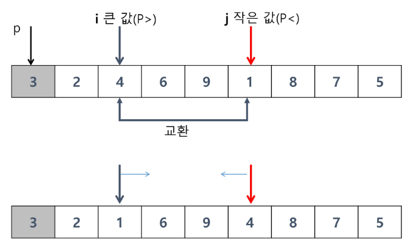
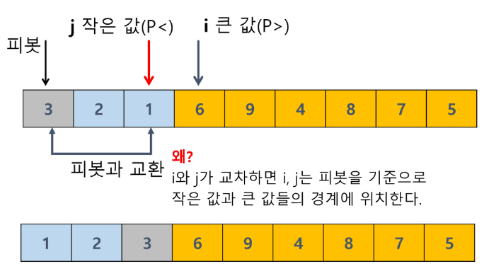
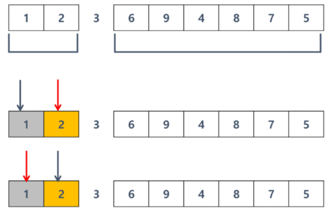
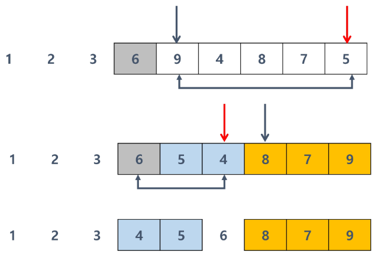

# Algorithm

<div style="text-align: right"> 24. 03. 18. ~ 24. 03. 19. </div>

## 1. 분할 정복

### 1. 분할 정복 (Divide & Conquer)

* 문제 제시 : 가짜 동전 찾기

    * 24개의 동전 중 가짜 동전이 하나 포함되어 있다. 가짜 동전은 진짜 동전에 비해 아주 조금 가볍다. 진짜 동전들의 무게가 동일하다고 할 때 양팔 저울을 이용해 가짜 동전을 찾아보자. - 양팔 저울을 최소로 사용해서 가짜 동전을 찾는 방법은 무엇인가?

* 설계 전략

    * 분할(Divide) : 해결할 문제를 여러 개의 작은 부분으로 나눈다.

    * 정복(Conquer) : 나눈 작은 문제를 각각 해결한다.

    * 통합(Combine) : (필요하다면) 해결된 해답을 모은다.

    * 비슷한 logic을 반복 → 재귀함수로 구현 가능

* Top-down approach 예시

    

* 문제 제시 : 자연수 C의 n제곱 값 구하기

    * 반복(Iterative) 알고리즘 : $O(n)$

    ```{:.pseudocode}
    Iterative_Power(x, n):
        result ← 1

        for i in 1 → n:
            result ← result * x

        return result
    ```

    * 분할 정복 기반 알고리즘 : $O(log_2 n)$

    ```{:.pseudocode}
    Recursive_Power(x, n):
        if n == 1: return x

        if n is even:
            y ← Recursive_Power(x, n / 2)
            return y * y

        else:
            y ← Recursive_Power(x, (n - 1) / 2)
            return y * y * x
    ```

## 2. 대표적인 분할 정복 알고리즘

### 1. 병합 정렬 (Merge Sort)

* 여러 개의 정렬된 자료의 집합을 병합하여 한 개의 정렬된 집합으로 만드는 방식

* 분할 정복 알고리즘의 활용

    * 자료를 최소 단위의 문제까지 나눈 후, 차례대로 정렬해 최종 결과를 얻어냄

    * top-down 방식

* 시간 복잡도 : $O(n log n)$

* 병합 정렬 과정 예시

    * {69, 10, 30, 2, 16, 8, 31, 22}를 병합 정렬하는 과정

    * 분할 단계 : 전체 자료 집합에 대해, 최소 크기의 부분집합이 될 때까지 분할 작업을 계속함.

        

    * 병합 단계 : 2개의 부분집합을 정렬하면서 하나의 집합으로 병합

        * 8개의 부분집합이 1개로 병합될 때까지 반복함

        

* Pseudocode : 분할 과정

    ```{:.pseudocode}
    merge_Sort(LIST m):
        if length(m) == 1: return m

        LIST left, right
        middle ← length(m) / 2
        for x in m before middle:
            add x to left
        for x in m after or equal middle:
            add x to right

        left ← merge_sort(left)
        right ← merge_sort(right)

        return merge(left, right)
    ```

* Pseudocode : 병합 과정

    ```{:.pseudocode}
    merge(LIST left, LIST right):
        LIST result

        while length(left) > 0 or length(right) > 0:
            if length(left) > 0 and length(right) > 0:
                if first(left) <= first(right):
                    append popfirst(left) to result
                else:
                    append popfirst(right) to result
            
            elif length(left) > 0:
                append popfirst(left) to result
            elif length(right) > 0:
                append popfirst(right) to result

        return result
    ```

### 2. 퀵 정렬

* 주어진 배열을 두 개로 분할하고, 각각을 정렬한다.

    1. 병합 정렬은 그냥 두 부분으로 나누는 반면, 퀵 정렬은 분할 시 기준 아이템(pivot item) 중심으로 분할

        * 기준보다 작은 것은 왼편, 큰 것은 오른편에 위치

    2. 각 부분 정렬이 끝난 후, 병합정렬은 "병합"이란 후처리 작업이 필요하나 퀵 정렬은 필요로 하지 않는다.

* 알고리즘

    ```{:.pseudocode}
    quickSort(A[], l, r):
        if l < r:
            s ← partition(a, l, r)
            quicksort(A[], l, s - 1)
            quicksort(A[], s + 1, r)
    ```


* {3, 2, 4, 6, 9, 1, 8, 7, 5} 정렬하기

    * 아이디어 - Hoard-Partition 알고리즘

        * pivot 값보다 큰 값은 오른쪽, 작은 값은 왼쪽 집합에 위치

        * 이후 pivot을 두 집합의 가운데에 위치

        * pivot 선택 - 왼쪽 끝, 오른쪽 끝, 임의의 세 값 중 중간값 선택

        

        

        

        

        

        ```{:.pseudocode}
        partition(A[], l, r):
            p ← A[l]      // p: pivot value
            i ← l, j ← r
            while i <= j:
                while i <= j and A[i] <= p: i++
                while i <= j and A[j] >= p: j--
                if i < j: swap(A[i], A[j])

            swap(A[l], A[j])
            return j
        ```

    * Lomuto partition 알고리즘

        ```{:.pseudocode}
        partition(A[], p, r):
            x ← A[r]
            i ← p - 1

            for j in p → r - 1:
                if A[j] <= x:
                    i++, swap(A[i], A[j])

            swap(A[i + 1], A[r])
            return i + 1
        ```

### 3. 분할 정복 알고리즘 정리

| Sort | Explanation |
| :---: | :--- |
| 병합 정렬 | 외부 정렬의 기본이 되는 알고리즘<br>멀티코어(Multi-Core) CPU나 다수의 프로세서에서 정렬 알고리즘을 병렬화하기 위해 병합 정렬 알고리즘이 활용됨 |
| 퀵 정렬 | 매우 큰 입력 데이터에 대해 좋은 성능을 보임 |
| |

## 3. 이진 탐색

* 문제 제시 : 병뚜껑 속의 숫자 게임

    * 술래가 병뚜껑 속 숫자를 확인한 후, 다음 사람부터 숫자를 맞히기 시작한다. 술래는 Up 또는 Down을 통해 게임에 참여한 사람들이 병뚜껑 속 숫자에 점점 가까워질 수 있도록 힌트를 제시한다.

    * 예시) 병뚜껑 속 숫자가 3인 경우

        * 첫 번째 사람이 14를 외쳤다면 → 술래는 'DOWN!'

        * 두 번째 사람이 2를 외쳤다면 → 술래는 'UP!'

        * 세 번째 사람이 4를 외쳤다면 → 술래는 'DOWN!'

        * 네 번째 사람은 결국 3을 외칠 수밖에 없을 것

        * 최대로 빨리 당첨되려면 어떻게 하면 될까?

### 1. 이진 검색 (Binary Search)

* 자료의 가운데에 있는 항목의 키 값과 비교하여 다음 검색의 위치를 결정하고 검색을 계속 진행하는 방법

* 목적 키를 찾을 때까지 이진 검색을 순환적으로 반복 수행함으로써 검색 범위를 반으로 줄여가며 보다 빠르게 검색을 수행함

* 이진 검색을 하기 위해서는 자료가 정렬된 상태여야 한다.

* 검색 과정

    1. 자료의 중앙에 있는 원소를 고른다.

    2. 중앙 원소의 값과 찾고자 하는 목표 값을 비교한다.

    3. 목표 값이 중앙 원소의 값보다 작으면 자료의 왼쪽 반에 대해 새로 검색을 수행, 크다면 자료의 오른쪽 반에 대해 새로 검색을 수행

    4. 찾고자 하는 값을 찾을 때까지 1 ~ 3의 과정을 반복

    ```{:.pseudocode}
    binarySearch(n, S[], key):
        low ← 0
        high ← n - 1

        while low <= high:
            mid ← low + (high - low) / 2

            if S[mid] == key:
                return mid
            elif S[mid] > key:
                high ← mid - 1
            else
                low ← mid + 1
        return -1
    ```

### 2. 이진 검색 정리

* 시간 복잡도 : $O(log n)$

* 정렬된 데이터를 기준으로 특정 값이나 범위를 검색하는 데 사용

* 이진 검색을 활용한 심화 학습 키워드 : Lower Bound, Upper Bound

    * 정렬된 배열에서 특정 값 이상 또는 이하가 처음으로 나타나는 위치를 찾는 알고리즘

    * 특정 데이터의 범위 검색 등에서 활용

## 4. Backtracking 응용

* Backtracking

    * 완전탐색 + 가지치기

    * 가능성이 없는(볼 필요 없는) 경우의 수를 제거하는 기법

<script type="text/javascript" src="http://cdn.mathjax.org/mathjax/latest/MathJax.js?config=TeX-AMS-MML_HTMLorMML"></script>
<script type="text/x-mathjax-config">
  MathJax.Hub.Config({
    tex2jax: {inlineMath: [['$', '$']]},
    messageStyle: "none",
    "HTML-CSS": { availableFonts: "TeX", preferredFont: "TeX" },
  });
</script>