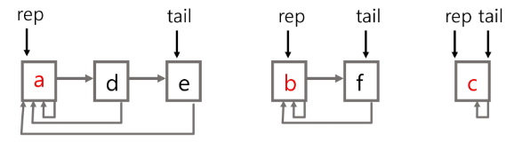
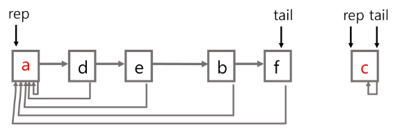
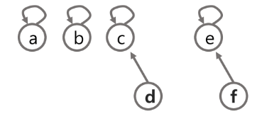
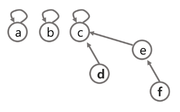
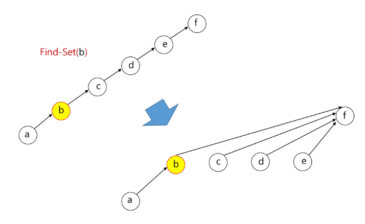
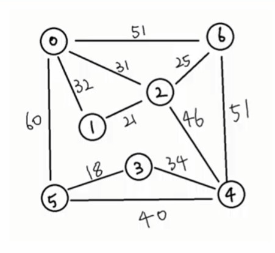
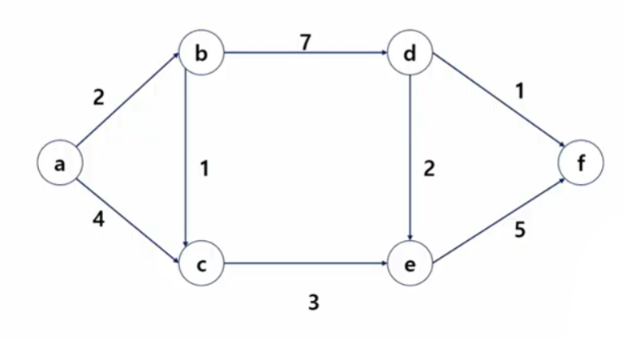

# Algorithm

<div style="text-align: right"> 24. 03. 19. ~ </div>

## 1. 트리

### 1. 트리

* 트리

    * **사이클이 없는 무향 연결 그래프**

        * 사이클 : 방문했던 노드로 다시 돌아오는 다른 경로가 있는 경우

        * 무향 : 간선에 방향이 없다 (양방향)

        * 연결 그래프 : 모든 꼭지점이 서로 갈 수 있는 경로가 있다.

        * *트리는 그래프의 일종이다!*

    * 각 노드는 최대 하나의 부모 노드가 존재할 수 있다.

    * 각 노드는 자식 노드가 없거나 하나 이상 존재할 수 있다.

    * 비선형 구조

        * 원소들 간에 1:n 관계를 가지는 자료 구조

        * 원소들 간에 **계층 관계**를 가지는 계층형 자료구조

    * 한 개 이상의 노드로 이루어진 유한 집합이며 다음 조건을 만족한다.

        1. 노드 중 부모가 없는 노드를 루트(root)

        2. 나머지 노드들은 n개의 분리 집합 T1, ..., Tn으로 분리될 수 있다.

            이들 T1, ..., Tn은 각각 하나의 트리가 되며(재귀적 정의) 루트의 서브트리(subtree)라고 한다.

    * 노드 (node, 정점 (vertex)) : 트리의 원소

    * 간선 : 노드를 연결하는 선

    * 루트 노드 : 트리의 시작 노드

    * 높이

        * 노드의 높이 : 루트에서 노드에 이르는 간선의 수. 노드의 레벨

        * 트리의 높이 : 트리에 있는 노드의 높이 중 가장 큰 값. 최대 레벨

* 이진 트리

    * 모든 노드들이 최대 2개의 서브트리를 갖는 특별한 형태의 트리

    * 각 노드가 자식 노드를 최대 2개까지만 가질 수 있는 트리

        * 왼쪽 자식 노드 (left child node)
        
        * 오른쪽 자식 노드 (right child node)

    * 포화 이진 트리 (Full Binary Tree)

        * 모든 레벨의 노드가 포화 상태로 채워져 있는 이진 트리

    * 완전 이진 트리 (Complete Binary Tree)

        * 높이가 h이고 노드 수가 n개일 때, 포화 이진 트리의 노드 번호 1번부터 n번까지 빈 자리가 없는 이진 트리

    * 편향 이진 트리 (Skewed Binary Tree)

        * 높이 h에 대한 최소 개수의 노드를 가지면서 한쪽 방향의 자식 노드만들 가진 이진 트리

    * 순회 (Traversal)

        * 트리의 각 노드를 중복되지 않게 모두 방문하는 것

        * 전위 순회 (Preorder Traversal, VLR) : 부모 노드 먼저, 그 다음 자손 노드 방문

        * 중위 순회 (Inorder Traversal, LVR) : 왼쪽 자손 노드, 현재 노드, 오른쪽 자손 노드 순으로 방문

        * 후위 순회 (Postorder Traversal, LRV) : 부모 노드보다 자손 노드를 먼저 방문

### 2. 이진 탐색 트리 (BST)

* 이진 탐색 트리

    * 탐색 작업을 효율적으로 하기 위한 자료구조

    * 모든 원소는 서로 다른 유일한 키를 갖는다.

    * key(왼쪽 서브트리) < key(루트 노드) < key(오른쪽 서브트리)

    * 왼쪽 서브트리와 오른쪽 서브트리도 이진 탐색 트리이다.

    * 중위 순회하면 오름차순으로 정렬된 값을 얻을 수 있다.

* 탐색 연산

    * 루트에서 시작

    * 탐색할 키 값을 루트 노드의 키 값과 비교

        * 동일하다면 - 탐색 성공

        * 탐색 값이 루트 노드 키 값보다 작다면 - 루트의 왼쪽 서브트리에 대해 탐색 수행

        * 탐색 값이 루트 노드 키 값보다 크다면 - 루트의 오른쪽 서브트리에 대해 탐색 수행

* 삽입 연산

    * 먼저 탐색 연산을 수행

        * 삽입할 원소와 같은 원소가 트리에 있으면 삽입할 수 없으므로, 같은 원소가 트리에 있는지 탐색하여 확인

    * 탐색 실패가 결정되는 위치가 삽입 위치가 된다. → 탐색 실패 위치에 원소 삽입

* 삭제 연산

* 성능

    * 탐색, 삽입, 삭제 시간은 트리의 높이만큼 시간이 걸린다.

    * 평균의 경우 - 이진 트리가 균형적으로 생성되어 있는 경우 $O(log n)$

    * 최악의 경우 - 편향 트리의 경우 $O(n)$

### 3. 힙 (Heap Tree)

* 힙 (heap)

    * 완전 이진 트리에 있는 노드 중 키 값이 가장 큰 / 작은 노드를 찾기 위해 만든 자료구조

    * 최대 힙 (max heap), 최소 힙 (min heap)

        * 키 값이 가장 큰(작은) 노드를 찾기 위한 완전 이진 트리

        * 부모 노드의 키 값 >(<) 자식 노드의 키 값

        * 루트 노드 : 키 값이 가장 큰(작은) 노드

        * 형제 노드끼리는 관계 제한이 없다.

* 힙의 삽입 연산

    * 힙의 마지막에 원소 삽입

    * 그 후 자리 찾아가기

* 힙의 삭제 연산

    * 루트 노드의 원소 삭제

    * 마지막 노드 삭제 후 루트 노드 자리에 값 부여

    * 그 후 자리 바꾸기 연산 실행
    
    * 힙에서는 루트 원소의 노드만 삭제할 수 있다.

    * 루트 노드의 원소를 삭제 후 반환

    * 힙의 종류에 따라 최대 / 최소값을 구할 수 있다.

* 힙의 활용

    * 힙을 활용하는 대표적인 2가지 예는 특별한 큐의 구현과 정렬이다.

    * 우선순위 큐를 구현하는 가장 효율적인 방법이 힙을 사용하는 것

    * from collections import heapQ

## 2. 그래프

### 1. 그래프

* 아이템(사물 또는 추상적 개념)들과 이들 사이의 연결 관계를 표현

* 그래프는 정점(Vertex)들의 집합과 이들을 연결하는 간선(Edge)들의 집합으로 구성된 자료구조

* 선형 자료구조나 트리 자료구조료 표현하기 어려운 N : N 관계를 가지는 원소들을 표현하기에 용이

* 그래프 유형

    * 무향 그래프 (Undirected Graph)

    * 유향 그래프 (Directed Graph)

    * 가중치 그래프 (Weighted Graph)

    * 사이클이 없는 방향 그래프 (DAG, Directed Acyclic Graph)

    * 완전 / 부분 그래프

        * 완전 그래프 : 정점들에 대해 가능한 모든 간선들을 가진 그래프

        * 부분 그래프 : 원래 그래프에서 일부의 정점이나 간선을 제외한 그래프

* 인접 (Adjacency)

    * 두 개의 정점에 간선이 존재(연결됨)하면 서로 인접해 있다고 한다.

    * 완전 그래프에 속한 임의의 두 정점들은 모두 인접해 있다.

* 그래프 경로

    * 경로 : 간선들을 순서대로 나열한 것

    * 단순경로 : 경로 중 한 정점을 최대한 한번만 지나는 경로

    * 사이클 : 시작한 정점에서 끝나는 경로

* 그래프 표현

    * *간선의 정보를 저장*하는 방식

    * 인접 행렬 (Adjacent Matrix)
    
        * $|V| \times |V|$ 크기의 2차원 배열을 이용해 간선 정보 저장

        * 두 정점을 연결하는 간선의 유무(인접시 1, 그렇지 않으면 0)를 행렬로 표현

        * 무향 그래프의 경우, $i$번째 행의 합 = $j$번째 열의 합 = $V_i$의 차수

        * 유향 그래프의 경우

            * 행 $i$의 합 = $V_i$의 진출 차수

            * 열 $i$의 합 = $V_i$의 진입 차수
        
    * 인접 리스트 (Adjacent List)

        * 각 정점마다 해당 정점으로 나가는 간선의 정보를 저장

    * 간선의 배열

        * 간선(시작 정점, 끝 정점)을 배열에 연속적으로 저장

## 3. Union-Find (Disjoint Set)

### 1. 서로소 집합 (상호배타 집합, Disjoint-sets)

* 서로 중복 포함된 원소가 없는 집합 (교집합이 없음)

* 집합에 속한 하나의 특정 멤버를 통해 각 집합을 구분 → **대표자(representative)**

* 연결 리스트 / 트리를 이용해 상호배타 집합을 표현할 수 있다.

* 상호배타 집합 연산

    * Make-Set($x$) 
    
        * 집합 만들기

        * 대표자 : $x$

    * Find-Set($x$)

        * $x$가 속한 집합을 찾음

        * 그 집합의 **대표자를 return**함

    * Union($x$, $y$)

        * $x$가 대표자인 집합과 $y$가 대표자인 집합을 묶음

### 2. 서로소 집합 표현 - 연결리스트

* 같은 집합의 원소들은 하나의 연결리스트로 관리한다.

* 연결리스트의 맨 앞의 원소를 집합의 대표 원소로 삼는다.

* 각 원소는 집합의 대표원소를 가리키는 링크를 갖는다.



* 연결 리스트 연산 예시

    * Find-Set($e$) → return $a$

    * Find-Set($f$) → return $b$

    * Union($a$, $b$)

    

### 3. 서로소 집합 표현 - 트리

* 하나의 집합(a disjoint set)을 하나의 트리로 표현한다.

* 자식 노드가 부모 노드를 가리키며, 루트 노드가 대표자가 된다.

* 트리 연산 예시

    * Find-Set($a$) ~ Find-Set($f$)

    

    * Union($c$, $d$), Union($e$, $f$)

    

    * Union($d$, $f$)

    

    * Find-Set($d$) → return $c$

    * Find-Set($e$) → return $c$

    ```python
    # 1 ~ 6번까지 노드가 존재
    # 1. make_set
    def make_set(n):
        return [i for i in range(n)]

    # 1 ~ 6번까지 활용하기 위해 (0번은 버림)
    parents = make_set(7)

    # 2. find-set : 대표자를 찾아보자
    # - 부모 노드를 보고, 부모 노드도 연결이 되어 있다면 다시 반복
    # - 언제까지? 자기 자신이 대표인 데이터를 찾을 때까지
    def find_set(x):
        # 기저조건 - 자기 자신이 대표라면
        if parents[x] == x:
            return x

        else:
            return find_set(parents[x])

    # 3. union
    def union(x, y):
        x = find_set(x)
        y = find_set(y)

        # 이미 같은 집합에 속해있다면 return
        if x == y:
            return

        # 다른 집합이라면 합침
        # 예시) 더 작은 루트 노드에 합쳐라!! (문제 조건에 따라 다름)
        if x < y:
            parents[y] = x
        else:
            parents[x] = y

    print(parents)
    union(1, 3)
    union(2, 3)
    union(5, 6)
    print(parents)
    ```

* 상호 배타 집합 연산의 문제점



* 문제점을 해결하기 위한 방법 (연산의 효율을 높이는 방법)

    * Rank를 이용한 Union

        * 각 노드는 자신을 루트로 하는 서브트리의 높이를 Rank라는 이름으로 저장

        * 두 집합을 합칠 때 Rank가 낮은 집합을 Rank가 높은 집합에 붙인다.

    * Path Compression

        * Find-Set을 행하는 과정에서 만나는 모든 노드들이 직접 root를 가리키도록 포인터를 바꾸어 준다.

## 4. 최소 비용 신장 트리 (MST)

* 신장 트리 (Spanning Tree)

    * 그래프 내 모든 정점을 포함하는 트리

    * 신장 트리는 그래프의 ***최소 연결 부분 그래프***이다.

        * 최소 연결 : 간선의 수가 가장 적다.

        * n개의 정점을 가지는 그래프의 최소 간선 수는 n - 1개 ↔ n - 1개의 간선으로 연결되어 있으면 필연적으로 트리 형태가 되며, 이것이 바로 신장 트리(Spanning Tree)이다.

        * 그래프에서 일부 간선을 선택해 만든 트리

    * [참고](https://gmlwjd9405.github.io/2018/08/28/algorithm-mst.html)

### 1. 최소 비용 신장 트리

* 간선의 개수를 최소로 하여 V개의 모든 정점을 연결하는 방법? (→ 한붓그리기를 생각)

* 모든 정점을 방문하는 최선의 경우의 특징

    1. 여러 가지 방법이 있다.

    2. 사이클이 발생하지 않는다.

    3. 지나가는 간선의 개수 : (V - 1) 개

    * **신장 트리**

        * *트리의 특징*을 가지고 있는 부분 *그래프*이다

    * **최소 비용 신장 트리 (MST)** : 그 중 비용(가중치)의 합이 가장 적은 신장 트리

        * 간선에 ***가중치***를 고려해, ***최소 비용***의 ***신장 트리(Spanning Tree)***를 선택하는 것을 가리킨다.

* 최소 비용 신장 트리를 확인하는 방법

    1. 완전 탐색 : 모든 신장 트리를 구하자 → 시간이 너무 많이 걸린다

    2. Backtracking

    3. DP, Greedy, ...

        * Greedy : 가장 작은 것부터 골라보는 것은 어떨까?

            * 제일 작은 것부터 → Prim Algorithm

            * 특정 노드를 시작으로, 갈 수 있는 곳들 중 가장 작은 곳으로 → Kruskal Algorithm

* 신장 트리

    * n개의 정점으로 이루어진 무방향 그래프에서, n개의 정점과 n - 1개의 간선으로 이루어진 트리

* 최소 신장 트리 (Minimum Spanning Tree)

    * 무방향 가중치 그래프에서 신장 트리를 구성하는 간선들의 가중치의 합이 최소인 신장 트리

* MST 구현 방법

    * 기본적으로 Greedy 알고리즘

    * Prim, Kruskal 알고리즘

### 2. Prim 알고리즘

* 하나의 정점에서 연결된 간선들 중 하나씩 선택해 나가면서 단계적으로 MST를 확장해 만들어가는 방식

    1. 임의 정점을 하나 선택해서 시작

    2. 선택한 정점과 인접하는 정점들 중 최소 비용의 간선이 존재하는 **정점을 선택**

    3. 모든 정점이 선택될 때까지 1 - 2번 과정 반복

* 정점 선택 기반 알고리즘이다.

* 서로소인 2개의 집합 (2-disjoint-sets) 정보를 유지

    * 트리 정점들 (Tree Vertices) : MST를 만들기 위해 선택된 정점들

    * 비트리 정점들 (Nontree Vertices) : 선택되지 않은 정점들



```python
# 우선순위 큐 (Priority Queue) 활용
from heapq import heappush, heappop

# class Node:
#     def __init__(self, num, weight):
#         self.num = num
#         self.weight = weight

def prim(start):
    pq = []
    MST = [0] * V

    # 최소 비용 - 가중치 합을 계속 저장해줄 것
    sum_weight = 0

    # 시작점 추가
    # [BFS] 노드 번호만 관리
    # [PRIM] 가중치가 낮으면 먼저 나와야 한다.
    # >> 관리해야 할 데이터가 (가중치, 노드 번호)
    # 1. class 만들기
    # 2. tuple로 관리
    heappush(pq, (0, start))

    while pq:
        weight, now = heappop(pq)

        # 우선순위 큐 특성상, 더 먼 거리로 가는 방법이 Queue에 저장되어 있기 때문에,
        # 기존에 이미 더 짧은 거리로 방문했다면 continue
        # 방문했다면 continue
        if MST[now]:
            continue

        # 방문 처리
        MST[now] = 1

        # 누적합 추가
        sum_weight += weight

        # 갈 수 있는 노드들(인접)을 보면서
        for to in range(V):
            # 갈 수 없다면, 혹은 이미 방문했다면 continue
            if not graph[now][to] or MST[to]:
                continue

            heappush(pq, (graph[now][to], to))

    print(f'최소 비용 : {sum_weight}')

V, E = map(int, input().split())
# 인접 행렬로 저장
# [과제] - 인접 리스트로 변경

graph = [[0] * V for _ in range(V)]
for _ in range(E):
    s, e, w = map(int, input().split()) # 시작 정점, 끝 정점, 간선 가중치
    graph[s][e] = w
    graph[e][s] = w # 무방향 그래프

prim(0)
```

### 3. Kruskal 알고리즘

* *Greedy method를 이용해 간선을 하나씩 선택*해서 MST를 찾는 알고리즘

    1. 최초, 모든 간선을 가중치에 따라 오름차순으로 정렬

    2. 가중치가 가장 낮은 **간선부터 선택**하면서 트리를 증가시킴

    3. n - 1개의 간선이 선택될 때까지 2를 반복

* 간선 선택 기반 알고리즘이다.


```python
# 1. 전체 그래프를 보고, 가중치가 제일 작은 간선부터 순서대로 뽑음
#   >> 코드로 구현 : 전체 간선 정보를 저장 + 가중치로 정렬

# 2. 방문 처리
#   >> 이 때, 사이클이 발생하면 안 된다!
#   >> 사이클 여부 : union-find 알고리즘이 활용

def make_set(x):
    return [i for i in range(x)]

def find_set(x):
    if x == parents[x]:
        return x
    
    # 경로 압축
    parents[x] = find_set(parents[x])
    return parents[x]

def union(x, y):
    x = find_set(x)
    y = find_set(y)

    # 같은 집합이면 return
    if x == y:
        return

    if x < y:
        parents[y] = x
    else:
        parents[x] = y

V, E = map(int, input().split())

edges = []  # 간선 정보들을 모두 저장
for _ in range(E):
    s, e, w = map(int, input().split())
    edges.append([s, e, w])
edges.sort(key = lambda x: x[2])    # 가중치를 기준으로 정렬

parents = make_set(V)   # 대표자 배열 생성

# MST 완성 = 간선 개수가 V - 1개일 때
cnt = 0
sum_weight = 0

# 간선들을 모두 확인한다.
for s, e, w in edges:
    # 사이클이 발생하면 continue
    # 이미 같은 집합에 속해 있다면 continue
    # 대표자가 같다 == 연결되어 있다!!
    if find_set(s) == find_set(e):
        print(s, e, w, ' / 사이클 발생! 탈락!')
        continue

    print(s, e, w)
    cnt += 1

    # 사이클이 없으면, 방문 처리
    union(s, e)
    sum_weight += w

    if cnt == V - 1:    # MST 완성 == 간선의 개수 V - 1
        break

print(f'최소 비용 : {sum_weight}')
```

### 4. 정리

* MST : 최소 비용 **신장 트리**

    * ***전체를 연결***하는 것 중 ***최소!!***

## 5. 최단 경로 (Dijkstra)

* 최단 경로

    * 간선 가중치가 있는 그래프에서 두 정점 사이의 경로들 중 간선의 가중치 합이 최소인 경로

* 하나의 시작 정점에서 끝 정점까지의 최단 경로 - 크게 3가지 알고리즘

    * 하나의 시작 정점에서 끝 정점까지의 최단 경로

        * ***다익스트라 (Dijkstra) 알고리즘*** - 음의 가중치를 허용하지 않음

        * 벨만-포드 (Bellman-Ford) 알고리즘 - 음의 가중치를 허용

    * 모든 정점들에 대한 최단 경로

        * 플로이드-워셜 (Floyd-Warshall) 알고리즘

### 1. Dijkstra 알고리즘

* 시작 정점에서 ***누적*** 거리가 최소인 *인접 정점*을 선택해 나가면서 최단 경로를 구하는 방식

    * 시작 정점($s$)에서 끝 정점($t$)까지의 최단 경로에 정점 $x$가 존재한다.

    * 이 때, 최단 경로는 $s$에서 $x$까지의 최단 경로와 $x$에서 $t$까지의 최단 경로로 구성된다.

* 탐욕 기법을 사용한 알고리즘으로, MST의 Prim 알고리즘과 유사 (→ 단, Prim 알고리즘은 누적 거리가 아님)



* 시작점 a, 끝 점 f

* dist (누적 거리)

    * 초기 세팅

        | a | b | c | d | e | f |
        | :---: | :---: | :---: | :---: | :---: | :---: |
        | 0 | INF | INF | INF | INF | INF |
        | |

    * [(b, 2), (c, 4)]

        * 갈 수 있는 경로 중 짧은 경로를 뽑자 → 갈 수 있는 후보군들을 저장해놓은, 가중치 기준으로 정렬된 우선순위 큐를 활용

        | a | b | c | d | e | f |
        | :---: | :---: | :---: | :---: | :---: | :---: |
        | 0 | 2 | INF | INF | INF | INF |
        | |

        * 방문 완료된 (b, 2) 제거

    * [(c, 4), (c, 3), (d, 9)] → [(c, 3), (c, 4), (d, 9)]

        * b에서 갈 수 있는 c, d를 우선순위 큐에 추가

        | a | b | c | d | e | f |
        | :---: | :---: | :---: | :---: | :---: | :---: |
        | 0 | 2 | 3 | INF | INF | INF |
        | |

        * 방문 완료된 (c, 3) 제거

    * [(c, 4), (e, 6), (d, 9)]

        * c에 이미 4보다 적은 자원으로 갈 수 있는 방법이 존재하므로 (c, 4) 제거

    * ... (반복)

```python
from heapq import heappush, heappop

def dijkstra(start):
    pq = []

    # 시작점의 weight, node 번호를 한 번에 저장
    heappush(pq, (0, start))

    # 시작 노드 초기화
    D[start] = 0

    while pq:
        # 최단 거리 노드에 대한 정보
        dist, now = heappop(pq)

        # pq의 특성 때문에 더 긴 거리가 미리 저장되어 있음
        # now 가 이미 더 짧은 거리로 온 적이 있다면 continue
        if D[now] < dist:
            continue

        # now 에서 인접한 다른 노드 확인
        for to in graph[now]:
            next_dist, next_node = to[0], to[1]

            # 누적 거리 계산
            new_dist = dist + next_dist

            # 이미 더 짧은 거리로 간 경우 continue
            if new_dist >= D[next_node]:
                continue

            D[next_node] = new_dist    # 누적 거리를 최단 거리로 갱신
            heappush(pq, (new_dist, next_node)) # next_node 로부터 갈 수 있는 노드 추가

V, E = map(int, input().split())
start = 0   # 시작 노드 번호

# 인접 리스트 (adjl)
graph = [[] for _ in range(V)]

# 누적 거리를 저장할 변수
INF = int(1e9)
D = [INF] * V

# 간선 정보 저장
for _ in range(E):
    s, e, w = map(int, input().split())
    graph[s].append([w, e])

dijkstra(0)
print(D)
```


<script type="text/javascript" src="http://cdn.mathjax.org/mathjax/latest/MathJax.js?config=TeX-AMS-MML_HTMLorMML"></script>
<script type="text/x-mathjax-config">
  MathJax.Hub.Config({
    tex2jax: {inlineMath: [['$', '$']]},
    messageStyle: "none",
    "HTML-CSS": { availableFonts: "TeX", preferredFont: "TeX" },
  });
</script>