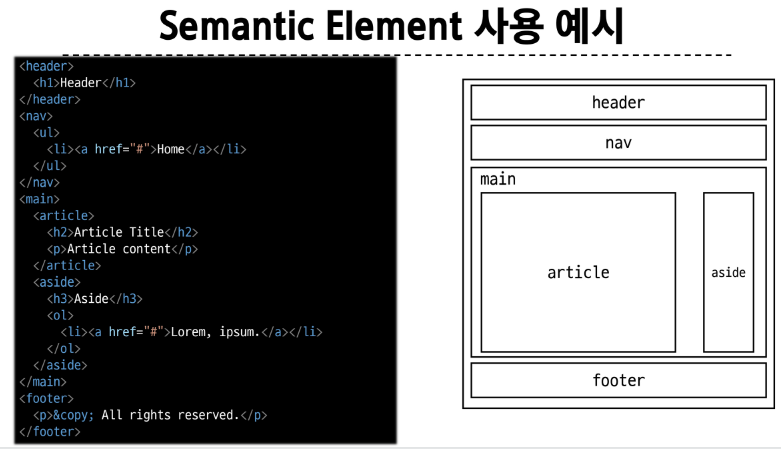
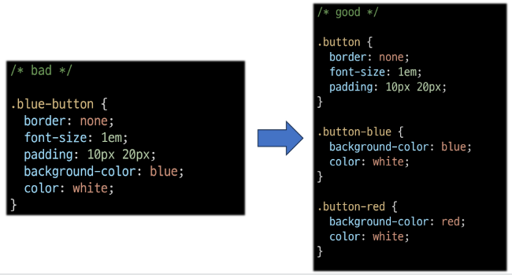
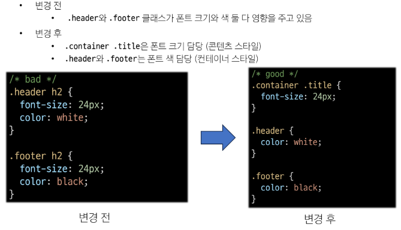

# Web - Bootstrap

<div style="text-align: right"> 24. 03. 08. </div>

## 1. Bootstrap

### 1. Bootstrap

* CSS FrontEnd Framework (Toolkit)

    * 미리 만들어진 다양한 디자인 요소들을 제공하여 Web site를 빠르고 쉽게 개발할 수 있도록 함

* 공식 문서

    * https://getbootstrap.com/

* CDN 

    * Content Delivery Network

    * 지리적 제약 없이 빠르고 안전하게 콘텐츠를 전송할 수 있는 전송 기술

    * 서버와 사용자 사이의 물리적 거리를 줄여 콘텐츠 로딩에 소요되는 시간을 최소화 (Web page 로드 속도를 높임)

    * 지리적으로 사용자와 가까운 CDN 서버에 콘텐츠를 저장해서 사용자에게 전달

* Bootstrap을 사용하는 이유

    * 가장 많이 사용되는 CSS Framework

    * 사전에 디자인된 다양한 component 및 기능

        * 빠른 개발 및 유지보수

    * 손쉬운 반응형 웹 디자인 구현

    * 커스터마이징 용이

    * 크로스 브라우징 지원
    
        * 모든 주요 브라우저에서 작동하도록 설계되어 있음

### 2. Bootstrap 기본 사용법

```CSS
<p class="mt-5">Hello, world!</p>

/* {property m}{sides t}-{size 5} */
```

* Bootstrap에서 class 이름으로 spacing을 표현하는 방법

    * Bootstrap에는 특정 규칙이 있는 class 이름으로 style 및 layout이 미리 작성되어 있음

    * Property

        | | |
        | :---: | :---: |
        | m | margin |
        | p | padding |
        | |

    * Sides

        | | |
        | :---: | :---: |
        | t | top |
        | b | bottom |
        | s | left |
        | e | right |
        | y | top, bottom |
        | x | left, right |
        | blank | 4 sides |
        | |

    * Size

        | | | |
        | :---: | :---: | :---: |
        | 0 | 0 rem | 0px |
        | 1 | 0.25 rem | 4px |
        | 2 | 0.5 rem | 8px |
        | 3 | 1 rem | 16px |
        | 4 | 1.5 rem | 24px |
        | 5 | 3 rem | 48px |
        | auto | auto | auto |
        | |

### 3. Reset CSS

* 모든 HTML 요소 스타일을 일관된 기준으로 재설정하는 간결하고 압축된 규칙 세트

    * HTML Element, Table, List 등의 요소들에 일관성 있게 style을 적용시키는 기본 단계

* 모든 브라우저는 각자의 user agent stylesheet를 가짐 → 이 설정이 브라우저마다 상이함

    * 모든 브라우저에서 Web site를 동일하게 보이게 만들어야 하는 개발자에겐 매우 골치아픈 일

* 모두 똑같은 스타일 상태로 만들고 스타일 개발을 시작하자!

* Normalize CSS

    * Reset CSS 방법 중 대표적인 방법

    * Web 표준 기준으로, 브라우저 중 하나가 불일치한다면 차이가 있는 브라우저를 수정하는 방법

## 2. Typography

* 제목, 본문 텍스트, 목록 등

* Display headings

    * 기존 Heading보다 더 눈에 띄는 제목이 필요한 경우 (더 크고 약간 다른 스타일)

        ```HTML
        <!-- Display heading -->
        <h1 class="display-1">Display 1</h1>
        <h1 class="display-2">Display 2</h1>
        <h1 class="display-3">Display 3</h1>
        <h1 class="display-4">Display 4</h1>
        <h1 class="display-5">Display 5</h1>
        <h1 class="display-6">Display 6</h1>

        <!-- Inline text elemets -->
        <p>You can use the mark tag to <mark>highlight</mark> text.</p>
        <p><del>This line of text is meant to be treated as deleted text.</del></p>
        <p><s>This line of text is meant to be treated as no longer accurate.</s></p>
        <p><ins>This line of text is meant to be treated as an addition to the document.</ins></p>
        <p><u>This line of text will render as underlined.</u></p>
        <p><small>This line of text is meant to be treated as fine print.</small></p>
        <p><strong>This line rendered as bold text.</strong></p>
        <p><em>This line rendered as italicized text.</em></p>

        <!-- lists -->
        <ul class="list-unstyled">
          <li>This is a list.</li>
          <li>It appears completely unstyled.</li>
          <li>Structurally, it's still a list.</li>
          <li>However, this style only applies to immediate child elements.</li>
          <li>Nested lists:
            <ul>
              <li>are unaffected by this style</li>
              <li>will still show a bullet</li>
              <li>and have appropriate left margin</li>
            </ul>
          </li>
          <li>This may still come in handy in some situations.</li>
        </ul>
        ```

    * Bootstrap Color System

        * Bootstrap이 지정하고 제공하는 색상 시스템

        * Colors - Text, Border, Background 및 다양한 요소에 사용

    * Bootstrap Component

        * Bootstrap에서 제공하는 UI 관련 요소

        * 버튼, 네비게이션 바, 카드, 폼 드롭다운 등

        * **일관된 디자인**을 제공하여, Web site 구성 요소를 구축하는 데 유용하게 활용

## 3. Semantic Web

### 1. Semantic Web

* 웹 데이터를 의미론적으로 구조화된 형태로 표현하는 방식

### 2. Semantic in HTML

    ```HTML
    <!-- 단순히 제목처럼 보이게 큰 글자로 만드는 것 -->
    <p style="font-size: 30px;">Heading</p>

    <!-- 페이지 내 최상위 제목이라는 의미르르 제공하는 요소 h1 -->
    <!-- 브라우저에 의해 스타일이 지정됨 -->
    <h1>Heading</h1>
    ```

* HTML Semantic Element

    * 기본적인 모양과 기능 이외에 의미를 가지는 HTML 요소

        * 검색엔진 및 개발자가 웹 페이지 콘텐츠를 이해하기 쉽도록

        

### 3. Semantic in CSS

* CSS 방법론

    * CSS를 효율적이고 유지보수가 용이하게 작성하기 위한 일련의 가이드라인

* OOCSS : Object-Oriented CSS

    * 객체 지향적 접근법을 적용하여 CSS를 구성하는 방법론

    * 기본 원칙

        1. 구조와 스킨을 분리

            * 구조와 스킨을 분리함으로써 재사용 가능성을 높임

            * 모든 버튼의 **공통** 구조 정의 → **각각**의 스킨(배경색, 폰트)을 정의

            

        2. 컨테이너와 콘텐츠를 분리

            * 객체에 직접 적용하는 대신 객체를 둘러싸는 컨테이너에 스타일을 적용

            * 스타일 정의 시 위치에 의존적인 스타일을 사용하지 않도록 함

            * 콘텐츠를 다른 컨테이너로 이동시키거나 재배치할 때 스타일이 깨지는 것을 방지

            

## 3. 참고

* 책임과 역할

    * HTML : 콘텐츠의 구조와 의미

    * CSS : 레이아웃과 디자인

* 의미론적인 마크업이 필요한 이유

    * 검색엔진 최적화 (SEO)
    
        * 검색 엔진이 해당 웹 사이트를 분석하기 쉽게 만들어 검색 순위에 영향을 줌

    * 웹 접근성 (Web Accessibility)

        * 웹 사이트, 도구, 기술이 고령자나 장애를 가진 사용자들이 사용할 수 있도록 설계 및 개발하는 것


<script type="text/javascript" src="http://cdn.mathjax.org/mathjax/latest/MathJax.js?config=TeX-AMS-MML_HTMLorMML"></script>
<script type="text/x-mathjax-config">
  MathJax.Hub.Config({
    tex2jax: {inlineMath: [['$', '$']]},
    messageStyle: "none",
    "HTML-CSS": { availableFonts: "TeX", preferredFont: "TeX" },
  });
</script>