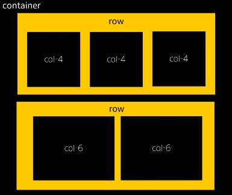
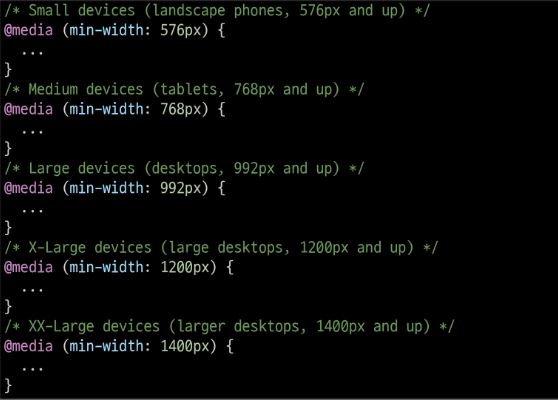
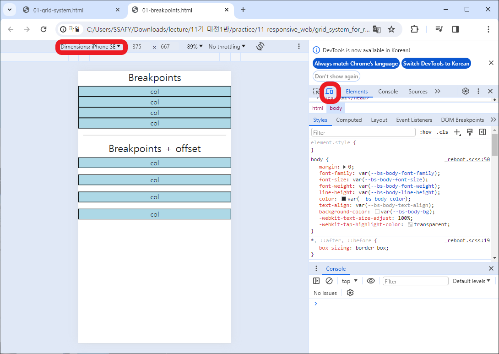
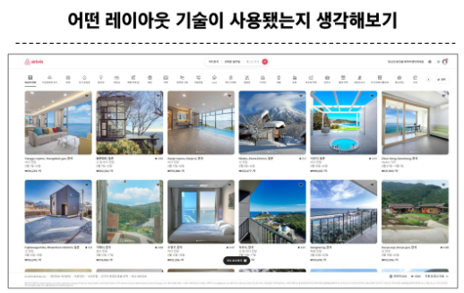
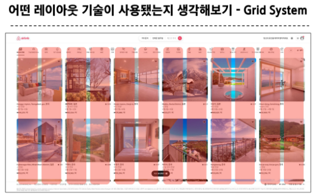
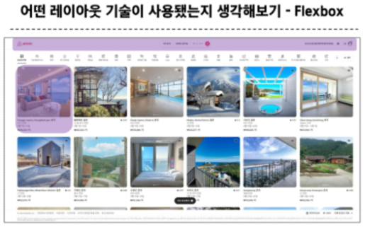
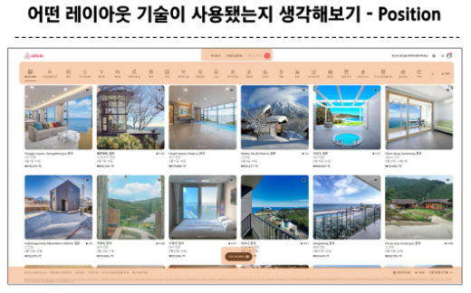

# Web - Responsive Web

<div style="text-align: right"> 24. 03. 11. </div>

## 1. Bootstrap Grid System

### 1. Bootstrap Grid System & Responsive Web Design

* Web page의 layout을 조정하는 데 사용되는 12개의 Column으로 구성된 시스템

    * 반응형 디자인을 지원해 Web Page를 모바일, 태블릿, 데스크탑 등 다양한 기기에서 적절하게 표시할 수 있도록 도움

* 반응형 웹 디자인 Responsive Web Design

    * 디바이스 종류나 화면 크기에 상관없이, 어디서든 일관된 레이아웃 및 사용자 경험을 제공하는 디자인 기술

### 2. Grid System 구조



| N | Elements | Explanation |
| :---: | :---: | :-- |
| 1 | Container | Column들을 담고 있는 공간 |
| 2 | Column | 실제 Contents를 포함하는 부분 |
| 3 | Gutter | Column 간 여백 영역 |

* 1개의 row 안에 12개의 column 영역 구성

* 각 요소는 12개 중 몇 개를 차지할 것인지 지정됨

    ```HTML
    <!-- Grid System - 기본 -->
    <h2 class="text-center">Basic</h2>
    <div class="container">
      <div class="row">
        <div class="box col">col</div>
        <div class="box col">col</div>
        <div class="box col">col</div>
      </div>
      <div class="row">
        <div class="box col-4">col-4</div>
        <div class="box col-4">col-4</div>
        <div class="box col-4">col-4</div>
      </div>
      <div class="row">
        <div class="box col-2">col-2</div>
        <div class="box col-8">col-8</div>
        <div class="box col-2">col-2</div>
      </div>
    </div>
    ```

    ```HTML
    <!-- Grid System - Nesting -->
    <h2 class="text-center">Nesting</h2>
    <div class="container">
      <div class="row">
        <div class="box col-4">col-4</div>
        <div class="box col-8">
          <div class="row">
            <div class="box col-6">col-6</div>
            <div class="box col-6">col-6</div>
            <div class="box col-6">col-6</div>
            <div class="box col-6">col-6</div>
          </div>
        </div>
      </div>
    </div>
    ```

    ```HTML
    <!-- Grid System - Offset -->
    <h2 class="text-center">Offset</h2>
    <div class="container">
      <div class="row">
        <div class="box col-4">col-4</div>
        <div class="box col-4 offset-4">col-4 offset-4</div>
      </div>
      <div class="row">
        <div class="box col-3 offset-3">col-3 offset-3</div>
        <div class="box col-3 offset-3">col-3 offset-3</div>
      </div>
      <div class="row">
        <div class="box col-6 offset-3">col-6 offset-3</div>
      </div>
    </div>    
    ```

    * Gutters

        * Grid System에서 Column 사이에 여백 영역

        * $x$축은 padding, $y$축은 margin으로 여백 생성

    ```HTML
    <h2 class="text-center">Gutters(gx-0)</h2>
    <!-- x : 좌우 방향 -->
    <div class="container">
      <div class="row gx-0">
        <div class="col-6">
          <div class="box">col</div>
        </div>
        <div class="col-6">
          <div class="box">col</div>
        </div>
      </div>
    </div>

    <br>

    <h2 class="text-center">Gutters(gy-5)</h2>
    <!-- y : 상하 방향 -->
    <div class="container">
      <div class="row gy-5">
        <div class="col-6">
          <div class="box">col</div>
        </div>
        <div class="col-6">
          <div class="box">col</div>
        </div>
        <div class="col-6">
          <div class="box">col</div>
        </div>
        <div class="col-6">
          <div class="box">col</div>
        </div>
      </div>
    </div>


    <br>

    <h2 class="text-center">Gutters(g-5)</h2>
    <!-- x, y 없음 : 4방향 모두 -->
    <div class="container">
      <div class="row g-5">
        <div class="col-6">
          <div class="box">col</div>
        </div>
        <div class="col-6">
          <div class="box">col</div>
        </div>
        <div class="col-6">
          <div class="box">col</div>
        </div>
        <div class="col-6">
          <div class="box">col</div>
        </div>
      </div>
    </div>
    ```

### 3. 참고

* The Grid System

    * CSS가 아닌 편집 디자인에서 나온 개념

    * 구성 요소를 잘 배치해서 시각적으로 좋은 결과물을 만들기 위함

    * 기본적으로 안쪽에 있는 요소들의 오와 열을 맞추는 것에서 기인

    * 정보 구조와 배열을 체계적으로 작성하여 정보의 질서를 부여하는 시스템

## 2. Grid System for Responsive Web

### 1. Grid System

* 디바이스 종류나 화면 크기에 상관없이, 어디서든 일관된 레이아웃 및 사용자 경험을 제공하는 디자인 기술

* Bootstrap Grid System에서는 12개의 Column과 6개 breakpoints를 사용해 반응형 웹 디자인을 구현

### 2. Grid System Breakpoints

* 웹 페이지를 다양한 화면 크기에서 적절하게 배치하기 위한 분기점

    * 화면 너비에 따라 6개의 분기점 제공 (xs, sm, md, lg, xl, xxl)

    | | xs<br><576px | sm<br>>=576px | md<br>>=768px | lg<br>>=992px | xl<br>>=1200px | xxl<br>>=1400px |
    | :---: | :---: | :---: | :---: | :---: | :---: | :---: |
    | container | None (auto) | 540px | 720px | 960px | 1140px | 1320px |
    | Class prefix | .col- | .col-sm- | .col-md- | .col-lg- | .col-xl- | .col-xxl- |
    | |

    * 각 breakpoints마다 설정된 최대 너비 값 *이상으로* 화면이 커지면 grid system 동작이 변경됨

    ```HTML
    <!-- Breakpoints 실습 -->
    <h2 class="text-center">Breakpoints</h2>
    <div class="container">
      <div class="row">
        <!-- 기본 상태에서 12-12-12-12칸 할당 -->
        <!-- sm(576 ~ 767px) 상태에서 6-6-6-6칸 할당 -->
        <!-- md(768 ~ 991px) 상태에서 2-8-2-12칸 할당 -->
        <!-- lg(992 ~ 1199px) 상태에서 3-3-3-3칸 할당 -->
        <!-- xl(1200 ~ 1300px) 상태에서 4-4-4-12칸 할당 -->
        <div class="box col-12 col-sm-6 col-md-2 col-lg-3 col-xl-4">
          col
        </div>
        <div class="box col-12 col-sm-6 col-md-8 col-lg-3 col-xl-4">
          col
        </div>
        <div class="box col-12 col-sm-6 col-md-2 col-lg-3 col-xl-4">
          col
        </div>
        <div class="box col-12 col-sm-6 col-md-12 col-lg-3 col-xl-12">
          col
        </div>
      </div>    
    ```
    
    ```HTML
    <!-- Breakpoints + Offset 실습 -->
    <h2 class="text-center">Breakpoints + offset</h2>
    <div class="row gy-3">
      <div class="box col-12 col-sm-4 col-md-6 ">
        col
      </div>
      <div class="box col-12 col-sm-4 col-md-6 ">
        col
      </div>
      <div class="box col-12 col-sm-4 col-md-6 ">
        col
      </div>
      <div class="box col-12 col-sm-4 offset-sm-4 col-md-6 offset-md-0">
        col
      </div>
    </div>    
    ```

### 3. 참고

* Media Query로 작성된 Grid system의 breakpoints

    

* 디바이스마다 보일 수 있는 화면을 웹에서 보는 방법

    

* [Bootstrap - Card 전용 Grid System](https://getbootstrap.com/docs/5.3/components/card/#grid-cards)

    ```HTML
    <h2 class="text-center">Grid Cards</h2>
    <div class="container">
      <!-- grid-card에서는 개수의 관점(column 배치의 관점이 아님) -->
      <!-- row-cols 라는 전용 class 사용 -->
      <div class="row row-cols-1 row-cols-sm-3 row-cols-md-2 gy-3">
        <div class="col">
          <div class="card">
            <div class="card-body">
              <h5 class="card-title">Card title</h5>
              <p class="card-text">This is a longer card with supporting text below as a natural lead-in to additional
                content. This content is a little bit longer.</p>
            </div>
          </div>
        </div>
        <div class="col">
          <div class="card">
            <div class="card-body">
              <h5 class="card-title">Card title</h5>
              <p class="card-text">This is a longer card with supporting text below as a natural lead-in to additional
                content. This content is a little bit longer.</p>
            </div>
          </div>
        </div>
        <div class="col">
          <div class="card">
            <div class="card-body">
              <h5 class="card-title">Card title</h5>
              <p class="card-text">This is a longer card with supporting text below as a natural lead-in to additional
                content.</p>
            </div>
          </div>
        </div>
        <!-- offset은 row가 아니고 col에서 각각 지정해줘야 함, offset에서는 column 배치의 관점(개수의 관점이 아님) -->
        <div class="col offset-sm-4 offset-md-0">
          <div class="card">
            <div class="card-body">
              <h5 class="card-title">Card title</h5>
              <p class="card-text">This is a longer card with supporting text below as a natural lead-in to additional
                content. This content is a little bit longer.</p>
            </div>
          </div>
        </div>
      </div>
    </div>    
    ```

## 3. CSS Layout 종합 정리










<script type="text/javascript" src="http://cdn.mathjax.org/mathjax/latest/MathJax.js?config=TeX-AMS-MML_HTMLorMML"></script>
<script type="text/x-mathjax-config">
  MathJax.Hub.Config({
    tex2jax: {inlineMath: [['$', '$']]},
    messageStyle: "none",
    "HTML-CSS": { availableFonts: "TeX", preferredFont: "TeX" },
  });
</script>