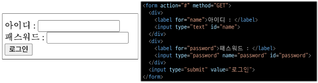

# Django

<div style="text-align: right"> 24. 03. 13. </div>

## 1. Template System

### 1. Django Template System

* Django Template System

    * 데이터 *표현*을 제어하면서, *표현*과 관련된 부분을 담당

    * HTML의 콘텐츠를 변수 값에 따라 바꾸고 싶다면?

    ```python
    from django.shortcuts import render 

    # app 내 views.py
    # render 함수의 추가 인자(3번째 인자)
    def index(request):
        context = {
            'name': 'Jane',
        }
        return render(request, 'articles/index.html', context)
    ```

    ```html
    <body>
        <h1>Hello, {{ name }}</h1>
    </body>
    ```

    * Django Template Language (DTL)

        * Template에서 조건, 반복, 변수 등의 프로그래밍적 기능을 제공하는 시스템

    * DTL Syntax

        | N | Elements | Explanations |
        | :---: | :---: | :--- |
        | 1 | Variable | render 함수의 세번째 인자로, dict 데이터를 사용<br>dict key에 해당하는 문자열이 template에서 사용 가능한 변수명이 됨<br>dot('.')를 사용하여 변수 속성에 접근할 수 있음 |
        | 2 | Filters | 표시할 변수를 수정할 때 사용 (변수 + '|' + 필터)<br>chained(연결)이 가능하며, 일부 필터는 인자를 받기도 함<br>약 60개의 built-in template filters를 제공 |
        | 3 | Tags | 반복 또는 논리를 수행하여 제어 흐름을 만듦<br>일부 태그는 시작과 종료 태그가 필요<br>약 24개의 built-in template tags를 제공 |
        | 4 | Comments | DTL에서의 주석 |
        | |

        ```html
        # 1. Variable
        {{ variable }}
        {{ variable.attribute }}

        # 2. Filters
        {{ variable|filter }}
        {{ name|truncatewords:30 }}

        # 3. Tags
        
         

        # 4. Comments
        <h1>Hello, {# name #}</h1>
        
          ...
        
        ```

### 2. Template Inheritance

* 템플릿 상속

    * 기본 템플릿 구조의 한계

        * 만약 모든 템플릿에 bootstrap을 적용하려면?

        * 모든 템플릿에 bootstrap CDN을 작성해야 할까?

    * 템플릿 상속

        * *페이지의 공통 요소를 포함*하고, *하위 템플릿이 재정의할 수 있는 공간*을 정의하는 기본 'skeleton' 템플릿을 작성하여 상속 구조를 구축

* 상속 구조 만들기

    

    * skeleton 역할을 하는 상위 템플릿 작성

    

    * 기존 하위 템플릿의 변화

* 'extends' tag

    ```html
    
    ```

    * 자식(하위) 템플릿이 부모 템플릿을 확장한다는 것을 알림

    * 반드시 자식 템플릿 최상단에 작성되어야 함 (2개 이상 사용 불가)

* 'block' tag

    ```html
    
    ```

    * 하위 템플릿에서 재정의할 수 있는 블록을 정의

    * 상위 템플릿에 작성하며, 하위 템플릿이 작성할 수 있는 공간을 지정하는 것

* 하위 템플릿이 재정의할 수 있는 block 영역

    

## 2. HTML Form (Request & Response)

* 데이터를 보내고 가져오기 - Sending and Retrieving form data

    * HTML **'form'** element를 통해 사용자와 애플리케이션 간의 상호작용 이해하기

    * HTML 'form'은 HTTP 요청을 서버에 보내는 가장 편리한 방법

    

    

* 'form' element

    * 사용자로부터 할당된 데이터를 서버로 전송

    * 웹에서 사용자 정보를 입력하는 여러 방식을 제공

        * text, password, checkbox 등

    * form의 핵심 속성 2가지 - 'action' & 'method'
    
        * 데이터를 어디(action)로 어떤 방식(method)으로 요청할지

        * action

            * 입력 데이터가 전송될 URL을 지정 (목적지)

            * 만약 이 속성을 지정하지 않으면 데이터는 현재 form이 있는 페이지의 URL로 보내짐

        * method

            * 데이터를 어떤 방식으로 보낼 것인지 정의

            * 데이터의 HTTP request methods (GET, POST)를 지정

* 'input' element

    * 사용자의 데이터를 입력받을 수 있는 요소

        * type 속성 값에 따라 다양한 유형의 입력 데이터를 받음

    * 'name' attribute

        * input의 핵심 속성

        * 입력한 데이터에 붙이는 이름(key)

        * 데이터를 제출했을 때 서버는 name 속성에 설정된 값을 통해서만 사용자가 입력한 데이터에 접근할 수 있음

* Query String Parameters

    * 사용자의 입력 데이터를 URL 주소에 파라미터를 통해 서버로 보내는 방법

    * 문자열은 앰퍼샌드('&')로 연결된 key=value 쌍으로 구성되며, 기본 URL과는 물음표('?')로 구분됨

    * 예시

        - http://host:port/path?key=value&key=value

## 3. form 활용

* 사용자 입력 데이터를 받아 그대로 출력하는 서버 만들기

    1. throw 로직 작성

    

    

* HTTP request 객체

    * view 함수의 첫번째 인자

    * form으로 전송한 데이터뿐만 아니라 모든 요청 관련 데이터가 담겨 있음

## 4. Django URLs

### 1. URL dispatcher

* Requests & Responses에서 Django URLs의 역할

    

* URL dispatcher

    * 운항 관리자, 분배기

    * URL 패턴을 정의하고, 해당 패턴이 일치하는 요청을 처리할 view 함수를 연결(mapping)

### 2. Variables & URL

* 현재 URL 관리의 문제점

    * 템플릿의 많은 부분이 중복되고, URL의 일부만 변경되는 상황이라면 계쏙해서 비슷한 URL과 템플릿을 작성해 나가야 할까?

    ```python
    urlpatterns = [
        path('articles/1/', ...),
        path('articles/2/', ...),
        path('articles/3/', ...),
        path('articles/4/', ...),
        path('articles/5/', ...),
        ...,
    ]
    ```

* Variable Routing

    * URL 일부에 변수를 포함시키는 것

    * 변수는 view 함수의 인자로 전달할 수 있음

    ```python
    urlpatterns = [
        path('articles/<int:num>/', views.detail),
        path('greeting/<str:name>/', views.greeting),
    ]
    ```

* Path Converters

    * URL 변수의 ***type***을 지정

    * str, int 등 5가지 type 지원

## 5. 참고

* 추가 템플릿 경로 지정 - 템플릿 기본 경로 외 커스텀 경로 지정하기

    

    

    

* DTL 주의사항

    * Python처럼 일부 프로그래밍 구조(if, for 등)를 사용할 수 있지만, ***명칭을 그렇게 설계했을 뿐***이지 Python 코드로 실행되는 것이 아니며 Python과는 관련이 없음

    * 프로그래밍적 로직이 아니라 ***표현을 위한*** 것

    * 프로그래밍적 로직은 되도록 view 함수에서 작성 및 처리

    * 공식 문서를 참고해 다양한 태그와 필터를 사용해보기

        * https://docs.djangoproject.com/en/4.2/ref/templates/builtins/

* Trailing Slashes

    * Django는 URL 끝에 '/'가 없다면 자동으로 붙임

    * 기술적 측면에서, foo.com/bar와 foo.com/bar/는 서로 다른 URL

        * 검색 엔진 로봇이나 웹 트래픽 분석 도구에서는 이 두 주소를 서로 다른 페이지로 보기 때문

    * Django는 검색 엔진이 혼동하지 않게 하기 위해 무조건 붙이는 것을 선택

    * 모든 Framework가 이렇게 동작하는 것은 아님에 주의

<script type="text/javascript" src="http://cdn.mathjax.org/mathjax/latest/MathJax.js?config=TeX-AMS-MML_HTMLorMML"></script>
<script type="text/x-mathjax-config">
  MathJax.Hub.Config({
    tex2jax: {inlineMath: [['$', '$']]},
    messageStyle: "none",
    "HTML-CSS": { availableFonts: "TeX", preferredFont: "TeX" },
  });
</script>