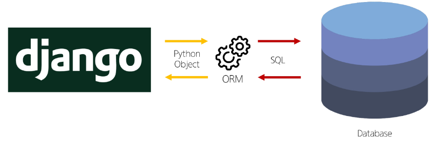
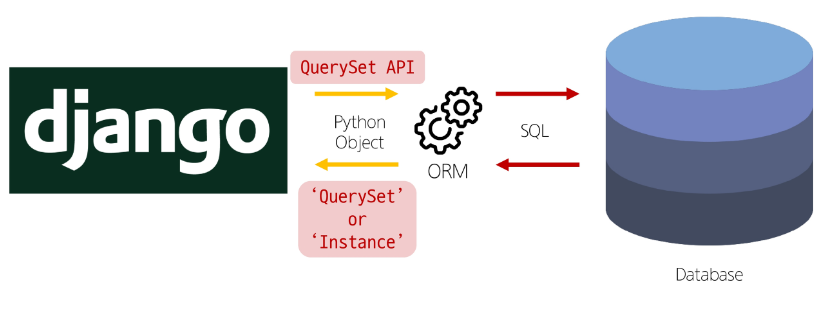
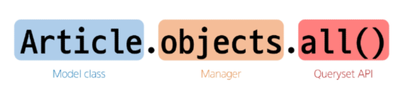
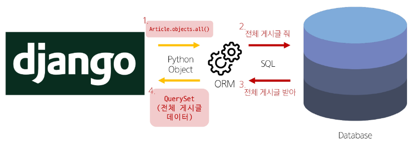
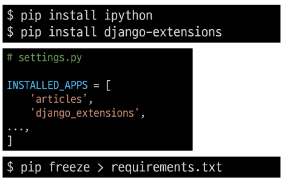
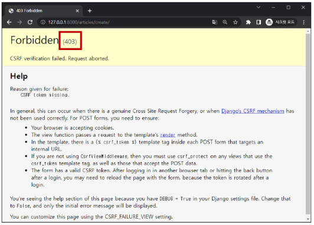
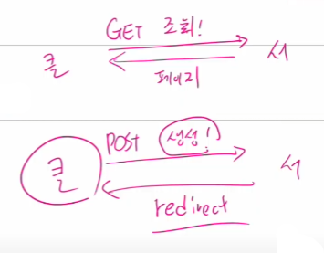
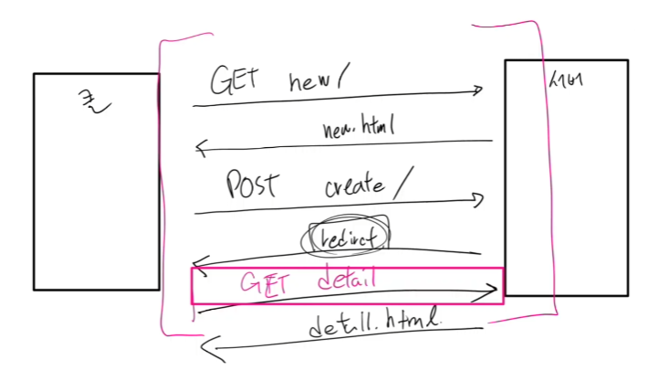

# Django - ORM

<div style="text-align: right"> 24. 03. 25. ~ 24. 03. 26. </div>

## 1. ORM

### 1. ORM (Object-Relational-Mapping)

* 객체 지향 프로그래밍 언어를 사용해 (ex. Python), 호환되지 않는 유형의 시스템 간에 데이터를 변환하는 기술

* ORM의 역할

    

    * Django → Database : QuerySet API

    * Database → Django : QuerySet (다중 데이터) or Instance (단일 데이터)

* QuerySet API

    * ORM에서 데이터를 검색, 필터링, 정렬 및 그룹화하는 데 사용하는 도구

    * API를 사용해 SQL이 아닌 Python 코드로 데이터 처리

    

    

    * Model class (Articles) 부분이 바뀜, Queryset API(Method, all()) 부분은 잘 바뀌지 않음

    * 전체 문구를 ORM이 해석해서 SQL이라는 언어로 번역함

    

    * **1번과 4번을 잘 처리하는 것이 Django ORM의 목적**

* Query

    * 데이터베이스에서, 특정한 데이터를 보여 달라는 요청

    * "쿼리문을 작성한다" : 원하는 데이터를 얻기 위해 데이터베이스에 요청을 보낼 코드를 작성한다.

    * Python으로 작성한 코드가 ORM에 의해 SQL로 변환되어 데이터베이스에 전달되며, 데이터베이스의 응답 데이터를 ORM이 QuerySet이라는 자료 형태로 변환하여 우리에게 전달

* QuerySet

    * 데이터베이스에게서 전달받은 객체 목록 (데이터 모음)
    
        * **순회가 가능한 데이터**로써 1개 이상의 데이터를 불러와 사용할 수 있음

    * Django ORM을 통해 만들어진 자료형

    * 단, 데이터베이스가 단일한 객체를 반환할 때는 QuerySet이 아닌 모델(class)의 인스턴스로 반환됨

* QuerySet API는, Python의 Model Class와 Instance를 활용해, DB에 데이터를 저장, 조회, 수정, 삭제하는 것

    * CRUD - 저장(Create), 조회(Read), 수정(Update), 삭제(Delete)

### 2. QuerySet API

* QuerySet API 실습 사전 준비

    * 외부 라이브러리 설치 및 설정

    

* Django shell

    * Django 환경 안에서 실행되는 python shell

    * 입력하는 QuerySet API 구문이 Django 프로젝트에 영향을 미침

    ```bash
    # 그냥 shell은 쓰기가 어려움
    $ python manage.py shell_plus
    ```

1. Create

    * 데이터 객체를 만드는 (생성하는) 3가지 방법

        1. 

        ```s
        # 1-1
        >>> article = Article()      # Article(class) 로부터 article(instance) 생성
        >>> article
        <Article: Article object (None)>

        >>> article.title = 'first'  # 인스턴스 변수 (title)에 값을 할당
        >>> article.content = 'django!' # 인스턴스 변수 (content)에 값을 할당

        # 1-2
        # save를 호출하고 확인하면 저장된 것을 확인할 수 있다.
        >>> article.save()
        >>> article
        <Article: Article object (1)>
        >>> article.id
        1
        >>> article.pk
        1
        >>> Article.objects.all()
        <QuerySet [Article: Article object (1)]>

        # 1-3
        # 인스턴스 article을 활용해 인스턴스 변수 활용하기
        >>> article.title
        'first'
        >>> article.content
        'django!'
        >>> article.create_at
        datetime.datetime(2023, 6, 30,  6, 55, 42, 322526, tzinfo=datetime.timezone.utc)
        ```

        2. 

        ```s
        # save Method를 호출해야 비로소 DB에 데이터가 저장됨
        # 테이블에 한 줄(행, 레코드)이 쓰여진 것

        >>> article = Article(title = 'second', content = 'django!')

        # 아직 저장되어 있지 않음
        >>> article
        <Article: Article object (None)>

        # save를 호출해야 저장됨
        >>> article.save()
        >>> article
        <Article: Article object (2)>
        >>> Article.objects.all()
        <QuerySet [<Article: Article object (1)>, <Article: Article object (2)>]>
        ```

        3. 
        ```s
        # QuerySet API 중 create() Method 활용
        # 위 2가지 방법과 달리 바로 저장 이후 바로 생성된 데이터가 반환
        
        >>> Article.objects.create(title = 'third', content = 'django!')
        <Article: Article object (3)>
        ```

    * save()

        * 객체를 데이터베이스에 저장하는 method

2. Read

    * 대표적인 조회 메서드

        * Return new QuerySets - all(), filter()

            * Iterable Object 반환 (→ QuerySet 반환)

        * Do not return QuertSets - get()

            * Non-iterable Object 반환 (→ 단일 데이터 반환)

    * all() : *전체 데이터* 조회, QuerySet 반환

    ```s
    >>> Article.objects.all()
    <QuerySet [<Article: Article object (1)>, <Article: Article object (2)>, <Article: Article object (3)>]>
    ```

    * filter() : *특정 조건 데이터* 조회, QuerySet 반환

    ```s
    >>> Article.objects.filter(content = 'django!')
    <QuerySet [<Article: Article object (1)>, <Article: Article object (2)>, <Article: Article object (3)>]>
    >>> Article.objects.filter(title = 'abc')
    <QuerySet []>
    >>> Article.objects.filter(title = 'first')
    <QuerySet [<Article: Article object (1)>]>
    ```

    * get() : 단일 데이터 조회 → 조건이 들어갈 수밖에 없음

    ```s
    # 반환된 데이터를 변수에 넣어 활용할 수 있음!!!
    >>> Article.objects.get(pk = 1)
    <Article: Article object (1)>

    # get()의 특징 - 2가지 예외
    # 1. 객체를 찾을 수 없으면 DoesNotExist 예외 발생
    >>> Article.objects.get(pk = 100)
    DoesNotExist: Article matching query does not exist.

    # 2. 둘 이상의 객체를 찾으면 MultipleObjectsReturned 예외 발생
    >>> Article.objects.get(content = 'django!')
    MultipleObjectsRetrned: get() returned more than one Article -- it returned 2!

    # 위 두 가지 특징을 갖고 있기 때문에, primary key와 같이 고유성(Uniqueness)을 보장하는 조회에서 사용해야 함!!!
    ```

3. Update → 조회가 선행되어야 함

* 데이터 수정

    * 인스턴스 변수 변경 후 save Method 호출

    ```s
    # 수정할 인스턴스 조회
    >>> article = Article.objects.get(pk = 1)

    # 인스턴스 변수 변경
    >>> article.title = 'byebye'

    # 저장
    >>> article.save()

    # 정상적으로 변경된 것을 확인
    >>> article.title
    'byebye'
    ```

4. Delete → 조회가 선행되어야 함

* 데이터 삭제

    * 삭제하려는 데이터 조회 후 deleta Method 호출

    ```s
    # 삭제할 인스턴스 조회
    >>> article = Article.objects.get(pk = 1)

    # delete Method 호출 (삭제된 객체가 반환)
    >>> article.delete()
    (1, { 'articles.Article' : 1 })

    # 삭제한 데이터는 더 이상 조회할 수 없음
    >>> Article.objects.get(pk = 1)
    DoesNotExist: Article matching query does not exist.
    ```

* 일반적인 상황에서, 한 번 지워진 PK(Primary Key) 값은 재사용하지 않는다.

    * 새로 생성되는 데이터는 그 다음 PK값을 할당받는다.

### 3. 참고

* Field lookups

    * 특정 레코드에 대한 조건을 설정하는 방법

    * QuerySet Method filter(), exclude() 및 get()에 대한 keyword 인자로 지정

    ```s
    # Field lookups 예시

    # "content column에 'dja'가 포함된 모든 데이터 조회"
    >>> Article.objects.filter(content = 'dja')
    <QuerySet []>
    >>> Article.objects.filter(content__contains = 'dja')
    <QuerySet [<Article: Article object (1)>, <Article: Article object (2)>, <Article: Article object (3)>]>
    ```

* ORM, QuerySet API를 사용하는 이유

    * DB Query를 추상화하여 Django 개발자가 DB와 직접 상호작용하지 않아도 되도록 함

    * DB와의 결합도를 낮추고, 개발자가 더욱 직관적이고 생산적으로 개발할 수 있도록 도움

* QuerySet API 관련 문서

    * [Django QuerySets API - Official Documents](https://docs.djangoproject.com/en/4.2/ref/models/quertsets/)

    * [Django Queries - Official Documents](https://docs.djangoproject.com/en/4.2/topics/db/queries/)

## 2. ORM with View

* Django shell에서 연습했던 QuerySet API를 View 함수에서 사용하기

### 1. Read

* 전체 게시글 조회

    ```python
    # articles/views.py

    from .models import Article

    def index(request):
        articles = Article.objects.all()
        context = {
            'articles': articles,
        }
        return render(request, 'articles/index.html', context)
    ```

    ```HTML
    <!-- articles/index.html -->

    <h1>Articles</h1>
    <hr>
    
        <p>글 번호: {{ article.pk }}</p>
        <p>글 제목: {{ article.title }}</p>
        <p>글 내용: {{ article.content }}</p>
        <hr>
    
    ```

* 단일 게시글 조회

    ```python
    # articles/urls.py

    urlpatterns = [
        ...
        path('<int:pk>/', views.detail, name = 'detail'),
    ]
    ```

    ```python
    # articles/views.py

    def detail(request, pk):
        article = Article.objects.get(pk = pk)
        context = {
            'article': article,
        }
        return render(request, 'articles/detail.html', context)
    ```

    ```HTML
    <!-- articles/detail.html -->

    <h2>DETAIL</h2>
    <h3>{{ article.pk }}번째 글</h3>
    <hr>
    <p>제목: {{ article.title }}</p>
    <p>내용: {{ article.content }}</p>
    <p>작성일: {{ article.created_at }}</p>
    <p>수정일: {{ article.updated_at }}</p>
    <hr>
    <a href="">[back]</a>
    ```

    ```HTML
    <!-- articles/index.html -->

    <h1>Articles</h1>
    <hr>

    
    <p>글 번호 : {{ article.id }}</p>

    <a href="">
        <p>글 제목 : {{ article.title }}</p>
    </a>

    <p>글 내용 : {{ article.content }}</p>
    <hr>
    
    ```

### 2. Create

* Create Logic 구현을 위해 필요한 view 함수는?

    * 사용자 입력 데이터를 받을 페이지를 렌더링 - new

    * 사용자가 입력한 데이터를 받아 DB에 저장 - create

* new

    ```python
    # articles/urls.py

    urlpatterns = [
        ...
        path('new/', views.new, name = 'new'),
    ]
    ```

    ```python
    # articles/views.py

    def new(request):
        return render(request, 'articles/new.html')
    ```

    ```HTML
    <!-- articles/new.html -->

    <h1>NEW</h1>
    <form action="#" method="GET">
        <div>
            <label for="title">Title: </label>
            <input type="text" name="title" id="title">
        </div>
        <div>
            <label for="content">Content: </label>
            <textarea name="content" id="content"></textarea>
        </div>
        <input type="submit">
    </form>
    <hr>
    <a href="">[back]</a>
    ```

    * new 페이지로 이동할 수 있는 하이퍼링크 작성
     
        ```HTML
        <!-- articles/index.html -->

        <h1>Articles</h1>
        <a href="">NEW</a>
        <hr>
        ...
        ```

* create

    ```python
    # articles/urls.py

    urlpatterns = [
        ...
        path('create/', views.create, name = 'create'),
    ]
    ```

    ```HTML
    <!-- articles/create.html -->

    <h1>게시글이 작성되었습니다.</h1>
    ```

    ```python
    # articles/views.py
    def create(request):
        title = request.GET.get('title')
        content = request.GET.get('content')

        # 1
        # article = Article()
        # article.title = title
        # article.content = content
        # article.save()

        # 2
        article = Article(title = title, content = content)
        article.save()

        # 3
        # Article.objects.create(title = title, content = content)

        return render(request, 'articles/create.html')
    ```

    ```HTML
    <!-- articles/new.html -->
    <h1>New</h1>
    <form action="" method="GET">
        <input type="text" name="title">
        <textarea name="content"></textarea>
        <input type="submit">
    </form>
    ```

* HTTP request methods

    * HTTP : 네트워크 상에서 데이터를 주고받기 위한 약속

    * HTTP request methods : 데이터(리소스)에 어떤 요청(행동)을 원하는지를 나타내는 것 - GET & POST

    * GET Method : 특정 리소스를 **조회**하는 요청

        * 데이터를 전달할 때 URL에서 Query String 형식으로 보내짐 → DB에 변화를 주지 않는 행위

        * http://127.0.0.1:8000/articles/create/?***title=제목&content=내용***

    * POST Method : 특정 리소스에 **변경(생성, 수정, 삭제)**을 요구하는 요청 → DB에 ***직접적 변화를 주는*** 행위

        * 데이터는 전달할 때 HTTP Body에 담겨 보내짐

        * ***게시글 생성 요청***이 POST로 바뀌어야 함

        ```HTML
        <!-- articles/new.html -->

        <h1>NEW</h1>
        <form action="" method="POST">
            ...
        </form>
        ```

        ```python
        # articles/views.py

        def create(request):
            # title = request.GET.get('title')
            # content = request.GET.get('content')
            title = request.POST.get('title')
            content = request.POST.get('content')
            ...
        ```

        * 게시글 작성 후 403 응답 확인
        

    * HTTP response status code : 특정 HTTP 요청이 성공적으로 완료되었는지를 3자리 숫자로 표현하기로 약속한 것

        * 403 Forbidden : 서버에 요청이 전달되었지만, *권한* 떄문에 거절되었다는 것을 의미

        * 404 : Page not Found → 없는 페이지를 요청했거나, 서버에서 해당 페이지를 준비하지 않았거나

        [MDN web docs: HTTP response status codes](https://developer.mozilla.org/en-US/docs/Web/HTTP/Status)

    * CSRF (Cross-Site-Request-Forgery) : 사이트 간 요청 위조

        * 사용자가 자신의 의지와 무관하게 공격자가 의도한 행동을 하여, 특정 웹 페이지를 보안에 취약하게 하거나 수정, 삭제 등의 작업을 하게 만드는 공격 방법

        * CSRF Token 적용 → Network 탭에서 확인 가능

            * POST는 ***DB를 건드리는*** 행위 → 보안의 관점에서 생각해야 할 이유가 있다.

            * Django 서버는 해당 요청이 DB에 데이터를 하나 생성하는(DB에 영향을 주는) 요청에 대해 *"Django가 직접 제공한 페이지에서 요청을 보낸 것인지"*에 대한 확인 수단이 필요한 것

            * 가짜 사이트에서 오는 요청을 받지 않겠다 → 방지 수단으로 DTL의 csrf_token 태그 사용

            | 기존 | 변경 |
            | :---: | :---: |
            | 요청 데이터 → 게시글 작성 | 요청 데이터 + **인증 토큰** → 게시글 작성 |
            | |

                * 요청 시 토큰 값도 함께 서버로 전송

            ```HTML
            <!-- articles/new.html -->

            <h1>NEW</h1>
            <form action="" method="POST">
                
                ...
            ```
        * 왜 POST일 때만 Token을 확인할까?

            * POST는 단순 조회를 위한 GET과 달리, 특정 리소스에 변경(생성, 수정, 삭제)을 요구하는 의미와 기술적인 부분을 갖고 있기 때문

            * DB에 조작을 가하는 요청은 반드시 인증 수단이 필요

            * DB에 대한 변경사항을 만드는 요청이기 때문에, 토큰을 사용해 최소한의 신원 확인을 하는 것

* redirect

    * 게시글 작성 후 완료를 알리는 페이지를 응답하는 것

        * 게시글을 "조회해줘!" 라는 요청이 아닌, "작성해줘!" 라는 요청이기 때문에, 게시글 저장 후 페이지를 응답하는 것은 POST 요청에 대한 적절한 응답이 아님

        * 데이터 저장 후 페이지를 주는 것이 아닌, 다른 페이지로 사용자를 보내야 한다.

            * "사용자를 보낸다." == **"사용자가 GET 요청을 한번 더 보내도록 해야 한다."**

            

    * redirect() : 클라이언트가 인자에 작성된 주소로 다시 요청을 보내도록 하는 함수

        ```python
        # articles/views.py
        from django.shortcuts import render, redirect

        def create(request):
            title = request.POST.get('title')
            content = request.POST.get('content')
            article = Article(title = title, content = content)
            article.save()

            # redirect(주소, 파라미터)
            return redirect('articles:detail', article.pk)
        ```

        

        * 게시글 작성 후 생성된 게시글의 detail 페이지로 redirect되었는지 확인

        * create 요청 이후에 detail로 다시 요청을 보냈다는 것을 알 수 있음

### 3. Delete

* 삭제 → 조회가 필수적으로 선행되어야 함 → variable routing이 존재해야 함

    ```python
    # articles/urls.py

    urlpatterns = [
        ...
        path('<int:pk>/delete/', views.delete, name = 'delete'),
    ]
    ```

    ```python
    # articles/urls.py

    def delete(request, pk):
        article = Article.objects.get(pk = pk)
        article.delete()
        return redirect('articles:index')   # 게시글 삭제가 잘 되면 메인 페이지로 이동
    ```

    ```HTML
    <!-- articles/detail.html -->

    <body>
        <h2>DETAIL</h2>
        ...
        <hr>
        <form action="" method="POST">
            
            <input type="submit" value="DELETE">
        </form>
        <a href="">[back]</a>
    </body>
    ```

### 4. Update

* Update Logic 구현을 위해 필요한 view 함수는?

    * 사용자 입력 데이터를 받을 페이지를 렌더링 - edit

    * 사용자가 입력한 데이터를 받아 DB에 저장 - update

* edit

    ```python
    # articles/urls.py

    urlpatterns = [
        ...
        path('<int:pk>/edit/', views.edit, name = 'edit'),
    ]
    ```

    ```python
    # articles/views.py

    def edit(request, pk):
        article = Article.objects.get(pk = pk)
        context = {
            'article': article,
        }
        return render(request, 'articles/edit.html', context)
    ```

    * 수정 시 이전 데이터가 출력될 수 있도록 작성하기

    ```HTML
    <!-- articles/edit.html -->
    <h1>EDIT</h1>
    <form action="#" method="POST">
        
        <div>
            <label for="title">Title: </label>
            <input type="text" name="title" id="title" value="{{ article.title }}">
        </div>
        <div>
            <label for="content">Content: </label>
            <textarea name="content" id="content">{{ article.content }}</textarea>
        </div>
        <input type="submit">
    </form>
    <hr>
    <a href="">[back]</a>
    ```

    * edit 페이지로 이동하기 위한 하이퍼링크 작성

    ```HTML
    <!-- articles/detail.html -->

    <body>
        <a href="">EDIT</a><br>
        <form action="" method="POST">
            
            <input type="submit" value="DELETE">
        </form>
        <a href="">[back]</a>
    </body>
    ```

* update

    ```python
    # articles/urls.py

    urlpatterns = [
        ...
        path('<int:pk>/update/', views.update, name = 'update'),
    ]
    ```

    ```python
    # articles/views.py

    def update(request, pk):
        article = Article.objects.get(pk = pk)
        article.title = request.POST.get('title')
        article.content = request.POST.get('content')
        article.save()

        return redirect('articles:detail', article.pk)
    ```

    * 작성 후 게시글 수정 테스트 - action 부분 수정

    ```HTML
    <!-- articles/edit.html -->
    <h1>EDIT</h1>
    <form action="" method="POST">
        ...
    ```

### 5. 참고

* GET 과 POST

| | GET | POST |
| :---: | :---: | :---: |
| 데이터 전송 방식 | URL의 Query String Parameter | HTTP Body |
| 데이터 크기 제한 | 브라우저 제공 URL의 최대 길이 | 제한 없음 |
| 사용 목적 | 데이터 검색 및 조회 | 데이터 제출 및 조작 |
| |

* GET 요청이 필요한 경우

    | Purpose | Explanation |
    | :---: | :--- |
    | 캐싱 및 성능 | GET 요청은 캐시(Cache)될 수 있고, 이전에 요청한 정보를 새로 요청하지 않고 사용할 수 있음<br>특히, 동일한 검색 결과를 여러 번 요청하는 경우 GET 요청은 캐시를 활용하여 더 빠르게 응답할 수 있음 |
    | 가시성 및 공유 | GET 요청은 URL에 데이터가 노출되어 있기 때문에 사용자가 해당 URL을 북마크하거나 다른 사람과 공유하기 용이 |
    | RESTful API 설계 | HTTP 메서드의 의미에 따라 동작하도록 디자인된 API의 일관성을 유지할 수 있음 |
    | |

* 캐시 (Cache)

    * 데이터나 정보를 임시로 저장해두는 메모리나 디스크 공간

    * 이전에 접근한 데이터를 빠르게 검색하고 접근할 수 있도록 함

<script type="text/javascript" src="http://cdn.mathjax.org/mathjax/latest/MathJax.js?config=TeX-AMS-MML_HTMLorMML"></script>
<script type="text/x-mathjax-config">
  MathJax.Hub.Config({
    tex2jax: {inlineMath: [['$', '$']]},
    messageStyle: "none",
    "HTML-CSS": { availableFonts: "TeX", preferredFont: "TeX" },
  });
</script>