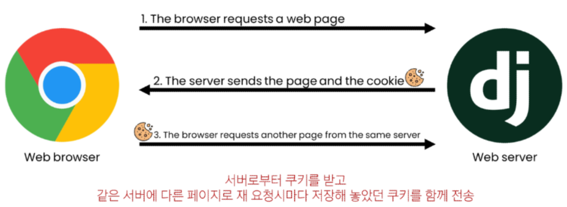
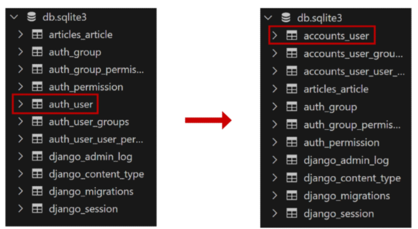
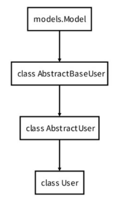

# Django - Authentication System

<div style="text-align: right"> 24. 03. 29. </div>

## 1. Cookie & Session

* 우리가 서버로부터 받은 페이지를 둘러보는 상황 != 서버와 서로 연결되어 있는 상태

### 1. HTTP

* HTML 문서와 같은 리소스들을 가져올 수 있도록 해 주는 규약

* 웹 (WWW)에서 이루어지는 모든 데이터 교환의 기초

* HTTP의 특징

    * 비 연결 지향 (connectionless) : 서버는 요청에 대한 응답을 보낸 후 연결을 끊음

    * 무상태 (stateless) : 연결을 끊는 순간, 클라이언트와 서버 간 통신이 끝나며 상태 정보가 유지되지 않음

    * *상태가 없다* : 로그인 상태를 유지할 수 없음 → 상태를 유지하기 위한 기술이 필요

### 2. 쿠키 (Cookie)

* 서버가 사용자의 웹 브라우저에 전송하는 작은 데이터 조각

* 클라이언트 측에서 저장되는 작은 데이터 파일이며, **사용자 인증**, 추적, 상태 유지 등에 사용되는 데이터 저장 방식

* 쿠키 사용 예시

    

    1. 브라우저 → 서버로 웹 페이지 요청

    2. 서버가 페이지와 쿠키를 함께 전송

        * 요청과 응답을 하면 이 둘의 관계는 끊어짐

        * **로그인이라는 상태를 유지**하기 위해, **내가 로그인했다는 내용의 쿠키**를 매 요청마다 보내야 함

    3. 브라우저 → 해당 서버에 다른 페이지를 요청 (쿠키를 포함하여 요청 전송)

* 쿠키 사용 원리

    1. 브라우저(클라이언트)는 쿠키를 key-value의 데이터 형식으로 저장

    2. 이렇게 쿠키를 저장해 놓았다가, 동일한 서버에 재요청 시 저장된 쿠키를 함께 전송

        * 쿠키는 두 요청이 동일한 브라우저에서 들어왔는지 아닌지를 판단할 때 주로 사용됨

        * 이를 이용해 사용자의 로그인 상태를 유지할 수 있음

        * 상태가 없는(stateless) HTTP 프로토콜에서 상태 정보를 기억시켜 주기 때문

* 쿠키 사용 목적

    1. 세션 관리 (Session Management) : 로그인, 아이디 자동완성, 공지 하루 안 보기, 팝업 체크, 장바구니 등의 정보 관리

        * 세션 (Session) : 서버 측에서 생성되어, 클라이언트와 서버 간 상태를 유지, 상태 정보를 저장하는 데이터 저장 방식

            * 쿠키의 일부로, 쿠키에 세션 데이터를 저장해 매 요청시마다 세션 데이터를 함께 보냄

            * 세션 작동 원리

                1. 클라이언트가 로그인하면 서버가 Session 데이터를 생성 후 저장

                2. 생성된 Session 데이터에 인증할 수 있는 Session ID 발급

                3. 발급한 Session ID를 클라이언트에 응답

                4. 클라이언트가 다시 동일한 서버에 접속하면, 요청과 함께 쿠키(Session ID가 저장된)를 서버에 전달

                5. 쿠키는 요청 때마다 서버에 함께 전송되므로, 서버에서 Session ID를 확인해 로그인되어 있다는 것을 알도록 함


    2. 개인화 (Personalization) : 사용자 선호, 테마 등의 설정

    3. 트래킹 (Tracking) : 사용자 행동을 기록 및 분석

* Cookie - Session 요약

    * 서버 측 : Session 데이터를 생성 후 저장(관리), 이 데이터에 접근할 수 있는 Session ID를 생성

    * 클라이언트 : Cookie에, 서버로부터 전달받은 Session ID를 저장, 이후 클라이언트가 같은 서버에 재요청 시마다 저장해둔 Cookie도 요청과 함께 전송

        * ex) 로그인 상태를 유지하기 위해, 로그인되어 있다는 사실을 입증하는 데이터를 매 요청마다 계속해서 보내는 것

    * Cookie & Session의 목적 : 서버와 클라이언트 간 '상태'를 유지

* Cookie 종류별 Lifetime (수명)

    1. Session Cookie : 현재 Session(Current Session)이 종료되면 삭제됨, 브라우저 종료와 함께 Session이 삭제됨
    
    2. Persistent Cookie : Expires 속성에 지정된 날짜 혹은 Max-Age 속성에 지정된 기간이 지나면 삭제됨

* Session in Django

    * Django는 'Database-backed session' 저장 방식을 기본 값으로 사용

    * Session 정보는 DB의 django-session table에 저장됨

    * Django는 요청안에 특정 Session ID를 포함하는 쿠키를 사용해 각각의 브라우저와 사이트가 연결된 Session 데이터를 알아냄

    * Django는 우리가 Session 메커니즘 (복잡한 동작원리) 에 대부분을 생각하지 않게끔 많은 도움을 줌

## 2. Authentication System

* 사용자 인증과 관련된 기능을 모아놓은 시스템

    * Authentication (인증) : 사용자가 자신이 누구인지 확인하는 것 (신원 확인)

* 사전 준비

    * 두 번째 app인, accouts 생성 및 등록

        * auth와 관련한 경로나 키워드들을 django 내부적으로 accounts라는 이름으로 사용하고 있기 때문에, 되도록 'accounts'로 지정하는 것을 권장

    ```python
    # accounts/urls.py

    from django.urls import path
    from . import views

    app_name = 'accounts'
    urlpatterns = [
      
    ]
    ```

    ```python
    # crud/urls.py

    urlpatterns = [
        ...,
        path('accounts/', include('accounts.urls')),
    ]
    ```

## 3. Custom User Model

* User Model 대체하기 : django가 기본적으로 제공하는 User model이 아닌, 직접 작성한 User model을 사용하기 위해

    * 우리는 지금까지 별도의 User class 정의 없이 내장된 auth app에 작성된 User class를 사용했음

    * 별도의 설정 없이 사용할 수 있어 간편하지만, 개발자가 직접 수정할 수 없는 문제가 존재

* 내장된 auth app

    ```python
    # settings.py

    INSTALLED_APPS = [
        ...
        'django.contrib.auth',
        ...
    ]
    ```

* 대체하기

    1. AbstractUser class를 상속받는 custom User class 작성

        * 기존 User class도 AbstractUser를 상속받기 때문에, 이렇게 하면 custom User class도 기존 User class와 완전히 같은 모습을 가지게 됨

        ```python
        # accounts/models.py

        from django.contrib.auth.models import AbstractUser

        class User(AbstractUser):
            pass
        ```

    2. django 프로젝트가 사용하는 기본 User model을, 작성한 User model로 지정

        * 수정 전 기본값은 'auth.User'

        ```python
        # settings.py

        AUTH_USER_MODEL = 'accounts.User'
        # 'accounts' app의 'User' class를 의미
        ```

    3. admin site에 대체한 User 모델 등록
      
        * 필수는 아니나, admin site에서 기존과 동일한 화면을 보기 위해 입력

        * 기본 User 모델(내장된 User 모델)이 아니기 때문에, 등록하지 않으면 출력되지 않기 때문

        ```python
        # accounts/admin.py

        from django.contrib import admin
        from django.contrib.auth.admin import UserAdmin
        from .models import User

        admin.site.register(User, UserAdmin)
        ```

* AUTH_USER_MODEL

    * Django 프로젝트의 User를 나타내는 데 사용하는 모델을 지정

        ※ 프로젝트 중간에 AUTH_USER_MODEL을 변경할 수 없음

    * 프로젝트를 시작하며 반드시 User 모델을 대체해야 한다.

        * Django는 새 프로젝트를 시작하는 경우 (기본 User 모델이 충분하더라도) custom User model을 설정하는 것을 강력히 권장하고 있음
        
            * 첫 migrate 전에 User model 대체 작업이 완료되어 있어야 함

            * custom User model은 기본 User model과 동일하게 작동하면서도, 필요한 경우 나중에 맞춤 설정할 수 있기 때문

        * 이미 프로젝트가 진행되고 있을 경우 DB 초기화 후 진행

    * 사용하는 User Table의 변화

    

## 4. Login & Logout

### 1. Login

* Login : Session을 Create하는 과정

* AuthenticationForm() : Login 인증에 사용할 데이터를 입력받는 built-in form

    * ModelForm이 아닌, **Form**이다.

        * 공통점 : 사용자 입력 데이터를 받기 위한 역할

        * 차이점 : Form은 이 데이터를 DB에 저장하지 않음, ModelForm은 DB에 데이터를 저장함

* Login 페이지 및 로직 작성

    ```python
    # accounts/urls.py

    app_name = 'accounts'
    urlpatterns = [
        path('login/', views.login, name='login'),
    ]
    ```

    ```HTML
    <!-- accounts/login.html -->

    <h1>로그인</h1>
    <form action="" method="POST">
        
        {{ form.as_p }}
        <input type="submit">
    </form>
    ```

    ```python
    # accounts/views.py

    from django.contrib.auth.forms import AuthenticationForm

    from django.shortcuts import render, redirect
    from django.contrib.auth import login as auth_login

    def login(request):
        if request.method == "POST":
            form = AuthenticationForm(request, request.POST)
            # form = AuthenticationForm(request, data=request.POST)
            # ModelForm은 첫 번째 인자로 data를 받았었음
            # Form은 두 번째 인자로 data를 받아야 함 → 첫 번째 인자가 요청이면 ModelForm이 아닌 Form이다.
            if form.is_valid():
              auth_login(request, form.get_user())
              return redirect('articles:index')

        else:
            form = AuthenticationForm()

        context = {
            'form': form,
        }
        return render(request, 'accounts/login.html', context)
    ```

    ```HTML
    <!-- articles/index.html -->

    <h1>Articles</h1>
    <a href="">Login</a>
    <a hred="">NEW</a>
    <hr>
    ```

* login(request, user) : AuthenticationForm을 통해 인증된 사용자를 로그인하는 함수

* get_user() : AuthenticationForm의 instance method

    * *유효성 검사를 통과했을 경우* 로그인한 사용자 객체를 반환

    * 유효성 검사를 통과한 경우에만 반환값 (사용자 객체) 이 존재

* Login 사실 확인 방법 (→ Session data 확인 방법)

    1. DB에서 Session 확인 (django_session)

        * expire date는 2주가 default

    2. 브라우저에서 Session ID 확인 (Cookies - sessionid)

        * 개발자 도구 - Application - Storage - Cookies 에서 확인 가능

### 2. Logout

* Session을 Delete하는 과정

* logout(request) : 현재 요청에 대한 Session Data를 DB에서 삭제 + 클라이언트의 쿠키에서도 Session ID를 삭제

* Logout 로직 작성

    ```python
    # accounts/urls.py

    urlpatterns = [
        path('login/', views.login, name='login'),
        path('logout/', views.logout, name='logout'),
    ]
    ```

    ```python
    # accounts/views.py

    from django.contrib.auth import logout as auth_logout

    def logout(request):
        auth_logout(request)
        return redirect('articles:index')
    ```

    ```HTML
    <!-- articles/index.html -->

    <h1>Articles</h1>
    <a href="">Login</a>
    <form action="" method="POST">
      
      <input type="submit" value="Logout">
    </form>
    ```

## 5. Template with Authentication data

* 인증 데이터를 Template에서 어떻게 출력할 수 있는가? → Template에서 인증 관련 데이터를 출력하는 방법

* 현재 로그인되어 있는 유저 정보를 출력하기

    ```HTML
    <!-- articles/index.html -->

    <h3>Hello, {{ user.username }}</h3>
    ```

* context processors

    * user라는 context 데이터를 사용할 수 있는 이유

        * django가 미리 준비한 context 데이터가 존재하기 때문 (context processors)

    * Template이 rendering될 때, 호출 가능한 context data 목록

    * 작성된 context data는 기본적으로 template에서 사용 가능한 변수로 포함됨

    * django에서 자주 사용하는 데이터 목록을 미리 template에 load해 둔 것

    * 내부적으로 비로그인 상태에서의 user를 지칭하는 AnonymousUser class가 존재

        * 비로그인 상태에서 user 객체 출력 시 AnonymousUser 가 출력됨

    * User 객체 자체를 출력해도 username이 출력됨 → 부모 클래스에 str 관련 magic method가 존재하기 때문

        * 객체 자체를 출력 시 username 속성이 출력되도록 되어 있음

        ```python
        class User(AbstractUser):
            def __str__(self):
                return self.username
        ```

    ```python
    # settings.py

    TEMPLATES = [
        {
            'BACKEND': 'django.template.backends.django.DjangoTemplates',
            'DIRS': [],
            'APP_DIRS': True,
            'OPTIONS': {
                'context_processors': [
                    'django.template.context_processors.debug',
                    'django.template.context_processors.request',
                    'django.contrib.auth.context_processors.auth',  # ◀◁◀◁◀
                    'django.contrib.messages.context_processors.messages',
                ],
            },
        },
    ]
    ```

## 6. 참고

* User 모델 상속 관계

    

    * class AbstractUser 생성 시 models.Model에서 상속받는 이유 : class AbstractBaseUser 에 기능이 많지 않기 때문

    * AbstractUser class (추상 클래스) : 관리자 권한과 함께 완전한 기능을 가지고 있는 User model을 구현하는 추상 기본클래스

    * Abstract base classes (추상 기본 클래스)

        * 몇 가지 공통 정보를 여러 다른 모델에 넣을 때 사용하는 클래스

        * ***makemigrations를 통한 DB table 생성에 직접 사용되지 않으며***, 대신 다른 모델의 기본 클래스로 사용되는 경우 해당 필드가 하위 클래스의 필드에 추가됨

            * 직접적으로 설계도를 만들기 위해 쓰여지는 클래스가 아닌, 다른 클래스를 만들 때 도움을 주는 (기능만 제공하는) 클래스 → 메모리를 아끼기 위해

<script type="text/javascript" src="http://cdn.mathjax.org/mathjax/latest/MathJax.js?config=TeX-AMS-MML_HTMLorMML"></script>
<script type="text/x-mathjax-config">
  MathJax.Hub.Config({
    tex2jax: {inlineMath: [['$', '$']]},
    messageStyle: "none",
    "HTML-CSS": { availableFonts: "TeX", preferredFont: "TeX" },
  });
</script>