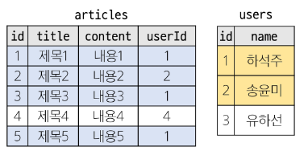

# DataBase

<div style="text-align: right"> 24. 04. 02. </div>

## 1. Database

### 1. Database

* 데이터베이스 : 체계적인 데이터 모음

* 데이터 : 저장에 처리나 효율적인 형태로 변환된 정보

    * 전세계 모든 데이터의 약 90%는 2015년 이후 생산된 것 (IBM)

    * 데이터 센터의 성장 - 전 세계 데이터 센터 시장 2022년부터 2026년까지 연평균 20% 이상 성장 예상

    * 데이터를 저장하고 잘 관리하여 활용할 수 있는 기술이 중요해짐

* 기존의 데이터 저장 방식

    * 파일(File) 이용 - 어디에서나 쉽게 사용 가능하나, 데이터를 구조적으로 관리하기 어려움

    * 스프레드시트(Spreadsheet) 이용 - 테이블의 열과 행을 사용해 데이터를 구조적으로 관리 가능

        * 크기 - 일반적으로 약 100만 행까지 저장 가능한 한계

        * 보안 - 단순히 파일이나 링크 소유 여부에 따른 단순한 접근 권한 기능 제공

        * 정확성 - 자료의 변경 발생 시, 이로 인해 테이블의 모든 위치에서 해당 값을 업데이트해야 함, 여기에서 딸려오는 부가 문제 발생 가능성

* 데이터베이스의 역할 : 데이터를 저장하고 조작 (CRUD)

### 2. Relational Database 관계형 데이터베이스

* 관계형 데이터베이스 : 데이터 간에 관계가 있는 데이터 항목들의 모음

    * 데이터를 저장 *(구조적 저장)*하고 조작 (CRUD)

    * 테이블, 행, 열의 정보를 구조화하는 방식

    * *서로 관련된* 데이터 포인터를 저장하고, 이에 대한 액세스를 제공

        

    * 관계 : 여러 테이블 간의 (논리적) 연결

        * 이 관계로 인해 두 테이블을 사용해 데이터를 다양한 형식으로 조회할 수 있음

            * 특정 날짜에 구매한 모든 고객 조회

            * 지난 달에 배송일이 지연된 고객 조회 등

* 관계형 데이터베이스 예시

    * 다음과 같이 고객 데이터가 테이블에 저장되어 있다고 가정

        

        * 고객 데이터 간 비교를 위해 어떤 값을 활용해야 할까? → 각 데이터에 고유한 식별 값 부여 (기본 키, Primary Key)
        
            

        * 누가 어떤 주문을 했는지 어떻게 식별할 수 있을까? → 주문 정보에 고객의 고유한 식별 값 저장 (외래 키, Foreign Key)

            

* 관계형 데이터베이스 관련 키워드

    * Table (Relation) : 데이터를 기록하는 곳

    * Field (Column, Attribute) : 각 필드에는 고유한 데이터 형식(타입)이 지정됨

    * Record (Row, Tuple) : 각 record에는 구체적인 값이 저장됨

    * Database (Schema) : table의 집합

    * Primary Key (기본 키, PK) : 각 record의 고유한 값, 관계형 데이터베이스에서 record의 식별자로 활용

    * Foreign Key (외래 키, FK) : table field 중 다른 table의 레코드를 식별할 수 있는 키
    
        * 다른 table의 primary key를 참조
        
        * 각 record에서 서로 다른 table 간 관계를 만드는 데 사용

### 3. RDBMS

* DBMS (Database Management System) : 데이터베이스를 관리하는 소프트웨어 프로그램

    * 데이터 저장 및 관리를 용이하게 하는 시스템

    * 데이터베이스와 사용자 간 인터페이스 역할

    * 사용자가 데이터 구성, 업데이트, 모니터링, 백업, 복구 등을 할 수 있도록 도움

* RDBMS (Relational Database Management System) : 관계형 데이터베이스를 관리하는 소프트웨어 프로그램

### 4. 데이터베이스 정리

* table은 데이터가 기록되는 곳

* table에는

    * 행에서 고유하게 식별 가능한 기본 키(PK)라는 속성이 있으며,

    * 외래 키(FK)를 사용해 각 행에서 서로 다른 table 간 관계를 만들 수 있음

* 데이터는 PK 또는 FK를 통해 결합(join)될 수 있는 여러 table에 걸쳐 구조화됨

## 2. SQL

### 1. SQL

* SQL (Structure Query Language) : 데이터베이스에 정보를 저장하고 처리하기 위한 프로그래밍 언어

    * table 형태로 구조화된(Structure) 관계형 데이터베이스에게 요청을 질의(요청, Query)

    * Query :  *데이터베이스로부터 정보를 요청*하는 것

        * 일반적으로 SQL로 작성하는 코드를 쿼리문(SQL문)이라 함

        * SQL은 미국 국립 표준 협회(ANSI)와 국제 표준화 기구(ISO)에 의해 표준이 채택됨

        * 모든 RDBMS에서 SQL 표준을 지원하나, 각 RDBMS마다 독자적 기능에 따라 표준을 벗어나는 문법(신규 명령문 등)이 존재하니 주의

### 2. SQL Syntax

* Syntax

    ```SQL
    SELECT column_name FROM table_name;
    ```

    * SQL 키워드는 대소문자를 구분하지 않음 - 하지만 대문자로 작성하는 것을 권장 (명시적 구분)

    * 각 SQL Statements의 끝에는 세미콜론(';')이 필요 - 세미콜론은 각 SQL Statements을 구분하는 방법 (명령어의 마침표)

### 3. SQL Statements

* SQL Statements : SQL을 구성하는 가장 기본적인 코드 블록

    ```SQL
    SELECT column_name FROM table_name;
    ```

    * 해당 예시 코드는 SELECT Statement라 부름

    * 이 Statement는 SELECT, FROM 2개의 keyword로 구성됨

* 수행 목적에 따른 SQL Statements 4가지 유형

    | 유형 | 역할 | SQL 키워드 | 비고 |
    | :---: | :---: | :---: | :---: |
    | DDL<br>(Data Definition Language) | 데이터의 기본 구조 및 형식 변경 | CREATE<br>DROP<br>ALTER | ## 7<br>record 생성이 아닌, table 자체에 관한 부분<br>(CRUD에 관한 부분이 아님) |
    | DQL<br>(Data Query Language) | 데이터 검색 | SELECT | ## 3 ~ ## 6<br>record 조회에 관한 부분(R) |
    | DML<br>(Data Manipulation Language) | 데이터 조작<br>(추가, 수정, 삭제) | INSERT<br>UPDATE<br>DELETE | ## 8<br>record 생성에 관한 부분<br>(C, U, D) |
    | DCL<br>(Data Control Language) | 데이터 및 작업에 대한 사용자 권한 제어 | COMMIT<br>ROLLBACK<br>GRANT<br>REVOKE | |
    | |

## 3. Single Table Queries (DQL - Data Query Language)

### 1. Querying Data - SELECT & FROM

* **SELECT** statement : table에서 데이터를 조회

    ```SQL
    -- SELECT 키워드 이후 데이터를 선택하려는 필드를 하나 이상 지정
    SELECT
        select_list
    -- FROM 키워드 이후 데이터를 선택하려는 테이블의 이름을 지정
    FROM
        table_name;
    ```

1. table employees에서 LastName field의 모든 데이터 조회

    ```SQL
    SELECT LastName FROM employees;
    ```

2. table employees에서 LastName, FirstName field의 모든 데이터 조회

    ```SQL
    SELECT LastName, FirstName FROM employees;
    ```

3. table employees에서 모든 field의 데이터를 조회

    ```SQL
    SELECT * FROM employees;
    ```

4. table employees에서 FirstName field의 모든 데이터를 조회 (단, 조회 시 FirstName이 아닌 '이름'으로 출력될 수 있도록 변경)

    ```SQL
    SELECT FirstName AS '이름' FROM employees;
    ```

5. table tracks에서 Name, Milliseconds field의 모든 데이터 조회 (단, Milliseconds field는 60,000으로 나눠 분 단위 값으로 출력)

    ```SQL
    SELECT
        Name,
        Milliseconds / 60000 AS '재생 시간(분)'
    FROM
        tracks;
    ```

* SELECT 정리

    * table의 데이터를 ***조회*** 및 반환

    * '*' (asterisk)를 사용해 모든 필드 선택

### 2. Sorting data - ORDER BY

* **ORDER BY** statement : 조회 결과의 records를 정렬

    ```SQL
    SELECT
        select_list
    FROM
        table_name
    -- FROM 뒤에 위치
    -- 하나 이상의 column 기준으로 결과를 오름차순(ASC, 기본 값), 내림차순(DESC)으로 정렬
    ORDER BY
        column1 [ASC|DESC],
        column2 [ASC|DESC],
        ...;
    ```

1. table employees에서 FirstName field의 모든 데이터를 오름/내림차순으로 조회

    ```SQL
    -- ASC
    SELECT FirstName FROM employees ORDER BY FirstName;

    -- DESC
    SELECT FirstName FROM employees ORDER BY FirstName DESC;
    ```

2. table customers에서 Country field를 기준으로 내림차순 정렬한 다음, City field 기준으로 오름차순 정렬해 조회

    ```SQL
    SELECT Country, City FROM customers ORDER BY Country DESC, City;
    ```

3. table tracks에서 Milliseconds field를 기준으로 내림차순 정렬한 다음, Name, Milliseconds field의 모든 데이터를 조회 (단, Milliseconds field는 60,000으로 나눠 분 단위 값으로 출력)

    ```SQL
    SELECT
        Name,
        Milliseconds / 60000 AS '재생 시간(분)'
    FROM
        tracks
    ORDER BY
        Milliseconds DESC;
    ```

* 정렬에서의 NULL

    * NULL : 데이터가 없음을 표현

    * 데이터 조회 시, NULL 값이 존재할 경우 오름차순 정렬 시 결과에 NULL이 먼저 출력

    ```SQL
    SELECT
        ReportsTo
    FROM
        employees
    ORDER BY
        ReportsTo;
    ```

* SELECT statement 실행 순서

    

    1. table에서 (FROM)

    2. 조회하여 (SELECT)

    3. 정렬 (ORDER BY)

### 3. Filtering data

* Filtering data 관련 keywords

    * Clause - DISTINCT, WHERE, LIMIT

    * Operator - BETWEEN, IN, LIKE, Comparison, Logical

* **DISTINCT** statement : 조회 결과에서 중복된 record 제거

    ```SQL
    -- SELECT keyword 바로 뒤에 작성
    SELECT DISTINCT
        select_list

    -- SELECT DISTINCT keyword 다음에 고유한 값을 선택하려는 하나 이상의 field 지정
    FROM
        table_name;
    ```

1. table customers에서 Country field의 모든 데이터를 오름차순 조회

    ```SQL
    SELECT Country FROM customers ORDER BY Country;
    ```

2. table customers에서 Country field의 모든 데이터를 중복 없이 오름차순 조회

    ```SQL
    SELECT DISTINCT Country FROM customers ORDER BY Country;
    ```

* **WHERE** statement : 조회 시 특정 검색 조건을 지정

    ```SQL
    SELECT DISTINCT
        select_list
    FROM
        table_name;
    -- FROM clause 뒤에 위치
    -- search_condition은 비교연산자 및 논리연산자(AND, OR, NOT 등)를 사용하는 구문이 사용됨
    WHERE
        search_condition;
    ```

1. table customers에서 City field 값이 'Prague'인(가 아닌) 데이터의 LastName, FirstName, City 조회

    ```SQL
    SELECT
        LastName, FirstName, City
    FROM
        customers
    WHERE
        City = 'Prague';

    WHERE
        City != 'Prague';
    ```

2. table customers에서 Company field값이 NULL이고(이거나) Country field 값이 'USA'인 데이터의 LastName, FirstName, Company, Country 조회

    ```SQL
    SELECT
        LastName, FirstName, Company, Country
    FROM
        customers
    WHERE
        Company IS NULL
        AND
        Country = 'USA';

    WHERE
        Company IS NULL
        OR
        Country = 'USA';
    ```

3. table tracks에서 Bytes field 값이 100,000 이상 500,000 이하인 데이터의 Name, Bytes 조회

    ```SQL
    SELECT
        Name, Bytes
    FROM
        tracks
    WHERE
        Bytes BETWEEN 100000 AND 500000;

    -- WHERE
    --     Bytes >= 100000
    --     AND Bytes <= 500000;
    ```

4. table tracks에서 Bytes field 값이 100,000 이상 500,000 이하인 데이터의 Name, Bytes를 Bytes 기준으로 오름차순 조회

    ```SQL
    SELECT
        Name, Bytes
    FROM
        tracks
    WHERE
        Bytes BETWEEN 100000 AND 500000
    ORDER BY
        Bytes;
    ```

5. table customers에서 Country field 값이 'Canada' 또는 'Germany' 또는 'France'인(가 아닌) 데이터의 LastName, FirstName, Country 조회

    ```SQL
    SELECT
        LastName, FirstName, Country
    FROM
        customers
    WHERE
        Country IN ('Canada', 'Germany', 'France');
        Country NOT IN ('Canada', 'Germany', 'France');
    ```

6. table customers에서 LastName field 값이 'son'으로 끝나는 데이터의 LastName, FirstName 조회

    ```SQL
    SELECT
        LastName, FirstName
    FROM
        customers
    WHERE
        LastName LIKE '%son';
    ```

7. table customers에서 FirstName field 값이 4자리면서 'a'로 끝나는 데이터의 LastName, FirstName 조회

    ```SQL
    SELECT
        LastName, FirstName
    FROM
        customers
    WHERE
        FirstName LIKE '___a';
    ```

## 4. Operators (DQL - Data Query Language)

* Comparison Operstors 비교 연산자 : =, >=, <=, !=, IS, LIKE, IN, BETWEEN...AND

* Logical Operators 논리 연산자 : AND(&&), OR(||), NOT(!)

* IN Operator : 값이 특정 목록 안에 있는지 확인

* LIKE Operator : 값이 특정 패턴에 일치하는지 확인

    * Wildcards와 함께 사용

* Wildcard Characters

    * '%' : *0개 이상의 문자열*과 일치하는지 확인

    * '_' : *단일 문자*와 일치하는지 확인

## 5. LIMIT (DQL - Data Query Language)

* **LIMIT** Clause : 조회하는 records 수를 제한

    ```SQL
    SELECT select_list FROM table_name

    -- 하나 또는 두 개의 인자를 사용 (0 또는 양의 정수)
    -- row_count는 조회하는 최대 records 수를 지정
    LIMIT
        [offset,] row_count;
    ```

1. table tracks에서 TrackId, Name, Bytes field 데이터를 Bytes 기준 내림차순으로 7개만 조회

    ```SQL
    SELECT TrackId, Name, Bytes
    FROM tracks
    ORDER BY Bytes DESC
    LIMIT 7;
    ```

2. table tracks에서 TrackId, Name, Bytes field 데이터를 Bytes 기준 내림차순으로 4번째부터 7번째 데이터만 조회

    ```SQL
    SELECT TrackId, Name, Bytes
    FROM tracks
    ORDER BY Bytes DESC
    LIMIT 3, 4;
    -- LIMIT 4 OFFSET 3;
    ```

## 6. Grouping data (DQL - Data Query Language)

* **GROUP BY** clause : records를 그룹화하여 요약본 생성 - 집계 함수와 함께 사용

* Aggregation Functions 집계 함수 : 값에 대한 계산을 수행하고 단일한 값을 반환하는 함수

    * SUM, AVG, MAX, MIN, COUNT

        ```SQL
        SELECT
            c1, c2, ..., cn, aggregate_function(ci)
        FROM
            table_name
        -- FROM 및 WHERE절 뒤에 배치
        -- GROUP BY 절 뒤에 그룹화할 field 목록을 작성
        GROUP BY
            c1, c2, ..., cn;
        ```

    1. Country field를 그룹화

        ```SQL
        SELECT Country
        FROM customers
        GROUP BY Country;
        ```

    2. COUNT 함수가 각 그룹에 대한 집계된 값을 계산

        ```SQL
        SELECT Country, COUNT(*)
        FROM customers
        GROUP BY Country;
        ```

1. table tracks에서 Composer field를 그룹화하여, 각 그룹에 대한 Bytes의 평균 값을 내림차순 조회

    ```SQL
    -- SELECT Composer, AVG(Bytes)
    SELECT
        Composer,
        AVG(Bytes) AS avgOfBytes
    FROM
        tracks
    GROUP BY
        Composer
    ORDER BY
        avgOfBytes DESC;
    ```

* **HAVING** clause : 집계 항목에 대한 세부 조건을 지정, 주로 GROUP BY와 함께 사용되며, GROUP BY가 없다면 WHERE처럼 동작

2. table tracks에서 Composer field를 그룹화하여, 각 그룹에 대한 Milliseconds의 평균 값이 10 미만인 데이터 조회 (단, Milliseconds field는 60,000으로 나눠 분 단위 값의 평균으로 계산)

    ```SQL
    SELECT
        Composer,
        AVG(Milliseconds / 60000) as avgOfMinute
    FROM
        tracks
    GROUP BY
        Composer

    -- 오류 발생 구문
    -- WHERE
    --    avgOfMinute < 10

    HAVING
        avgOfMinute < 10;
    ```

* SELECT statement 실행 순서

    

    1. table에서 (FROM)

    2. 특정 조건에 맞추어 (WHERE)

    3. 그룹화하고 (GROUP BY)

    4. 만약 그룹화 조건이 있다면 맞추고 (HAVING)

    5. 조회하여 (SELECT)

    6. 정렬하고 (ORDER BY)

    7. 특정 위치의 값을 가져옴 (LIMIT)

## 7. Managing Tables (DDL - Data Definition Language)

### 1. Create a table

* **CREATE TABLE** statement : table 생성

    ```SQL
    -- 각 field에 적용할 데이터 타입 작성
    -- table 및 field에 대한 제약 조건 (constraints) 작성
    CREATE TABLE table_name (
        column_1 data_type constraints,
        column_2 data_type constraints,
        ...,
    );
    ```

    * examples table 생성 및 확인

        ```SQL
        CREATE TABLE examples (
            
            -- data type : 정수 INTEGER
            -- constraints : PRIMARY KEY → 지정하면 자동으로 증가함 (AUTOINCREMENT는 선택 입력 사항)
            ExamId INTEGER PRIMARY KEY AUTOINCREMENT,

            -- data type : 가변 길이 문자열 VARCHAR(max_length = 50)
            -- constraints : NULL 값을 허용하지 않는다 (값이 무조건 있어야 한다.)
            LastName VARCHAR(50) NOT NULL,
            FirstName VARCHAR(50) NOT NULL
        );
        ```

* **PRAGMA** : table schema(구조) 확인

    ```SQL
    PRAGMA table_info('examples');

    -- cid
    -- Column ID를 의미하며, 각 column의 고유한 식별자를 나타내는 정수 값
    -- 직접 사용하지 않으며, PRAGMA 명령과 같은 meta data 조회에서 출력 값으로 활용
    ```

* 대표적인 SQLite data type

    | N | type | Description |
    | :---: | :---: | :---: |
    | 1 | NULL | 아무런 값도 포함하지 않음을 나타냄 |
    | 2 | INTEGER | 정수 |
    | 3 | REAL | 부동 소수점 |
    | 4 | TEXT | 문자열 |
    | 5 | BLOB | 이미지, 동영상, 문서 등의 binary data |
    | |

* Constraints 제약 조건 : table의 field에 적용되는 규칙 또는 제한 사항

    * 데이터의 무결성을 유지하고, 데이터베이스의 일관성을 보장

    | N | type | Description |
    | :---: | :---: | :---: |
    | 1 | PRIMARY KEY | 해당 field를 기본 키로 지정<br>INTEGER type에만 적용되며, INT, BIGINT 등과 같은 다른 정수 유형은 적용되지 않음 |
    | 2 | NOT NULL | 해당 field에 NULL 값을 허용하지 않도록 지정 |
    | 3 | FOREIGN KEY | 다른 table과의 Foreign Key 관계를 정의 |
    | |

* **AUTOINCREMENT** keyword : 자동으로 고유한 정수 값을 생성하고 할당하는 field attribute

    * field의 자동 증가를 나타내는 특수한 키워드

    * 주로 PRIMARY KEY field에 적용

    * INTEGER PRIMARY KEY AUTOINCREMENT가 작성된 field는 항상 새로운 record에 대해 이전 최대 값보다 큰 값을 할당

    * *삭제된 값은 무시되며 재사용할 수 없게 됨*

### 2. Modifying Table Fields

* **ALTER TABLE** statement : table 및 field 조작

    | Command | Description |
    | :---: | :---: |
    | ALTER TABLE ADD COLUMN | add the field |
    | ALTER TABLE RENAME COLUMN | rename the field |
    | ALTER TABLE RENAME TO | rename the table |
    | |

    * Table 생성 후 변경은 간단한 작업이 아님

    * SQLite는 field의 data type 변경에 있어 다소 제한적임

    * SQLite는 COLUMN 수정 불가 - 대신 table의 이름을 바꾸고, 새 table을 만들고 data를 새 table에 복사하는 방식을 사용함

* ALTER TABLE **ADD COLUMN** syntax

    ```SQL
    ALTER TABLE
        table_name

    -- ADD COLUMN 키워드 이후 추가하고자 하는 새 field 이름과 data type 및 constraints 작성
    -- 단, 추가하고자 하는 field에 NOT NULL 제약 조건이 있을 경우, NULL이 아닌 기본 값 설정 필요
    ADD COLUMN
        column_definition;
    ```

    * examples table에 Country, Age, Address field 추가

        ```SQL
        -- name : Country, type : VARCHAR(100), notnull : 1, dflt_value : 'default value'
        ALTER TABLE
            examples
        ADD COLUMN
            Country VARCHAR(100) NOT NULL DEFAULT 'default value';

        -- SQLite는 단일 문으로 한번에 여러 field를 추가할 수 없다.

        -- name : Age, type : INTEGER, notnull : 1, dflt_value : 0
        ALTER TABLE examples
        ADD COLUMN Age INTEGER NOT NULL DEFAULT 0;

        -- name : Address, type : VARCHAR(100), notnull : 1, dflt_value : 'default value'
        ALTER TABLE examples
        ADD COLUMN Address VARCHAR(100) NOT NULL DEFAULT 'default value';
        ```

* ALTER TABLE **RENAME COLUMN** syntax

    ```SQL
    ALTER TABLE
        examples

    -- RENAME COLUMN 키워드 이후 이름을 바꾸려는 field의 이름을 지정하고 TO 키워드 뒤에 새 이름 지정
    RENAME COLUMN
        current_name TO new_name;
    ```

    * example table Address field의 이름을 PostCode로 변경

    ```SQL
    ALTER TABLE examples RENAME COLUMN Address TO PostCode;
    ```

* ALTER TABLE **RENAME TO** syntax

    ```SQL
    ALTER TABLE
        table_name

    -- RENAME TO 키워드 뒤에 새로운 table 이름 지정
    RENAME TO
        new_table_name;
    ```

    * examples table 이름을 new_examples로 변경

    ```SQL
    ALTER TABLE examples RENAME TO new_examples;
    ```

* **DROP TABLE** statement : table 삭제

    ```SQL
    -- DROP TABLE statement 이후 삭제할 table 이름 작성
    DROP TABLE table_name;
    ```

## 8. Modifying Data (DML - Data Manipulation Language)

* 사전 준비

    ```SQL
    CREATE TABLE articles (
        id INTEGER PRIMARY KEY AUTOINCREMENT,
        title VARCHAR(100) NOT NULL,
        content VARCHAR(200) NOT NULL,
        createdAt DATE NOT NULL
    );
    ```

* **INSERT** statement : table record 삽입

    ```SQL
    -- INSERT INTO절 다음에 table 이름과 괄호 안에 field 목록 작성
    INSERT INTO table_name (c1, c2, ...)

    -- VALUES 키워드 다음 괄호 안에 해당 field에 삽입할 값 목록 작성
    VALUES (v1, v2, ...);
    ```

    * articles table에 데이터 입력

        ```SQL
        -- title : hello, content : world, createdAt : 2000-01-01
        -- id는 자동으로 입력하도록 되어 있어 입력할 필요가 없다.
        INSERT INTO
            articles (title, content, createdAt)
        VALUES
            ('hello', 'world', '2000-01-01');
        ```

        * articles table에 여러 records 추가 입력

        ```SQL
        INSERT INTO
            articles (title, content, createdAt)
        VALUES
            ('title1', 'content1', '1900-01-01'),
            ('title2', 'content2', '1800-01-01'),
            ('title3', 'content3', '1700-01-01'),
        -- DATE 함수 활용 : 현재 시간을 return해 줌
            ('mytitle', 'mycontent', DATE());
        ```

* **UPDATE** statement : table record 수정

    ```SQL
    UPDATE table_name

    -- SET 절 다음에 수정할 field와 새 value 지정
    SET column_name = expression,

    -- WHERE 절에서 수정할 record를 지정하는 조건 작성
    -- WHERE 절을 작성하지 않으면 모든 records를 수정
    [WHERE
        condition];
    ```

    ```SQL
    -- article table 1번 record의 title field 값을 'update Title'로 변경
    UPDATE articles
    SET title = 'update Title'
    WHERE id = 1;

    -- article table 2번 record title, content field 값을 각각 'update Title', 'update Content'로 변경
    UPDATE
        articles
    SET
        title = 'update Title',
        content = 'update Content'
    WHERE
        id = 2;
    ```

* **DELETE** statement : table record 삭제

    ```SQL
    -- DELETE FROM 절 다음에 table 이름 작성
    DELETE FROM table_name

    -- WHERE 절에서 삭제할 record 지정하는 조건 작성
    -- WHERE 절을 작성하지 않으면 모든 records  삭제
    [WHERE
        condition];
    ```

    ```SQL
    -- articles table의 1번 record 삭제
    DELETE FROM articles
    WHERE id = 1;


    -- articles table에서 작성일이 오래된 순으로 records 2개 삭제
    DELETE FROM
        articles
    WHERE id IN (
        SELECT id FROM articles
        ORDER BY createdAt
        LIMIT 2
    );
    ```

    * 작성일이 오래된 순으로 records 2개 삭제 (시각화 예시)

        
    
## 9. Multi Table Queries

### 1. Join

* 관계 : 여러 table 간의 (논리적) 연결

* JOIN이 필요한 순간

    * table을 분리하면 데이터 관리는 용이해질 수 있으나 출력 시 문제가 있음

    * table 1개만을 출력할 수밖에 없어 다른 table과 결합해 출력하는 것이 필요해짐

    * 이때 사용하는 것이 **JOIN**

* 사전 준비

    ```SQL
    -- users 및 articles table 생성
    CREATE TABLE users (
        id INTEGER PRIMARY KEY AUTOINCREMENT,
        name VARCHAR(50) NOT NULL
    );    

    CREATE TABLE articles (
        id INTEGER PRIMARY KEY AUTOINCREMENT,
        title VARCHAR(50) NOT NULL,
        content VARCHAR(100) NOT NULL,
        userId INTEGER NOT NULL,

        -- 외부 키의 field명은 userId로, 참조는 users table의 id를 활용한다.
        FOREIGN KEY (userId)
            REFERENCES users(id)
    );
    
    -- 자료 입력
    INSERT INTO 
      users (name)
    VALUES 
      ('하석주'),
      ('송윤미'),
      ('유하선');

    INSERT INTO
      articles (title, content, userId)
    VALUES 
      ('제목1', '내용1', 1),
      ('제목2', '내용2', 2),
      ('제목3', '내용3', 1),
      ('제목4', '내용4', 4),
      ('제목5', '내용5', 1);
    ```

### 2. Joining Tables

* **JOIN** clause : 둘 이상의 table에서 데이터를 검색하는 방법

* **INNER JOIN** clause : 두 table에서 값이 일치하는 records에 대해서만 결과를 반환

    

    ```SQL
    SELECT select_list

    -- FROM 절 이후 main table 지정 (table_a)
    FROM table_a

    -- INNER JOIN 절 이후 main table과 JOIN할 table 지정 (table_b)
    INNER JOIN table_b

        -- ON 키워드 이후 JOIN 조건을 작성
        -- JOIN 조건은 table_a와 table_b간 records를 일치시키는 규칙을 지정
        ON table_b.fk = table_a.pk;
    ```

    * 작성자가 있는 (존재하는 회원) 모든 게시글을 작성자 정보와 함께 조회

        

        

        

        ```SQL
        -- 작성자가 있는 (존재하는 회원) 모든 게시글을 작성자 정보와 함께 조회 

        SELECT * FROM articles
        INNER JOIN users
            ON users.id = articles.userId;

        -- Right JOIN
        -- SELECT * FROM users
        -- INNER JOIN articles
        --    ON articles.userId = users.id;
        ```

    * 1번 회원(하석주)이 작성한 모든 게시글의 제목 (title)과 작성자명 (name)을 조회

        ```SQL
        -- articles table의 title과 users table의 name을 붙일 것
        SELECT articles.title, users.name

        -- table_a
        FROM articles

        -- table_b
        INNER JOIN users

            -- users table의 id가 articles table의 userId와 일치하는 자료들
            ON users.id = articles.userId

        -- users.id가 1인 (1번 회원)
        WHERE users.id = 1;
        ```

* **LEFT JOIN** clause : 오른쪽 table의 일치하는 records와 함께 왼쪽 table의 모든 records 반환

    

    ```SQL
    SELECT select_list

    -- FROM 절 이후 왼쪽 table 지정 (table_a)
    FROM table_a

    -- LEFT JOIN절 이후 오른쪽 table 지정 (table_b)
    LEFT JOIN table_b

        -- ON 키워드 이후 JOIN 조건을 작성
        -- 왼쪽 table의 각 record를 오른쪽 table의 모든 records와 일치시킴
        ON table_b.fk = table_a.pk;
    ```

    * 모든 게시글을 작성자 정보와 함께 조회

        

        

        

        ```SQL
        -- 모든 게시글을 작성자 정보와 함께 조회

        SELECT * FROM articles
        LEFT JOIN users
            ON users.id = articles.userId;
        ```
    
    * LEFT JOIN 특징

        * 왼쪽 table의 모든 records 표기

        * 오른쪽 table과 매칭되는 record가 없으면 NULL 표시

    * 게시글을 작성한 이력이 없는 회원 정보 조회

        ```SQL
        SELECT *
        FROM users
        LEFT JOIN articles
            ON articles.userId = users.id
        WHERE articles.userId IS NULL;
        ```

## 0. 참고

* 타입 선호도 (Type Affinity) : Column에 data type이 명시적으로 지정되지 않았거나 지원하지 않을 때, SQLite가 자동으로 data type을 추론하는 것

    * SQLite type affinity의 목적

        1. 유연한 데이터 타입 지원 
        
            * 데이터 타입을 명시적으로 지정하지 않고도 데이터를 저장 & 조회할 수 있음

            * Column에 저장되는 값의 특성을 기반으로 데이터 타입 유추

        2. 간편한 데이터 처리

            * INTEGER Type Affinity를 가진 열에 문자열 데이터를 저장해도, SQLite는 자동으로 숫자로 변환해 처리

        3. SQL 호환성

            * 다른 데이터베이스 시스템과 호환성 유지

* NO NULL constraints를 반드시 사용?

    * "NO"

    * 하지만 데이터베이스를 사용하는 프로그램에 따라 NULL을 저장할 필요가 없는 경우가 많으므로 대부분 NOT NULL을 정의

    * "값이 없다." 라는 표현을 table에 기록하는 것은 '0'이나 '빈 문자열' 등을 사용하는 것으로 대체하는 것을 권장

* SQLite의 날짜와 시간

    * SQLite에는 날짜 및/또는 시간을 저장하기 위한 별도의 데이터 타입이 없음

    * 대신 날짜 및 시간에 대한 함수를 사용해 표기 형식에 따라 TEXT, REAL, INTEGER 값으로 저장함

<script type="text/javascript" src="http://cdn.mathjax.org/mathjax/latest/MathJax.js?config=TeX-AMS-MML_HTMLorMML"></script>
<script type="text/x-mathjax-config">
  MathJax.Hub.Config({
    tex2jax: {inlineMath: [['$', '$']]},
    messageStyle: "none",
    "HTML-CSS": { availableFonts: "TeX", preferredFont: "TeX" },
  });
</script>