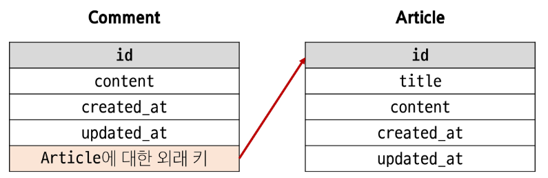
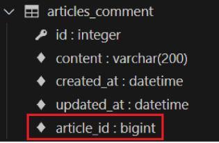
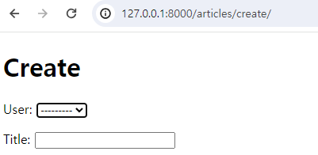
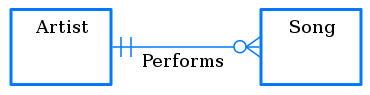

# DataBase - Many to One Relationships

<div style="text-align: right"> 24. 04. 03. ~ 24. 04. 04. </div>

## 1. Many to One Relationships

### 1. Many to One Relationships

* N:1 or 1:N

* 한 table의 0개 이상의 record가 다른 table의 record 한 개와 관련된 관계

    * Comment(N) - Article(1)  : 0개 이상의 댓글은 1개의 게시글에 작성될 수 있다.

    * Table 관계

        

### 2. 댓글 모델

* ForeignKey() : 외래 키 형성에 관한 N:1 관계 설정 모델 필드

* 댓글 모델 정의

    * 외래 키는 ForeignKey class를 작성하는 위치와 관계없이 table field 마지막에 생성됨

    * ForeignKey(to, on_delete)

        * to : 참조하는 model class 이름

        * on_delete : 외래 키가 참조하는 개체(1)가 사라졌을 때, 외래 키를 가진 객체(N)를 어떻게 처리할지 정의하는 설정 (→ 데이터 무결성)

    ```python
    # articles/models.py

    class Comment(models.Model):
        # ForeignKey class의 Instance 이름은 참조하는 model class 이름의 단수형으로 작성하는 것을 권장

        # on_delete : article이 지워졌을 때 댓글들은 어떻게 할 것인가에 대한 설정
        # 댓글이 있으면 게시글을 삭제하지 못 함, 게시글이 지워지면 댓글도 같이 삭제됨 등
        # 게시글이 지워지면 댓글도 같이 삭제되는 설정으로 진행
        article = models.ForeignKey(Article, on_delete = models.CASCADE)


        content = models.CharField(max_length = 200)
        created_at = models.DateTimeField(auto_now_add = True)
        updated_at = models.DateTimeField(auto_now = True)
    ```

* Migration 이후 댓글 table 확인

    * 댓글 table에 article_id field 생성 확인

    * '참조 대상 class 이름' + '_' + 'class 이름' → 참조하는 class 이름의 소문자(단수형)로 작성하는 것이 권장되었던 이유

        

* on_delete의 'CASCADE' : 부모 객체(참조된 객체)가 삭제됐을 때 이를 참조하는 객체도 삭제

    * 기타 옵션 : PROTECT, SET_NULL, SET_DEFAULT, SET() , DO NOTHING 등

### 3. 댓글 생성 연습

* 댓글은 게시글이 있어야 생성 가능

* shell_plus 실행 및 게시글 작성

    ```bash
    $ python manage.py shell_plus

    # 게시글 생성
    Article.objects.create(title='title', content='content')
    ```
    
* 댓글 생성

    ```bash
    # Comment class의 instance comment 생성
    comment = Comment()

    # instance varable 저장
    comment.content = 'first comment'

    # DB에 댓글 저장
    comment.save()

    # 에러 발생
    # articles_comment table의 ForeignKeyField, article_id 값이 저장 시 누락되었기 때문
    django.db.utils.IntegrityError: NOT NULL constraint failed:
    articles_comment.article_id
    ```

    ```bash
    # 게시글 조회
    article = Article.objects.get(pk = 1)

    # 외래 키 데이터 입력
    comment.article = article
    # 또는 comment.article_id = article.pk처럼 pk값을 직접 외래 키 column에 넣어줄 수도 있지만 권장하지 않음

    # 댓글 저장 및 확인
    comment.save()
    ```

* comment instance를 통한 article 값 참조하기

    ```bash
    comment.pk
    => 1

    comment.content
    => 'first comment'

    # class 변수명인 article로 조회 시 해당 참조하는 게시물 객체를 조회할 수 있음
    comment.article
    => <Article: Article object (1)>

    # article_pk는 존재하지 않는 필드이기 때문에 사용 불가
    coment.article_id
    => 1
    ```

* 두 번째 댓글 생성

    ```bash
    comment = Comment(content = 'second comment', article = article)
    comment.save()

    comment.pk
    => 2

    comment
    => <Comment: Comment object (2)>

    comment.article.pk
    => 1
    ```

### 4. 역참조

* Comment → Article (참조) : 어떤 댓글이 작성된 게시글의 정보

* Article → Comment (역참조) : 어떤 게시글에 작성된 댓글 목록

* Python Code의 관점에서, Article → Comment 방향으로의 물리적 연결이 되어 있지 않음

* 역참조 : N:1 관계에서, 1에서 N을 참조하거나 조회하는 것

    * N은 1에 대한 외래 키를 가지고 있어 물리적으로 참조가 가능하지만, 1은 N에 대한 참조 방법이 존재하지 않음

    * 별도의 역참조 기능이 필요 → Django에서 별도 지원

* article.***comment_set***.all() : 특정 게시글에 작성된 댓글 전체를 조회하는 명령

    * article : model instance

    * ***comment_set : related manager (역참조 이름)***

        * Comment(model명)의 복수형과 관계된 이름을 만들어 줌

        * related manager : N:1 혹은 M:N 관계에서 역참조 시 사용하는 manager

            * 'objects' manager를 통해 QuerySet API를 사용했던 것처럼, related manager를 통해 QuerySet API를 사용할 수 있게 됨

            * related manager 이름 규칙

                * N:1 관계에서 생성되는 related manager 이름은 ***참조하는 "model명_set" 이름 규칙***으로 만들어짐

                * 특정 댓글의 게시글 참조 (Comment → Article) : comment.article

                * 특정 게시글의 댓글 목록 참조 (Article → Comment) : article.comment_set.all()

    * all() : QuerySet API

    ```bash
    # shell_plus 실행 및 1번 게시글 조회
    $ python manage.py shel_plus

    article = Article.objects.get(pk = 1)

    # 1번 게시글에 작성된 모든 댓글 조회하기(역참조)
    >>> article.comment_set.all()
    <QuerySet [<Comment: Comment object (1)>]>,
    <Comment: Comment object(2)>

    # 1번 게시글에 작성된 모든 댓글 내용 출력
    comments = article.comment_set.all()

    for comment in comments:
        print(comment.content)
    ```

### 5. 댓글 구현

* CRUD 중 U(댓글 수정)는 추후 JS를 활용

* CREATE - 생성

    * 사용자가 입력 → 사용자의 입력을 받아주는 Django Form

    * 사용자의 입력을 DB에 저장해야 함 → Django ModelForm이 필요할 것

        ```python
        # articles/forms.py
        from .models import Comment

        class CommentForm(forms.ModelForm):
            class Meta:
                model = Comment
                # fields = '__all__'
                fields = ('content', )
        ```

        * Comment class의 외래 키 필드 article 또한 데이터 입력이 필요한 필드이기 때문에 출력되고 있는 것

        * 하지만 외래 키 필드 데이터는 사용자로부터 입력받는 값이 아닌, view 함수 내에서 다른 방법으로 전달받아 저장되어야 함

        * 출력에서 제외된 외래 키 데이터는 어디에서 받아와야 할까? → detail page의 URL에 활용되는 variable routing → 댓글의 외래 키 데이터에 필요한 정보가 바로 게시글의 pk 값

        * comments_create view 함수 정의 → url에서 넘겨받은 pk 인자를 게시글을 조회하는 데 사용

            ```bash
            # shell_plus
            comment = Comment()     ← (2) 이를 위해서는 comment instance가 python 코드 내에 필요
            comment.content = 'aaa'
            comment.article = article   ← (1) article 속성을 넣어줘야 함 (외래 키 입력)
            comment.save()

            # 저장이 이루어지기 전에 comment instance를 제공받는 것이 필요
            # views 함수에서, save method의 commit 속성
            ```

            * save(commit = False) : DB에 저장하지 않고 instance만 반환

                * (Create, but don't save the new instance.)

                * 생성된 instance를 통해 필요한 추가 logic을 처리해준 후 logic 저장

            ```python
            # articles/views.py

            def comments_create(request, pk):
                # 게시글 조회 (어떤 게시글에 작성되어야 하는지 알아야 하기 때문)
                article = Article.objects.get(pk=pk)

                comments = article.comment_set.all()

                # 사용자 입력 데이터를 받아 Comment 저장 (+유효성 검사)
                comment_form = CommentForm(request.POST)

                if comment_form.is_valid():
                    comment = comment_form.save(commit = False)
                    comment.article = article
                    comment.save()
                    return redirect('articles:detail', article.pk)
                
                context = {
                    'article': article,
                    'comment_form': comment_form,
                    'comments': comments,
                }
                return render(request, 'articles/detail.html', context)
            ```

        ```python
        # articles/urls.py

        urlpatterns = [
            ...
            path('<int:pk>/comments/', views.comments_create, name='comments_create'),
        ]
        ```

        ```python
        # articles/views.py
        from .models import ArticleForm, CommentForm

        def detail(request, pk):
            article = Article.objects.get(pk=pk)

            # 사용자로부터 댓글 데이터 입력을 받기 위한 form
            comment_form = CommentForm()

            context = {
                'article': article,
                'comment_form': comment_form,
            }
            return render(request, 'articles/detail.html', context)
        ```

        ```HTML
        <!-- articles/detail.html -->

        <h3>댓글 작성</h3>
        <form action="" method="POST">
            
            {{ comment_form }}
            <input type="submit" value="댓글 작성">
        </form>
        ```

* READ - 출력

    * detail view 함수에서 전체 댓글 데이터 조회

        ```python
        # articles/views.py
        from .models import Article, Comment
        from .forms import ArticleForm, CommentForm

        def detail(request, pk):
            article = Article.objects.get(pk=pk)
            comment_form = CommentForm()

            # 특정 게시글에 작성된 모든 댓글 조회 (Article → Comment, 역참조)
            comments = article.comment_set.all()

            # DB의 모든 댓글 조회(특정 게시글에 작성된 모든 댓글 조회가 아님)
            # Comment.objects.all()

            context = {
                'article': article,
                'comment_form': comment_form,
                'comments': comments,
            }
            return render(request, 'articles/detail.html', context)
        ```

* DELETE - 삭제

    * 개별 댓글 목록 각각 옆에 삭제 버튼이 있어야 할 것

    * 고려사항

        * 몇 번째 댓글을 삭제? → 댓글에 대한 pk

        * 삭제 이후 redirect? → article에 대한 pk

        * 2개의 pk가 필요한 것 같다.
        
        * url 구성에 있어서도 일관성이 있으면 좋을 것!

    ```python
    # articles/urls.py

    urlpatterns = [
        ...
        path('<int:article_pk>/comments/<int:comment_pk>/delete/', views.comments_delete, name='comments_delete'),
    ]
    ```

    ```python
    # article/views.py

    from .models import Article, Comment

    def comments_delete(request, article_pk, comment_pk):
        comment = Comment.objects.get(pk = comment_pk)
        comment.delete()
        return redirect('articles:detail', article_pk)

    # =========================================== #
    # 가능은 하지만 url 구성에 있어 일관성을 해치기 때문에 권장되지는 않는 방법
    def comments_delete(request, comment_pk):
        comment = Comment.objects.get(pk = comment_pk)
        article_pk = comment.article.pk
        comment.delete()
        return redirect('articles:detail', article_pk)
    ```

    ```HTML
    <ul>
        
            <li>
                {{ comment.content }}
                <form action="" method="POST" style="display: inline;">
                
                <input type="submit" value="DELETE">
                </form>
            </li>
        
    </ul>
    ```

## 2. Article & User

### 1. Model 관계 설정

* Article(N) - User(1) : 0개 이상의 게시글은 1명의 회원에 의해 작성될 수 있다.

* N 쪽에 외래 키가 배치된다.

    ```python
    # articles/models.py

    # from accounts.models import User
    # Django에서는 User model을 '직접' 참조하지 않는다. → get_user_model() 함수를 대신 사용했던 것을 기억

    # from django.contrib.auth import get_user_model
    # Django의 내부적인 구동 순서 및 반환값에 따른 이유로 사용하지 않는다.

    from django.conf import settings

    class Article(models.Model):
        # user = models.ForeignKey(User, on_delete = models.CASCADE)
        # user = models.ForeignKey(get_user_model(), on_delete = models.CASCADE)
        user = models.ForeignKey(settings.AUTH_USER_MODEL, on_delete = models.CASCADE)
        title = models.CharField(max_length = 10)
        content = models.TextField()
        created_at = models.DateTimeField(auto_now_add = True)
        updated_at = models.DateTimeField(auto_now = True)
    ```

    * *User model을 참조하는 2가지 방법*
    
        | | get_user_model() | settings.AUTH_USER_MODEL |
        | :---: | :---: | :---: |
        | 반환 값 | User Object<br>(객체) | 'accounts.User'<br>(문자열) |
        | 사용 위치 | **models.py가 아닌**<br>다른 모든 위치 | **models.py** |
        | |

    * django project '내부적인 구동 순서'와 '반환 값'에 따른 이유

        * get_user_model()을 사용하지 못하는 이유
        
            * 전체 프로그램 구동 시 models.py의 구동 우선 순위가 빠른데, 이 시점에 get_user_model()로 반환되는 User object를 정의할 수 없어 오류 발생

            * 따라서, 문자열을 반환해 주는 settings.AUTH_USER_MODEL을 사용해 우선 입력해 주고, 프로그램 구동 순서에 따라 나중에 처리

    * 어느 쪽이든 User model은 직접 참조하지 않는다는 것

* model 변경 후 migration 수행

    * 기본적으로 모든 field에는 NOT NULL constraints가 있기 때문에, user 데이터를 추가하지 않으면 새로운 field가 추가되지 못함

    * console 창에서 각각 값을 직접 입력해주거나, models에 default 속성을 직접 지정해주는 방법이 있음

### 2. 게시글 CREATE

* User model에 대한 외래 키 데이터 입력을 받기 위해 불필요한 input이 출력됨

    

    ```python
    # articles/forms.py

    class ArticleForm(forms.ModelForm):
        class Meta:
            model = Article
            fields = ('title', 'content', )
    ```

* 게시글 작성 시 에러 발생 → user_id field data 입력이 누락되었기 때문

    * NOT NULL constrains failed: articles_article.user_id

* 게시글 작성 시 작성자 정보가 함께 저장될 수 있도록 save의 commit 옵션 활용

    ```python
    # articles/views.py

    @login_required
    def create(request):
        if request.method == "POST":
            form = ArticleForm(request.POST)
            if form.is_valid():
                article = form.save(commit = False)
                article.user = request.user     # 게시글 작성자는 DB 수정 요청자이다
                article.save()
                return redirect('articles:detail', article.pk)
        else:
            ...
    ```

### 3. 게시글 READ

* 각 게시글의 작성자 이름 출력

    ```HTML
    <!-- articles/index.html -->
    
        <p>작성자 : {{ article.user }}</p>
            <!-- {{ article.user.username }} 속성에 저장되어 있지만, User model 설계 상 magic method로 인해 user 객체만 출력 시에 username이 출력되도록 되어 있음 -->
        <p>글 번호: {{ article.pk }}</p>
        <a href="">
        <p>글 제목: {{ article.title }}</p>
        </a>
        <p>글 내용: {{ article.content }}</p>
        <hr>
    
    ```

### 4. 게시글 UPDATE

```{:.pseudocode}
# Article → User (참조) : article.user

# User → Article (역참조) : user.article_set.all()
```

* 본인의 게시글만 수정할 수 있도록 하기

    * 게시글 수정 요청자 == 게시글 작성자인가??

    ```python
    # articles/views.py

    @login_required     # login 조건만 요구하는 부분, 게시글 수정 요청자 == 게시글 작성자인지까지는 확인해주지 않음
    def update(request, pk):
        article = Article.objects.get(pk = pk)
        if request.user == article.user:    # 게시글 수정 요청자 == 게시글 작성자라면
            if request.method == "POST":
                form = ArticleForm(request.POST, instance = article)    # Update는 instance 변수를 넣어주기 때문에, 별도로 commit을 통해 작성자를 입력해주는 과정이 필요없다.
                ...
        
        else:
            return redirect('articles:index')   # 게시글 수정 요청자 != 게시글 작성자라면 main page로 보내버림
    ```

    ```HTML
    <!-- articles/detail.html -->

    <!-- 요청자가 게시글 작성자라면 표시 -->
    
        <a href="">UPDATE</a>
        <form action="" method="POST">
            
            <input type="submit" value="DELETE">
        </form>
    
    ```

### 5. 게시글 DELETE

* 본인의 게시글만 삭제할 수 있도록 하기

    * 게시글 삭제 요청자 == 게시글 작성자인가??

    ```python
    # articles/views.py

    @login_required
    def delete(request, pk):
        article = Article.objects.get(pk = pk)
        if request.user == article.user:    # 게시글 삭제 요청자 == 게시글 작성자라면 삭제
            article.delete()
        return redirect('articles:index')
    ```

## 3. Comment & User

### 1. Model 관계 설정

* Comment(N) - User(1) : 0개 이상의 댓글은 1명의 회원에 의해 작성될 수 있다.

* N 쪽에 외래 키가 배치된다.

    ```python
    # articles/models.py

    class Comment(models.Model):
        article = models.ForeignKey(Article, on_delete=models.CASCADE)
        user = models.ForeignKey(settings.AUTH_USER_MODEL, on_delete = models.CASCADE)  # accounts.User로 작성되는 instance를 외래 키로 받아 입력하는 field 작성
        content = models.CharField(max_length=200)
        created_at = models.DateTimeField(auto_now_add=True)
        updated_at = models.DateTimeField(auto_now=True)        
    ```

### 2. 댓글 CREATE

* 댓글 작성 시 이전에 게시글 작성 시와 같은 에러 발생

    * NOT NULL constraints failed: articles_comment.user_id

    ```python
    # articles/views.py
    
    def comments_create(request, pk):
        article = Article.objects.get(pk=pk)
        comments = article.comment_set.all()
        comment_form = CommentForm(request.POST)
        if comment_form.is_valid():
            comment = comment_form.save(commit=False)
            comment.article = article
            comment.user = request.user # 댓글 작성 시 작성자 정보가 함께 저장될 수 있도록 작성
            comment.save()
            ...
    ```

### 3. 댓글 READ

* 댓글 출력 시 댓글 작성자와 함께 출력

    ```HTML
    <!-- articles/detail.html -->

    
        <li>
            {{ comment.user }} - {{ comment.content }}
            ...
        </li>
    
    ```

### 4 댓글 DELETE

* 본인의 댓글만 삭제할 수 있도록 하기

    * 댓글 삭제 요청자 == 댓글 작성자인가??

    ```python
    # articles/views.py

    def comments_delete(request, article_pk, comment_pk):
        comment = Comment.objects.get(pk = comment_pk)
        if request.user == comment.user:        # 댓글 삭제 요청자 == 댓글 작성자라면
            comment.delete()
        return redirect('articles:detail', article_pk)
    ```

    * 해당 댓글의 작성자가 아니라면, 댓글 삭제 버튼을 출력하지 않도록 함

    ```HTML
    <!-- articles/detail.html -->

    <ul>
        
        <li>
            {{ comment.user }} - {{ comment.content }}
            
            <form action="" method="POST" style="display: inline;">
                
                <input type="submit" value="삭제">
            </form>
            
        </li>
        
    </ul>
    ```

## 0. 참고

* admin site 등록

    * 댓글은 현재 admin page에 보이지 않음 → 보이게 하도록 하는 작업

    * Comment model을 admin site에 등록해 CRUD 동작 확인하기

        ```python
        # articles/admin.py

        from .models import Article, Comment

        admin.site.register(Article)
        admin.site.register(Comment)
        ```

* 댓글이 없는 경우 대체 콘텐츠 출력

    * DTL의 'for empty' tag 활용

        ```HTML
        <!-- articles/detail.html -->
        <ul>
            
            <li>
                {{ comment.content }}
                <form action="" method="POST" style="display: inline;">
                
                <input type="submit" value="DELETE">
                </form>
            </li>
            
            <p>댓글이 없어요..</p>
            
        </ul>
        ```

    * if tag를 활용할 수도 있음

* 댓글 개수 출력하기

    ```HTML
    <!-- DTL filter - 'length' 사용 -->
    {{ comments|length }}
    {{ article.comment_set.all|length }}

    <!-- QuerySet API - 'count()' 사용 -->
    {{ article.comment_set.count }}

    <!-- view 함수에서 미리 계산을 끝낸 다음 보내는 것이 더 좋을 것 -->
    ```

* 인증된 사용자만 댓글 작성 및 삭제

    * decorator 사용

    ```python
    # articles/views.py

    @login_required
    def comments_create(request, pk):
        pass

    @login_required
    def comments_delete(request, article_pk, comment_pk):
        pass
    ```

* ERD (Entity-Relationship Diagram, 개체-관계 다이어그램)

    * 데이터의 '구조' 및 그에 수반한 제약 조건을 설계하는 기법 중 하나인 ERM(Entity-Relationship Modeling, 개체-관계 모델링) 프로세스의 산출물을 가리킴

    * Crow's Foot Notation

        * Entity 사이의 관계를 기본적으로 entitiy를 연결하는 선으로 나타내고, 관계의 cardinality를 나타내는 기호들을 그 선의 양끝에 연결함

        

        * Crow's Foot Notation을 활용하면 다수 관계(N:1 relations)를 표현하는 것이 명확해짐

    * [Wikipedia 참고](https://ko.wikipedia.org/wiki/%EA%B0%9C%EC%B2%B4-%EA%B4%80%EA%B3%84_%EB%AA%A8%EB%8D%B8)

* POST 요청 조건임을 필요로 할 때 - decorator 사용 가능

    ```python
    # articles/views.py

    from django.views.decorators.http import require_POST

    # decorator는 순서에 따라 실행되기 때문에, process 순서가 중요한 경우 유의해야 함
    @login_required
    @required_POST
    def comments_delete(request, articke_pk, comment_pk):
        comment = Comment.objects.get(pk = comment_pk)
        if request.user == comment.user:
            comment.delete()
        return redirect('articles:detail', article_pk)
    ```

* NoReverseMatch 발생 시

    * 현재 페이지의 url tag 체크

