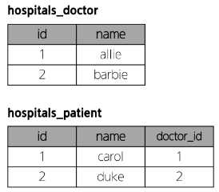
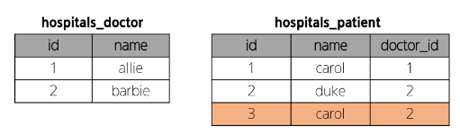
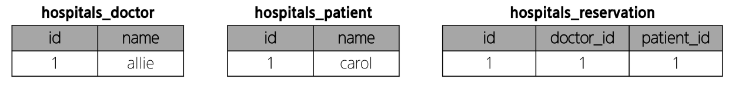

# DataBase - Many to Many Relationships

<div style="text-align: right"> 24. 04. 08. ~ </div>

## 1. Many to Many Relationships

### 1. Many to Many Relationships

* 한 테이블의 0개 이상의 레코드가, 다른 테이블의 0개 이상의 레코드와 관련된 경우

    * *양쪽 모두에서 N:1 관계를 가짐*

### 2. N:1의 한계,  M:N 관계의 역할과 필요성

* 병원 진료 시스템 모델 관계 - 환자와 의사 2개의 모델을 사용해 모델 구조 구상하기

    * 한 명의 의사에게 여러 환자가 예약할 수 있도록 설계

    ```python
    # hospitals/models.py

    from django.db import models

    class Doctor(models.Model):
        name = models.TextField()

        def __str__(self):
            return f'{self.pk}번 의사 {self.name}'
        
    class Patient(models.Model):
        doctor = models.ForeignKey(Doctor, on_delete = models.CASCADE)
        name = models.TextField()

        def __str__(self):
            return f'{self.pk}번 환자 {self.name}'
    ```

    

* N:1의 한계 상황

    * 1번 환자 (carol)가 두 의사 모두에게 진료를 받고자 한다면, 환자 테이블에 1번 환자 데이터가 중복으로 입력될 수밖에 없음

    

    * 동시에 예약을 남기기 → 동일한 환자지만 다른 의사에게도 진료를 위해 예약하기 위해서는 객체를 하나 더 만들어 진행해야 함

        * 외래 키 column에 '1, 2' 형태로 저장하는 것은 DB 타입 문제로 불가능

    * *예약 테이블을 따로 만들자*

### 3. 중개 모델

1. 예약 모델 생성

    * 환자 모델의 외래 키를 삭제하고 별도의 예약 모델을 새로 생성

    * 예약 모델은 의사와 환자에 각각 N:1 관계를 가짐

        | id | doctor_id | patient_id |
        | :---: | :---: | :---: |
        | 1 | 1 | 1 |
        | 2 | 2 | 1 |
        | |

        ```python
        # 외래 키 삭제
        class Patient(models.Model):
            name = models.TextField()

            def __str__(self):
                return f'{self.pk}번 환자 {self.name}'
            
        # 중개모델 작성
        class Reservation(models.Model):
            doctor = models.ForeignKey(Doctor, on_delete = models.CASCADE)
            patient = models.ForeignKey(Patient, on_delete = models.CASCADE)

            def __str__(self):
                return f'{self.doctor_id}번 의사의 {self.patient_id}번 환자'
        ```

2. 예약 데이터 생성

* 의사와 환자 생성 후 예약 만들기

    ```python
    # hostpital/models.py

    doctor1 = Doctor.objects.create(name = 'allie')
    patient1 = Patient.objects.create(name = 'carol')

    Reservation.objects.create(doctor = doctor1, patient = patient1)
    ```

    

3. 예약 정보 조회

* 의사와 환자가 예약 모델을 통해 각각 본인의 진료 내역을 확인

    ```python
    # 의사 → 예약 정보 찾기
    doctor1.reservation_set.all()
    >>> <QuerySet [<Reservation: 1번 의사의 1번 환자>]>

    # 환자 → 예약 정보 찾기
    patient1.reservation_set.all()
    >>> <QuerySet [<Reservation: 1번 의사의 1번 환자>]>
    ```

### 4. ManyToManyField

* Django가 중개 모델을 자동으로 만들어주는 **ManyToManyField**가 존재함

* ManyToManyField() : M:N 관계 설정 model field

    ```python
    # hospitals/models.py

    class Patient(models.Model):
        # ManyToManyField 작성
        doctors = models.ManyToManyField(Doctor)
        name = models.TextField()

        def __str__(self):
            return f'{self.pk}번 환자 {self.name}'
    ```

    * M:N 관계는 서로에게 종속된 관계가 아니기 때문에, ManyToManyField는 Doctor나 Patient 중 아무데나 있어도 기능 작동은 한다.

    * 단, **참조 / 역참조 기능이 ManyToManyField의 위치와 관련**이 있다.

        * 예시) ManyToManyField가 의사에게 존재할 경우

            ```python
            class Doctor(models.Model):
                patients = models.ManyToManyField(Patient)
                name = models.TextField()

                def __str__(self):
                    return f'{self.pk}번 환자 {self.name}'
            ```

            * 의사가 자신의 오늘 환자에 대해 조회하고 싶다. → **참조**

            * 환자가 자신의 의사를 조회하고 싶다. → **역참조**

    ```python
    # 의사 1명, 환자 2명 생성
    # ManyToManyField()는 환자 측 class에 존재

    doctor1 = Doctor.objects.create(name = 'allie')
    patient1 = Patient.objects.create(name = 'carol')
    patient2 = Patient.objects.create(name = 'duke')
    ```
    
    * 예약 생성 (환자가 예약) - **.add(#)**

        * add : 관계 생성 명령어

    ```python
    # 예약 생성 (환자가 예약)
    # patient1이 doctor1에게 예약
    patient1.doctors.add(doctor1)

    # patient1 - 자신이 예약한 의사 목록 확인
    patient1.doctors.all()
    >>> <QuerySet [<Doctor: 1번 의사 allie>]>

    # doctor1 - 자신의 예약된 환자목록 확인
    doctor1.patient_set.all()
    >>> <QuerySet [<Patient: 1번 환자 carol>]>
    ```

    * 예약 생성 (의사가 예약)

    ```python
    # doctor1이 patient2을 예약
    doctor1.patient_set.add(patient2)

    # doctor1 - 자신의 예약 환자목록 확인
    doctor1.patient_set.all()
    >>> <QuerySet [<Patient: 1번 환자 carol>, <Patient: 2번 환자 duke>]>

    # patient1, 2 - 자신이 예약한 의사 목록 확인
    patient1.doctors.all()
    >>> <QuerySet [<Doctor: 1번 의사 allie>]>

    patient2.doctors.all()
    >>> <QuerySet [<Doctor: 1번 의사 allie>]>
    ```

    * 예약 취소하기 (삭제) - **.remove(#)**

        * remove : 관계 삭제 명령어

    ```python
    # doctor1이 patient1 진료 예약 취소

    doctor1.patient_set.remove(patient1)

    doctor1.patient_set.all()
    >>> <QuerySet [<Patient: 2번 환자 duke>]>

    patient1.doctors.all()
    >>> <QuerySet []>
    ```

    ```python
    # pathent2가 doctor1 진료 예약 취소

    patient2.doctors.remove(doctor1)

    patient2.doctors.all()
    >>> <QuerySet []>

    doctor1.patient_set.all()
    >>> <QuerySet []>
    ```

### 5. 'through' argument

* 만약 예약 정보에 병의 증상, 예약일 등 추가 정보가 포함되어야 한다면? → table을 다시 만들어야 할 것

* 'through' argument : 중개 테이블에 '추가 데이터'를 사용해 M:N 관계를 형성하려는 경우에 사용

* Reservation Class 재작성 및 through 설정

    * 예약 정보에 "증상" 과 "예약일"이라는 추가 데이터가 생김

    ```python
    class Reservation(models.Model):
        doctor = models.ForeignKey(Doctor, on_delete = models.CASCADE)
        patient = mdoels.ForeignKey(Patient, on_delete = models.CASCADE)
        symptom = models.TextField()
        reserved_at = models.DateTimeField(auto_now_add = True)

        def __str__(self):
            return f'{self.doctor.pk}번 의사의 {self.patient.pk}번 환자'
    ```

    * 예약 생성 방법 2가지

    ```python
    # 1. Reservation class를 통한 예약 생성
    reservation1 = Reservation(doctor = doctor1, patient = patient1, symptom = 'headache')
    reservation1.save()

    # 2. Patient 또는 Doctor의 instance를 통한 예약 생성 (through_defaults)
    # dictionary 형태의 input을 사용해야 한다.
    patient2.doctors.add(doctor1, through_defaults = {'symptom': 'flu'})

    # 생성과 마찬가지로 의사와 환자 모두 각각 예약 삭제 가능
    doctor1.patient_set.remove(patient1)
    patient2.doctors.remove(doctor1)
    ```

### 6. M:N 관계 주요 사항 정리

1. M:N 관계로 맺어진 두 테이블에는 물리적 변화가 없음

2. ManyToManyField()는 중개 테이블을 자동으로 생성

3. ManyToManyField는 M:N 관계를 맺는 두 모델 어디에 위치해도 상관없음

    * 대신, 필드 작성 위치에 따라 참조와 역참조 방향 주의

4. N:1은 완전한 종속 관계였지만, M:N은 종속적 관계가 아니며 '의사에게 진찰받는 환자 & 환자를 진찰하는 의사' 이렇게 2가지 형태로 모두 표현 가능

### 7. ManyToManyField(to, **options)

```python
# 환자 → 의사 참조
patient.doctors.all()

# 의사 → 환자 역참조
doctors.patient_set.all()

# 이 둘의 표기를 통일할 수 없을까????
```

* ManyToManyField(to, **options) : M:N 관계 설정 시 사용하는 모델 필드

* ManyToManyField의 대표 인자 3가지 - related_name, symmetrical, through

1. 'related_name' arguments : 역참조 시 사용하는 manager name을 변경

    * manager name을 바꾸면 이전에 지정한 manager name은 사용할 수 없음 (추가가 아닌, 변경의 개념)

    * migrate를 재진행해야 함

    ```python
    # hospitals/models.py

    class Patient(models.Model):
        doctors = models.ManyToManyField(Doctor, related_name = 'patients')
        name = models.TextField()
    ```

    ```python
    # 변경 전
    doctor.patient_set.all()

    # 변경 후
    doctor.patients.all()
    ```

2. 'symmetrical' arguments : 관계 설정 시 대칭 유무 설정, ManyToManyField가 동일한 모델을 가리키는 정의에서만 사용
    
    * 대칭 관계 : 관계 설정 시 반대 관계도 똑같이 설정되는지의 문제

        * 테이블 하나가 스스로 M:N 관계를 설정하는 경우
        
            * 예시) 1번 유저가 2번 유저와 관계를 갖지만, 2번 유저가 1번 유저가 관계를 가지지 않는 경우 대칭이 켜지지 않았다고 표현

    * 기본 값 : True

    * True일 경우

        * source 모델(→ 관계를 시작하는 모델)의 인스턴스가 target 모델(관계의 대상이 되는 모델)의 인스턴스를 참조하면, 자동으로 target 모델의 인스턴스도 source 모델 인스턴스를 자동으로 참조하도록 함 (대칭)

        * 즉, 내가 당신의 친구라면 자동으로 당신도 내 친구가 됨

    * False일 경우

        * True와 반대 (대칭되지 않음)

    ```python
    class Person(models.Model):
        friends = models.ManyToManyField('self')
        # friends = models.ManyToManyField('self', symmetrical = False)
    ```

3. 'through' arguments : 사용하고자 하는 중개 모델을 지정, 일반적으로 추가 데이터를 M:N 관계와 연결하려는 경우에 활용

    ```python
    class Patient(models.Model):
        doctors = models.ManyToManyField(Doctor, through = 'Reservation')

    class Reservation(models.Model):
        doctor = models.ForeignKey(Doctor, on_delete = models.CASCADE)
        patient = models.ForeignKey(Patient, on_delete = models.CASCADE)
        symptom = models.TextField()
        reserved_at = models.DateTimeField(auto_now_add = True)
    ```

* M:N에서의 대표 methods - add(), remove()

    * add() : 지정된 객체를 관련 객체 집합에 추가
    
        * 이미 존재하는 관계에 사용하면 관계가 복제되지 않음

    * remove() : 관련 객체 집합에서 지정된 모델 객체를 제거

## 2. 좋아요 기능 구현

### 1. 모델 관계 설정

* Article (M) - User (N)

    * 0개 이상의 게시글은 0명 이상의 회원과 관련

    * 게시글은 회원으로부터 0개 이상의 좋아요를 받을 수 있고, 회원은 0개 이상의 게시글에 좋아요를 누를 수 있음

    ```python
    # Article class에 ManyToManyField 작성
    # articles/models.py

    class Article(models.Model):
        # 외래 키 : 단수형 (→ 다대다 관계와 구분하기 위함)
        user = models.ForeignKey(settings.AUTH_USER_MODEL, on_delete = models.CASCADE)
        # 다대다 관계 : 복수형
        like_users = models.ManyToManyField(settings.AUTH_USER_MODEL)
        ...
    ```

    * Migration 진행 후 에러 발생 - 역참조 (Reverse accessor) 매니저 충돌

        | Relations | Description |
        | :---: | :--- |
        | N:1 | 유저가 작성한 게시글<br>**user.article_set**.all() |
        | M:N | 유저가 좋아요한 게시글<br>**user.article_set**.all() |
        | |

        * like_users field 생성 시 자동으로 역참조 매니저 .article_set가 생성됨

        * 그러나 이전 N:1 (Article-User) 관계에서 이미 같은 이름의 매니저를 사용 중

            * user.article_set.all() → 해당 유저가 작성한 모든 게시글 조회

        * 'user가 작성한 글 (user.article_set)'과 'user가 좋아요를 누른 글 (user.article_set)'을 구분할 수 없게 됨

        * user와 관계된 ForeignKey 혹은 ManyToManyField 둘 중 하나에 related_name 작성 필요

            * 보통 M:N 관계에서의 이름을 변경함

        ```python
        # articles/models.py

        class Article(models.Model):
            user = models.ForeignKey(settings.AUTH_USER_MODEL, on_delete = models.CASCADE)
            like_users = models.ManyToManyField(settings.AUTH_USER_MODEL, related_name = 'like_articles')
            ...
        ```

    * User - Article 간 사용 가능한 전체 related manager

        | related manager | description |
        | :---: | :--- |
        | article.user | 게시글을 작성한 유저 - N:1 |
        | user.article_set | 유저가 작성한 게시글 (역참조) - N:1 |
        | article.like_users | 게시글을 좋아요 한 유저 - M:N |
        | user.like_articles | 유저가 좋아요 한 게시글 (역참조) - M:N |
        | |

### 2. 기능 구현

* url 작성

    ```python
    # articles/urls.py

    urlpatterns = [
        ...
        path('<int:article_pk>/likes/', views.likes, name='likes'),
    ]
    ```

* view 함수 작성

    ```python
    # articles/views.py

    # 참조 관계 활용 시
    @login_required
    def likes(request, article_pk):
        # 어떤 게시글에 좋아요가 눌리는 건지 조회(특정)
        article = Article.objects.get(pk = article_pk)

        # user는 요청 객체에 존재
        # 해당 게시글에 좋아요를 누른 유조 목록에 현재 요청하는 유저가 있을 경우 → 좋아요 취소
        if request.user in article.like_users.all():
            article.like_users.remove(request.user)

        # 아니라면 → 좋아요 추가
        else:
            article.like_users.add(request.user)

        return redirect('articles:index')

    # 역참조 활용 시
    @login_required
    def likes(request, article_pk):
        article = Article.objects.get(pk = article_pk)

        # 요청하는 유저가 좋아요를 누른 게시글 목록에, 지금 좋아요를 요청하는 게시글이 있을 경우
        if article in user.like_articles.all():
            user.like_articles.remove(article)
        else:
            user.like_article.add(article)
        return redirect('articles:index')
    ```

    * article / user 양쪽 모두 판단의 기준(중심)이 될 수 있음

        * user 중심으로 판단 시 역참조 관계가 됨 (→ 비직관적일 것)

        * 표현이 자연스러운 부분을 골라 구현하면 됨

* index template에서 각 게시글에 좋아요 버튼 출력

    ```HTML
    <!-- articles/index.html -->

    
        ...

        

        <form action="" method="POST">
        
        
            <input type="submit" value="좋아요 취소">
        
            <input type="submit" value="좋아요">
        
        </form>
        <hr>
    
    ```

* 좋아요 인원수 출력

    ```HTML
    <!-- articles/index.html -->
    <p>{{ article.like_users.all|length }} 명이 이 글을 좋아합니다.</p>
    <p>{{ article.like_users.count }} 명이 이 글을 좋아합니다.</p>
    ```

    ```python
    # articles/views.py
    
    def detail(request):
        ...
    ```

## 0. 참고

* 중개 테이블 필드 생성 이름 규칙 : appname_class_fieldname

<script type="text/javascript" src="http://cdn.mathjax.org/mathjax/latest/MathJax.js?config=TeX-AMS-MML_HTMLorMML"></script>
<script type="text/x-mathjax-config">
  MathJax.Hub.Config({
    tex2jax: {inlineMath: [['$', '$']]},
    messageStyle: "none",
    "HTML-CSS": { availableFonts: "TeX", preferredFont: "TeX" },
  });
</script>