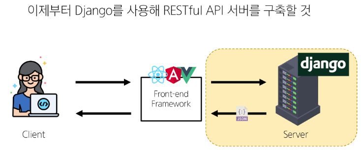

# DataBase - REST API

<div style="text-align: right"> 24. 04. 11. ~ 24. 04. 15. </div>

## 1. API

### 1. API - Application Programming Interface

* 두 SW가 서로 통신할 수 있게 하는 메커니즘

* 클라이언트 - 서버 관계처럼, 서로 다른 프로그램에서 요청과 응답을 받을 수 있도록 만든 체계

* API

    * '이렇게 요청을 보내면, 이렇게 정보를 제공해줄 것이다' 라는 매뉴얼로, SW와 SW 간 지정된 정의(형식)로 소통하는 수단

* Web API

    * Web server 또는 Web browser를 위한 API

    * 현대 웹 개발은 하나부터 열까지 직접 개발하기보다 여러 Open API들을 활용하는 추세

### 2. REST - Representational State Transfer

* API Server를 개발하기 위한 일종의 SW 설계 *방법론*

    * 모두가 API Server를 설계하는 구조가 다르니, 이렇게 맞춰 설계하는 게 어때???

    * *규칙이 아님*

* RESTful API

    * REST 원리를 따르는 시스템, REST라는 설계 디자인 약속을 지켜 구현한 API

    * *자원을 정의*하고 *자원에 대한 주소를 지정*하는 전반적인 방법을 서술

        * *각각 API 서버 구조를 작성하는 모습이 너무 다르니, 어느 정도 약속을 만들어서 다같이 API 서버를 구성하자!*

* REST에서 자원을 사용하는 3가지 방법

    * 자원의 *식별* - URI

    * 자원의 *행위* - HTTP Methods (CRUD)

    * 자원의 *표현* - JSON 데이터, 궁극적으로 표현되는 데이터 결과물

### 3. 자원의 식별

* URI - Uniform Resource Identifier, 통합 자원 식별자

    * 인터넷에서 리소스(자원)를 식별하는 문자열

    * 가장 일반적인 URI는 웹 주소로 알려진 URL

* URL - Uniform Resource Locator, 통합 자원 위치

    * 웹에서 주어진 리소스의 주소

    * 네트워크 상에 리소스가 어디에 있는지를 알려 주기 위한 약속

        

        |   N   |          name           | description                                                                                                                                                                                                                                 |
        | :---: | :---------------------: | :------------------------------------------------------------------------------------------------------------------------------------------------------------------------------------------------------------------------------------------ |
        |   1   | Schema<br>(or Protocol) | 브라우저가 리소스를 요청하는 데 사용해야 하는 규약<br>URL의 첫 부분은 브라우저가 어떤 규약을 사용하는지를 나타냄<br>기본적으로 웹은 http(s)를 요구하며, 메일을 열기 위한 mailto:, 파일을 전송하기 위한 ftp: 등 다른 프로토콜도 존재         |
        |   2   |       Domain Name       | 요청 중인 웹 서버를 나타냄<br>어떤 웹 서버가 요구되는지를 가리키며, 직접 IP 주소를 사용하는 것도 가능하지만, 사람이 외우기 어렵기 때문에 주로 Domain Name으로 사용됨<br>예를 들어 도메인 google.com의 IP 주소는 142.251.42.142              |
        |   3   |          Port           | 웹 서버의 리소스에 접근하는 데 사용되는 기술적인 문(Gate)<br>HTTP 프로토콜의 표준 포트<br>&emsp;HTTP - 80<br>&emsp;HTTPS - 443<br>표준 포트만 작성 시 생략 가능                                                                             |
        |   4   |          Path           | 웹 서버의 리소스 경로<br>초기에는 실제 파일이 위치한 물리적 위치를 나타냈지만, 오늘날은 실제 위치가 아닌 추상화된 형태의 구조를 표현<br>예를 들어 /articles/create/ 라는 주소가 실제 articles 폴더 안에 create 폴더 안을 나타내는 것은 아님 |
        |   5   |       Parameters        | 웹 서버에 제공하는 추가적인 데이터<br>'&' 기호로 구분되는 key-value쌍 목록<br>서버는 리소스를 응답하기 전에 이러한 parameter를 사용해 추가 작업을 수행할 수 있음                                                                            |
        |   6   |         Anchor          | 일종의 *북마크*를 나타내며, 브라우저의 해당 지점에 있는 콘텐츠를 표시<br>fragment identifier(부분 식별자)라고 부르는 '#' 이후 부분은 서버에 전송되지 않음                                                                                   |
        |       |
  
### 4. 자원의 행위

* HTTP **Request** Methods (요청)

    * 리소스에 대한 행위 (수행하고자 하는 동작)를 정의

    * HTTP verbs라고도 함

    * 대표 HTTP Request Methods

        |   N   |  name  | description                                                               |
        | :---: | :----: | :------------------------------------------------------------------------ |
        |   1   |  GET   | 서버에 리소스의 표현을 요청<br>GET을 사용하는 요청은 데이터만 검색해야 함 |
        |   2   |  POST  | 데이터를 지정된 리소스에 제출<br>서버의 상태를 변경                       |
        |   3   |  PUT   | 요청한 주소의 리소스를 수정                                               |
        |   4   | DELETE | 지정된 리소스를 삭제                                                      |
        |       |

* HTTP **response** status codes (응답)

    * 특정 HTTP 요청이 성공적으로 완료되었는지 여부를 나타냄

        * status module 안에 있는 status code를 사용해 각각의 상태 코드를 명확하게 하는 데 사용

    * 5개의 응답 그룹

        |   N   | name                              |
        | :---: | :-------------------------------- |
        |   1   | Informational responses (100-199) |
        |   2   | Successful responses (200-299)    |
        |   3   | Redirection message (300-399)     |
        |   4   | Client error responses (400-499)  |
        |   5   | Server error responses (500-599)  |
        |       |

### 5. 자원의 표현

* 지금까지 Django 서버는 사용자에게 페이지 (html)만 응답

* REST API는, 서버가 응답할 수 있는 다양한 데이터 타입 중 **JSON 타입**으로 응답하는 것을 권장

    

    

    

    

## 2. DRF with Single Model

### 1. 사전 준비

* migrate 진행 및 준비된 fixtures file을 load하여 실습용 초기 데이터 입력

    ```s
    # articles/fixtures/articles.json 파일 존재

    $ python manage.py loaddata articles.json
    ```

* python으로 json 응답 받기

    ```python
    # 제공된 python-request-sample.py 확인
    # python-request-sample.py

    import requests
    from pprint import pprint


    response = requests.get('http://127.0.0.1:8000/api/v1/articles/')

    # json을 python 타입으로 변환
    result = response.json()

    print(type(result))
    # pprint(result)
    # pprint(result[0])
    # pprint(result[0].get('title'))
    ```

* requirements.txt 설치 및 INSTALLED_APPS 등록

    ```python
    # project/settings.py

    INSTALLED_APPS = [
        ...,
        'rest_framework',
        ...
    ]
    ```

### 2. DRF - Django REST Framework

* Django에서 Restful API 서버를 쉽게 구축할 수 있도록 도와주는 오픈소스 라이브러리

* Postman 설치

    * API를 구축하고 사용하기 위한 플랫폼

    * API를 빠르게 만들 수 있는 여러 도구 및 기능 제공

* URL과 HTTP requests methods 설계

    |             |     GET      |  POST   |     PUT     |   DELETE    |
    | :---------: | :----------: | :-----: | :---------: | :---------: |
    |  articles/  | 전체 글 조회 | 글 작성 |             |             |
    | articles/1/ | 1번 글 조회  |         | 1번 글 수정 | 1번 글 삭제 |
    |             |

### 3. GET

* Serialization - 직렬화

    * *여러 시스템에서 활용하기 위해* 데이터 구조나 객체 상태를 나중에 재구성할 수 있는 포맷으로 변환하는 과정

    * 어떠한 언어나 환경에서도 나중에 다시 쉽게 쓸 수 있도록 유연성 높은 데이터 타입으로 미리 준비해두는 과정

    

* Serializer

    * Serialization을 진행하여 Serialized data를 반환해주는 class

* ModelSerializer

    * Django Model과 연결된 Serializer class

    * 일반 Serializer와 달리 사용자 입력 데이터를 받아 자동으로 model field에 맞추어 Serialization을 진행

    * ModelSerializer의 인자 및 속성

        ```python
        serializer = ArticleListSerializer(articles, many = True)
        return Response(serializer.data)
        ```

        * many 옵션 : Serialize 대상이 QuerySet인 경우 입력

        * data 속성 : Serialized data 객체에서 실제 데이터 추출

* 게시글 데이터 목록 조회하기

    ```python
    # 게시글 데이터 목록을 제공하는 ArticleListSerializer 정의

    # articles/serializers.py

    from rest_framework import serializers
    from .models import Article

    class ArticleListSerializer(serializers.ModelSerializer):
        class Meta:
            model = Article
            fields = ('id', 'title', 'content', )
    ```

    ```python
    # articles/urls.py

    urlpatterns = [
        ...
        path('articles/', views.article_list),
    ]
    ```

    ```python
    # articles/views.py

    from rest_framework.response import Response
    from rest_framework.decorators import api_view

    from .models import Article
    from .serializers import ArticleListSerializer

    # decorator가 없으면 DRF view 함수로서의 역할 불가능
    @api_view(['GET'])
    def article_list(request):
        articles = Article.objects.all()
        serializer = ArticleListSerializer(articles, many = True)
        return Response(serializer.data)
    ```

* 과거 view 함수와의 비교

    * 똑같은 데이터를 HTML에 출력되도록 페이지와 함께 응답했던 과거의 view 함수

    * JSON 데이터로 serialization하여 페이지 없이 응답하는 현재의 view 함수

* 'api_view' decorator

    * DRF view 함수에서는 필수로 작성되며, view 함수를 실행하기 전 HTTP method를 확인

    * 기본적으로 GET method만 허용되며, 다른 method 요청에 대해서는 405 Method Not Allowed로 응답

    * DRF view 함수가 응답해야 하는 HTTP method 목록을 작성

* 단일 게시글 데이터 조회하기

    ```python
    # 각 게시글의 상세 정보를 제공하는 ArticleSerializer 정의
    # articles/serializers.py

    class ArticleSerializer(serializers.ModeSerializer):
        class Meta:
            model = Article
            fields = '__all__'
    ```

    ```python
    # articles/urls.py

    urlpatterns = [
        ...
        path('articles/<int:article_pk>/', views.article_detail),
    ]
    ```

    ```python
    # articles.views.py

    from .serializers import ArticleListSerializer, ArticleSerializer

    @api_view(['GET'])
    def article_detail(request, article_pk):
        article = Article.objects.get(pk = article_pk)
        serializer = ArticleSerializer(article)
        return Response(serializer.data)
    ```

### 4. POST

* 게시글 데이터 생성하기

    * 데이터 생성이 성공했을 경우 201 Created 응답

    * 데이터 생성이 실패했을 경우 400 Bad request 응답

* article_list view 함수 구조 변경 (method에 따른 분기처리)

    ```python
    # articles/views.py

    from rest_framework import status

    @api_view(['GET', 'POST'])
    def article_list(request):
        if request.method == 'GET':
            articles = Article.objects.all()
            serializer = ArticleListSerializer(articles, many = True)
            return Response(serializer.data)

        elif request.method == 'POST':
            serializer = ArticleSerializer(data = request.data)
            if serializer.is_valid():
                serializer.save()
                return Response(serializer.data, status = status.HTTP_201_CREATED)
            return Response(serializer.errors, status = status.HTTP_400_BAD_REQUEST)
    ```

### 5. DELETE

* 게시글 데이터 삭제하기

    * 요청에 대한 데이터 삭제가 성공했을 경우에는 204 No Content 응답

    ```python
    # articles/views.py

    @api_view(['GET', 'DELETE'])
    def article_detail(request, article_pk):
        article = Article.objects.get(pk = article_pk)
        if request.method == 'GET':
            serializer = ArticleSerializer(article)
            return Response(serializer.data)
        
        elif request.method == 'DELETE':
            article.delete()
            return Response(status = status.HTTP_204_NO_CONTENT)
    ```

### 6. PUT

* 게시글 데이터 수정하기

    * 요청에 대한 데이터 수정이 성공했을 경우 200 OK 응답

* 'partial' argument

    * 부분 업데이트를 허용하기 위한 인자

    * 예를 들어 partial 인자 값이 False인 경우 게시글 title만을 수정하려고 해도 반드시 content 값도 요청 시 함께 전송해야 함

        * 기본적으로 serializer는 모든 필수 field에 대한 값을 전달받기 때문 → 누락 판단

        * 즉, 수정하지 않는 다른 field data도 모두 전송해야 하며, 그렇지 않으면 유효성 검사에서 오류가 발생

    ```python
    # articles/views.py

    @api_view(['GET', 'DELETE', 'PUT'])
    def article_detail(request, article_pk):
        ...

        elif request.method == 'PUT':
            serializer = ArticleSerializer(article, data = reqeust.data, partial = True)

            if serializer.is_valid():
                serializer.save()
                return Response(serializer.data)
            return Response(serializer.errors, status = status.HTTP_400_BAD_REQUEST)
    ```

## 3. DRF with N:1 Relation

* URL 및 HTTP request method 구성

    |         URL          |      GET       |   POST    |      PUT       |     DELETE     |
    | :------------------: | :------------: | :-------: | :------------: | :------------: |
    |      comments/       | 댓글 목록 조회 |           |                |                |
    |     comments/1/      | 단일 댓글 조회 |           | 단일 댓글 수정 | 단일 댓글 삭제 |
    | articles/1/comments/ |                | 댓글 생성 |                |                |
    |                      |

### 1. GET

* 전체 댓글 목록 조회

    ```python
    # 댓글 목록 조회를 위한 CommentSerializer 정의
    # articles/serializers.py

    from .models import Article, Comment

    class CommentSerializer(serializers.ModelSerializer):
        class Meta:
            model = Comment
            fields = '__all__'
    ```

    ```python
    # url 작성
    # articles/urls.py

    urlpatterns = [
        ...,
        path('comments/', views.comment_list),
    ]
    ```

    ```python
    # view 함수 작성
    # articles/views.py

    from .models import Article, Comment
    from .serializers import ArticleListSerializer, ArticleSerializer, CommentSerializer

    @api_view(['GET'])
    def comment_list(request):
        comments = Comment.objects.all()
        serializer = CommentSerializer(comments, many = True)
        return Response(serializer.data)
    ```

* 단일 댓글 조회

    ```python
    # articles/urls.py

    urlpatterns = [
        ...,
        path('comments/<int:comment_pk>/', views.comment_detail),
    ]
    ```

    ```python
    # articles/views.py

    @api_view(['GET'])
    def comment_detail(request, comment_pk):
        comment = Comment.objects.get(pk = comment_pk)
        serializer = CommentSerializer(comment)
        return Response(serializer.data)
    ```

### 2. POST

* 댓글 생성은 게시글 생성과 달리, 게시글의 정보도 같이 필요하다.

* 단일 댓글 생성을 위한 url 및 view 함수 작성

    ```python
    # articles/urls.py

    urlpatterns = [
        ...,
        path('articles/<int:article_pk>/comments/', views.comment_create),
    ]
    ```

    ```python
    # articles/views.py

    @api_view(['POST'])
    def comment_create(request, article_pk):
        article = Article.objects.get(pk = article_pk)

        # CommentForm을 사용할 때는 첫 번째 인자로 data를 받기 때문에 바로 request.data를 사용하면 되었으나,
        # CommentSerializer의 경우 주의
        serializer = CommentSerializer(data = request.data)
        if serializer.is_valid(raise_exception = True):

            # serializer instance의 save() method는 특정 Serializer instance를 저장하는 과정에서 추가 데이터를 받을 수 있음
            # article, content field가 모두 필요한데, POSTMAN을 통해 content만 입력하면 400 error 발생
            # serializer.save()
            serializer.save(article = article)
            return Response(serializer.data, status = status.HTTP_201_CREATED)
    ```

    * article을 입력해 줘도 계속 상태코드 400 응답 확인

        * **CommentSerializer**에서 외래 키에 해당하는 **article** field 또한 사용자로부터 입력받도록 설정되어 있기 때문에, 서버 측에서는 누락되었다고 판단한 것

        * is_valid()문을 통과하지 못함 → 유효성 검사 목록에서 제외 필요

* **article** field를 *읽기 전용 field*로 설정하기

    * 데이터를 전송받은 시점에서 **유효성 검사를 제외**시키고, **데이터 조회 시에는 출력**하는 필드

        ```python
        # articles/serializers.py

        class CommentSerializer(serializers.ModelSerializer):
            class Meta:
                model = Comment
                fields = '__all__'
                read_only_fields = ('articles', )
        ```

### 3. DELETE & PUT

* 단일 댓글 삭제 및 수정을 위한 view 함수 작성

    ```python
    # articles/views.py
    @api_view(['GET', 'DELETE', 'PUT'])
    def comment_detail(request, comment_pk):
        comment = Comment.objects.get(pk = comment_pk)
        if request.method == 'GET':
            serializer = CommentSerializer(comment)
            return Response(serializer.data)

        elif request.method == 'DELETE':
            comment.delete()
            return Response(status = status.HTTP_204_NO_CONTENT)
    
        elif request.method == 'PUT':
            serializer = CommentSerializer(comment, data = request.data)
            if serializer.is_valid(raise_exception = True):
                serializer.save()
                return Response(serializer.data)
    ```

### 4. 응답 데이터 재구성

* 댓글 조회 시 게시글 번호만 제공해주는 것이 아닌 *'게시글의 제목'까지 제공*하기

* 필요한 데이터를 만들기 위한 Serializer는 내부에서 추가 선언이 가능함

    

    ```python
    # articles/serializers.py

    class CommentSerializer(serializers.ModelSerializer):
        # 외래 키에 대한 결과물을 만들어주는 Serializer를 CommentSerializer 안쪽에서 선언
        class ArticleTitleSerializer(serializers.ModelSerializer):
            class Meta:
                model = Article
                fields = ('title',)
        
        # CommentSerializer가 갖고 있는 article field를 ArticleTitleSerializer를 통해 만든 결과물로 덮어쓰기

        # Field에 대한 값을 custom하는 순간 read_only_fields가 작동하지 않음 → serializing할 때 옵션을 넣어줘야 함
        article = ArticleTitleSerializer(read_only = True)

        class Meta:
            model = Comment
            fields = '__all__'
            # read_only_fields = ('articles',)
    ```

    

## 4. 역참조 시 데이터 구성

* Article → Comment 간 역참조 관계를 활용한 JSON 데이터 재구성

    * 단일 게시글 조회 시 해당 게시글에 작성된 댓글 목록도 함께 붙여 응답

    * 단일 게시글 조회 시 해당 게시글에 작성된 댓글 개수도 함께 붙여 응답

### 1. 단일 게시글 & 댓글 목록

* Nested Relationships (역참조 매니저 활용)

    * model 관계 상으로 참조하는 대상은 참조되는 대상의 표현에 포함되거나 중첩될 수 있음

    * 이러한 중첩된 관계는 serializers를 field로 사용해 표현 가능

    ```python
    # articles/serializers.py

    class ArticleSerializer(serializers.ModelSerializer):

        # 기존에 만들어놓은 CommentSerializer을 사용해도 됨
        class CommentDetailSerializer(serializers.ModelSerializer):
            class Meta:
                model = Comment
                fields = ('id', 'content', )

        # 1 → N 참조
        # 단일 대상이 아니기 때문에 many = True 옵션을 넣어줘야 함
        # serializer에서도 역참조의 이름 규칙은 변하지 않음 (comment_abcd 등으로 바꿀 수 없음)
        # 바꾸려면 model에서 related_name 옵션을 지정해서 바꿔줘야 함
        comment_set = CommentDetailSerializer(many = True, read_only = True)

        class Meta:
            model = Article
            fields = '__all__'
    ```

### 2. 단일 게시글 & 댓글 개수

* 댓글 개수 → 앞선 단순 역참조와 달리, 개수 계산을 하여 새로운 field를 생성해야 하는 과정

* 댓글 개수에 해당하는 새로운 field 생성

    ```python
    # articles/serializers.py

    class ArticleSerializer(serializers.ModelSerializer):
        class CommentDetailSerializer(serializers.ModelSerializer):
            class Meta:
                model = Comment
                fields = ('id', 'content', )

        comment_set = CommentDetailSerializer(many = True, read_only = True)
        # read_only 인자를 override하는 field에 작성해야 함 (read_only_fields에 입력하면 동작하지 않음)

        # 새로이 만드는 필드이기 때문에 이름 규칙이 없음
        # source 인자 → 문자열로 작성하는데, article.comment_set 에서 instance를 빼고 입력
        comment_count = serializers.IntegerField(source = 'comment_set.count', read_only = True)
        # read_only 인자를 생성하는 field에 작성해야 함 (read_only_fields에 입력하면 동작하지 않음)

        class Meta:
            model = Article
            fields = '__all__'
    ```

    * *source* arguments

        * field를 채우는 데 사용할 속성의 이름

        * 점 표기법 (dotted notation)을 사용해 속성을 탐색할 수 있음

### 3. 읽기 전용 field 지정 issue (중요)

    * 특정 field를 override 혹은 추가한 경우 read_only_fields는 동작하지 않음

    * 이런 경우, override 혹은 새로운 field에 read_only keyword 인자로 작성해야 함

## 5. API 문서화

### 1. 개요

* OAS, OpenAPI Specification

    * RESTful API를 설명하고 시각화하는 표준화된 방법

    * API에 대한 세부사항을 기술할 수 있는 공식 표준 (가이드)

    * Swagger, Redoc 등 - OAS 기반 API에 대한 문서를 생성하는 데 도움을 주는 오픈소스 프레임워크

* drf-spectacular 라이브러리

    * DRF를 위한 OpenAPI 3.0 구조 생성을 도와주는 라이브러리

    ```s
    $ pip install drf-spectacular
    ```

    ```python
    # settings.py

    # 등록
    INSTALLED_APPS = [
        ...,
        'drf_spectacular',
        ...,
    ]

    # 관련 설정 코드 입력 (OpenAPI 구조 자동 생성 코드)
    REST_FRAMEWORK = {
        # YOUR SETTINGS
        'DEFAULT_SCHEMA_CLASS': 'drf_spectacular.openapi.AutoSchema',
    }
    ```

    ```python
    # drf/urls.py

    # swagger, redoc 페이지 제공을 위한 url 작성
    from drf_spectacular.views import SpectacularAPIView, SpectacularRedocView, SpectacularSwaggerView

    urlpatterns = [
        ...,
        path('api/schema/', SpectacularApiView.as_view(), name='schema'),
        path('api/schema/swagger-ui/', SpectacularSwaggerView.as_view(url_name = 'schema'), name = 'swagger-ui'),
        path('api/schema/redoc/', SpectacularRedocView.as_view(url_name = 'schema'), name = 'redoc'),
    ]
    ```

    ```python
    # 커스텀하기
    # settings.py

    SPECTACULAR_SETTINGS = {
        'TITLE': '내 API 서비스',
        'DESCRIPTION': 'Django 마지막 서비스',
        'VERSION': '1.0.0',
        'SERVE_INCLUDE_SCHEMA': False,
    }
    ```

### 2. "설계 우선" 접근법

* OAS의 핵심 이점

* API를 **먼저 설계하고 명세 작성 후**, 이를 기반으로 코드를 구현하는 방식

* API의 일관성을 유지하고, API 사용자는 더 쉽게 API를 이해 / 사용할 수 있음

* OAS를 사용하면 API가 어떻게 작동하는지를 시각적으로 보여주는 문서를 생성할 수 있으며, 이는 API를 이해하고 테스트하는 데 매우 유용

* 이런 목적으로 사용되는 도구가 Swagger-UI 또는 ReDoc

## 0. 참고

* raise_exception

    * is_valid()의 선택 인자

    * 유효성 검사를 통과하지 못할 경우 ValidationError 예외를 발생시킴

    * DRF에서 제공하는 기본 예외 처리기에 의해 자동으로 처리되며, 기본적으로 HTTP 400 응답을 반환

        ```python
        # articles/views.py

        @api_view(['GET', 'POST'])
        def article_list(request):
            ...
            elif request.method == 'POST':
                serializer = ArticleSerializer(data = request.data)
                if serializer.is_valid(raise_exception = True):
                    serializer.save()
                    return Response(serializer.data, status = status.HTTP_201_CREATED)
                # 생략 가능해짐
                # return Response(serializer.errors, status = status.HTTP_400_BAD_REQUEST)
        ```

* Django shortcuts functions - render(), redirect(), **get_object_or_404**, **get_list_or_404**

    * get_object_or_404()

        * model manager objects에서 get()을 호출하지만, 해당 객체가 없을 땐 기존 DoesNotExist 예외 대신 **Http404를 raise**함

            * 클라이언트가 없는 데이터를 조회할 때, 서버 입장에서 나쁜 요청이 아니라서 서버가 잘 찾아보았지만 자료가 없는 것

            * 이 상황에서 사용자는 404 Error를 받아야 하지만 500 Internal Server Error가 발생함

                * view 함수에서, 조회를 했을 때 사용한 .get 함수에서 발생한 예외 (없는 자료)로 인해 더 아래 구문을 실행하지 않고 바로 500 Error를 발생시키기 때문

            * try ~ except 구문을 사용하는 경우

            ```python
            @api_view(['GET', 'DELETE', 'PUT'])
            def article_detail(request, article_pk):
                try:
                    article = Article.objects.get(pk = article_pk)
                except DoesNotExist:
                    return ...

                if request.method == 'GET':
                    ...
            ```

            * 이를 get_object_or_404 함수를 사용하여 간단하게 표현할 수 있음

            ```python
            # articles/views.py

            from django.shortcuts import get_object_or_404

            article = Article.objects.get(pk = article_pk)
            comment = Comment.objects.get(pk = comment_pk)

            # 위 코드를 모두 다음과 같이 변경
            article = get_object_or_404(Article, pk = article_pk)
            comment = get_object_or_404(Comment, pk = comment_pk)
            ```

    * get_list_or_404()

        * model manger objects에서 filter()의 결과를 반홯나고, 해당 객체 *목록*이 없을 땐 **Http404를 raise**함

            ```python
            # articles/views.py

            from django.shortcuts import get_list_or_404

            articles = Article.objects.all()
            comments = Comment.objects.all()

            # 위 코드를 모두 다음과 같이 변경
            articles = get_list_or_404(Article)
            comments = get_list_or_404(Comment)
            ```

    * 왜 사용해야 할까?

        * 클라이언트에게 "서버에 오류가 발생하여 요청을 수행할 수 없다(500)" 라는, *원인이 정확하지 않은 에러를 제공하기보다는*, 적절한 예외처리를 통해 클라이언트에게 **보다 정확한 에러 현황을 전달하는 것**도 매우 중요한 개발 요소 중 하나이기 때문

* django-seed, psycopg2

    * django-seed : DB에 랜덤하게 자료를 채워넣어 주는 프로그램

    ```s
    $ pip install django-seed
    $ pip install psycopg2
    ```

    ```python
    # settings.py

    INSTALLED_APPS = [
        ...,
        'django_seed',
    ]
    ```

    ```s
    # articles app에 Article, Comment model 2개가 있는데, 이를 이용해 랜덤하게 10개의 데이터를 만들어 DB에 저장
    $ python manage.py seed --number=10 articles
    ```

<script type="text/javascript" src="http://cdn.mathjax.org/mathjax/latest/MathJax.js?config=TeX-AMS-MML_HTMLorMML"></script>
<script type="text/x-mathjax-config">
  MathJax.Hub.Config({
    tex2jax: {inlineMath: [['$', '$']]},
    messageStyle: "none",
    "HTML-CSS": { availableFonts: "TeX", preferredFont: "TeX" },
  });
</script>