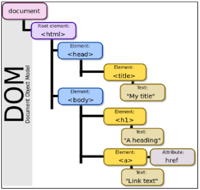
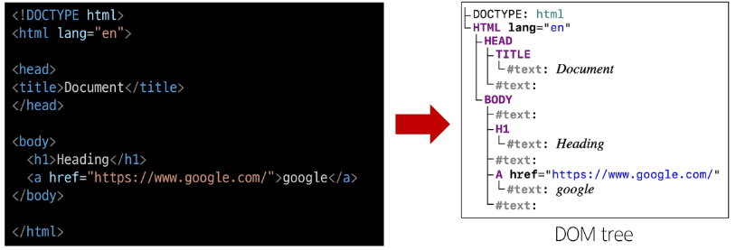

# JavaScript - DOM

<div style="text-align: right"> 24. 04. 16. </div>

## 1. History of JavaScript

### 1. Web Browser & JS

* Web의 탄생 (1990)

    * Tim Berners-Lee 경이 WWW, HyperText 시스템 고안해 개발

    * URL, HTTP 최초 설계 및 구현

    * 초기의 웹은 정적인 텍스트 페이지만을 지원

* Web Browser의 대중화 (1993)

    * Netscape 사의 최초 상용 웹 브라우저인 Netscape Navigator 출시

    * Netscape 사는 Web의 동적인 기능을 만들기 위한 프로젝트를 시작

* JavaScript의 탄생 (1995)

    * Netscape 소속 개발자 Brandon Eich는 웹의 동적 기능 개발이라는 회사의 요구사항을 넘어, **스크립트 언어** Mocha 개발

    * 이후 LiveScript로 이름을 변경했으나, 당시 가장 인기있던 프로그래밍 언어인 Java의 명성에 기대보고자 JavaScript로 이름을 변경

    * JavaScript는 Necscape Navigator 2.0에 탑재되어 웹 페이지에 동적 기능을 추가하는 데 사용

* JavaScript 파편화 (1996)

    * Microsoft가 자체 웹 브라우저인 인터넷 익스플로러(IE) 3.0에 JavaScript와 유사한 언어인 JScript를 도입

    * 많은 회사들이 독자적으로 JavaScript를 변경하고 이를 자체 브라우저에 탑재 → JavaScript의 파편화 시작

* 1차 브라우저 전쟁 (1995 - 2001)

    * Microsoft는 IE를 자사 윈도우 운영체제에 내장하여 무료로 배포

    * Microsoft의 공격적인 마케팅, 자금력, 압도적인 윈도우 운영체제 점유율 앞에 Netscape는 빠르게 몰락 (IE의 시장 점유율 약 96% - 2002년)

    * 추후 Brandon Eich와 함께 Netscape에서 나온 핵심 개발진은 모질라 재단을 설립하여 Firefox 브라우저 출시 (2003)

    * 웹 표준의 부재로 인해 각 기업에서 자체 표준을 확립하려는 상황 발생 → 웹 개발자들에게 큰 혼란을 주었으며, 결국 웹 표준의 중요성을 인식하는 계기가 됨

* ECMAScript 출시 (1997)

    * JavaScript의 파편화를 막기 위해 Netscape사는 ECMA 재단에 웹 표준 제작을 요청

    * ECMA에서 ECMAScript라는 표준 언어를 정의하여 발표 (1997) → 이때부터 JavaScript는 ECMAScript 표준에 기반을 두고 발전하기 시작

* 2차 브라우저 전쟁 (2004 - 2017)

    * 웹 표준이 정의되었지만 당시 가장 높은 점유율을 가진 IE는 웹 표준을 지키지 않았고, 독자적 규격을 유지하며 웹 시장을 주도

    * IE의 독주에 대한 Firefox의 대항 - 2008년까지 점유율 30% 차지

    * Google의 Chrome 브라우저의 등장 (2008)

        * Chrome은 출시 3년만에 Firefox의 점유율을 넘어서고, 그로부터 반년 뒤 IE의 점유율을 넘어섬

        * 빠른 성능, 다양한 플랫폼 지원, 보안, Google 생태계 통합 등 다양한 이유가 있지만, 가장 중요했던 역할은 바로 **적극적인 웹 표준 준수**

        * 호환성

            * 웹 표준을 준수함으로써, 사용자들은 브라우저 간에 일관된 웹 페이지를 볼 수 있게 됨

            * 이는 다양한 플랫폼 및 기기에서 웹 사이트가 일관되게 동작할 수 있음을 의미

        * 개발자 도구

            * 웹 개발자를 위한 강력한 도구를 제공하여 웹 애플리케이션을 개발하는 데 도움

* 2차 브라우저 전쟁의 영향

    * Chrome이 웹 표준을 준수하고 새로운 웹 기술을 적극적으로 채택함으로써, 다른 브라우저 제조사들도 웹 표준 준수에 대한 중요성을 인식하고, 이에 따라 웹 표준을 채택하는 데 더 많은 노력을 기울이게 됨

    * 웹의 기능이 크게 확장되며 웹 애플리케이션의 비약적인 발전을 이끌어 감

### 2. ECMAScript

* ECMA International이 정의하고 있는 표준화된 스크립트 프로그래밍 언어 **명세**

    * 스크립트 언어가 준수해야 하는 규칙, 세부사항 등을 제공

* ECMAScript와 JavaScript

    * JavaScript는 ECMAScript 표준을 구현한 구체적인 프로그래밍 언어

    * ECMAScript의 명세를 기반으로 하여 웹 브라우저나 Node.js와 같은 환경에서 실행됨

* ECMAScript는 JavaScript의 표준이며, JavaScript는 ECMAScript 표준을 따르는 구체적인 프로그래밍 언어

* ECMAScript는 언어의 핵심을 정의하고, JavaScript는 ECMAScript 표준을 따라 구현된 언어로 사용

* ECMAScript의 역사

    * ECMAScript 5 (ES5)에서 안정성과 생산성을 크게 높임 (2009)

    * ECMAScript 2015 에서 객체지향 프로그래밍 언어로써 많은 발전을 이루어, 역사상 가장 중요한 버전으로 평가됨 (2015)

* JavaScript의 현재

    * 현재는 Chrome, Firefox, Safari, Microsoft Edge 등 다양한 웹 브라우저가 경쟁하고 있으며, 모바일 등 시장이 다양화되어 있음

    * 기존에 JavaScript는 브라우저에서만 웹 페이지의 동적인 기능을 구현하는 데에만 사용

        * 예를 들어, 사용자의 입력에 따라 웹 페이지의 내용이 동적으로 변경되거나, 애니메이션 효과가 적용되는 등의 기능

    * 이후 **Node.js**로 인해 브라우저에서 벗어나 서버 사이드 분야뿐만 아니라, 클라이언트 사이드 등 다양한 프레임워크와 라이브러리들이 개발되면서, 웹 개발 분야에서는 필수적인 언어로 자리잡게 됨

## 2. DOM

### 1. Web Browser에서의 JavaScript

* JavaScript 실행 환경 종류

    1. HTML script tag

        ```HTML
        <body>
          <script>
            console.log('hello')
          </script>
        </body>
        ```

    2. js 확장자 파일 → 실행은 HTML 또는 Node.js로 실행

        ```JS
        console.log('Hello')
        ```

        ```HTML
        <body>
          <script src='hello.js'></script>
        </body>
        ```

    3. 브라우저 console

        * F12 - 개발자 도구 - console에서 입력

### 2. DOM - The Document Object Model

* Web Page (Document)를 구조화된 객체로 제공하여, 프로그래밍 언어가 페이지 구조에 접근할 수 있는 방법을 제공

* 문서 구조, 스타일, 내용 등을 변경할 수 있도록 함

* DOM API

    * 다른 프로그래밍 언어가 웹 페이지에 접근 및 조작할 수 있도록, 페이지 요소들을 객체 형태로 제공하며 이에 따른 메서드 또한 제공

* DOM 특징

    * DOM에서 모든 요소, 속성, 텍스트는 하나의 객체

    * 모두 document 객체의 하위 객체로 구성됨

        

* DOM tree

    * Browser는 HTML 문서를 해석하여 DOM tree라는 객체 트리로 구조화

    * **객체 간 상속 구조가 존재**

        

* DOM의 핵심

    * 문서의 요소들을 객체로 제공하여 다른 프로그래밍 언어에서 접근하고 조작할 수 있는 방법을 제공하는 API

### 3. Document 객체

* 'document' 객체

    * 웹 페이지 객체이며, DOM tree의 진입점

    * 페이지를 구성하는 모든 객체 요소를 포함

## 3. DOM 선택

* DOM 조작을 위해 → 조작 이전에 선택(조회)하는 것이 중요

* 웹 페이지를 동적으로 만들기 == 웹 페이지를 조작하기

    * 조작 순서

        1. 조작하고자 하는 요소를 **선택(또는 탐색)**

        2. 선택된 요소의 콘텐츠 또는 속성을 **조작**

### 1. 선택 메서드 - 2가지

* document.querySelector(selector)

    * 제공한 선택자와 일치하는 element 한 개 선택

    * 제공한 CSS selector를 만족하는 **첫 번째** element 객체를 반환 (없다면 null 반환)

* document.querySelectorAll(selector) : 요소 여러 개 선택

    * 제공한 선택자와 일치하는 여러 element를 선택

    * 제공한 CSS selector를 만족하는 NodeList를 반환

### 2. DOM 선택

```HTML
<body>
  <h1 class="heading">DOM 선택</h1>
  <a href="https://www.google.com/">google</a>
  <p class="content">content1</p>
  <p class="content">content2</p>
  <p class="content">content3</p>
  <ul>
    <li>list1</li>
    <li>list2</li>
  </ul>

  <script>
    console.log(document.querySelector('.heading'))
    console.log(document.querySelector('.content'))
    console.log(document.querySelectorAll('.content'))
    console.log(document.querySelectorAll('ul > li'))
  </script>

</body>
```

### 3. DOM 조작

* 속성(attribute) 조작

    * class 속성 조작 - 'classList' property : 요소의 클래스 목록을 DOMTokenList(유사 배열) 형태로 반환

        * element.classList.*add()* : 지정한 클래스 값을 추가

        * element.classList.*remove()* : 지정한 클래스 값을 제거

        * element.classList.*toggle()* : 클래스가 존재한다면 제거하고 false 반환, 존재하지 않으면 클래스를 추가하고 true 반환

        ```JS
        <script>
          // class 속성 조작
          const h1Tag = document.querySelector('.heading')
          console.log(h1Tag)
          console.log(h1Tag.classList)

          h1Tag.classList.add('red')
          console.log(h1Tag.classList)

          h1Tag.classList.remove('red')
          console.log(h1Tag.classList)

          h1Tag.classList.toggle('red')
        </script>
        ```

    * 일반 속성 조작

        * element.*getAttribute()* : 해당 요소에 지정된 값을 반환 (조회)

        * element.*setAttribute(name, value)* : 지정된 요소의 속성 값을 설정(새 속성 추가) / 속성이 이미 있으면 기존 값을 갱신

        * element.*removeAttribute()* : 요소에서 지정된 이름을 가진 속성 제거

        ```JS
        <script>
          // 일반 속성 조작
          const aTag = document.querySelector('a')
          console.log(aTag)

          console.log(aTag.getAttribute('href'))

          aTag.setAttribute('href', 'https://www.naver.com/')
          console.log(aTag.getAttribute('href'))

          aTag.removeAttribute('href')
          console.log(aTag.getAttribute('href'))
        </script>
        ```

* HTML 콘텐츠 조작

    * 'textConent' property : 요소의 텍스트 콘텐츠를 표현

        ```JS
        <script>
          const h1Tag = document.querySelector('.heading')
          console.log(h1Tag)

          console.log(h1Tag.textContent)

          h1Tag.textContent = '내용 수정'
          console.log(h1Tag)
        </script>
        ```

* DOM 요소 조작

    * document.createElement(tagName) : 작성한 tagName의 HTML 요소를 생성하여 반환

    * Node.appendChild() : 한 Node를 특정 부모 Node의 자식 NodeList 중 마지막 자식으로 삽입, 추가된 Node 객체를 반환

    * Node.removeChild() : DOM에서 자식 Node를 제거하고, 제거된 Node를 반환

        ```JS
        <body>
          <div></div>

          <script>
            // 생성
            const h1Tag = document.createElement('h1')
            h1Tag.textContent = '제목'
            console.log(h1Tag)
            
            // 추가
            const divTag = document.querySelector('div')
            divTag.appendChild(h1Tag)
            console.log(divTag)

            // 삭제
            divTag.removeChild(h1Tag)
          </script>
        </body>
        ```

* 스타일 조작

    * 'style' property : 해당 요소의 모든 style 속성 목록을 포함하는 속성

        ```JS
        <body>
          <p>Lorem, ipsum dolor.</p>

          <script>
            const pTag = document.querySelector('p')
            console.log(pTag.style)
            
            pTag.style.color = 'crimson'
            pTag.style.fontSize = '2rem'
            pTag.style.border = '1px solid black'
            console.log(pTag.style)
          </script>
        </body>
        ```

* JS가 CSS의 모든 것을 할 수 있는 것은 아니다!

    * 모든 Layout을 JS로 짜려고 하는 것은 잘못된 것

## 0. 참고

* Node

    * DOM의 기본 구성 단위

    * DOM 트리의 각 부분은 Node라는 객체로 표현됨

        * Document Node → HTML 문서 전체를 나타내는 노드

        * Element Node → HTML 요소를 나타내는 노드 (예를 들어 <p>)

        * Text Node → HTML 텍스트 (Element Node 내의 텍스트 컨텐츠를 나타냄)

        * Attribute Node → HTML 요소의 속성을 나타내는 노드

* NodeList

    * DOM method를 사용해 선택한 Node의 목록

    * 배열과 유사한 구조를 가짐 - Index로만 각 항목에 접근 가능

    * JavaScript의 배열 method 사용 가능

    * querySelectorAll()에 의해 반환되는 NodeList는 DOM의 변경사항을 *실시간으로 반영하지 않음*

        * DOM이 나중에 변경되더라도, 이전에 이미 선택한 NodeList 값은 변하지 않음

* Element

    * Node의 하위 유형

    * Element는 DOM 트리에서 HTML 요소를 나타내는 특별한 유형의 Node

        * 예를 들어, <p>, <div>, <span>, <body> 등의 HTML 태그들이 Element 노드를 생성

        * Node의 속성과 method를 모두 갖고 있으며 추가적으로 요소 특화된 기능(className, innerHTML, id 등)을 가지고 있음

        * 모든 Element는 Node이지만, 모든 Node가 Element인 것은 아님

* DOM 속성 확인 Tip

    * 개발자 도구 → Elements → Properties

    * 해당 요소의 모든 DOM 속성 확인 가능

* Parsing - 구문 분석, 해석

    * 브라우저가 문자열을 해석하여 DOM tree로 만드는 과정

<script type="text/javascript" src="http://cdn.mathjax.org/mathjax/latest/MathJax.js?config=TeX-AMS-MML_HTMLorMML"></script>
<script type="text/x-mathjax-config">
  MathJax.Hub.Config({
    tex2jax: {inlineMath: [['$', '$']]},
    messageStyle: "none",
    "HTML-CSS": { availableFonts: "TeX", preferredFont: "TeX" },
  });
</script>