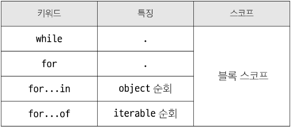

# JavaScript - Basic Syntax

<div style="text-align: right"> 24. 04. 17. </div>

## 1. 변수

* JavaScript 문법 학습

    * ECMAScript 2015 (ES6) 이후의 명제를 따름

### 1. 변수 선언 키워드

* 식별자 (변수명) 작성 규칙

    * 반드시 문자, 달러 ('$') 또는 밑줄 ('_')로 시작

    * 대소문자를 구분, 예약어 사용 불가 (for, if, function 등)

* 식별자 (변수명) Naming case

    * JavaScript에서는 3가지 case를 활용

    * 카멜 케이스 camelCase - 변수, 객체, 함수에 사용

    * 파스칼 케이스 PascalCase - 클래스, 생성자에 사용

    * 대문자 스네이크 케이스 SNAKE_CASE - 상수 (constants)에 사용

* 변수 선언 키워드 3가지

    1. let

        * *블록 스코프 (block scope → 중괄호)*를 갖는 지역 변수를 선언

        * 재할당 가능, 재선언 불가능

        * ES6에서 추가

            ```JS
            let number = 10 // 1. 선언 및 초기값 할당
            number = 20 // 2. 재할당 가능
            ```
            
            ```JS
            let number = 10 // 1. 선언 및 초기값 할당
            let number = 20 // 2. 재선언 불가능
            ```

    2. const

        * *블록 스코프*를 갖는 지역 변수를 선언

        * 재할당 불가능, 재선언 불가능

        * ES6에서 추가

            ```JS
            const number = 10 // 1. 선언 및 초기값 할당
            number = 10 // 2. 재할당 불가능
            ```

            ```JS
            const number = 10 // 1. 선언 및 초기값 할당
            const number = 20 // 2. 재선언 불가능
            ```

            ```JS
            const number  // const' declarations must be initialized. (선언 시 반드시 초기값 설정 필요)
            ```

    3. var - ## 0. 참고 부분 참고

    * 어떤 변수 선언 키워드를 사용해야 할까? → 유지 / 보수의 입장에서 고려 필요

        * 기본적으로 const 사용을 권장

        * 재할당이 필요하다면 그때 let으로 변경해서 사용

    * 블록 스코프 (block scope)

        * if, for, 함수 등의 '중괄호 내부'를 가리킴

        * 블록 스코프를 갖는 변수는 블록 바깥에서 접근 불가능

            ```JS
            let x = 1

            if (x == 1) {
                // block scope
                let x = 2
                console.log(x)  // 2
            }
            console.log(x)  // 1
            ```

## 2. 데이터 타입

### 1. 데이터 타입

* 원시 자료형 (Primitive type) : 변수에 값이 직접 저장되는 자료형 (불변, 값이 복사)

    * Number, String, Boolean, null, undefined

        ```JS
        const bar = 'bar'
        console.log(bar)    // bar

        bar.toUpperCase()   // toUpperCase() method는 값을 변경하지 않고 반환만 하는 것
        console.log(bar)    // bar
        ```

        ```JS
        let a = 10
        let b = a   // a가 바라보고 있는 주소가 아닌 값을 b에 할당
        b = 20
        console.log(a)  // 10
        console.log(b)  // 20
        ```

* 참조 자료형 (Reference type) : 객체의 메모리 주소가 저장되는 자료형 (가변, 주소가 복사)

    * 객체를 생성하면 객체의 메모리 주소를 변수에 할당

    * Objects (Object, Array, Function)

        ```JS
        const obj1 = { name: 'Alice', age: 30 }
        const obj2 = obj1
        obj2.age = 40

        console.log(obj1.age)   // 40
        console.log(obj2.age)   // 40
        ```

### 2. 원시 자료형

* 원시 자료형 종류

    | Type | Description |
    | :---: | :--- |
    | Number | **정수 또는 실수형** 숫자를 묶어 표현하는 자료형 |
    | String | 텍스트 데이터를 표현하는 자료형<br>'+' 연산자를 사용해 문자열끼리 결합<br>뺄셈, 곱셈, 나눗셈 불가능 |
    | null | 변수의 값이 없음을 의도적으로 표현할 때 사용 |
    | undefined | 변수 선언 이후 직접 값을 할당하지 않으면 자동으로 할당됨 |
    | Boolean | 조건문 / 반복문에서 Boolean이 아닌 데이터 타입은 "자동 형변환 규칙"에 따라 true 또는 false로 반환됨 |
    | |

* Template literals (템플릿 리터럴)

    * 내장된 표현식을 허용하는 문자열 작성 방식

    * backtick(``)을 이용해며, 여러 줄에 걸쳐 문자열을 정의할 수도 있고, JavaScript의 변수를 문자열 안에 바로 연결할 수 있음

    * 표현식은 '\$'와 중괄호 (${expression})로 표기

    * ES6+ 부터 지원

        ```JS
        // Template literals → Python의 f-string과 유사

        const age = 100
        const message = `홍길동은 ${age}세입니다.`
        console.log(message)    // 홍길동은 100세입니다.
        ```

* '값이 없음'에 대한 표현이 null / undefined 2가지인 이유

    * "JavaScript의 설계 실수"

    * null이 원시 자료형임에도 불구하고 object로 출력되지 않는 이유는, JavaScript 설계 당시의 버그를 해결하지 않은 것

        * 해결하지 못하는 이유는 이미 null type에 의존성을 띄고 있는 수많은 프로그램들이 망가질 수 있기 때문 (하위호환 유지)

        ```JS
        typeof null // "object"
        typeof undefined    // "undefined"
        ```

* 자동 형변환

    | data type | false | true |
    | :---: | :---: | :---: |
    | undefined | 항상 false | X |
    | null | 항상 false | X |
    | Number | 0, -0, NaN | 나머지 모든 경우 |
    | String | \'\' (빈 문자열) | 나머지 모든 경우 |
    | |

    ```JS
    // Number 예시
    const a = 13
    const b = -5
    const c = 3.14  // float - 숫자 표현
    const d = 2.998e8   // 2.998 * 10^8 = 299,800,000
    const e = Infinity
    const f = -Infinity
    const g = NaN   // Not a Number를 나타내는 값
    ```

    ```JS
    // String 예시
    // '+' 연산자를 사용해 문자열끼리 결합

    const firstName = 'Tony'
    const lastName = 'Stark'
    const fullName = firstName + lastName

    console.log(fullName)   //TonyStark
    ```

    ```JS
    // null & undefined
    // null : 개발자가 직접 의도적으로 변수의 값이 없음을 표현
    let a = null
    console.log(a)  // null

    // 변수가 없을 시 JS가 자동으로 할당
    let b
    console.log(b)  // undefined
    ```

## 3. 연산자

* 할당 연산자

    * 오른쪽에 있는 피연산자의 평가 결과를 왼쪽 피연산자에 할당하는 연산자

    * 단축 연산자 지원

        ```JS
        let a = 0

        a += 10
        console.log(a)  // 10

        a -= 3
        console.log(a)  // 7

        a *= 10
        console.log(a)  // 70

        a %= 7
        console.log(a)  // 0
        ```

* 증가 & 감소 연산자

    * 증가 연산자 ++ : 피연산자를 증가(1을 더함)시키고 연산자의 위치에 따라 증가하기 전이나 후의 값을 반환

    * 감소 연산자 -- : 피연산자를 감소(1을 뺌)시키고 연산자의 위치에 따라 감소하기 전이나 후의 값을 반환

    * += 또는 -=와 같이 더 명시적인 표현으로 작성하는 것을 권장

        ```JS
        let x = 3
        const y = x++
        console.log(x, y)   // 4 3

        let a = 3
        const b = ++a
        console.log(a, b)   // 4 4
        ```

* 비교 연산자 : 피연산자들 (숫자, 문자, Boolean 등)을 비교하고 결과값을 boolean으로 반환하는 연산자

        ```JS
        3 > 2   // true
        3 < 2   // false

        'A' < 'B'   // true
        'Z' < 'a'   // true
        '가' < '나' // true
        ```

* 동등 연산자 (==) : 두 피연산자가 같은 값으로 평가되는지 비교 후 boolean 값을 반환

    * "암묵적 타입 변환"을 통해 타입을 일치시킨 후 같은 값인지 비교

    * 두 피연산자가 모두 객체일 경우 메모리의 같은 객체를 바라보는지 판별

        ```JS
        console.log(1 == 1) // true
        console.log('hello' == 'hello') // true
        console.log('1' == 1)   // true
        console.log(0 == false) // true
        ```

* 일치 연산자 (===)

    * 두 피연산자의 값과 **타입**이 모두 같은 경우 true를 반환

    * 같은 객체를 가리키거나, 같은 타입이면서 같은 값인지를 비교

    * 엄격한 비교가 이뤄지며, 암묵적 타입 변환이 발생하지 않음

    * 특수한 경우를 제외하고는 동등 연산자가 아닌 **일치 연산자 사용 권장**

        * 특수한 경우 : null과 undefined를 확인할 때

        ```JS
        console.log(1 == 1) // true
        console.log('hello' === 'hello') // true
        console.log('1' === 1)   // false
        console.log(0 === false) // false
        ```

* 논리 연산자

    * and 연산 &&

    * or 연산 ||

    * not 연산 !

    * 단축 평가 지원 (앞쪽의 연산에서 결과가 결정나면 이후의 연산을 하지 않음)

        ```JS
        true && true    // true
        true && false   // false

        false || true   // true
        false || false  // false

        !true   // false

        1 && 0  // 0
        0 && 1  // 0
        4 && 7  // 7
        1 || 0  // 1
        0 || 1  // 1
        4 || 7  // 4
        ```

## 4. 조건문

* if : 조건 표현식의 결과값을 boolean type으로 변환 후 참 / 거짓을 판단

    ```JS
    // if-statement.html

    const name = 'customer'

    if (name == 'admin') {
        console.log('관리자님 환영해요')
    } else if (name == 'customer') {
        console.log('고객님 환영해요')
    } else {
        console.log(`반갑습니다. ${name}님`)
    }
    ```

* 삼항 연산자

    ```JS
    condition ? expression1 : expression2
    ```

    * condition : 평가할 조건, true / false로 평가

    * expression1 : 조건이 true일 경우 반환할 값 또는 표현식

    * expression2 : 조건이 false일 경우 반환할 값 또는 표현식

        ```JS
        // 간단한 조건부 로직을 간결하게 표현할 때 유용
        // 복잡한 로직이나 대다수의 경우 가독성이 떨어질 수 있으므로, 적절한 상황에서만 사용하는 것을 권장

        const age = 20
        const message = (age >= 18) ? '성인' : '미성년자'

        console.log(message)    // '성인'
        ```

## 5. 반복문

### 1. 반복문

* 반복문 종류

    1. while : 조건문이 참이면 문장을 계속해서 수행

        ```JS
        while (condition) {
            // do something
        }
        ```

        ```JS
        let i = 0
        
        while (i < 6) {
            console.log(i)
            i++
        }
        ```

    2. for : 특정한 조건이 거짓을 판별될 때까지 반복

        ```JS
        for ([초기문]; [조건문]; [증감문]) {
            // do something
        }
        ```

        ```JS
        for (let i = 0; i < 6; i++) {
            console.log(i)
        }
        ```

    3. for...in : 객체의 열거 가능한 속성(property → Python의 key)에 대해 반복

        ```JS
        for (variable in object) {
            statement
        }
        ```

        ```JS
        const object = { a: 'apple', b: 'banana' }

        for (const property in object) {
            console.log(property)   // a, b
            console.log(object[property])   // apple, banana
        }
        ```

    4. for...of : 반복 가능한 객체(배열, 문자열 등)에 대해 반복

        ```JS
        for (variable of iterable) {
            statement
        }
        ```

        ```JS
        const numbers = [0, 1, 2, 3]

        for (const number of numbers) {
            console.log(number) // 0, 1, 2, 3
        }
        ```

### 2. 반복문 정리

* for...in과 for...of 비교 (배열과 객체)

    ```JS
    // for...in
    // Array
    const arr = ['a', 'b', 'c']
    for (const elem in arr) {
        console.log(elem)   // 0 1 2 : index 출력 (열거 가능한 속성)
    }
    // 배열도 결국 객체로 구성된 것이기 때문에 동작
    // arr = { 0: 'a', 1: 'b', 2: 'c', }

    // Object
    const capitals = {
        korea: '서울',
        japan: '도쿄',
        china: '베이징',
    }
    for (const capital in capitals) {
        console.log(capital)    // korea japan china
    }

    // for...in은 객체(Object)를 위한 방법
    // 반복되는 것의 순서가 보장될 때 사용
    ```

    ```JS
    // for...of
    // Array
    const arr = ['a', 'b', 'c']
    for (const elem of arr) {
        console.log(elem)   // a b c
    }

    // Object
    const capitals = {
        korea: '서울',
        japan: '도쿄',
        china: '베이징',
    }
    for (const capital of capitals) {
        console.log(capital)
        // TypeError: capitals is not iterable
    }

    // 객체는 for...of가 작동하지 않음 → 반복되는 것의 순서가 보장되지 않기 때문
    ```

    * 객체 관점에서 배열의 index는 정수 이름을 가진 열거 가능한 속성

    * for...in은 정수가 아닌 이름과 속성을 포함하여 열거 가능한 모든 **속성**을 반환

    * 내부적으로 for...in은 배열의 반복자가 아닌 **속성 열거**를 사용하기 때문에, **특정 순서**에 따라 인덱스를 반환하는 것을 **보장할 수 없음**

    * for...in은 인덱스의 순서가 중요한 **배열에서는 사용하지 않음**

    * **배열에서는 for문, for...of를 사용**

* 반복문 사용 시 const 사용 여부

    * for문

        * for (let i = 0; i < arr.length; i++) { ... }의 경우, 최초 정의한 i를 **재할당**하면서 사용하기 때문에 **const를 사용하면 Error 발생**

    * for...in, for...of

        * 재할당이 아니라, 매 반복마다 다른 속성 이름이 변수에 지정되는 것이므로 **const를 사용해도 Error가 발생하지 않음**

        * 단, const 특징에 따라 블록 내부에서 변수를 수정할 수 없음

* 반복문 종합

    

## 0. 참고

* 세미콜론 (semicolon)

    * JS는 문장 마지막 세미콜론(';')을 선택적으로 사용 가능

    * 세미콜론이 없으면 ASI에 의해 자동으로 세미콜론이 삽입됨

        * ASI (Automatic Semicolon Insertion, 자동 세미콜론 삽입 규칙)

    * JavaScript를 만든 Brendan Eich 또한 세미콜론 작성을 반대

* 변수 선언 키워드 - 'var'

    * ES6 이전에 변수 선언에 사용했던 키워드

    * 재할당 가능 & 재선언 가능

    * 함수 스코프 (function scope)를 가짐

    * "호이스팅"되는 특성으로 인해 예기치 못한 문제 발생 가능

        * 따라서 ES6 이후부터는 var 대신 const와 let을 사용하는 것을 권장

    * 변수 선언 시 var, const, let 키워드 중 하나를 사용하지 않으면 자동으로 var 선언됨

* 함수 스코프 (function scope)

    * 함수의 중괄호 내부를 가리킴

    * 함수 스코프를 가지는 변수는 함수 바깥에서 접근 불가능

        ```JS
        function foo() {
            var x = 1
            console.log(x)  // 1
        }

        console.log(x)  // ReferenceError: x is not defined
        ```

* 호이스팅 (hoisting)

    * 변수를 선언 이전에 참조할 수 있는 현상

    * 변수 선언 이전의 위치에서 접근 시 undefined를 반환

        ```JS
        console.log(name)   // undefined → 선언 이전에 참조
        var name = '홍길동' // 선언

        // 위 코드를 암묵적으로 아래와 같이 이해함
        var name    // undefined로 초기화
        console.log(name)

        var name = '홍길동'
        ```

    * JavaScript에서 변수들은 실제 실행 시에 코드의 최상단으로 끌어올려지게 되며 (hoisted), 이러한 이유 때문에 var로 선언된 변수는 선언 시에 undefined로 값이 초기화되는 과정이 동시에 발생

        ```JS
        console.log(name)   // undefined
        var name = '홍길동'

        console.log(age)    // ReferenceError: Cannot access 'age' before initialization
        let age = 30

        console.log(height) // ReferengeError: Cannot access 'height' before initialization
        const height = 170
        ```

* NaN을 반환하는 경우 예시

    1. 숫자로서 읽을 수 없음 (Number(undefined))

    2. 결과가 허수인 수학 계산식 (Math.sqrt(-1))

    3. 피연산자가 NaN (7 ** NaN)

    4. 정의할 수 없는 계산식 (0 * Infinity)

    5. 문자열을 포함하면서 덧셈이 아닌 계산식 ('가' / 3)


<script type="text/javascript" src="http://cdn.mathjax.org/mathjax/latest/MathJax.js?config=TeX-AMS-MML_HTMLorMML"></script>
<script type="text/x-mathjax-config">
  MathJax.Hub.Config({
    tex2jax: {inlineMath: [['$', '$']]},
    messageStyle: "none",
    "HTML-CSS": { availableFonts: "TeX", preferredFont: "TeX" },
  });
</script>