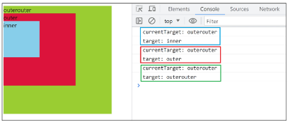

# JavaScript - Event

<div style="text-align: right"> 24. 04. 22. </div>

## 1. 이벤트

### 1. 이벤트 객체

* 웹에서의 이벤트 - 웹에서의 모든 동작은 **이벤트 발생과 함께 한다.**

    * 화면을 스크롤하는 것

    * 버튼을 클릭했을 때 팝업 창이 출력되는 것

    * 마우스 커서의 위치에 따라 드래그 & 드롭하는 것

    * 사용자의 키보드 입력 값에 따라 새로운 요소를 생성하는 것

* 이벤트 (event) : 무언가 일어났다는 신호, 사건

    * 모든 DOM 요소는 이러한 event를 만들어냄

* **event object** : DOM에서 이벤트가 발생해을 때 생성되는 객체

    * 이벤트 종류 - mouse, input, keyboard, touch, ...

* **DOM 요소는 event를 받고, 받은 event를 '처리'(→ event handler, 이벤트 처리기)할 수 있음**

### 2. Event handler

* 이벤트가 발생했을 때 실행되는 함수

    * 사용자의 행동에 어떻게 반응할지를 JavaScript 코드로 표현한 것

* **.addEventListener()** : 특정 이벤트를 DOM 요소가 수신할 때마다 콜백 함수를 호출

    * <span style='color: red'>EventTarget</span>.addEvenListener(<span style='color: green'>type</span>, <span style='color: blue'>handler</span>)

        * <span style='color: red'>DOM요소</span>.addEventListener(<span style='color: green'>수신할 이벤트</span>, <span style='color: blue'>콜백 함수</span>)

        * <span style='color: red'>대상</span>에 <span style='color: green'>특정 이벤트</span>가 발생하면, <span style='color: blue'>지정한 이벤트를 받아 할 일</span>을 등록한다.

    * .addEventListener()의 콜백 함수 특징

        * 발생한 이벤트를 나타내는 **event 객체를 유일한 매개변수로 받음**

            ```JS
            // function (event)
            // event를 입력하지 않아도 자동으로첫 번째 인자로 넘겨줌
            obj.addEventListener('event', function (event) {
                ...
            })
            ```

        * 반환값 없음

    * .addEventListener() 활용 - "버튼을 클릭하면 버튼 요소 출력하기"

        * 버튼에 이벤트 처리기를 부착하여, 클릭 이벤트가 발생하면 이벤트가 발생한 버튼 정보를 출력

        * 요소에 .addEventListener()를 부착하게 되면 내부의 this 값은 대상 요소를 가리키게 됨 (event 객체의 currentTarget 속성 값과 동일)

            ```HTML
            <button id='btn'>버튼</button>
            ```

            ```JS
            // 1. 버튼 선택
            const btn = document.querySelector('#btn')


            // 2. 콜백 함수
            const detectClick = function (event) {
                console.log(event)  // PointerEvent
                console.log(event.currentTarget)  // <button id="btn">버튼</button>
                console.log(this) // <button id="btn">버튼</button>
            }

            // 3. 버튼에 이벤트 핸들러를 부착
            btn.addEventListener('click', detectClick)
            ```

### 3. 버블링

* form > div > p 형태의 중첩된 구조에 각각 이벤트 핸들러가 있을 때, 만약 p 요소를 클릭하면 어떻게 될까?

    ```HTML
    <form id='form'>
        form
        <div id='div'>
            div
            <p id='p'>p</p>
        </div>
    </form>
    ```

    ```JS
    const formElement = document.querySelector('#form')
    const divElement = document.querySelector('#div')
    const pElement = document.querySelector('#p')

    const clickHandler1 = function (event) {
        console.log('form이 클릭되었습니다.')
    }
    const clickHandler2 = function (event) {
        console.log('div가 클릭되었습니다.')
    }
    const clickHandler3 = function (event) {
        console.log('p가 클릭되었습니다.')
    }

    formElement.addEventListener('click', clickHandler1)
    divElement.addEventListener('click', clickHandler2)
    pElement.addEventListener('click', clickHandler3)
    ```

    * p 요소만 클릭했는데도 불구하고 모든 핸들러(p, div, form)가 동작함

* 버블링 (Bubbling)

    * 한 요소에 이벤트가 발생하면, 이 요소에 할당된 핸들러가 동작하고, 이어서 부모 요소의 핸들러가 동작하는 현상

    * 가장 최상단의 조상 요소(document)를 만날 때까지 이 과정이 반복되면서, 요소 각각에 할당된 핸들러가 동작

    * 이벤트가 제일 깊은 곳에 있는 요소에서 시작해 부모 요소를 거슬러 올라가며 발생하는 것이 마치 물속 거품과 닮았기 때문

    * 가장 안쪽의 p 요소를 클릭하면 p → div → form 순서로 3개의 이벤트 핸들러가 모두 동작했던 것

* 이벤트가 정확히 어디에서 발생했는지 접근할 수 있는 방법 - target & currentTarget

    | Attribute | Description |
    | :---: | :--- |
    | currentTarget 속성 | '현재' 요소<br>항상 이벤트 핸들러가 연결된 요소만을 참조하는 속성<br>'this'와 같음 |
    | target 속성 | 이벤트가 발생한 가장 안쪽의 요소(target)를 참조하는 속성<br>실제 이벤트가 시작된 요소<br>버블링이 진행되어도 변하지 않음 |
    | |

* 'target' & 'currentTarget' 예시

    ```HTML
    ...
    <style>
    #outerouter {
        width: 300px;
        height: 300px;
        background-color: yellowgreen;
    }

    #outer {
        width: 200px;
        height: 200px;
        background-color: crimson;
    }

    #inner {
        width: 100px;
        height: 100px;
        background-color: skyblue;
    }
    </style>
    ...

    <div id="outerouter">
        outerouter
        <div id="outer">
            outer
            <div id="inner">inner</div>
        </div>
    </div>
    ```

    ```JS
    const outerOuterElement = document.querySelector('#outerouter')
    const outerElement = document.querySelector('#outer')
    const innerElement = document.querySelector('#inner')

    const clickHandler = function (event) {
        console.log('currentTarget:', event.currentTarget.id)
        console.log('target:', event.target.id)
    }

    outerOuterElement.addEventListener('click', clickHandler)
    ```

    * 세 요소 중 가장 최상위 요소인 outerouter 요소에만 핸들러 부착

    * 각 요소를 클릭했을 때 event의 target과 currentTarget 차이 비교

        

        * 'currentTarget': 핸들러가 연결된 outerouter 요소만 가리킴

        * 'target': 실제 이벤트가 발생하는 요소를 가리킴

        * 핸들러는 outerouter에만 할당되어 있지만, 하위 요소 outer와 inner를 클릭해도 해당 핸들러가 동작함

        * 클릭 이벤트가 어디서 발생했든 상관없이 outerouter까지 이벤트가 버블링되어 핸들러를 실행시키기 때문

* 버블링이 필요한 이유

    * 만약 다음과 같이 각자 다른 동작을 수행하는 버튼이 여러 개가 있다고 가정

    * 그렇다면 각 버튼마다 서로 다른 이벤트 핸들러를 할당해야 할까? → 각 버튼의 *공통 조상인 div 요소에 이벤트 핸들러 단 하나만 할당*하기

        ```HTML
        <div>
            <button></button>
            <button></button>
            ...
            <button></button>
            <button></button>
        </div>
        ```

    * 요소의 공통 조상에 이벤트 핸들러를 단 하나만 할당하면 여러 요소를 한꺼번에 다룰 수 있음

    * 공통 조상에 할당한 핸들러에서 event.target을 이용하면 실제 어떤 버튼에서 이벤트가 발생했는지 알 수 있기 때문

        ```JS
        // 예시

        const divTag = document.querySelector('div')

        divTag.addEventListener('click', function (event) {
            console.log(event.target)
        })
        ```

## 2. Event handler 활용

1. 버튼을 클릭하면 숫자를 1씩 증가해서 출력하기

    ```HTML
    <body>
        <button id="btn">버튼</button>
        <p>클릭횟수 : <span id="counter">0</span></p>

        <script>
            // 1. 버튼 선택
            const btn = document.querySelector('#btn')

            // 2. 이벤트 핸들러 부착
            btn.addEventListener('click', function (event) {
              
                // 2.1. 카운트할 요소 선택
                const spanTag = document.querySelector('#counter')

                // 2.2. 카운트할 요소를 직접 변화
                spanTag.textContent++
          })
        </script>
    </body>
    ```

2. 사용자의 입력값을 실시간으로 출력하기

    * 어떤 이벤트를 감지할 것인가? → 'input' event

    * 그대로 실시간으로 출력? → p tag에 입력된 값을 console에 자동으로 출력

    ```HTML
    <body>
      <input type="text" id="text-input">
      <p></p>

      <script>
        // 1. input tag 선택
        const inputTag = document.querySelector('#text-input')

        // 2. callback 함수 작성 : input tag에 input event가 발생할 때마다 실행되는 코드
        const inputHandler = function (event) {
            // 3.1. 입력한 사용자 데이터가 어디에 있는지 찾기
            console.log(event.currentTarget.value)
            // console.log(event.target.value)
            // console.log(this.value)

            // 3.2. 사용자 입력 데이터를 <p> tag에 저장
            const pTag = document.querySelector('p')
            pTag.textContent = event.currentTarget.value
        }

        // 3. 선택한 input tag에 event handler 부착
        inputTag.addEventListener('input', inputHandler)
      </script>
    </body>
    ```

    * currentTarget 주의사항

        * console.log()로 event 객체를 출력할 경우, currentTarget 키의 값은 null을 가짐

        * currentTarget은 이벤트가 처리되는 동안에만 사용할 수 있기 때문

        * 대신 console.log(event.currentTarget)을 사용해 콘솔에서 확인 가능

        * currentTarget 이후의 속성 값들은 **'target'을 참고해서 사용하기**

3. 사용자의 입력값을 실시간으로 출력, '+' 버튼을 클릭하면 출력한 값의 CSS 스타일을 변경하기

    ```HTML
    <body>
        <h1></h1>
        <button id="btn">클릭</button>
        <input type="text" id="text-input">

        <script>
            // 1. input, h1 및 버튼 태그 선택
            const inputTag = document.querySelector('#text-input')
            const h1Tag = document.querySelector('h1')
            const btn = document.querySelector('#btn')

            // 2. input event에 반응하는 callback 함수 작성
            const inputHandler = function (event) {
                h1Tag.textContent = event.currentTarget.value
            }
            // 3. addEventListener를 inputTag에 입력
            inputTag.addEventListener('input', inputHandler)

            // 4. click 시 style 적용 구현
            const clickHandler = function (event) {
                // 4.1. add
                h1Tag.classList.add('blue')

                // 4.2. toggle
                h1Tag.classList.toggle('blue')

                // 4.3. if 방법
                if (h1Tag.classList.value) {
                    h1Tag.classList.remove('blue')
                } else {
                    h1Tag.classList.add('blue')
                }
            }
            // 5. addEventListener를 btn에 입력
            btn.addEventListener('click', clickHandler)

        </script>
    </body>    
    ```

4. todo 프로그램 구현

    ```HTML
    <body>
        <input type="text" class="input-text">
        <button id="btn">+</button>
        <ul></ul>

        <script>
            // 1. 필요한 tag를 모두 선택
            const inputTag = document.querySelector('.input-text')
            const btn = document.querySelector('#btn')
            const ulTag = document.querySelector('ul')

            const addTodo = function (event) {
                // 2.1. 사용자 입력 데이터 저장
                const inputData = inputTag.value

                // 추가 기능 : 빈 문자열 입력 방지, 입력이 없을 경우 경고 대화상자를 띄움
                // trim() : 문자열 양 끝에서 공백을 제거한 새로운 문자열을 반환하는 함수
                if (inputData.trim()) {
                    // 2.2. 데이터를 저장할 li 요소 생성
                    const liTag = document.createElement('li')
            
                    // 2.3. li 요소에 데이터 입력
                    liTag.textContent = inputData
            
                    // 2.4. li 요소를 부모 ul 요소의 자식 요소로 추가
                    ulTag.appendChild(liTag)

                    // 2.5. appendChild 이후 입력창 비우기
                    inputTag.value = ''
                } else {
                    // 팝업창 띄우기
                    // window 없이 alert('...')만 입력해도 됨
                    window.alert('할 일을 입력하세요..')
                }

            }
            btn.addEventListener('click', addTodo)
        </script>
    </body> 
    ```

5. 로또 번호 생성기 구현

    * 1 ~ 45까지, 겹치지 않는 숫자 생성

    * JavaScript에서는 Python의 random 함수와 같은 강력한 함수 관련 기능을 제공하지 않음

    * [Lodash](https://lodash.com/) : 모듈성, 성능 및 추가 기능을 제공하는 JavaScript 유틸리티 라이브러리로, array, object 등 자료구조를 다룰 때 사용하는 유용하고 간편한 함수들을 제공

    ```HTML
    <body>
        <h1>로또 추천 번호</h1>
        <button id="btn">행운 번호 받기</button>
        <div></div>

        <!-- Lodash CDN을 입력 -->
        <script src="https://cdn.jsdelivr.net/npm/lodash@4.17.21/lodash.min.js"></script>
        <script>
            // 1. 필요한 요소 선택
            const h1Tag = document.querySelector('h1')
            const btn = document.querySelector('#btn')
            const divTag = document.querySelector('div')

            // 2. 로또 번호를 생성하는 함수
            const getLottery = function (event) {
                // 2.1. 1 ~ 45까지의 값이 필요
                const numbers = _.range(1, 46)

                // 2.2. 45개의 요소가 있는 배열에서 6개 번호 추출
                const sixNumbers = _.sampleSize(numbers, 6)

                // 2.3. 6개의 li 요소를 담을 ul 요소 생성
                const ulTag = document.createElement('ul')

                // 2.4. 추출한 6개 번호 배열을 "반복"하면서 li 요소 생성
                sixNumbers.forEach( (number) => {
                    // 번호를 담을 li 요소 생성 후 입력
                    const liTag = document.createElement('li')
                    liTag.textContent = number

                    // 생성한 liTag를 ulTag에 추가
                    ulTag.appendChild(liTag)
                })
                // liTag들이 포함된 ulTag를 div에 추가
                divTag.appendChild(ulTag)
            }
            // 3. btn에 작성한 callback 함수를 addEventListener를 통해 입력
            btn.addEventListener('click', getLottery)

        </script>
    </body>
    ```

## 3. 이벤트 기본 동작 취소

* HTML의 각 요소가 기본적으로 가지고 있는 이벤트가 때로는 방해가 되는 경우가 있어, 이벤트의 기본 동작을 취소할 필요가 있음

    * 예시

        * form 요소의 제출 이벤트를 취소하여 페이지 새로고침을 막을 수 있음

        * a 요소를 클릭할 때 페이지 이동을 막고 추가 로직을 수행할 수 있음

* **.preventDefault()** : 해당 이벤트에 대한 기본 동작을 실행하지 않도록 지정

    ```HTML
    <body>
        <h1>중요한 내용</h1>

        <form id="my-form">
            <input type="text" name="username">
            <button type="submit">Submit</button>
        </form>

        <script>
          
            // 1. copy 이벤트 취소 - 콘텐츠를 복사하는 것을 방지
            const h1Tag = document.querySelector('h1')
            h1Tag.addEventListener('copy', function (event) {
                console.log(event)
                event.preventDefault()
                alert('복사할 수 없습니다.')
            })

            // 2. submit 이벤트 취소
            // form 제출 시 페이지 새로고침 동작 취소 - form 요소의 submit 동작(action 값으로 요청)을 취소시킴
            const formTag = document.querySelector('#my-form')
            const handleSubmit = function (event) {
                event.preventDefault()
            }
            formTag.addEventListener('submit', handleSubmit)

        </script>
    </body>
    ```

## 0. 참고

* addEventListener 에서의 화살표 함수 주의사항

    * 화살표 함수는 자신만의 this를 가지지 않기 때문에, 자신을 포함하고 있는 함수의 this를 상속받음

    * this를 사용해야 하는 경우 addEventListener에서는 일반 함수로 사용하기

        ```JS
        const functionButton = document.querySelector('#function')
        const arrowButton = document.querySelector('#arrow')

        functionButton.addEventListener('click', function () {
            console.log(this) // <button id="function">function</button>
        })

        // 화살표 함수에서 this → global
        arrowButton.addEventListener('click', () => {
            console.log(this) // window
        })
        ```

<script type="text/javascript" src="http://cdn.mathjax.org/mathjax/latest/MathJax.js?config=TeX-AMS-MML_HTMLorMML"></script>
<script type="text/x-mathjax-config">
  MathJax.Hub.Config({
    tex2jax: {inlineMath: [['$', '$']]},
    messageStyle: "none",
    "HTML-CSS": { availableFonts: "TeX", preferredFont: "TeX" },
  });
</script>