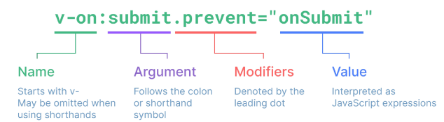

# Vue - Basic Syntax

<div style="text-align: right"> 24. 04. 29. </div>

## 1. Template Syntax - Directive

### 1. Template Syntax

* Template Syntax : DOM을 기본 구성 요소 인스턴스의 데이터에 **선언적으로 바인딩**할 수 있는 HTML 기반 **템플릿 구문**을 사용

    * 선언적으로 바인딩 : Vue Instance와 DOM을 연결

    * 템플릿 구문 : HTML에서 쓸 수 없었던 확장된 문법 제공

* Template Syntax 종류

    1. Text Interpolation

        ```HTML
        <p>Message: {{ msg }}</p>
        ```

        * 데이터 바인딩의 가장 기본적인 형태

        * 이중 중괄호 구문(콧수염 구문)을 사용

        * 콧수염 구문은 해당 구성 요소 인스턴스의 msg 속성 값으로 대체

        * msg 속성이 변경될 때마다 업데이트됨

    2. Raw HTML

        ```JS
        const rawHTML = ref('<span style="color: red">This should be red.</span>')
        ```

        ```HTML
        <div v-html="rawHtml"></div>
        ```

        * HTML 구문 자체를 그대로 출력하는 방법

        * 콧수염 구문은 데이터를 일반 텍스트로 해석하기 때문에, 실제 HTML을 출력하려면 v-html을 사용해야 함

    3. Attribute Bindings

        ```JS
        const dynamicId = ref('my-id')
        ```

        ```HTML
        <div v-bind:id="dynamicId"></div>
        ```

        * 콧수염 구문은 HTML 속성 내에서 사용할 수 없기 때문에 v-bind 사용

        * HTML의 id 속성 값을 vue의 dynamicId 속성과 동기화되도록 함

        * 바인딩 값이 null이거나 undefined인 경우 렌더링 요소에서 제거됨

    4. JavaScript Expressions

        ```HTML
        {{ number + 1 }}

        {{ ok? 'YES' : 'NO' }}

        {{ message.split('').reverse().join('') }}

        <div :id="`list=${id}`"></div>
        ```

        * Vue는 모든 데이터 바인딩 내에서 JavaScript 표현식의 모든 기능을 지원

        * Vue 템플릿에서 JavaScript 표현식을 사용할 수 있는 위치

            1. 콧수염 구문 내부

            2. 모든 directive의 속성 값("v-"로 시작하는 특수 속성)

* Expressions 주의사항

    * 각 바인딩에는 하나의 단일 표현식만 포함될 수 있음

        * 표현식은 값으로 평가할 수 있는 코드 조각 (return 뒤에 사용할 수 있는 코드여야 함)

    * 작동하지 않는 경우

        ```HTML
        <!-- 표현식이 아닌 선언식 -->
        {{ const number = 1 }}

        <!-- 제어문은 삼항 표현식을 사용해야 함 -->
        {{ if (ok) { return message } }}
        ```

### 2. Directive

* 'v-' 접두사가 있는 특수 속성

* Directive 특징

    * Directive의 속성 값은 단일 JavaScript 표현식이어야 함 (v-for, v-on 제외)

    * **표현식 값이 변경될 때 DOM에 반응적으로 업데이트를 적용**

        ```HTML
        <p v-if="seen">Hi There</p>
        ```

* Directive 전체 구문

    

    * Name

    * Argument

        * **일부** directive는 directive 뒤에 콜론(":")으로 표시되는 인자를 사용할 수 있음

            ```HTML
            <!-- HTML <a> 요소의 href 속성을 myUrl 값에 바인딩하도록 하는 v-bind의 인자 href -->
            <a v-bind:href="myUrl">Link</a>

            <!-- v-on의 인자 click은 이벤트 수신할 이벤트 이름을 작성 -->
            <button v-on:click="doSomething">Button</button>
            ```

    * Modifiers

        * ".(dot)"로 표현되는 특수 접미사로, directive가 특별한 방식으로 바인딩되어야 함을 나타냄

            ```HTML
            <!-- .prevent는 발생한 이벤트에서 event.preventDefault()를 호출하도록 v-on에 지시하는 modifier -->
            <form @submit.prevent="onSubmit">...</form>
            ```

    * Value : JavaScript의 표현식이 들어가는 부분

        * onSubmit : JavaScript로 쓰여진 함수일 것!

* Built-in Directives

    * v-text, v-show, v-if, v-for, ...

## 2. Dynamically data binding

### 1. v-bind

* 하나 이상의 속성 또는 component data를 표현식에 동적으로 바인딩

* v-bind 사용처

    * 동적인 속성 3가지 - 일반 속성, class 속성, style 속성

    1. Attribute Bindings

        * HTML의 속성 값을 Vue의 상태 속성 값과 동기화되도록 함

        * Dynamic attribute name (동적 인자 이름)

            * 대괄호 ([])로 감싸서 directive argument에 JavaScript 표현식을 사용할 수도 있음

            * JavaScript 표현식에 따라 동적으로 평가된 값이 최종 argument 값으로 사용됨

                * 대괄호 안에 작성하는 이름은 **반드시 소문자로만** 구성 가능 (브라우저가 속성 이름을 소문자로 강제 변환하기 때문)

            ```JS
            const { createApp, ref } = Vue

            const app = createApp({
                setup() {
                    const imageSrc = ref('https://picsum.photos/200')
                    const myUrl = ref('https://www.google.co.kr/')
                    const dynamicattr = ref('title')
                    const dynamicValue = ref('Hello Vue.js')

                    return {
                        imageSrc,
                        myUrl,
                        dynamicattr,
                        dynamicValue,
                    }
                }
            })
            app.mount('#app')
            ```

            ```HTML
            <!-- v-bind -->
            
            <a v-bind:href="myUrl">Move to url</a>
            
            <!-- dynamic attribute name -->
            <!-- v-bind는 많이 사용하기 때문에 축약하여 :으로만 사용 가능하다. -->
            <p :[dynamicattr]="dynamicValue">...</p>
            ```

    2. Class and Style Bindings

        * class와 style은 모두 HTML 속성이므로, 다른 속성과 마찬가지로 v-bind를 사용해 동적으로 문자열 값을 할당할 수 있음

        * Vue는 class 및 style 속성 값을 v-bind로 사용할 때, **객체** 또는 **배열**을 활용해 작성할 수 있도록 함

            * 단순히 문자열 연결을 사용해 이러한 값을 생성하는 것은 번거롭고 오류가 발생하기 쉽기 때문

        * Class & Style Bindings가 가능한 경우

            1. Binding HTML Classes

                * Binding to Objects

                    * 객체를 :class에 전달해 클래스를 동적으로 전환할 수 있음

                        ```JS
                        const isActive = ref(false)
                        ```

                        ```HTML
                        <style>
                            .active {
                                color: crimson;
                            }
                        </style>

                        ...
                        <div :class="{ active: isActive }">Text</div>
                        ```

                    * 객체에 더 많은 필드를 포함하여 여러 클래스를 전환할 수 있음

                        ```JS
                        const isActive = ref(false)
                        const hasInfo = ref(true)
                        ```

                        ```HTML
                        <div class="static" :class="{ active: isActive, 'text-primary': hasInfo }">Text</div>
                        ```

                    * 반드시 inline 방식으로 작성하지 않아도 됨 - 반응형 변수를 활용해 객체를 한번에 작성

                        ```HTML
                        <div class="static" :class="classObj">Text</div>
                        ```

                        ```JS
                        const isActive = ref(false)
                        const hasInfo = ref(true)

                        // ref는 반응 객체의 속성으로 액세스되거나 변경될 때 자동으로 unwrap
                        const classObj = ref({
                            active: isActive,
                            'text-primary': hasInfo,
                        })
                        ```

                * Binding to Arrays

                    * :class를 배열에 바인딩하여 클래스 목록을 적용할 수 있음

                        ```JS
                        const activeClass = ref('active')
                        const infoClass = ref('text-primary')
                        ```

                        ```HTML
                        <div :class="[activeClass, infoClass]">Text</div>
                        ```

                    * 배열 구문 내에서 객체 구문을 사용하는 경우

                        ```HTML
                        <div :class="[{ active: isActive }, infoClass]">Text</div>
                        ```

            2. Binding Inline Styles

                * Binding to Objects

                    * :style은 JavaScript 객체 값에 대한 바인딩을 지원 (HTML style 속성에 해당)

                        ```JS
                        const activeColor = ref('crimson')
                        const fontSize = ref(50)
                        ```

                        ```HTML
                        <div :style="{ color: activeColor, fontSize: fontSize + 'px' }">Text</div>
                        ```

                    * 실제 CSS에서 사용하는 것처럼 :style은 kebab-cased 키 문자열도 지원 (단, camelCase 작성을 권장)
                    
                        ```HTML
                        <div :style="{ 'font-size': fontSize + 'px' }">Text</div>
                        ```

                    * 반드시 inline 방식으로 작성하지 않아도 됨 → 반응형 변수를 활용해 객체를 한번에 작성하는 방법

                        ```JS
                        const styleObj = ref({
                            color: activeColor,
                            fontSize: fontSize.value + 'px',
                        })
                        ```

                        ```HTML
                        <div :style="styleObj">Text</div>
                        ```

                * Binding to Arrays

                    * 여러 스타일 객체를 배열에 작성해서 :style을 바인딩할 수 있음

                    * 작성한 객체는 병합되어 동일한 요소에 적용

                        ```JS
                        const styleObj2 = ref({
                            color: 'blue',
                            border: '1px solid black',
                        })
                        ```

                        ```HTML
                        <div :style="[styleObj, styleObj2]">Text</div>
                        ```

## 3. Event Handling

### 1. v-on

* DOM 요소에 이벤트 리스너를 연결 및 수신

* v-on 구성

    ```HTML
    <div v-on:event="handler"></div>

    <!-- 약어 -->
    <div @event="handler"></div>
    ```

    * handler 종류

        1. Inline handlers : 이벤트가 트리거될때 실행될 JavaScript 코드

        2. Method handlers : 컴포넌트에 정의된 method 이름

1. Inline handlers : 주로 간단한 상황에 사용

    ```JS
    const count = ref(0)
    ```

    ```HTML
    <button @click="count++">Add 1</button>
    <p>Count: {{ count }}</p>
    ```

    * Inline handlers에서의 method 호출

        * method 이름에 직접 바인딩하는 대신 inline handlers에서 method를 호출할 수도 있음 → 이렇게 하면 기본 이벤트 대신 사용자 지정 인자를 전달할 수 있음

        ```JS
        const greeting = function (message) {
          console.log(message)
        }
        ```

        ```HTML
        <button @click="greeting('hello')">Say hello</button>
        <button @click="greeting('bye')">Say bye</button>
        ```

    * Inline Handlers에서 원래 DOM 이벤트에 접근하기

        * $event 변수를 사용해 method에 전달

        ```JS
        // $event는 JavaScript 내부 built-in 함수
        // 함수 정의 시 인자 위치와 관계없이 $event의 인자 위치는 아무 데나 넣어도 됨
        const warning = function (message, event) {
          console.log(message)
          console.log(event)
        }
        ```

        ```HTML
        <button @click="warning('경고입니다.', $event)">Submit</button>
        ```

2. Method handlers : Inline handlers로는 불가능한 대부분의 상황에서 사용

    ```JS
    const name = ref('Alice')
    const myFunc = function (event) {
        console.log(event)
        console.log(event.currentTarget)
        console.log(`Hello ${name.value}!`)
    }
    ```

    ```HTML
    <button @click="myFunc">Hello</button>
    ```

    * Method Handlers는 이를 트리거하는 기본 DOM Event 객체를 자동으로 수신함

* [Event Modifiers](https://vuejs.org/guide/essentials/event-handling.html#event-modifiers)

    * Vue는 v-on에 대한 Event Modifiers를 제공해, event.preventDefault()와 같은 구문을 method에서 작성하지 않도록 함

    * stop, prevent, self 등 다양한 modifiers를 제공

    * method는 DOM event에 대한 처리보다는 데이터에 관한 논리를 작성하는 것에 집중할 것

        ```HTML
        <form @submit.prevent="onSubmit">...</form>
        <a @click.stop.prevent="onLink">...</a>
        ```

        * Modifiers는 chained되게끔 작성할 수 있으며, 이때는 작성된 순서로 실행되기 때문에 작성 순서에 유의

* [Key Modifiers](https://vuejs.org/guide/essentials/event-handling.html#key-modifiers)

    * Vue는 키보드 이벤트를 수신할 때 특정 키에 관한 별도 modifiers를 사용할 수 있음

        ```HTML
        <!-- key가 Enter일 때만 onSubmit 이벤트를 호출하기 -->
        <input @keyup.enter="onSubmit">
        ```

## 4. Form Input Bindings

### 1. Form Input Bindings & v-model

* form을 처리할 때 사용자가 input에 입력하는 값을 실시간으로 JavaScript 상태에 동기화해야 하는 경우 (양방향 바인딩)

* 양방향 바인딩 방법

    1. v-bind와 v-on을 함께 사용

    2. v-model 사용

1. v-bind와 v-on을 함께 사용

    * v-bind를 사용해 input 요소의 value 속성 값을 입력 값으로 사용

    * v-on을 사용해 input event가 발생할 때마다 input 요소의 value 값을 별도 반응형 변수에 저장하는 핸들러를 호출

    ```JS
    const inputText1 = ref('')
    const onInput = function (event) {
        inputText1.value = event.currentTarget.value
    }
    ```

    ```HTML
    <p>{{ inputText1 }}</p>
    <input :value="inputText1" @input="onInput">
    ```

2. **v-model**

    * form input 요소 또는 컴포넌트에서 양방향 바인딩을 만듦

    1. v-model을 사용해 사용자 입력 데이터와 반응형 변수를 실시간 동기화

        ```JS
        const inputText2 = ref('')
        ```

        ```HTML
        <p>{{ inputText2 }}</p>
        <input v-model="inputText2">
        ```

    2. v-model을 사용해 사용자 입력 데이터와 반응형 변수를 실시간 동기화

        * IME가 필요한 언어(한국어, 중국어, 일본어 등)의 경우 v-model이 제대로 업데이트되지 않음

        * 해당 언어에 대해 올바르게 응답하려면 v-bind와 v-on 방법을 사용해야 함

### 2. v-model 활용

* v-model과 다양한 입력(input) 양식

    * v-model은 단순 Text input뿐만 아니라 Checkbox, Radio, Select 등 다양한 타입의 사용자 입력 방식과 함께 사용 가능

* Checkbox 활용

    1. 단일 체크박스와 boolean 값 활용

        ```JS
        const checked = ref(false)
        ```
        
        ```HTML
        <input type="checkbox" id="checkbox" v-model="checked">
        <label for="checkbox">{{ checked }}</label>
        ```

    2. 여러 체크박스와 배열 활용 - 해당 배열에는 현재 선택된 체크박스의 값이 포함됨

        ```JS
        const checkedNames = ref([])
        ```

        ```HTML
        <div>Checked names: {{ checkedNames }}</div>

        <input type="checkbox" id="alice" value="Alice" v-model="checkedNames">
        <label for="alice">Alice</label>

        <input type="checkbox" id="bella" value="Bella" v-model="checkedNames">
        <label for="bella">Bella</label>
        ```

* Select 활용

    * select에서 v-model 표현식의 초기 값이 어떤 option과도 일치하지 않는 경우 select 요소는 "선택되지 않은(unselected)" 상태로 렌더링됨

        ```JS
        const selected = ref('')
        ```

        ```HTML
        <div>Selected: {{ seleted }}</div>

        <select v-model="selected">
            <option disabled value="">Please select one</option>
            <option>Alice</option>
            <option>Bella</option>
            <option>Cathy</option>
        </select>
        ```

## 5. Computed Properties 계산된 속성

### 1. computed()

* computed() : 계산된 속성을 정의하는 함수

    * 미리 계산된 속성을 사용해 템플릿에서 표현식을 단순하게 하고 불필요한 반복 연산을 줄임

    * computed()를 사용하지 않는 경우

        ```JS
        const todos = ref([
            { text: 'Vue 실습' },
            { text: '자격증 공부' },
            { text: 'TIL 작성' },
        ])
        ```

        ```HTML
        <h2>남은 할 일</h2>
        <p>{{ todos.length > 0 ? '아직 남았다' : '퇴근!' }}</p>
        ```

        * 템플릿이 복잡해지며 todos에 따라 계산을 수행하게 됨

        * 만약 이 계산을 템플릿에 여러 번 사용하는 경우에는 반복이 발생

    * computed()를 사용하는 경우

        ```JS
        const { createApp, ref, computed } = Vue

        const restOfTodos = computed( () => {
            return todos.value.length > 0 ? '아직 남았다' : '퇴근!'
        })
        ```

        ```HTML
        <h2>남은 할 일</h2>
        <p>{{ restOfTodos }}
        ```

        * 반응형 데이터를 포함하는 복잡한 로직의 경우 computed를 활용해 미리 값을 계산하여 계산된 값을 사용

* computed() 특징

    * 반환되는 값은 computed ref이며, 일반 refs와 유사하게 **계산된 결과를 .value로 참조할 수 있음** (템플릿에서는 .value 생략 가능)

    * computed 속성은 의존된 반응형 데이터를 <span style="color: red;">자동으로 추적</span>

    * 의존하는 데이터가 변경될 때만 재평가

        * restOfTodos의 계산은 todos에 의존하고 있음 → 따라서 <span style="color: red;">todos가 변경될 때만 restOfTodos가 업데이트됨</span>

### 2. Computed vs. Methods

* computed와 동일한 로직을 처리할 수 있는 method

    ```JS
    const getRestOfTodos = function () {
        return todos.value.length > 0 ? '아직 남았다' : '퇴근!'
    }
    ```

    ```HTML
    <p>{{ getRestOfTodos() }}</p>
    ```

* computed와 method 차이

    * computed 속성은 <span style="color: red;">의존된 반응형 데이터를 기반으로 캐시(cached)</span>된다.

    * 의존하는 데이터가 변경된 경우에만 재평가됨 → 즉, 의존된 반응형 데이터가 변경되지 않는 한 이미 계산된 결과에 대한 여러 참조는 다시 평가할 필요 없이 이전에 계산된 결과를 반환

    * 반면, method 호출은 다시 렌더링이 발생할 때마다 항상 함수를 실행

    * 상황에 따라 적절한 방법을 선택해야 함

    | 방식 | 실행 방식 | 적절한 사용처 |
    | :---: | :---: | :--- |
    | computed | 의존된 데이터가 변경되면 자동으로 업데이트 | 의존하는 데이터에 따라 결과가 바뀌는 계산된 속성을 만들 때 유용<br>동일한 의존성을 가진 여러 곳에서 사용할 때 계산 결과를 캐싱하여 중복 계산 방지 |
    | method | 호출해야만 실행됨 | 단순히 특정 동작을 수행하는 함수를 정의할 때 사용<br>데이터에 의존하는지 여부와 관계없이 항상 동일한 결과를 반환하는 함수 |
    | |

### 3. computed 주의사항

* computed의 반환 값은 의존하는 데이터의 파생된 값

    * 이미 의존하는 데이터에 의해 계산이 완료된 값

    * 일종의 snapshot이며, 의존하는 데이터가 변경될 때만 새 snapshot이 생성됨

* 계산된 값은 읽기 전용으로 취급되어야 하며, 변경되어서는 안됨

* 대신 새 값을 얻기 위해서는 의존하는 데이터를 업데이트해야 함

* computed에서 reverse() 및 sort() 사용 시 원본 배열을 변경하기 때문에, 원본 배열을 복사본을 만들어서 진행해야 함

    ```JS
    // 좋은 예시
    return [...numbers].reverse()

    // 잘못된 예시
    return numbers.reverse()
    ```

## 6. Conditional Rendering

### 1. v-if

* v-if : 표현식 값의 true / false를 기반으로 요소를 조건부로 렌더링

    * 'v-else' directive를 사용해 v-if에 대한 else 블록을 나타낼 수 있음

        ```JS
        const isSeen = ref(true)
        ```

        ```HTML
        <p v-if="isSeen">true일 때 보여요</p>
        <p v-else>false일 때 보여요</p>
        <button @click="isSeen=!isSeen">토글</button>
        ```

    * 'v-else-if' directive를 사용해 v-if에 대한 else if 블록을 나타낼 수 있음

        ```JS
        const name = ref('Cathy')
        ```

        ```HTML
        <div v-if="name === 'Alice'">Alice입니다.</div>
        <div v-else-if="name === 'Bella'">Bella입니다.</div>
        <div v-else-if="name === 'Cathy'">Cathy입니다.</div>
        <div v-else>아무도 아닙니다.</div>
        ```

* 여러 요소에 대한 v-if 적용

    * HTML template 요소에 v-if를 사용해 하나 이상의 요소에 대해 적용할 수 있음 (v-else, v-else-if 모두 적용 가능)

        ```HTML
        <template v-if="name === 'Cathy'">
            <div>Cathy입니다</div>
            <div>나이는 30살입니다</div>
        </template>
        ```

* HTML \<template\> element

    * 페이지가 로드될 때 렌더링되지 않지만, JavaScript를 사용해 나중에 문서에서 사용할 수 있도록 하는 HTML을 보유하기 위한 메커니즘

    * 보이지 않는 wrapper 역할

### 2. v-if vs. v-show

* v-show : 표현식 값의 true / false를 기반으로 요소의 가시성(visibility)을 전환

    * v-show는 항상 DOM에 렌더링되어 있음 - CSS display 속성만 전환하기 때문

        ```JS
        const isShow = ref(false)
        ```
        
        ```HTML
        <div v-show="isShow">v-show</div>
        ```

* v-if와 v-show의 적절한 사용처

    | 명령어 | 설명 |
    | :---: | :--- |
    | v-if<br>Cheap initial load, expensive toggle | 초기 조건이 false인 경우 아무 작업도 수행하지 않음<br>토글 비용이 높음 |
    | v-show<br>Expensivel initial load, cheap toggle | 초기 조건에 관계없이 항상 렌더링<br>초기 렌더링 비용이 더 높음 |
    | |

    * 콘텐츠를 매우 자주 전환해야 하는 경우 v-show를, 실행 중에 조건이 변경되지 않는 경우 v-if를 권장

## 7. List Rendering

### 1. v-for

* v-for : 소스 데이터를 기반으로 요소 또는 템플릿 블록을 여러 번 렌더링

    * 소스 데이터 : Array, Object, Number, String, Iterable

* v-for 구조

    * v-for는 alias in expression 형식의 특수 구문 사용

        ```HTML
        <div v-for="item in items">
            {{ item.text }}
        </div>
        ```

    * index(객체에서는 key)에 대한 별칭 지정 가능

        ```HTML
        <div v-for="(item, index) in arr"></div>

        <div v-for="value in object"></div>
        <div v-for="(value, key) in object"></div>
        <div v-for="(value, key, index) in object"></div>
        ```

    * 예시 - 배열 반복

        ```JS
        const myArr = ref([
            { name: 'Alice', age: 20 },
            { name: 'Bella', age: 21 },
        ])
        ```

        ```HTML
        <div v-for="(item, index) in myArr">
            {{ index }} / {{ item }}
        </div>

        <!-- 0 / { "name": "Alice", "age": 20 } -->
        <!-- 1 / { "name": "Bella", "age": 21 } -->
        ```

    * 예시 - 객체 반복

        ```JS
        const myObj = ref({
            name: 'Cathy',
            age: 30,
        })
        ```

        ```HTML
        <div v-for="(value, key, index) in myObj">
            {{ index }} / {{ key }} / {{ value }}
        </div>

        <!-- 0 / name / Cathy -->
        <!-- 1 / age / 30 -->
        ```

    * 여러 요소에 대한 v-for 적용 : HTML template 요소에 v-for를 사용해 하나 이상의 요소에 대해 반복 렌더링할 수 있음

        ```HTML
        <ul>
            <template v-for="item in myArr">
                <li>{{ item.name }}</li>
                <li>{{ item.age }}</li>
                <hr>
            </template>
        </ul>
        ```

    * 중첩된 v-for (nested v-for) : 각 v-for 범위는 상위 범위에 접근할 수 있음

        ```JS
        const myInfo = ref([
            { name: 'Alice', age: 20, friends: ['Bella', 'Cathy', 'Dan'] },
            { name: 'Bella', age: 21, friends: ['Alice', 'Cathy'] },
        ])
        ```

        ```HTML
        <ul v-for="item in myInfo">
            <li v-for="friend in item.friends">
                {{ item.name }} - {{ friend }}
            </li>
        </ul>

        <!-- Alice - Bella -->
        <!-- Alice - Cathy -->
        <!-- Alice - Dan -->
        <!-- Bella - Alice -->
        <!-- Bella - Cathy -->
        ```

### 2. v-for with key

* 반드시 v-for와 key를 함께 사용한다 : 내부 컴포넌트의 상태를 일관되게 하여 **데이터의 예측 가능한 행동을 유지하기 위함**

    * key는 반드시 각 요소에 대한 <span style="color: red;">고유한 값을 나타낼 수 있는 식별자여야 함</span>

        ```JS
        let id = 0

        const items = ref([
            { id: id++, name: 'Alice' },
            { id: id++, name: 'Bella' },
        ])
        ```

        ```HTML
        <div v-for="item in items" :key="item.id">
            <p>{{ item }}</p>
        </div>

        <!-- { "id": 0, "name": "Alice" } -->
        <!-- { "id": 1, "name": "Bella" } -->
        ```

* 내장 특수 속성 key

    * number 혹은 string으로만 사용해야 함

    * Vue의 내부 가상 DOM 알고리즘이 이전 목록과 새 노드 목록을 비교할 때 각 node를 식별하는 용도로 사용

    * Vue 내부 동작과 관련한 부분이기 때문에 최대한 작성하려고 노력할 것

### 3. v-for with v-if

* 동일 요소에 v-for와 v-if를 함께 사용하지 않는다

    * 동일한 요소에서 v-if가 v-for보다 우선순위가 더 높기 때문

    * v-if에서의 조건은 v-for 범위의 변수에 접근할 수 없음

        ```JS
        let id = 0

        const todos = ref([
          { id: id++, name: '복습', isComplete: true },
          { id: id++, name: '예습', isComplete: false },
          { id: id++, name: '저녁식사', isComplete: true },
          { id: id++, name: '노래방', isComplete: false }
        ])
        ```

        ```HTML
        <!-- [Bad] v-for with v-if -->
        <ul>
        <li v-for="todo in todos" v-if="todo.isComplete === false" :key="todo.id">
            {{ todo.name }}
        </li>
        </ul>        

        <!-- v-if가 더 높은 우선순위를 가지므로, v-for 범위의 todo 데이터를 v-if에서 사용할 수 없음 -->
        <!-- Uncaught TypeError: Cannot read properties of undefined (reading 'isComplete') -->
        ```

* v-for와 v-if 해결법 2가지

    1. <span style="color: red;">computed를 활용해 필터링된 목록을 반환하여, 미리 만들어놓은 목록을 반복</span>하도록 설정

        ```JS
        const completeTodos = computed( () => {
            return todos.value.filter( (todo) => !todo.isComplete)
        })
        ```

        ```HTML
        <!-- [Good 1] v-for with v-if (computed)-->
        <ul>
        <li v-for="todo in completeTodos" :key="todo.id">
            {{ todo.name }}
        </li>
        </ul>
        ```

    2. v-for와 /<templage/> 요소를 사용해 <span style="color: red;">v-if 위치를 이동</span>

        ```HTML
        <!-- [Good 2] v-for with v-if -->
        <ul>
        <template v-for="todo in todos" :key="todo.id">
            <li v-if="!todo.isComplete">
            {{ todo.name }}
            </li>
        </template>
        </ul>
        ```

### 4. v-for 관련 주의사항

* 배열 변경 관련 method : v-for와 배열을 함께 사용 시 배열의 method를 주의해서 사용해야 함

    1. 변화 method : 호출하는 원본 배열을 변경

        * push(), pop(), shift(), unshift(), splice(), sort(), reverse()

    2. 배열 교체 : 원본 배열을 수정하지 않고 항상 새 배열을 반환

        * filter(), concat(), slice()

* v-for와 배열을 활용해 필터링 / 정렬 활용하기 - <span style="color: red;">원본 데이터를 수정하거나 교체하지 않고</span> 필터링하거나 정렬된 새로운 데이터를 표시하는 방법

    1. computed 활용 - 원본 기반으로 필터링된 새로운 결과 생성

        ```JS
        const numbers = ref([1, 2, 3, 4, 5])

        const evenNumbers = computed( () => {
            return numbers.value.filter( (number) => number % 2 === 0)
        })
        ```

        ```HTML
        <li v-for="num in evenNumbers">{{ num }}</li>
        ```

    2. method 활용 - computed가 불가능한 중첩된 v-for의 경우

        ```JS
        const numberSets = ref([
            [1, 2, 3, 4, 5],
            [6, 7, 8, 9, 10],
        ])

        const evenNumbers = function (numbers) {
            return numbers.filter( (number) => number % 2 === 0)
        }
        ```

        ```HTML
        <ul v-for="numbers in numberSets">
            <li v-for="num in evenNumbers(numbers)">{{ num }}</li>
        </ul>
        ```

* 배열의 인덱스를 v-for의 key로 사용하지 말 것

    ```HTML
    <!-- 잘못된 예시 -->
    <div v-for="(item, index) in items" :key="index">
        <!-- content -->
    </div>
    ```

    * 인덱스는 식별자가 아닌 배열의 항목 위치만 나타내기 때문

    * 만약 새 요소가 배열의 끝이 아닌 위치에 삽입되면 이미 반복된 구성 요소 데이터가 함께 업데이트되지 않기 때문

    * 직접 고유한 값을 만들어내는 method를 만들거나, 외부 라이브러리 등을 활용하는 등 식별자 역할을 할 수 있는 값을 만들어 사용해야 함

## 8. Watchers

### 1. watch()

* watch() : 하나 *이상*의 반응형 데이터를 감시하고, 감시하는 데이터가 변경되면 콜백 함수를 호출

    * computed와 유사하나, computed는 어느 *하나*에 의존되어 있음

* watch() 구조

    ```JS
    watch(source, (newValue, oldValue) => {
        // do something
    })
    ```

    * 첫번째 인자 (source) : watch가 감시하는 대상 (반응형 변수, 값을 반환하는 함수 등)

    * 두번째 인자 (callback function) : source가 변경될 때 호출되는 콜백 함수

        1. newValue : 감시하는 대상이 변화된 값

        2. oldValue (optional) : 감시하는 대상의 기존 값

* watch() 기본 동작

    ```HTML
    <button @click="count++">Add 1</button>
    <p>Count: {{ count }}</p>
    ```

    ```JS
    const count = ref(0)

    watch(count, (newValue, oldValue) => {
        console.log(`newValue: ${newValue}, oldValue: ${oldValue}`)
    })

    // newValue: 1, oldValue: 0
    // newValue: 2, oldValue: 1
    // newValue: 3, oldValue: 2
    // newValue: 4, oldValue: 3
    // newValue: 5, oldValue: 4
    // newValue: 6, oldValue: 5
    ```

    * 감시하는 변수에 변화가 생겼을 때 연관 데이터 업데이트하기

        ```JS
        const message = ref('')
        const messageLength = ref(0)

        watch(message, (newValue) => {
          messageLength.value = newValue.length
        })
        ```

        ```HTML
        <input v-model="message">
        <p>Message length: {{ messageLength }}</p>
        ```

    * 여러 source를 감시하는 watch - 배열을 활용

        ```JS
        watch([foo, bar], ([newFoo, newBar], [prevFoo, prevBar]) => {
            /* ... */
        })
        ```

* computed vs. watch

    * 공통점 : 데이터의 변화를 감지하고 처리

        | | Computed | Watchers |
        | :---: | :---: | :---: |
        | 동작 | 의존하는 데이터 속성의 계산된 값을 반환<br>중복된 값을 방지해 계산을 줄이고 싶기 때문 | 특정 데이터 속성의 변화를 감시하고 작업을 수행 (side-effects) |
        | 사용 목적 | 계산한 값을 캐싱하여 재사용<br>중복 계산 방지 | 데이터 변화에 따른 특정 작업 수행 |
        | 사용 예시 | 연산된 길이, 필터링된 목록 계산 등 | DOM 변경, 다른 비동기 작업 수행(**axios를 보내는 등**), 외부 API와 연동 등 |
        | |

        * <span style="color: red;">computed와 watch 모두 의존(감시)하는 원본 데이터를 직접 변경하지 않음</span>

            ```JS
            // Write operation failed: computed value is readonly
            const a = ref(0)
            const b = computed(() => {
            return a.value + 1
            })
            console.log(b.value++)
            ```

## 9. Lifecycle Hook

### 1. Lifecycle Hook

* Lifecycle Hook : Vue instance의 생애주기 동안 특정 시점에 실행되는 함수

    * [Lifecycle Diagram](https://vuejs.org/guide/essentials/lifecycle.html#lifecycle-diagram/) : instance의 생애 주기 중간중간에 함수를 제공해 개발자가 특정 단계에서 원하는 로직을 작성할 수 있도록 함

        

* Lifecycle Hooks 예시

    1. Vue 컴포넌트 인스턴스가 초기 렌더링 및 DOM 요소 생성 완료 후 특정 로직을 수행하기

        ```JS
        const { createApp, ref, onMounted } = Vue

        const app = createApp({
            setup() {
                ...
                onMounted( () => {
                    console.log('mounted')
                })
            }
        })
        ```

        ```JS
        // 초기 페이지 렌더링 시 고양이 사진이 출력되도록 하기
        const { createApp, ref, onMounted } = Vue
            const URL = 'https://api.thecatapi.com/v1/images/search'

            const app = createApp({
            setup() {
                const getCatImage = function () {
                    axios({
                        method: 'get',
                        url: URL,
                    })
                        .then((response) => {
                            imgUrl = response.data[0].url
                            return imgUrl
                        })
                        .then((imgData) => {
                            imgElem = document.createElement('img')
                            imgElem.setAttribute('src', imgData)
                            document.body.appendChild(imgElem)
                        })
                        .catch((error) => {
                            console.log('실패했다옹')
                    })
                }

                onMounted( () => {
                    getCatImage()
                })

                return { getCatImage }
            }
            })

        ```

    2. 반응형 데이터의 변경으로 인해 컴포넌트의 DOM이 업데이트된 후 특정 로직을 수행하기

        ```HTML
        <button @click="count++">Add 1</button>
        <p>Count: {{ count }}</p>
        <p>{{ message }}</p>        
        ```

        ```JS
        const { createApp, ref, onUpdated } = Vue

        const app = createApp({
            setup() {
                const count = ref(0)
                const message = ref(null)

                onUpdated( () => {
                    message.value = 'count가 수정됨!!'
                })
            }
        })
        ```

* Lifecycle Hooks 특징

    * Vue는 Lifecycle Hooks에 등록된 콜백 함수들을 인스턴스와 자동으로 연결함

    * 이렇게 동작하려면 hooks 함수들은 **반드시 동기적으로 작성되어 있어야 함**

    * 인스턴스 생애 주기의 여러 단계에서 호출되는 다른 hooks도 있으며, 가장 일반적으로 사용되는 것은 onMounted, onUpdated, onUnmounted 등

## 10. Vue Style Guide

### 1. Vue Style Guide

* Vue의 스타일 가이드 규칙은 우선순위에 따라 4가지 범주로 나눔

    * [규칙 범주](https://vuejs.org/style-guide/)

        * 우선순위 A : 필수 (Essential)

            * 오류 방지에 도움이 되므로 어떤 경우에도 규칙을 학습하고 준수

            * v-for에 key 작성하기, 동일 요소에 v-if와 v-for 함께 사용하지 않기

        * 우선순위 B : 적극 권장 (Strongly Recommended)

            * 가독성 및/또는 개발자 경험을 향상시킴

            * 규칙을 어겨도 코드는 여전히 실행되겠지만, 정당한 사유가 있어야 규칙을 위반할 수 있음

        * 우선순위 C : 권장 (Recommended)

            * 일관성을 보장하도록 임의의 선택을 할 수 있음

        * 우선순위 D : 주의 필요 (Use with Caution)

            * 잠재적 위험 특성을 고려함

## 0. 참고

* '$' 접두어가 붙은 변수

    * Vue instance 내에서 제공되는 내부 변수

    * 사용자가 지정한 반응형 변수나 method와 구분하기 위함

    * 주로 Vue instance 내부 상태를 다룰 때 사용

* IME (Input Method Editor)

    * 사용자가 입력 장치에서 기본적으로 사용할 수 없는 문자(비영어권 언어)를 입력할 수 있도록 하는 운영 체제 구성 프로그램

    * 일반적으로 키보드 키보다 자모가 더 많은 언어에서 사용해야 함

    * IME가 동작하는 방식과 Vue의 양방향 바인딩(v-model) 동작 방식이 상충하기 때문에 한국어 입력 시 예상대로 동작하지 않았던 것

* Cache (캐시)

    * 데이터나 결과를 일시적으로 저장해두는 임시 저장소

    * 이후에 같은 데이터나 결과를 다시 계산하지 않고 빠르게 접근할 수 있도록 함

    * 예시) 웹 페이지의 캐시 데이터

        * 과거 방문한 적이 있는 페이지에 다시 접속할 경우, 페이지 일부 데이터를 브라우저 캐시에 저장 후 같은 페이지에 다시 요청 시 모든 데이터를 다시 응답받는 것이 아닌, 일부 캐시된 데이터를 사용해 더 빠르게 웹 페이지를 렌더링

<script type="text/javascript" src="http://cdn.mathjax.org/mathjax/latest/MathJax.js?config=TeX-AMS-MML_HTMLorMML"></script>
<script type="text/x-mathjax-config">
  MathJax.Hub.Config({
    tex2jax: {inlineMath: [['$', '$']]},
    messageStyle: "none",
    "HTML-CSS": { availableFonts: "TeX", preferredFont: "TeX" },
  });
</script>