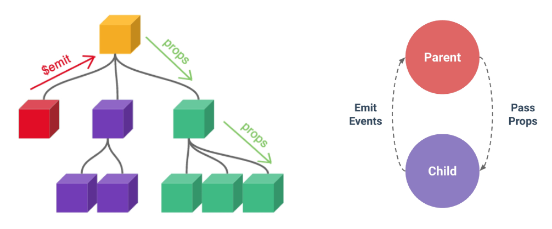
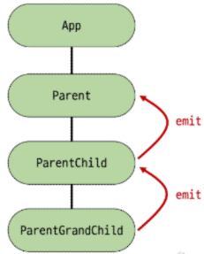

# Vue - Component State Flow

<div style="text-align: right"> 24. 05. 07. </div>

## 1. Passing Props

### 1. Props

* 컴포넌트 : 재사용 가능한 코드 블록

    * 만약 동일한 사진 데이터가 한 화면의 여러 곳에 출력되고 있다면?

        * 페이지 중 해당 사진을 변경해야 할 때 모든 컴포넌트에 대해 변경 요청을 해야 함

        * 한 곳에서 해결하는 방법? "공통된 부모 컴포넌트에서 관리하자."



* 부모는 자식에게 데이터를 전달(Pass Props)하며, 자식은 자신에게 일어난 일을 부모에게 알림(Emit event)

* Props : 부모 컴포넌트로부터 자식 컴포넌트로 데이터를 전달하는 데 사용되는 속성

    * 부모 속성이 업데이트되면 자식으로 전달되지만 그 반대는 안됨
    
        * 즉, 자식 컴포넌트 내부에서 props를 변경하려고 시도해서는 안 되며 불가능

        * 부모 컴포넌트가 업데이트될 때마다 이를 사용하는 자식 컴포넌트의 모든 props가 최신 값으로 업데이트됨

    * 부모 컴포넌트에서만 변경하고, 이를 내려받는 자식 컴포넌트는 자연스럽게 갱신

* One-Way Data Flow : 모든 props는 자식 속성과 부모 속성 사이에 <span style="color: red;">하향식 단방향 바인딩</span>(one-way-down binding)을 형성

    * 단방향인 이유 : 하위 컴포넌트가 실수로 상위 컴포넌트의 상태를 변경하여 앱애서의 데이터 흐름을 이해하기 어렵게 만드는 것을 방지하기 위함 → 데이터 흐름의 **일관성** 및 **단순화**

### 2. Props 선언

* 부모 컴포넌트에서 내려보낸 props를 사용하기 위해서는 자식 컴포넌트에서 명시적인 props 선언이 필요

* 부모 컴포넌트 Parent에서 자식 컴포넌트 ParentChild에 보낸 props 작성

    ```HTML
    <!-- Parent.vue -->

    <template>
      <div>
        <!-- my-msg : props 이름 -->
        <!-- "message" : props 값 -->
        <ParentChild my-msg="message" />
      </div>
    </template>
    ```

* Props 선언 : defineProps()를 사용해 props 선언 → defineProps()에 작성하는 인자의 데이터 타입에 따라 선언 방식이 나뉨

    ```HTML
    <script setup>
    // 내려받은 props를 선언
    defineProps()
    </script>
    ```

    * Props 선언의 2가지 방식

        1. 문자열 배열을 사용한 선언 - 배열의 문자열 요소로 props 선언, 문자열 요소의 이름은 전달된 props의 이름

            ```HTML
            <!-- ParentChild.vue -->

            <!-- 내려주는 쪽인 my-msg는 HTML 문법 영역 - 대소문자 구분x -->
            <!-- 받는 script 부분은 JS 문법 - hypen 사용x -->

            <script setup>
            defineProps(['myMsg'])
            </script>
            ```

        2. 객체를 사용한 선언 -  각 객체 속성의 키가 전달받은 props 이름이 되며, 객체 속성의 값은 값이 될 **데이터의 타입**에 해당하는 생성자 함수(Number, String ...)여야 함

            ```HTML
            <!-- ParentChild.vue -->

            <script setup>
            defineProps({
              myMsg: String
            })
            </script>
            ```

* Props 데이터 사용

    * props 선언 후 템플릿에서 반응형 변수와 같은 방식으로 사용

        ```HTML
        <!-- ParentChild.vue -->

        <div>
          <p>{{ myMsg }}</p>
        </div>
        ```

    * props를 객체로 반환하므로 필요한 경우 JavaScript에서 접근 가능

        ```HTML
        <script setup>
        const props = defineProps({ myMsg: String })
        console.log(props)  // { myMsg: 'message' }
        console.log(props.myMsg)  // 'message'
        </script>
        ```

* 한 단계 더 props 내려보내기

    * ParentChild 컴포넌트를 부모로 갖는 ParentGrandChild 컴포넌트 생성 및 등록

        ```HTML
        <!-- ParentGrandChild.vue -->

        <template>
          <div></div>
        </template>

        <script setup>
        </script>
        ```

        ```HTML
        <!-- ParentChild.vue -->

        <template>
          <div>
            <p>{{ myMsg }}</p>
            <ParentGrandChild />
          </div>
        </template>

        <script setup>
        import ParentGrandChild from '@/components/ParentGrandChild.vue'

        defineProps({
          myMsg: String,
        })
        </script>
        ```

### 3. Props 세부사항

* v-bind를 사용하여 <span style="color: red;">동적으로 할당된 props</span> 사용

1. Dynamic props 정의

    ```HTML
    <!-- Parent.vue -->
    <ParentChild my-msg="message" :dynamic-props="name" />

    ...

    <script setup>
      import { ref } from 'vue'
      const name = ref('Alice')
    </script>
    ```

2. Dynamic props 선언 및 출력

    ```HTML
    <!-- ParentChild.vue -->

    <script setup>
      defineProps({
        myMsg: String,
        dynamicProps: String,
      })
    </script>
    ```

    ```HTML
    <!-- ParentChild.vue -->

    <p>{{ dynamicProps }}</p>
    ```

### 4. Props 활용

* 다른 디렉티브와 함께 사용 - v-for와 함께 사용해 반복되는 요소를 props로 전달하기

    1. ParentItem 컴포넌트 생성 및 Parent의 하위 컴포넌트로 등록

        ```HTML
        <!-- ParentItem.vue -->

        <template>
          <div></div>
        </template>

        <script setup>
        </script>
        ```

        ```HTML
        <!-- Parent.vue -->

        <template>
          <div>
            <ParentItem />
          </div>
        </template>

        <script setup>
        import ParentItem from '@/components/ParentItem.vue'
        </script>
        ```

    2. 데이터 정의 및 v-for 디렉티브의 반복 요소로 활용, 각 반복 요소를 props로 내려보내기

        ```HTML
        <!-- Parent.vue -->
        <template>
          <ParentItem
            v-for="item in items"
              :key="item.id"
              :my-prop="item"
          />
        </template>

        <script setup>
          const items = ref([
            { id: 1, name: '사과' },
            { id: 2, name: '바나나' },
            { id: 3, name: '딸기' },
          ])
        </script>
        ```

    3. props 선언 및 출력 결과 확인

        ```HTML
        <!-- ParentItem.vue -->

        <template>
          <div>
            <p>{{ myProp.id }}</p>
            <p>{{ myProp.name }}</p>
          </div>
        </template>

        <script setup>
        defineProps({
          myProp: Object
        })
        </script>
        ```

## 2. Component Events

### 1. Emit


* 부모는 자식에게 데이터를 전달(Pass Props)하며, 자식은 자신에게 일어난 일을 부모에게 알림(Emit event)

    * <span style="color: red;">부모가 props 데이터를 변경하도록 소리쳐야 한다.</span>

* **$emit()** : 자식 컴포넌트가 이벤트를 발생시켜 부모 컴포넌트로 데이터를 전달하는 역할의 method

    * '$' 표기는 Vue 인스턴스의 내부 변수들을 가리킴

    * Life cycle hooks, 인스턴스 메서드 등 내부 특정 속성에 접근 시 사용

    * $emit(event, ...args)

        * event : 커스텀 이벤트 이름

        * args : 추가 인자

### 2. 이벤트 발신 및 수신 (Emitting & Listening to Events)

* $emit을 사용해 템플릿 표현식에서 직접 사용자 정의 이벤트를 발신

    ```HTML
    <button @click="$emit('someEvent')">클릭</button>
    ```

* 그런 다음 부모는 v-on을 사용해 수신할 수 있음

    ```HTML
    <template>
      <ParentComp @some-event="someCallback" />
    </template>
    ```

* 이벤트 발신 및 수신하기

    1. ParentChild에서 someEvent라는 이름의 사용자 정의 이벤트를 발신

        ```HTML
        <!-- ParentChild.vue -->

        <button @click="$emit('someEvent')">클릭</button>
        ```

    2. ParentChild의 부모 Parent는 v-on을 사용해 발신된 이벤트를 수신, 수신 후 처리할 로직 및 콜백함수 호출

        ```HTML
        <!-- Parent.vue -->

        <template>
          <ParentChild @some-event="someCallback" my-msg="message" :dynamic-props:"name" />
        </template>

        <script setup>
          const someCallback = function () {
            console.log('Parent가 발신한 이벤트를 수신했어요.')
          }
        </script>
        ```

### 3. emit 이벤트 선언

* defineEmits()를 사용해 발신할 이벤트를 선언

* props와 마찬가지로 defineEmits()에 작성하는 인자의 데이터 타입에 따라 선언 방식이 나뉨

* defineEmits()는 \$emit 대신 사용할 수 있는 동등한 함수를 반환 (script에서는 \$emit 메서드를 접근할 수 없기 때문)

    ```HTML
    <script setup>
      const emit = defineEmits(['someEvent', 'myFocus'])

      const buttonClick = function () {
        emit('someEvent')
      }
    </script>
    ```

* 이벤트 선언 방식으로 추가 버튼 작성 및 결과 확인

    ```HTML
    <!-- ParentChild.vue -->

    <template>
      ...
      <button @click="buttonClick">클릭</button>
    </template>

    <script setup>
      const emit = defineEmits(['someEvent'])

      const buttonClick = function () {
        emit('someEvent')
      }
    </script>
    ```

### 4. 이벤트 전달

* 이벤트 인자 (Event Arguments) : 이벤트 발신 시 추가 인자를 전달하여 값을 제공할 수 있음

* 이벤트 인자 전달 활용

    1. ParentChild에서 이벤트를 발신하여 Parent로 추가 인자 전달하기

        ```HTML
        <!-- ParentChild.vue -->
        
        <script setup>
          const emit = defineEmits(['someEvent', 'emitArgs'])
          
          const emitArgs = function () {
            emit('emitArgs', 1, 2, 3)
          }
        </script>

        <template>
          ...
          <button @click="emitArgs">추가 인자 전달</button>
        </template>
        ```

    2. ParentChild에서 발신한 이벤트를 Parent에서 수신

        ```HTML
        <!-- Parent.vue -->
        
        <template>
          <ParentChild
            @some-event="someCallback"
            @emit-args="getNumbers"
            my-msg="message"
              :dynamic-props="name"
          />
        </template>

        <script setup>
          const getNumbers = function (...args) {
            console.log(args)
            // (3) [1, 2, 3]
            console.log(`ParentChild가 전달한 추가인자 ${args}를 수신했어요.`)
            // ParentChild가 전달한 추가인자 1, 2, 3를 수신했어요.
          }
        </script>
        ```

### 5. 이벤트 세부사항

* Event Name Casing

    * 선언 및 발신 시 (JS 영역에서 발신) → camelCase

    * 부모 컴포넌트에서 수신 시 (HTML에서 수신) → kebab-case

### 6. emit 이벤트 활용



* 최하단 컴포넌트 ParentGrandChild에서 Parent 컴포넌트의 name 변수 변경 요청하기

    1. ParentGrandChild에서 이름 변경을 요청하는 이벤트 발신

        ```HTML
        <!-- ParentGrandChild.vue -->

        <template>
          ...
          <button @click="updateName">이름 변경</button>
        </template>

        <script setup>
          const emit = defineEmits(['updateName'])

          const updateName = function () {
            emit('updateName')
          }s
        </script>
        ```

    2. 이벤트 수신 후 이름 변경을 요청하는 이벤트 발신

        ```HTML
        <!-- ParentChild.vue -->
        
        <template>
          ...
          <ParentGrandChild :my-msg="myMsg" @update-name="updateName" />
        </template>

        <script setup>
          const emit = defineEmits(['someEvent', 'emitArgs', 'updateName'])

          const updateName = function () {
            emit('updateName')
          }
        </script>
        ```

    3. 이벤트 수신 후 이름 변수 변경 메서드 호출, 해당 변수를 props으로 받는 모든 곳에서 자동 업데이트

        ```HTML
        <!-- Parent.vue -->
        
        <template>
          <ParentChild @update-name="updateName" />
        </template>

        <script setup>
          const updateName = function () {
            name.value = 'Bella'
          }
        </script>
        ```

## 0. 참고

* ※주의※ 정적 & 동적 props

    * 첫 번째는 정적 props로 문자열 "1"을 전달

    * 두 번째는 동적 props로 숫자 1을 전달

        ```HTML
        <!-- 1 -->
        <SomeComponent num-props="1" />

        <!-- 2 -->
        <SomeComponent :num-props="1" />
        ```

* Props 선언 시 **객체 선언 문법**을 권장하는 이유

    * 컴포넌트를 가독성이 좋게 문서화하는 데 도움이 되며, 다른 개발자가 잘못된 유형을 전달할 때에 브라우저 콘솔에 경고를 출력하도록 함

    * 추가로 props에 대한 <span style="color: red;">유효성 검사</span>로써 활용 가능

        ```HTML
        
        <script setup>
          defineProps({
            // 여러 타입 허용
            propB: [String, Number],
            
            // 문자열 필수
            // required 속성 사용 가능
            propC: {
              type: String,
              required: true,
            },

            // 기본 값을 갖는 숫자형
            propD: {
              type: Number,
              default: 10,
            },
          })
        </script>
        ```

* emit 이벤트도 객체 선언 문법으로 작성 가능

    * emit 이벤트 또한 객체 구문으로 선언된 경우 유효성을 검사할 수 있음

        ```HTML
        <script setup>
          const emit = defaultEmits({
            // 유효성 검사 없음
            click: null,

            // submit 이벤트 유효성 검사
            submit: ({ email, password }) => {
              if (email && password) {
                return true
              } else {
                console.warn('submit 이벤트가 옳지 않음')
                return false
              }
            }
          })
          const submitForm = function (email, password) {
            emit('submit', { email, password })
          }
        </script>
        ```

<script type="text/javascript" src="http://cdn.mathjax.org/mathjax/latest/MathJax.js?config=TeX-AMS-MML_HTMLorMML"></script>
<script type="text/x-mathjax-config">
  MathJax.Hub.Config({
    tex2jax: {inlineMath: [['$', '$']]},
    messageStyle: "none",
    "HTML-CSS": { availableFonts: "TeX", preferredFont: "TeX" },
  });
</script>