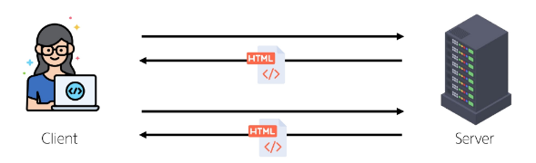
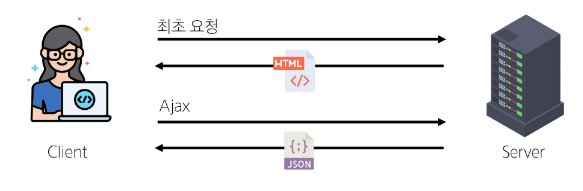
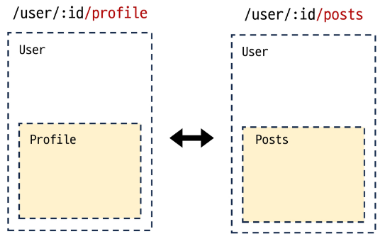

# Vue - Router

<div style="text-align: right"> 24. 05. 08. </div>

## 1. Routing

* Routing : 네트워크에서 경로를 선택하는 프로세스 → 웹 애플리케이션에서 다른 페이지 간의 전환과 경로를 관리하는 기술

* SSR에서의 Routing (SSR : Server-Side Rendering)

    

    * SSR에서 routing은 서버 측에서 수행

    * 서버가 사용자가 방문한 URL 경로를 기반으로 응답 전송

    * 링크를 클릭하면 브라우저는 서버로부터 HTML 응답을 수신하고 새 HTML로 전체 페이지를 다시 로드

* CSR에서의 Routing (CSR : Client-Side Rendering)

    

    * CSR에서 routing은 클라이언트 측에서 수행

    * 클라이언트 측 JS가 새 데이터를 동적으로 가져와 전체 페이지를 다시 로드하지 않음

* SPA에서 Routing이 없다면

    * 유저가 URL을 통한 페이지의 변화를 감지할 수 없음

    * 페이지가 무엇을 렌더링 중인지에 대한 상태를 알 수 없음

        * URL이 1개이기 때문에 새로 고침시 처음 페이지로 되돌아감

        * 링크 공유 시 첫 페이지만 공유 가능

    * 브라우저의 뒤로 가기 기능을 사용할 수 없음

    * 페이지는 1개이지만, 주소에 따라 여러 컴포넌트를 새로 렌더링하여 마치 여러 페이지를 사용하는 것처럼 보이도록 해야 함

## 2. Vue Router

* Vite로 프로젝트 생성 시 Router 추가

    1. App.vue 코드 변화

    2. router 폴더 신규 생성

    3. views 폴더 신규 생성

* RouterLink

    * 페이지를 다시 로드하지 않고 URL을 변경하여 URL 생성 및 관련 로직을 처리

    * HTML의 \<a\> 태그를 렌더링

* RouterView

    * RouterLink URL에 해당하는 컴포넌트를 표시

    * 원하는 곳에 배치하여 컴포넌트를 레이아웃에 표시할 수 있음

        ```HTML
        <!-- App.vue -->

        <template>
          <header>
            <nav>
              <RouterLink to="/">Home</RouterLink>
              <RouterLink to="/about">About</RouterLink>
            </nav>
          </header>

          <RouterView />
        </template>
        ```

* router/index.js

    * 라우팅에 관련된 정보 및 설정이 작성되는 곳

    * router에 URL과 컴포넌트를 mapping

* views

    * RouterView 위치에 렌더링할 컴포넌트를 배치

    * 기존 components 폴더와 기능적으로 다른 것은 없으며, 단순 분류의 의미로 구성됨

    * 일반 컴포넌트와 구분하기 위해 컴포넌트 이름을 View로 끝나도록 작성하는 것을 권장

### 1. Basic Routing

* 라우팅 기본

    1. index.js에 라우터 관련 설정 작성 (주소, 이름, 컴포넌트)

        ```JS
        // index.js

        const router = createRouter({
          routes: [
            {
              path: '/',  // 주소
              name: 'home',   // 이름
              component: HomeView   // 컴포넌트
            },
          ]
        })
        ```

    2. RouterLink의 'to' 속성으로 index.js에서 정의한 주소 값(path)을 사용

        ```HTML
        <!-- App.vue -->

        <RouterLink to="/">Home</RouterLink>
        <RouterLink to="/about">About</RouterLink>
        ```

    3. RouterLink 클릭 시 경로와 일치하는 컴포넌트가 RouterView에서 렌더링됨

        ```HTML
        <!-- App.vue -->

        <RouterView />
        ```

### 2. Named Routes

* Named Routes : 경로에 이름을 지정하는 라우팅

    * name 속성 값에 경로에 대한 이름을 지정

    * 경로에 연결하려면 RouterLink에 v-bind를 사용해 'to' props 객체로 전달

        ```HTML
        <!-- App.vue -->

        <RouterLink :to="{ name: 'home' }">Home</RouterLink>
        <RouterLink :to="{ name: 'about' }">About</RouterLink>
        ```

* Named Routes의 장점

    * 하드 코딩된 URL을 사용하지 않아도 됨

    * URL 입력 시 오타 방지

### 3. Dynamic Route Matching

* Dynamic Route Matching : URL의 일부를 변수로 사용해 경로를 동적으로 매칭

    * 매개변수를 사용한 동적 경로 매칭 - 주어진 패턴 경로를 동일한 컴포넌트에 mapping해야 하는 경우 활용

        - user/1, user/2, user/3 등 모든 사용자의 ID를 활용해 프로필 페이지 URL을 설계하는 경우

        1. views 폴더 내 UserView 컴포넌트 작성

            ```HTML
            <!-- UserView.vue -->

            <template>
              <div>
                <h1>UserView</h1>
              </div>
            </template>
            ```

        2. UserView 컴포넌트 라우터 등록 (매개변수는 콜론으로 표기)

            ```JS
            // index.js

            import UserView from '@/views/UserView.vue'

            const router = createRouter({
              routes: [
                {
                  path: '/user/:id',
                  name: 'user',
                  component: UserView,
                },
              ]
            })
            ```

        3. UserView 컴포넌트로 이동하기 위한 RouterLink 작성 (매개변수는 객체의 params 속성의 객체 타입으로 전달, 단 객체의 key 이름과 index.js에서 지정한 매개변수 이름이 같아야 함)

            ```HTML
            <!-- App.vue -->

            <script setup>
              import { ref } from 'vue'

              const userId = ref(1)
            </script>

            <template>
              <RouterLink :to="{ name: 'user', params: { 'id': userId } }">User</RouterLink>
            </template>
            ```

        4. 현재 사용자의 id를 출력하기 (경로가 일치하면 라우트의 매개변수는 컴포넌트에서 \$route.params로 참조 가능)

            ```HTML
            <!-- UserView.vue -->

            <template>
              <div>
                <h1>UserView</h1>
                <h2>{{ $route.params.id }}번 User 페이지</h2>
              </div>
            </template>
            ```

        5. useRoute() 함수를 사용해 스크립트 내에서 반응형 변수에 할당 후 템플릿에 출력하는 것을 권장 (템플릿에서 \$route를 사용하는 것과 동일)

            ```HTML
            <!-- UserView.vue -->
            
            <template>
              <div>
                <h1>UserView</h1>
                <!-- <h2>{{ $route.params.id }}번 User 페이지</h2> -->
                <h2>{{ userId }}번 User 페이지</h2>
              </div>
            </template>

            <script setup>
              import { ref } from 'vue'
              import { useRoute } from 'vue-router'

              const route = useRoute()
              const userId = ref(route.params.id)
            </script>
            ```

### 4. Nested Routes



* 애플리케이션의 UI는 여러 레벨 깊이로 중첩된 컴포넌트로 구성되기도 함

    * 이 경우 URL을 중첩된 컴포넌트 구조에 따라 변경되도록 이 관계를 표현할 수 있음

* 중첩된 라우팅 활용

    1. 컴포넌트 생성 (components 폴더에 UserProfile, UserPosts 컴포넌트 작성)

        ```HTML
        <!-- UserProfile.vue -->

        <template>
          <div>
            <h1>UserProfile</h1>
          </div>
        </template>
        ```

        ```HTML
        <!-- UserPosts -->

        <template>
          <div>
            <h1>UserPosts</h1>
          </div>
        </template>
        ```

    2. 라우터 등록 (index.js에 두 컴포넌트를 import)

        ```JS
        // index.js

        import UserProfile from '@/components/UserProfile.vue'
        import UserPosts from '@/components/UserPosts.vue'
        ```

    3. children 옵션을 활용해 중첩된 라우터에 컴포넌트 등록

        * children 옵션은 배열 형태로, 필요한 만큼 중첩 관계를 표현할 수 있음

        ```JS
        // index.js

        {
          path: '/user/:id',
          name: 'user',
          component: UserView,
          children: [
            // UserProfile은 UserView의 <RouterView> 내부에 렌더링
            { path: 'profile', name: 'user-profile', component: UserProfile },
            // UserPosts는 UserView의 <RouterView> 내부에 렌더링
            { path: 'posts', name: 'user-posts', component: UserPosts },
          ]
        }
        ```
        
    4. 두 컴포넌트에 대한 RouterLink 및 RouterView 작성

        ```HTML
        <!-- UserView.vue -->

        <template>
          <div>
            <RouterLink :to="{ name: 'user-profile' }">Profile</RouterLink>
            <RouterLink :to="{ name: 'user-posts' }">Posts</RouterLink>
            <h1>UserView</h1>
            <h2>{{ userId }}번 User 페이지</h2>
            <hr>
            <RouterView />
          </div>
        </template>
        ```

    5. 중첩된 Named Routes를 다룰 때는 일반적으로 **하위 경로에만 이름을 지정** → /user/:id로 이동 시 항상 중첩된 경로가 표시됨

        ```JS
        // index.js

        import UserHome from '@/components/UserHome.vue'

        {
          path: '/user/:id',
          // name: 'user',
          component: UserView,
          children: [
            { path: '', name: 'user', component: UserHome }, // 수정 부분
            { path: 'profile', name: 'user-profile', component: UserProfile },
            { path: 'posts', name: 'user-posts', component: UserPosts },
          ]
        }
        ```
        
        ```HTML
        <!-- UserHome component 생성 -->
        <!-- components/UserHome.vue -->

        <template>
          <div>
            <h1>UserHome</h1>
          </div>
        </template>
        ```
        
* 중첩된 라우팅(Nested Routing) 주의 : 컴포넌트 간 부모-자식 관계 관점이 아닌 URL에서의 중첩된 관계를 표현하는 관점으로 바라보기

### 5. Programmatic Navigation

* Programmatic Navigation : RouterLink 대신 JavaScript를 사용해 페이지를 이동하는 것

* 프로그래밍 방식 네비게이션

    * 프로그래밍으로 URL 이동하기

    * router의 인스턴스 메서드를 사용해 RouterLink로 \<a\> 태그를 만드는 것처럼 프로그래밍으로 네비게이션 관련 작업을 수행할 수 있음

* router의 method

    1. router.push() : 다른 위치로 이동하기

        * 새 항목을 history stack에 push하므로, 사용자가 브라우저 뒤로 가기 버튼을 클릭하면 이전 URL로 이동할 수 있음

        * RouterLink를 클릭했을 때 내부적으로 호출되는 method이므로, RouterLink를 클릭하는 것은 router.push()를 호출하는 것과 같음

            | 선언적 표현 | 프로그래밍적 표현 |
            | :---: | :---: |
            | \<RouterLink :to="..."\> | router.push(...) |
            | |

        * UserView 컴포넌트에서 HomeView 컴포넌트로 이동하는 버튼 만들기
        
            ```HTML
            <!-- UserView.vue -->

            <template>
              ...
              <button @click="goHome">홈으로!</button>
            </template>

            <script setup>
              import { useRoute, useRouter } from 'vue-router'

              const router = useRouter()
              const goHome = function () {
                router.push({ name: 'home' })
              }
            </script>
            ```

    2. router.replace() : 현재 위치 바꾸기
    
        * push() method와 달리 history stack에 새로운 항목을 push하지 않고 다른 URL로 이동 (→ 이동 전 URL로 뒤로 가기 불가)

            | 선언적 표현 | 프로그래밍적 표현 |
            | :---: | :---: |
            | \<RouterLink :to="..." replace\> | router.replace(...) |
            | |

        * UserView 컴포넌트에서 HomeView 컴포넌트로 이동하는 버튼 만들기

            ```HTML
            <!-- UserView.vue -->

            <script setup>

              // const router = useRouter()
              const goHome = function () {
                // router.push({ name: 'home' })
                router.replace({ name: 'home' })
              }
            </script>
            ```
## 3. Navigation Guard

### 1. Navigation Guard

* Navigation Guard : Vue router를 통해 특정 URL에 접근 시 다른 URL로 redirect하거나 취소하여 내비게이션을 보호

    * 라우트 전환 전/후 자동으로 실행되는 Hook

* Navigation Guard 종류

    1. Globally (전역 가드) : 애플리케이션 전역에서 모든 라우트 전환에 적용되는 가드

    2. Per-route (라우터 가드) : 특정 라우트에만 적용되는 가드

    3. In-component (컴포넌트 가드) : 컴포넌트 내에서만 적용되는 가드

### 2. Globally Guard

* Globally Guard : 애플리케이션 전역에서 모든 라우트 전환에 적용되는 가드

    * <span style="color: red;">작성 위치 : index.js</span>

* Guard 활용

    ```JS
    router.beforeEach( (to, from) => {
      ...
      return false 또는 return { name: 'About' }
    })
    ```

    * 모든 가드는 2개의 인자를 받음

        * to: 이동할 URL 정보가 담긴 Route 객체

        * from: 현재 URL 정보가 담긴 Route 객체

    * 선택적으로 다음 값 중 하나를 반환

        * false : 현재 내비게이션을 취소, 브라우저 URL이 변경된 경우(사용자가 수동으로 또는 뒤로가기 버튼을 통해) 'from' 경로의 URL로 재설정

        * Route Location : router.push()를 호출하는 것처럼 경로 위치를 전달하여 다른 위치로 redirect, return이 없다면 자동으로 'to' URL Route 객체로 이동

* Globally Guard 종류

    1. router.beforeEach() : 다른 URL로 이동하기 직전에 실행되는 함수 (Global Before Guards)

        1. 전역 가드 beforeEach 작성

        2. HomeView에서 UserView로 이동했을 때 각 인자값 출력 확인하기

            ```JS
            // index.js

            // 전역 가드
            router.beforeEach( (to, from) => {
              console.log(to)
              console.log(from)
            })
            ```

            * to에는 이동할 URL인 user 라우트에 대한 정보가, from에는 현재 URL인 home 라우트에 대한 정보가 들어있음

        3. Login이 되어있지 않다면 페이지 진입을 막고 Login 페이지로 이동시키기

            ```HTML
            <!-- LoginView.vue -->

            <template>
              <div>
                <h1>Login View</h1>
              </div>
            </template>
            ```

            ```HTML
            <!-- App.vue -->

            <RouterLink :to="{ name: 'login' }">Login</RouterLink>
            ```

            ```JS
            // index.js
            import LoginView from '@/views/LoginView.vue'

            {
              path: '/login',
              name: 'login',
              component: LoginView,
            },

            ...

            router.beforeEach( (to, from) => {
              const isAuthenticated = false
              // 로그인이 되어있지 않고 + 이동하는 곳이 login이 아니라면
              if (!isAuthenticated && to.name !== 'login') {
                console.log('로그인이 필요합니다!')
                return { name: 'login' }
              }
            })
            ```

    2. beforeResolve()

    3. afterEach()

### 3. Per-route Guard

* Per-route Guard : 특정 라우터에서만 동작하는 가드

    * <span style="color: red;">작성 위치 : index.js의 각 routes</span>

* Per-route Guard 종류

    1. router.beforeEnter() : 특정 route에 진입했을 때만 실행되는 함수 (단순히 URL의 매개변수나 쿼리 값이 변경될 때는 실행되지 않고, 다른 URL에서 탐색해올 때만 실행됨)

        * 이미 로그인한 상태라면 LoginView 진입을 막고 HomeView로 이동시키기

            ```JS
            // index.js

            const isAuthenticated = true

            ...
            {
              path: '/user/:id',
              name: 'user',
              component: UserView,
              beforeEnter: (to, from) => {
                if (isAuthenticated === true) {
                  console.log('이미 로그인 상태입니다.')
                  return { name: 'home' }
                }
              }
            }
            ```

### 4. In-component Guard

* In-component Guard : 특정 컴포넌트 내에서만 동작하는 가드

    * <span style="color: red;">작성위치 : 각 컴포넌트의 \<script\> 내부</span>

* In-component Guard 종류

    1. onBeforeRouteLeave() : 현재 라우트에서 다른 라우트로 이동하기 전에 실행

        * 사용자가 현재 페이지를 떠나는 동작에 대한 로직 처리

        * 사용자가 UserView를 떠날 시 팝업창 출력하기
        
            ```JS
            // UserView.vue

            import { onBeforeRouteLeave } from 'vue-router'

            onBeforeRouterLeave( (to, from) => {
              const answer = window.confirm('정말 떠나실 건가요?')
              if (answer === false) {
                return false
              }
            })
            ```

    2. onBeforeRouteUpdate() : 이미 렌더링된 컴포넌트가 같은 라우트 내에서 업데이트되기 전에 실행
    
        * 라우트 업데이트 시 추가적인 로직을 처리

        * UserView 페이지에서 다른 id를 가진 User의 UserView 페이지 이동하기 → 같은 라우트 내에서 업데이트되는 경우 (/user/1 → /user/100)

            ```HTML
            <!-- UserView.vue -->

            <button @click="routeUpdate">100번 유저 페이지</button>
            ```

            ```JS
            // UserView.vue

            import { onBeforeRouteUpdate } from 'vue-router'

            const routeUpdate = function () {
              router.push({ name: 'user', params: { id: 100 } })
            }

            onBeforeRouteUpdate( (to, from) => {
              userId.value = to.params.id
            })
            ```

## 0. 참고

* Navigation Guard 정리

    | | Navigation Guard | Examples | Description |
    | :---: | :---: | :---: | :--- |
    | 1 | Globally<br>(전역 가드) | useRouter().beforeEach | 애플리케이션 전역에서 동작<br>작성위치 : <span style="color: red;">index.js</span> |
    | 2 | Per-route<br>(라우터 가드) | beforeEnter: callBackFunction | 특정 route에서만 동작<br>작성위치 : <span style="color: red;">index.js의 각 routes</span> |
    | 3 | In-component<br>(컴포넌트 가드) | onBeforeRouteLeave(callBackFunction)<br>onBeforeRouteUpdate(callBackFunction) | 특정 컴포넌트 내에서만 동작<br>작성위치 : <span style="color: red;">각 컴포넌트의 script</span> |
    | |

<script type="text/javascript" src="http://cdn.mathjax.org/mathjax/latest/MathJax.js?config=TeX-AMS-MML_HTMLorMML"></script>
<script type="text/x-mathjax-config">
  MathJax.Hub.Config({
    tex2jax: {inlineMath: [['$', '$']]},
    messageStyle: "none",
    "HTML-CSS": { availableFonts: "TeX", preferredFont: "TeX" },
  });
</script>