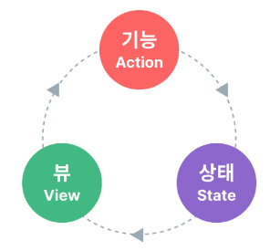
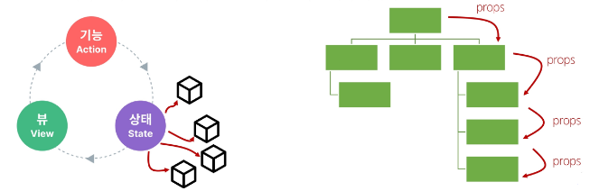
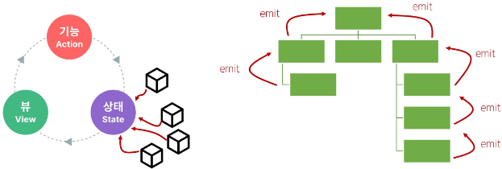
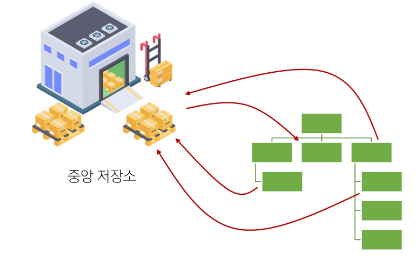
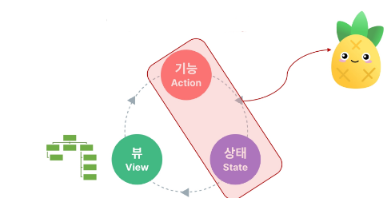
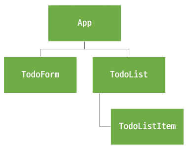

# Vue - Vue State Management

<div style="text-align: right"> 24. 05. 09. </div>

## 1. State Management

* State Management 상태 관리

    * Vue 컴포넌트는 이미 반응형 상태를 관리하고 있음

    * 상태 === 데이터 (Vue에서 반응형 변수(반응형 데이터)를 상태라고 부름)

* 컴포넌트 구조의 단순화

    * 상태 (State) : 앱 구동에 필요한 기본 데이터

    * 뷰 (View) : 상태를 선언적으로 mapping하여 시각화

    * 기능 (Actions) : View에서 사용자 입력에 대해 반응적으로 상태를 변경할 수 있게 정의된 동작

        ```HTML
        <template>
          <!-- View -->
          <div>{{ count }}</div>
        </template>

        <script setup>
          import { ref } from 'vue'

          // State
          const count = ref(0)

          // Actions
          const increment = function () {
            count.value++
          }
        </script>
        ```

    * "단방향 데이터 흐름"의 간단한 표현

        

* 상태 관리의 단순성이 무너지는 시점 - 여러 컴포넌트가 상태를 공유할 때

    1. 여러 View가 동일한 상태에 종속되는 경우

        * 공유 상태를 공통 조상 컴포넌트로 "끌어올린" 다음 props로 전달하는 것

        * 하지만 계층 구조가 깊어질 경우 비효율적, 관리가 어려워짐

            

    2. 서로 다른 뷰의 기능이 동일한 상태를 변경시켜야 하는 경우

        * 발신(emit)된 이벤트를 통해 상태의 여러 복사본을 변경 및 동기화하는 것

        * 마찬가지로 관리의 패턴이 깨지기 쉽고 유지 / 관리할 수 없는 코드가 됨

            

* 해결책 - 각 컴포넌트의 공유 상태를 추출하여, **계층 구조에 상관없이** 전역에서 참조할 수 있는 저장소(**Pinia**)에서 관리

    

    * 컴포넌트 트리는 하나의 큰 View가 되고, 모든 컴포넌트는 트리 계층 구조에 관계없이 상태에 접근하거나 기능을 사용할 수 있음

    * Vue의 공식 상태 관리 라이브러리 === **Pinia**

        

## 2. State Management Library (Pinia)

### 1. Pinia

* Pinia : Vue 공식 상태 관리 라이브러리

### 2. Pinia 구조

* store, state, getters, actions, plugin

```JS
// stores/counter.js

import { ref, computed } from 'vue'
import { defineStore } from 'pinia'

// 1. store
// useCounterStore : 중앙 저장소 이름 (기본적으로 pinia에서 제공하는 이름으로, 변경 가능)
export const useCounterStore = defineStore('counter', () => {

  // 2. state
  const count = ref(0)

  // 3. getters
  const doubleCount = computed(() => count.value * 2)

  // 4. actions
  function increment() {
    count.value++
  }

  // Setup Stores의 반환 값
  // pinia의 상태들을 사용하려면 반드시 반환해야 함
  // store에서는 공유하지 않는 private한 상태 속성을 가지지 않음 (error가 발생하는 것은 아니나 pinia의 존재 목적에 부합하지 않음)
  return { count, doubleCount, increment }
})
```

1. store

    * 중앙 저장소로, 모든 컴포넌트가 공유하는 상태, 기능 등이 작성됨

    * defineStore()의 반환값 이름은 use와 store를 사용하는 것을 권장

    * defineStore()의 첫번째 인자는 애플리케이션 전체에 걸쳐 사용하는 store의 고유 ID

2. state (**ref()**)

    * 반응형 상태(데이터)

3. getters (**computed()**)

    * 계산된 값

4. actions (**function()**)

    * method

5. plugin

    * 애플리케이션의 상태 관리에 필요한 **추가 기능을 제공하거나 확장하는 도구나 모듈**

    * 애플리케이션의 상태 관리를 더욱 간편하고 유연하게 만들어주며, 패키지 매니저로 설치 이후 별도 설정을 통해 추가됨

* 정리

    * Pinia는 store라는 저장소를 가짐 (*유일*한 저장소는 아니다)

    * store는 state, getters, actions로 이루어지며, 각각 ref(), computed(), function()과 동일함

### 3. Pinia 구성 요소 및 활용

* state (ref())

    * 각 컴포넌트 깊이에 관계없이 store instance로 state에 접근하여 직접 읽고 쓸 수 있음

    * 만약 store에 state를 정의하지 않았다면 컴포넌트에서 새로 추가할 수 없음

        ```HTML
        <template>
          <div>
            <p>state : {{ store.count }}</p>
          </div>
        </template>

        <script setup>
        // App.vue

        // stores/counter.js의 useCounterStore import
        import { useCounterStore } from '@/stores/counter'

        // store 변수에 중앙 저장소 할당
        const store = useCounterStore()

        // state 참조 및 변경
        console.log(store.count)
        const newNumber = store.count + 1
        </script>
        ```

* getters (computed())

    * store의 모든 getters 또한 state처럼 직접 접근 가능
    
        ```HTML
        <!-- App.vue -->

        <script setup>
          // getters 참조
          console.log(store.doubleCount)
        </script>
        ```

* actions (function())

    * store의 모든 actions 또한 직접 접근 및 호출할 수 있음

    * getters와 달리 state 조작, 비동기, API 호출이나 다른 로직을 진행할 수 있음

        ```HTML
        <!-- App.vue -->

        <template>
          <div>
            <button @click="store.increment()">+++</button>
          </div>
        </template>

        <script setup>
          // actions 참조
          store.increment()
        </script>
        ```

## 3. Pinia 실습

* Pinia를 활용한 Todo 프로젝트 구현

    * Todo CRUD 구현

    * Todo 개수 계산 - 완료된 Todo 개수

* 컴포넌트 구성

    

    * Todo 목록 (Todo 배열)을, Pinia가 없었다면 App에 데이터를 배치할 것

        * TodoForm에서 emit, App에서 TodoList, TodoItem으로 prop

    * Pinia를 활용 → 별도의 Store에 데이터(state)를 관리

### 1. Read Todo

* store에 임시 todos 목록 state를 정의

    ```JS
    // stores/counter.js

    import { ref, computed } from 'vue'
    import { defineStore } from 'pinia'

    export const useCounterStore = defineStore('counter', () => {
      let id = 0
      const todos = ref([
        { id: id++, text: `할 일 ${id}`, isDone: false },
        { id: id++, text: `할 일 ${id}`, isDone: false },
      ])
      return { todos }
    })
    ```

* store의 todos state를 참조

* 하위 컴포넌트인 TodoListItem을 반복하면서 개별 todo를 props로 전달

    ```HTML
    <!-- TodoList.vue -->

    <template>
      <div>
        <TodoListItem 
          v-for="todo in store.todos"
          :key="todo.id"
          :todo="todo"
        />
      </div>
    </template>

    <script setup>
    import TodoListItem from '@/components/TodoListItem.vue'
    import { useCounterStore } from '@/stores/counter'

    const store = useCounterStore()
    </script>    
    ```

* props 정의 후 데이터 출력 확인

    ```HTML
    <!-- TodoListItem.vue -->

    <template>
      <div>
        {{ todo }}
      </div>
    </template>

    <script setup>
    defineProps({
      todo: Object,
    })
    </script>
    ```

### 2. Create Todo

* todos 목록에 todo를 생성 및 추가하는 addTodo action 정의

    ```JS
    // stores/counter.js

    const addTodo = function (todoText) {
      todos.value.push({
        id: id++,
        text: todoText,
        isDone: false,
      })
    }

    return { todos, addTodo, }
    ```

* TodoForm에서 실시간으로 입력되는 사용자 데이터를 양방향 바인딩하여 반응형 변수로 할당

    ```HTML
    <!-- TodoForm.vue -->

    <template>
      <div>
        <form>
          <input type="text" v-model="todoText">
          <input type="submit">
        </form>
      </div>
    </template>

    <script setup>
    import { ref } from 'vue'

    const todoText = ref('')
    </script>
    ```

* submit event 발생 시 사용자 입력 텍스트를 인자로 전달하여 store에 정의한 addTodo action method를 호출

    ```HTML
    <!-- TodoForm.vue -->

    <template>
      <div>
        <form @submit.prevent="createTodo(todoText)">
          <input type="text" v-model="todoText">
          <input type="submit">
        </form>
      </div>
    </template>

    <script setup>
    import { ref } from 'vue'
    const todoText = ref('')

    import { useCounterStore } from '@/stores/counter'
    const store = useCounterStore()
    const createTodo = function (todoText) {
      store.addTodo(todoText)
    }
    </script>
    ```

* form 요소를 선택하여 todo 입력 후, input 데이터를 초기화할 수 있도록 처리

    * Vue에서 ref 속성을 사용해 form 요소 선택 가능

    ```HTML
    <!-- TodoForm.vue -->
    <template>
      <div>
        <form @submit.prevent="createTodo(todoText)" ref="formElem">
        ...
    </template>

    <script setup>
      ...
      const formElem = ref(null)

      const createTodo = function (todoText) {
        store.addTodo(todoText)
        formElem.value.reset()
      }
    </script>
    ```

### 3. Delete Todo

* todos 목록에서 특정 todo를 삭제하는 deleteTodo 액션 정의

    * 전달받은 todo의 id 값을 활용해 선택된 todo의 index 구하고, 해당 index의 todo 삭제 후 todos 배열 재설정

    ```JS
    // stores/counter.js

    const deleteTodo = function (todoId) {
      const index = todos.value.findIndex( todo => todo.id === todoId )
      todos.value.splice(index, 1)
    }

    return { todos, addTodo, deleteTodo, }
    ```

* 각 todo에 삭제 버튼 작성, 버튼 클릭 시 선택된 todo의 id를 인자로 전달해 deleteTodo method 호출

    ```HTML
    <!-- TodoListItem.vue -->

    <template>
      <div>
        <span>{{ todo.text }}</span>
        <button @click="store.deleteTodo(todo.id)">Delete</button>
      </div>
    </template>

    <script setup>
    defineProps({
      todo: Object,
    })

    import { useCounterStore } from '@/stores/counter'
    const store = useCounterStore()

    </script>    
    ```

### 4. Update Todo

* 각 todo 상태의 isDone 속성을 변경하여 todo의 완료 유무 처리하기

    * 완료된 todo에는 취소선 스타일 적용하기

    * todos 목록에서 특정 todo의 isDone 속성을 변경하는 updateTodo action 정의

    * 전달받은 todo의 id 값을 활용해 선택된 todo와 동일 todo를 목록에서 검색, 일치하는 todo 데이터의 isDone 속성 값을 반대로 재할당 후 새로운 todo 목록 반환

    ```JS
    // stores/counter.js
    
    const updateTodo = function (todoId) {
      todos.value = todos.value.map( todo => {
        if (todo.id === todoId) {
          todo.isDone = !todo.isDone
        }
        return todo
      } )
    }
    
    return { todos, addTodo, deleteTodo, updateTodo, }
    ```

* todo 내용을 클릭하면 선택된 todo의 id를 인자로 전달해 updateTodo method 호출

    ```HTML
    <!-- TodoListItem.vue -->

    ...
      <span @click="store.updateTodo(todo.id)">
        {{ todo.text }}
      </span>
      ...   
    ```

* todo 객체의 isDone 속성 값에 따라 스타일 바인딩 적용하기

    ```HTML
    <!-- TodoListItem.vue -->

    <template>
      ...
      <span
       @click="store.updateTodo(todo.id)"
       :class="{ 'is-done': todo.isDone }"
      >
      {{ todo.text }}
      </span>
    </template>

    <style>
      .is-done {
        text-decoration: line-through;
      }
    </style>
    ```

### 5. Counting Todo

* todos 배열의 길이 값을 반환하는 함수 doneTodosCount 작성 (getters)

    ```JS
    // stores/counter.js

    const doneTodosCount = computed( () => {
      const doneTodos = todos.value.filter( todo => todo.isDone )
      return doneTodos.length
    } )

    return { todos, addTodo, deleteTodo, updateTodo, doneTodosCount, }
    ```

* App component에서 doneTodosCount getter를 참조

    ```HTML
    <!-- App.vue -->
    <template>
      ...
      <h2>완료된 Todo : {{ store.doneTodosCount }}</h2>
    </template>

    <script setup>
      import { useCounterStore } from '@/stores/counter'
      const store = useCounterStore()
    </script>
    ```

### 6. Local Storage

* Local Storage : 브라우저 내에 key-value 쌍을 저장하는 웹 스토리지 객체

    * 특징

        * **페이지를 새로고침**하고 브라우저를 다시 실행해도 **데이터가 유지**

        * 쿠키와 다르게 네트워크 요청 시 서버로 전송되지 않음

        * 여러 탭이나 창 간에 데이터를 공유할 수 있음

    * 사용 목적

        * 웹 애플리케이션에서 사용자 설정, 상태 정보, 캐시 데이터 등을 클라이언트 측에서 보관 → 웹 사이트의 성능을 향상시키고 사용자 경험을 개선하기 위함

* pinia-plugin-persistedstate

    * Pinia의 플러그인 중 하나로, 웹 애플리케이션의 상태(state)를 브라우저의 local storage나 session storage에 영구적으로 저장하고 복원하는 기능을 제공

    * pinia-plugin-perststedstate 설정

        1. 설치 및 등록

            ```s
            $ npm i pinia-plugin-persistedstate
            ```

            ```JS
            // main.js

            import piniaPluginPersistedstate from 'pinia-plugin-persistedstate'

            const pinia = createPinia()
            pinia.use(piniaPluginPersistedstate)

            // app.use(createPinia())
            app.use(pinia)
            ```

        2. defineStore()의 3번째 인자로 관련 객체 추가

            ```JS
            // stores/counter.js

            export const useCounterStore = defineStore('counter', () => {
              ...,
              return { todos, addTodo, deleteTodo, updateTodo, doneTodosCount, }
            }, { persist: true })
            ```

## 0. 참고

* 이제 모든 데이터를 store에서 관리해야 할까?

    * Pinia를 사용한다고 해서 모든 데이터를 state에 넣어야 하는 것은 아님

    * pass props, emit event를 함께 사용해 애플리케이션을 구성해야 함

    * 상황에 따라 적절하게 사용하는 것이 필요

* Pinia를 언제 사용해야 할까?

    * Pinia는 공유된 상태를 관리하는 데 유용하지만, 구조적인 개념에 대한 이해와 시작하는 비용이 큼

    * 애플리케이션이 단순하다면 Pinia가 없는 것이 더 효율적일 수 있음

    * 그러나 중대형 규모의 SPA를 구축하는 경우, Pinia는 자연스럽게 선택할 수 있는 단계가 오게 됨

    * 결과적으로, 적절한 상황에서 활용 시 Pinia 효용을 극대화할 수 있음

<script type="text/javascript" src="http://cdn.mathjax.org/mathjax/latest/MathJax.js?config=TeX-AMS-MML_HTMLorMML"></script>
<script type="text/x-mathjax-config">
  MathJax.Hub.Config({
    tex2jax: {inlineMath: [['$', '$']]},
    messageStyle: "none",
    "HTML-CSS": { availableFonts: "TeX", preferredFont: "TeX" },
  });
</script>