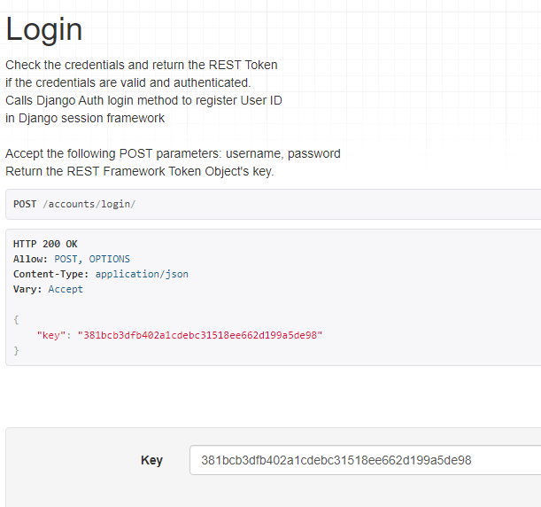
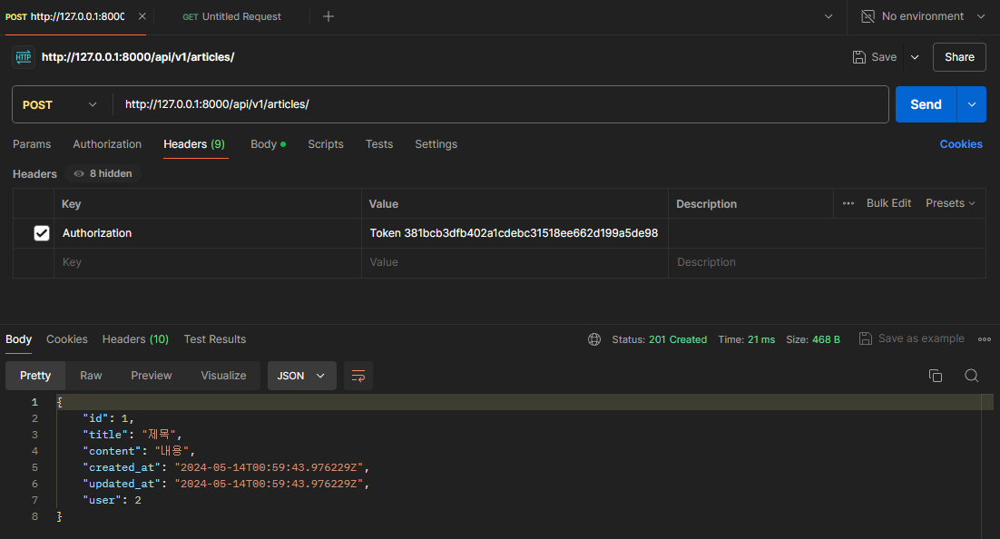
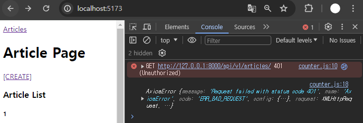

# Vue - Vue with DRF

<div style="text-align: right"> 24. 05. 13. ~ 24. 05. 14. </div>

* Vue with DRF

    1. Vue와 DRF 간 기본적인 **요청과 응답**

    2. Vue와 DRF에서의 인증 시스템

* skeleton project 기반으로 학습

    

## 1. 메인 페이지 구현

### 1. 게시글 목록 출력

* ArticleView component에 ArticleList component와 ArticleListItem component 등록 및 출력

    * ArticleList와 ArticleListItem은 각각 게시글 출력을 담당

### 2. DRF와의 요청과 응답

* store에 임시로 입력한 임시 데이터가 아닌, DRF 서버에 요청하여 데이터를 응답받아 store에 저장 후 출력하기

1. DRF 서버로의 AJAX 요청을 위한 axios 설치 및 관련 코드 작성

    ```s
    $ npm install axios
    ```

    ```JS
    // store/counter.js

    import { ref, computed } from 'vue'
    import { defineStore } from 'pinia'
    import axios from 'axios'

    export const useCounterStore = defineStore('counter', () => {
      // 빈 배열 articles 및 Django 서버 URL 입력
      const articles = ref([])
      const API_URL = 'http://127.0.0.1:8000'

      return { articles, API_URL, }
    }, { persist: true })

    ```

2. DRF 서버로 요청을 보내고 응답 데이터를 처리하는 getArticles 함수 작성 (Pinia → actions)

    ```JS
    // store/counter.js

    export const useCounterStore = defineStore('counter', () => {
      const articles = ref([])
      const API_URL = 'http://127.0.0.1:8000'

      // getArticles 함수 작성
      const getArticles = function () {
        axios({
          method: 'get',
          url: `${API_URL}/api/v1/articles/`
        })
          .then( res => {
            console.log(res)
            console.log(res.data)
          } )
          .catch( error => console.log(error) )
      }

      return { articles, API_URL, getArticles, }
    }, { persist: true })
    ```

3. ArticleView component가 mount될 때 getArticles 함수가 실행되도록 함 (→ onMounted())

    ```HTML
    <!-- views/ArticleView.vue -->

    <script setup>
      import { onMounted } from 'vue'
      import { useCounterStore } from '@/stores/counter'
      import ArticleList from '@/components/ArticleList.vue'

      const store = useCounterStore()
      omMounted( () => {
        store.getArticles()
      } )
    </script>
    ```

4. 에러 발생 확인

    

    * DRF 서버 측에서는 문제없이 응답했으나(200 OK) 브라우저 측에서 거절했음 

    * <span style="color: red;">CORS policy에 의해 차단</span>되었다 → 'Access-Control-Allow-Origin' 헤더가 없다

## 2. CORS Policy

### 1. CORS Policy

* SOP (Same-Origin Policy) : 동일 출처 정책

    * 어떤 출처(Origin)에서 불러온 문서나 스크립트가 다른 출처에서 가져온 리소스와 상호 작용하는 것을 제한하는 보안 방식

        * "다른 곳에서 가져온 자료는 일단 막는다."

        * 웹 애플리케이션의 도메인이 다른 도메인의 리소스에 접근하는 것을 제어하여 사용자의 개인정보와 데이터의 보안을 보호하고, 잠재적인 보안 위협을 방지

        * 잠재적으로 해로울 수 있는 문서를 분리함으로써 공격받을 수 있는 경로를 줄임

* Origin : 출처

    * URL의 Protocol, Host, Port를 모두 포함하여 "출처"라고 부름

    * Same Origin 예시 - 아래 세 영역이 일치하는 경우에만 동일 출처(Same-Origin)로 인정

        

        | URL | 결과 | 이유 |
        | :---: | :---: | :---: |
        | http://localhost:3000/articles/ | 성공 | Path만 다름 |
        | http://localhost:3000/comments/3/ | 성공 | Path만 다름 |
        | http<span style="color: red;">s</span>://localhost:3000/articles/3/ | 실패 | Protocol 다름 |
        | http://localhost:<span style="color: red;">80</span>/articles/ | 실패 | Port 다름 |
        | http://<span style="color: red;">yahuua</span>:3000/articles/ | 성공 | Host 다름 |
        | |

* CORS Policy의 등장

    * 기본적으로 웹 브라우저는 같은 출처에서만 요청하는 것을 허용하며, 다른 출처로의 요청은 보안상의 이유로 차단됨

        * SOP에 의해 다른 출처의 리소스와 상호작용하는 것이 기본적으로 제한되기 때문

    * 하지만 현대 웹 애플리케이션은 다양한 출처로부터 리소스를 요청하는 경우가 많기 때문에 CORS 정책이 필요하게 되었음

    * <span style="color: red;">CORS</span>는 웹 서버가 리소스에 대한 서로 다른 출처 간 접근을 허용하도록 선택할 수 있는 기능을 제공

* CORS (Cross-Origin Resource Sharing) : 교차 출처 리소스 공유

    * <span style="color: red;">특정 출처에서 실행 중인 웹 애플리케이션이 다른 출처의 자원에 접근할 수 있는 권한을 부여</span>하도록 브라우저에 알려주는 체제

    * 만약 다른 출처의 리소스를 가져오기 위해서는 이를 제공하는 서버가 브라우저에게 다른 출처지만 접근해도 된다는 사실을 알려야 함

* CORS Policy (Cross-Origin Resource Sharing Policy) : 교차 출처 리소스 공유 정책

    * 다른 출처에서 온 리소스를 공유하는 것에 대한 정책

    * 서버에서 설정되며, 브라우저가 해당 정책을 확인하여 요청이 허용되는지 여부를 결정

    * 다른 출처의 리소스를 불러오려면 그 다른 출처에서 올바른 <span style="color: red;">CORS header를 포함한 응답을 반환</span>해야 함

    

    * [CORS policy](https://developer.mozilla.org/ko/docs/Web/HTTP/CORS) 정리

        * 웹 애플리케이션이 다른 도메인에 있는 리소스에 안전하게 접근할 수 있도록 허용 또는 차단하는 보안 메커니즘

        * 서버가 약속된 CORS Header를 포함해 응답한다면 브라우저는 해당 요청을 허용

        * 서버에서 CORS Header를 만들어야 한다!!

        * 프론트엔드 / 백엔드 양쪽 모두에서 마주칠 상황이기 때문에 필히 숙지해야 함

### 2. CORS Headers 설정

* Django에서는 django-cors-headers 라이브러리 활용

    * 손쉽게 응답 객체에 CORS header를 추가해주는 라이브러리

* 설치 및 settings.py에 등록

    ```s
    $ pip install django-cors-headers
    ```

    ```py
    # settings.py

    INSTALLED_APPS = [
        ...
        'corsheaders',
        ...
    ]

    MIDDLEWARE = [
        ...
        'corsheaders.middleware.CorsMiddleware',
        ...
    ]

    # CORS를 허용할 Vue 프로젝트의 Domain 등록 (settings.py)
    CORS_ALLOWED_ORIGINS = [
        'http://127.0.0.1:5173',
        'http://localhost:5173',
    ]
    ```

## 3. Article CR 구현

### 1. 전체 게시글 조회

* store에 게시글 목록 데이터 저장

    ```JS
    export const useCounterStore = defineStore('counter', () => {
      const articles = ref([])
      const API_URL = 'http://127.0.0.1:8000'

      const getArticles = function () {
        axios({
          method: 'get',
          url: `${API_URL}/api/v1/articles/`
        })
          .then( res => {
            // console.log(res)
            // console.log(res.data)
            articles.value = res.data
          } )
          .catch( error => console.log(error) )
      }

      return { articles, API_URL, getArticles, }
    }, { persist: true })

    ```

### 2. 단일 게시글 조회

1. DetailView 관련 route 작성

    ```JS
    // router/index.js

    import DetailView from '@/views/DetailView.vue'

    const router = createRouter({
      history: createWebHistory(import.meta.env.BASE_URL),
      routes: [
        {
          path: '/',
          name: 'ArticleView',
          component: ArticleView
        },
        {
          path: '/articles/:id',
          name: 'DetailView',
          component: DetailView
        },
        ...
      ]
    })

    export default router
    ```

2. ArticleListItem에 DetailView component로 가기 위한 RouterLink 작성

    ```HTML
    <!-- components/ArticleListItem.vue -->

    <template>
      <div>
        <h5>{{ article.id }}</h5>
        <p>{{ article.title }}</p>
        <p>{{ article.content }}</p>

        <RouterLink :to="{ name: 'DetailView', params: { id: article.id } }">[DETAIL]</RouterLink>
      </div>
    </template>

    <script setup>
      defineProps({
        article: Object,
      })

      import { RouterLink } from 'vue-router'
    </script>
    ```

3. DetailView가 mount될 때 특정 게시글을 조회하는 AJAX 요청 진행, 데이터 수신 및 template 출력

    ```HTML
    <!-- views/DetailView.vue -->

    <template>
      <div>
        <h1>Detail</h1>
        <!-- 비동기 요청으로 article 정보를 받아오므로, article이 null이 아닐 때 나오도록 해야 함 -->
        <div v-if="article">
          <p>글 번호 : {{ article.id }}</p>
          <p>제목 : {{ article.title }}</p>
          <p>내용 : {{ article.content }}</p>
          <p>작성시간 : {{ article.created_at }}</p>
          <p>수정시간 : {{ article.updated_at }}</p>
        </div>
      </div>
    </template>

    <script setup>
      import axios from 'axios'
      import { onMounted, ref } from 'vue'
      import { useRoute } from 'vue-router'
      import { useCounterStore } from '@/stores/counter'

      const store = useCounterStore()
      const route = useRoute()
      // axios response를 받을 article 변수 작성
      const article = ref(null)

      onMounted( () => {
        axios({
          method: 'get',
          url: `${store.API_URL}/api/v1/articles/${route.params.id}/`,
        })
          .then ( res => {
          // console.log(res.data)
          article.value = res.data
          } )
          .catch ( error => console.log(error) )
      } )
    </script>
    ```

### 3. 게시글 작성

1. CreateView 관련 router 작성

    ```JS
    // router/index.js

    import CreateView from '@/views/CreateView.vue'

    const router = createRouter({
      history: createWebHistory(import.meta.env.BASE_URL),
      routes: [
        ...
        {
          path: '/create',
          name: 'CreateView',
          component: CreateView
        },
      ]
    })

    export default router
    ```

2. ArticleView에 CreateView component로 가기 위한 RouterLink 작성

    ```HTML
    <!-- views/ArticleView.vue -->
    <template>
      <div>
        <h1>ArticleView</h1>
        <RouterLink :to="{ name: 'CreateView', }">[CREATE]</RouterLink>
        <ArticleList />
      </div>
    </template>

    <script setup>
      ...
      import { RouterLink } from 'vue-router'
      ...
    </script>
    ```

3. v-model 사용해 사용자 입력 데이터를 양방향 바인딩

    ```HTML
    <!-- views/CreateView.vue -->

    <template>
      <div>
        <h1>게시글 작성</h1>

        <!-- axios로 요청을 보낼 것이기 때문에 action 속성은 필요없음 -->
        <form>
          <label for="title">제목 : </label>
          <input type="text" id="title" v-model.trim="title"><br>
          
          <label for="content">내용 : </label>
          <textarea id="content" v-model.trim="content"></textarea><br>
          <input type="submit">
        </form>

      </div>
    </template>

    <script setup>
      import { ref } from 'vue'

      const title = ref(null)
      const content = ref(null)
    </script>
    ```

4. createArticle 함수 작성

    * 게시글 생성이 성공한다면 ArticleView 컴포넌트로 이동

    * form tag에, submit event가 발생했다면 createArticle 함수가 호출하도록 설정

    ```HTML
    <!-- views/CreateView.vue -->

    <template>
      <div>
        <h1>게시글 작성</h1>

        <!-- submit event 발생 시 함수 호출 -->
        <form @submit.prevent="createArticle">
          <label for="title">제목 : </label>
          <input type="text" id="title" v-model.trim="title"><br>
          
          <label for="content">내용 : </label>
          <textarea id="content" v-model.trim="content"></textarea><br>
          <input type="submit">
        </form>
      </div>
    </template>

    <script setup>
      import { ref } from 'vue'

      import axios from 'axios'
      import { useCounterStore } from '@/stores/counter'
      import { useRouter } from 'vue-router'

      const title = ref(null)
      const content = ref(null)

      const store = useCounterStore()
      const router = useRouter()

      const createArticle = function () {
          axios({
            method: 'post',
            url: `${store.API_URL}/api/v1/articles/`,
            data: {
              title: title.value,
              content: content.value,
            }
          })
            // 게시글 생성이 성공한다면 ArticleView 컴포넌트로 이동
            .then ( () => {
              router.push({ name: 'ArticleView '})
            } )
            .catch( error => console.log(error) )
        }
      </script>
    ```

## 4. Authentication with DRF

### 1. 인증

* Authentication 인증 : 수신된 요청을 해당 요청의 사용자 또는 자격 증명과 연결하는 메커니즘 → 누구인지를 확인하는 과정

* Permissions 권한 : 요청에 대한 접근 허용 또는 거부 여부를 결정

* 순서상 인증이 먼저 진행되며, 수신 요청을 해당 요청의 사용자 또는 해당 요청이 서명된 토큰(token)과 같은 자격 증명 자료와 연결 → 그 다음 권한 및 제한 정책은 인증이 완료된 해당 자격 증명을 사용해 요청을 허용해야 하는지 결정

    * DRF에서 인증은 항상 view 함수 시작 시, 권한 및 제한 확인이 발생하기 전, 다른 코드의 진행이 허용되기 전에 실행

    * 인증 자체로는 들어오는 요청을 허용하거나 거부할 수 없으며, <span style="color: red;">단순히 요청에 사용된 자격 증명만 식별</span>한다는 점에 유의

* 승인되지 않은 응답 및 금지된 응답 : 인증되지 않은 요청이 권한을 거부하는 경우 해당되는 두 가지 오류 코드

    1. HTTP 401 Unauthorized : 요청된 리소스에 대한 유효한 인증 자격 증명이 없기 때문에, 클라이언트 요청이 완료되지 않았음을 나타냄 (누구인지를 증명할 자료가 없음)

    2. HTTP 403 Forbidden (Permission Denied) : 서버에 요청이 전달되었지만, 권한 때문에 거절됨을 의미 → 401과 다른 점은, 서버는 클라이언트가 누구인지 알고 있음

### 2. 인증 체계 설정

1. 전역 설정

    * DEFAULT_AUTHENTICATION_CLASSES를 사용

        ```py
        # settings.py

        REST_FRAMEWORK = {
          # Authentication
            'DEFAULT_AUTHENTICATION_CLASSES': [
                'rest_framework.authentication.BasicAuthentication',
                'rest_framework.authentication.TokenAuthentication',
            ]
        }
        ```

2. View 함수별 설정

    * authentication_classes 데코레이터를 사용

        ```py
        # articles/views.py

        from rest_framework.decorators import authentication_classes
        from rest_framework.authentication import TokenAuthentication, BasicAuthentication

        @api_view(['GET', 'POST'])
        @authentication_classes([TokenAuthentication, BasicAuthentication, ])
        def article_list(request):
            pass
        ```

### 3. Token 인증 설정

* DRF가 제공하는 인증 체계

    1. BasicAuthentication

    2. <span style="color: green;">TokenAuthentication</span>

        * token 기반 HTTP 인증 체계로, 기본 데스크톱 및 모바일 클라이언트와 같은 클라이언트-서버 설정에 적합

        * 서버가 인증된 사용자에게 토큰을 발급하고, 사용자는 매 요청마다 발급받은 토큰을 요청과 함께 보내 인증 과정을 거침

    3. SessionAuthentication

    4. RemoteUserAuthentication

* TokenAuthentication 적용 과정

    1. 인증 클래스 설정 : 모든 view 함수가 토큰 기반 인증이 진행될 수 있도록 설정하는 것

        ```py
        # settings.py

        REST_FRAMEWORK = {
          # Authentication
            'DEFAULT_AUTHENTICATION_CLASSES': [
                'rest_framework.authentication.TokenAuthentication',
            ]
        }
        ```

    2. INSTALLED_APPS 추가

        ```py
        # settings.py

        INSTALLED_APPS = [
            ...
            'rest_framework.authtoken',
        ]
        ```

    3. Migrate 진행

    4. 토큰 생성 코드 작성 : 인증된 사용자에게 자동으로 토큰을 생성해주는 역할

        ```py
        # accounts/signals.py

        from django.db.models.signals import post_save
        from django.dispatch import receiver
        from rest_framework.authtoken.models import Token
        from django.conf import settings


        @receiver(post_save, sender=settings.AUTH_USER_MODEL)
        def create_auth_token(sender, instance=None, created=False, **kwargs):
            if created:
                Token.objects.create(user=instance)
        ```

### 4. Dj-Rest-Auth 라이브러리

* Dj-Rest-Auth : 회원가입, 인증(소셜미디어 인증 등), 비밀번호 재설정, 사용자 세부 정보 검색, 회원 정보 수정 등 다양한 인증 관련 기능을 제공하는 라이브러리

* Dj-Rest-Auth 설치 및 사용

    1. 설치 및 INSTALL_APPS 등록

        ```s
        $ pip install dj-rest-auth
        ```

        ```py
        # settings.py

        INSTALLED_APPS = [
            ...
            'dj_rest_auth',
            ...
        ]
        ```
    2. project URL에 추가

        ```py
        # my_api/urls.py

        urlpatterns = [
            ...
            path('accounts/', include('dj_rest_auth.urls')),
            ...
        ]        
        ```

* Dj-Rest-Auth의 Registration(등록) 기능 추가 설정

    1. 패키지 추가 설치 및 추가 App 등록

        ```s
        $ pip install 'dj-rest-auth[with_social]'
        ```

        ```py
        # settings.py

        INSTALLED_APPS = [
            ...
            'django.contrib.sites',
            'allauth',
            'allauth.account',
            'allauth.socialaccount',
            'dj_rest_auth.registration',
            ...
        ]

        SITE_ID = 1

        ACCOUNT_EMAIL_VERIFICATION = 'none'

        MIDDLEWARE = [
            ...
            'allauth.account.middleware.AccountMiddleware',
            ...
        ]
        ```

    2. 추가 URL 등록

        ```py
        # my_api/urls.py

        urlpatterns = [
            ...
            path('accounts/signup/', include('dj_rest_auth.registration.urls')),
            ...
        ]
        ```

    3. Migrate 진행

### 5. Token 발급 및 활용

* 회원가입 및 로그인을 진행하여 토큰 발급

    * 로그인 성공 후 DRF로부터 발급받은 Token 확인 → <span style="color: red;">이 Token을 Vue에서 별도로 저장하여 매 요청마다 함께 보내야 함</span>

        

* 게시글 작성 과정을 통해 Token 사용 방법 익히기

    * Content와 함께 Headers에 발급받은 Token 작성하여 송신

        

        * "Authorization" HTTP Header에 포함

        * 키 앞에는 문자열 "Token"이 와야 하며, 공백으로 두 문자열을 구분해야 함

* **발급받은 Token을 인증이 필요한 요청마다 함께 보내야 함**

### 6. 권한 정책 설정

1. 전역 설정

    * DEFAULT_PERMISSION_CLASSES 사용

        ```py
        # settings.py

        REST_FRAMEWORK = {
            ...

            # permission
            'DEFAULT_PERMISSION_CLASSES': [

            # 지정하지 않을 경우 이 설정은 기본적으로 무제한 액세스를 허용
                'rest_framework.permissions.AllowAny',
            ],
        }        
        ```


2. View 함수별 설정

    * permission_classes 데코레이터를 사용

        ```py
        # articles/views.py

        # permission Decorators
        from rest_framework.decorators import permission_classes
        from rest_framework.permissions import IsAuthenticated

        @api_view(['GET', 'POST'])
        @permission_classes([IsAuthenticated])
        def article_list(request):
            pass
        ```

### 7. IsAuthenticated 권한 설정

* DRF가 제공하는 권한 정책

    1. <span style="color: green;">IsAuthenticated</span>

        * 인증되지 않은 사용자에 대한 권한을 거부하고, 그렇제 않은 경우 권한을 허용

        * 등록된 사용자만 API에 액세스할 수 있도록 하려는 경우 적합

    2. IsAdminUser

    3. IsAuthenticatedOrReadOnly

    4. ...

* IsAuthenticated 권한 설정

    1. DEFAULT_PERMISSION_CLASSES 관련 내용 작성
     
        ```py
        # settings.py

        REST_FRAMEWORK = {
          ...
          'DEFAULT_PERMISSION_CLASSES': [
              'rest_framework.permissions.AllowAny',
          ]
        }
        ```

        * 기본적으로 모든 View 함수에 대한 접근을 허용

    2. permission_classes 관련 코드 작성

        ```py
        # articles/views.py

        # permission Decorators
        from rest_framework.decorators import permission_classes
        from rest_framework.permissions import IsAuthenticated

        @api_view(['GET', 'POST'])
        @permission_classes([IsAuthenticated])
        def article_list(request):
            pass
        ```
        
        * 전체 게시글 조회 및 생성시에만 인증된 사용자만 진행할 수 있도록 권한 설정

## 5. Authentication with Vue



* 게시글 전체 조회에 401 status code 발생 : 게시글 조회 요청 시 인증에 필요한 수단(token)을 보내지 않고 있으므로 게시글 조회가 불가능해짐

### 1. 회원가입

1. SignUpView route 관련 내용 작성

    ```JS
    // router/index.js

    import SignUpView from '@/views/SignUpView.vue'
    
    const router = createRouter({
      history: createWebHistory(import.meta.env.BASE_URL),
        routes: [
          ...,
          {
            path: '/signup',
            name: 'SignUpView',
            component: SignUpView
          },
        ]
    })
    ```

2. 회원가입 form 작성, 사용자 입력 데이터와 바인딩될 반응형 변수 작성

    ```HTML
    <!-- views/SignUpView.vue -->

    <template>
      <div>
        <h1>Sign Up Page</h1>
        <form>
          <label for="username">username : </label>
          <input type="text" id="username" v-model.trim="username"><br>

          <label for="password1">password1 : </label>
          <input type="password" id="password1" v-model.trim="password1">

          <label for="password2">password2 : </label>
          <input type="password" id="password2" v-model.trim="password2">

          <input type="submit" value="SignUp">
        </form>
      </div>
    </template>

    <script setup>
    import { ref } from 'vue'

    const username = ref(null)
    const password1 = ref(null)
    const password2 = ref(null)
    </script>
    ```

3. signUp 함수 작성

    * 사용자 입력 데이터를 받아 → 서버로 회원가입 요청을 보냄

    * 사용자 입력 데이터를 받는 부분 작성

    ```JS
    // stores/counter.js

    export const useCounterStore = defineStore('counter', () => {
      const signUp = function (payload) {
        const username = payload.username
        const password1 = payload.password1
        const password2 = payload.password2
        // const { username, password1, password2 } = payload

        axios({
          method: 'post',
          url: `${API_URL}/accounts/signup/`,
          data: {
            username, password1, password2,
          }
        })
          .then ( res => {
            console.log('회원가입이 완료되었습니다.')
          } )
          .catch (err => console.log(err) )
      }
      return { ..., signUp }
    }, { persist: true })
    ```

    * 서버로 회원가입 요청을 보내는 부분 작성

    ```HTML
    <!-- views/SignupView.vue -->
    
    <template>
      ...
      <form @submit.prevent="signUp">
      ...
    </template>

    <script>
      import { useCounterStore } from '@/stores/counter'

      ...
      const store = useCounterStore()
      const signUp = function () {
        const payload = {
          username: username.value,
          password1: password1.value,
          password2: password2.value,
        }
        store.signUp(payload)
      }
    </script>
    ```

### 2. 로그인

1. LoginView route 관련 내용 작성

    ```JS
    // router/index.js

    import LogInView from '@/views/LogInView.vue'

    const router = createRouter({
      history: createWebHistory(import.meta.env.BASE_URL),
      routes: [
        ...,
        {
          path: '/login',
          name: 'LogInView',
          component: LogInView
        }
      ]
    })
    ```

2. 로그인 form 및 사용자 입력 데이터와 바인딩될 반응형 변수 작성

    ```HTML
    <!-- views/LoginView.vue -->
    
    <template>
      <div>
        <h1>LogIn Page</h1>
        <form>
          <label for="username">username : </label>
          <input type="text" id="username" v-model.trim="username"><br>

          <label for="password">password : </label>
          <input type="password" id="password" v-model.trim="password"><br>

          <input type="submit" value="logIn">
        </form>
      </div>
    </template>

    <script setup>
    import { ref } from 'vue'

    const username = ref(null)
    const password = ref(null)
    </script>    
    ```

3. logIn 함수 작성

    * 사용자 입력 데이터를 받아 → 서버로 로그인 요청 및 응답받은 토큰 저장

    * 사용자 입력 데이터를 받는 부분 작성

    ```HTML
    <!-- views/LoginView.vue -->

    <template>
      ...
      <form @submit.prevent="logIn">
      ...
    </template>

    <script setup>
    import { ref } from 'vue'
    import { useCounterStore } from '@/stores/counter'

    const username = ref(null)
    const password = ref(null)

    const store = useCounterStore()

    const logIn = function () {
      const payload = {
        username: username.value,
        password: password.value,
      }
      store.logIn(payload)
    }
    </script>
    ```

    * 서버로 로그인 요청 부분 작성

    ```JS
    // stores/counter.js
    
    const logIn = function (payload) {
      const { username, password } = payload
      axios({
        method: 'post',
        url: `${API_URL}/accounts/login/`,
        data: {
          username, password,
        }
      })
        .then ( res => {
          console.log('로그인이 완료되었습니다.')
          console.log(res.data)
        } )
        .catch ( err => console.log(err) )
    }
    ```

### 3. 요청과 토큰

* **Token을 store에 저장하여 인증이 필요한 요청마다 함께 보낸다.**

* 반응형 변수 token 선언 및 토큰 저장

    ```JS
    // stores/counter.js

    export const userCounterStore = defincStore('counter', () => {

      const token = ref(null)
      ...
      
      const logIn = function (payload) {
        ...
        .then (res => {
          token.value = res.data.key
        } )
        .catch( err => console.log(err) )
      }
      return { ..., token, }
    }, { persist: true })
    ```

* 토큰이 필요한 요청

    1. 게시글 전체 목록 조회 시

        * 게시글 전체 목록 조회 요청 함수 getArticles에 token 추가

        ```JS
        // stores/counter.js

        const getArticles = function () {
          axios({
            method: 'get',
            url: `${API_URL}/api/v1/articles/`,
            headers: {
              Authorization: `Token ${token.value}`
            }
          })
            .then(response => {
              articles.value = response.data
            })
            .catch(error => {
              console.log(error)
            })
        }        
        ```

    2. 게시글 작성 시

        * 게시글 작성 함수 createArticle에 token 추가

        ```JS
        // views/CreateView.vue

        const createArticle = function () {
          axios({
            method: 'post',
            url: `${store.API_URL}/api/v1/articles/`,
            data: {
              title: title.value,
              content: content.value
            },
            headers: {
              Authorization: `Token ${store.token}`
            }
          }) ...
        }
        ```

### 4. 인증 여부 확인

* 인증 상태 여부를 나타낼 속성값 지정

    * token 소유 여부에 따라 로그인 상태를 나타낼 isLogin 변수 작성 → computed를 활용해 token 값이 변할 때만 상태를 계산하도록 함

        ```JS
        // stores/counter.js

        export const useCounterStore = defineStore('counter', () => {
          const isLogin = computed( () => {
            return token.value ? true : false
          } )
          ...
          return { ... isLogin, }
        })
        ```

* 사용자의 인증(로그인) 여부에 따른 추가 기능 구현

    1. 인증되지 않은 사용자 → 메인 페이지 접근 제한

        * 전역 네비게이션 가드 beforeEach를 활용해 다른 주소에서 메인 페이지로 이동 시 인증되지 않은 사용자라면 로그인 페이지로 이동시키기

    2. 인증된 사용자 → 회원가입 및 로그인 페이지에 접근 제한

        * 다른 주소에서 회원가입 또는 로그인 페이지로 이동 시 이미 인증된 사용자라면 메인 페이지로 이동시키기

        ```JS
        // router/index.js

        import { useCounterStore } from '@/stores/counter'
        
        const router = createRouter({...})
        router.beforeEach( (to, from) => {

          const store = useCounterStore()

          // 1. 인증되지 않은 사용자 → 메인 페이지 접근 제한
          if (to.name === 'ArticleView' && !store.isLogin) {
            window.alert('로그인이 필요합니다.')
            return { name: 'LogInView' }
          }

          // 2. 인증된 사용자 → 회원가입 및 로그인 페이지에 접근 제한
          if ( (to.name === 'SignUpView' || to.name === 'LogInView') && (store.isLogin)) {
            window.alert('이미 로그인되어 있습니다.')
            return { name: 'ArticleView' }
          }
        } )        
        ```

### 5. 자연스러운 애플리케이션을 위한 기타 기능 구현

1. 로그인 성공 후 자동으로 메인 페이지로 이동하기

    ```JS
    // stores/counter.js

    import { useRouter } from 'vue-router'

    export const useCounterStore = defineStore('counter', () => {
      const router = useRouter()

      const logIn = function (payload) {
        ...
          .then ( res => {
            token.value = res.data.key
            router.push({ name: 'ArticleView' })
          } )
          .catch ( err => console.log(err) )
      }
      ...
    })
    ```

2. 회원가입 성공 후 자동으로 로그인까지 진행하기

    ```JS
    // stores/counter.js

    const signUp = function (payload) {
      ...
        .then ( res => {
          const password = password1
          logIn( { username, password })
        } )
        .catch ( err => console.log(err) )
    }
    ```

## 0. 참고

* Django Signals

    * **이벤트 알림 시스템**

    * 애플리케이션 내에서 특정 이벤트 발생 시, 다른 부분에게 신호를 보내어 이벤트가 발생헀음을 알릴 수 있음

    * 주로 모델의 데이터 변경 또는 저장, 삭제와 같은 작업에 반응하여 추가적인 로직을 실행하고자 할 때 사용

        * ex) 사용자가 새로운 게시글을 작성할 때마다 특정 작업(예: 이메일 알림 보내기)을 수행하려는 경우

* 환경 변수 (environment variable) : 애플리케이션의 설정이나 동작을 제어하기 위해 사용되는 변수

    * 개발, 테스트 및 프로덕션 환경에서 다르게 설정되어야 하는 설정 값이나 민감한 정보(ex. API key)를 포함

    * 환경 변수를 사용하여 애플리케이션의 설정을 관리하면, 다양한 환경에서 일관된 동작을 유지하면서 필요에 따라 변수를 쉽게 변경할 수 있음

    * 보안적인 이슈를 피하고, 애플리케이션을 다양한 환경에 대응하기 쉽게 만들어 줌

    * [Vite에서 환경변수를 사용하는 법](https://vitejs.dev/guide/env-and-mode.html)

* Vue 프로젝트 진행 시 유용한 자료 

    * Awesome Vue.js : Vue와 관련하여 선별된 유용한 자료를 아카이빙 및 관리하는 프로젝트

        * https://github.com/vuejs/awesome-vue

        * https://awesome-vue.js.org/

    * Vuetify : Vue를 위한 UI 라이브러리 (like 'Bootstrap')

        * https://vuetifyjs.com/en/

* 조회는 모두에게, 작성은 로그인한 사용자에게만 허용할 때

    * GET과 POST 요청 부분을 분리하여 views 함수를 따로 작성하기

    * IsAuthenticatedOrReadOnly 사용하기

        ```py
        # articles/views.py
        from rest_framework.permissions import IsAuthenticatedOrReadOnly

        # @permission_classes([IsAuthenticated])
        @permission_classes([IsAuthenticatedOrReadOnly])
        def article_list_create(request):
            ...
        ```

<script type="text/javascript" src="http://cdn.mathjax.org/mathjax/latest/MathJax.js?config=TeX-AMS-MML_HTMLorMML"></script>
<script type="text/x-mathjax-config">
  MathJax.Hub.Config({
    tex2jax: {inlineMath: [['$', '$']]},
    messageStyle: "none",
    "HTML-CSS": { availableFonts: "TeX", preferredFont: "TeX" },
  });
</script>