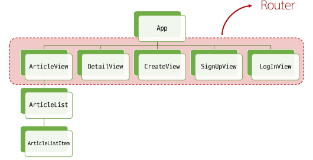
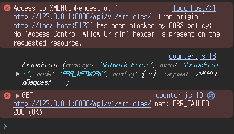
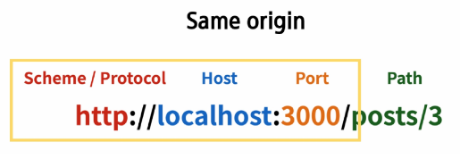
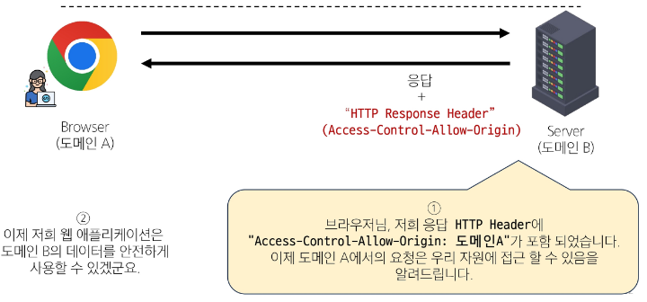

# Vue - Vue with DRF

<div style="text-align: right"> 24. 05. 13. ~ 24. 05. 14. </div>

* Vue with DRF

    1. Vue와 DRF 간 기본적인 **요청과 응답**

    2. Vue와 DRF에서의 인증 시스템

* skeleton project 기반으로 학습

    

## 1. 메인 페이지 구현

### 1. 게시글 목록 출력

* ArticleView component에 ArticleList component와 ArticleListItem component 등록 및 출력

    * ArticleList와 ArticleListItem은 각각 게시글 출력을 담당

### 2. DRF와의 요청과 응답

* store에 임시로 입력한 임시 데이터가 아닌, DRF 서버에 요청하여 데이터를 응답받아 store에 저장 후 출력하기

1. DRF 서버로의 AJAX 요청을 위한 axios 설치 및 관련 코드 작성

    ```s
    $ npm install axios
    ```

    ```JS
    // store/counter.js

    import { ref, computed } from 'vue'
    import { defineStore } from 'pinia'
    import axios from 'axios'

    export const useCounterStore = defineStore('counter', () => {
      // 빈 배열 articles 및 Django 서버 URL 입력
      const articles = ref([])
      const API_URL = 'http://127.0.0.1:8000'

      return { articles, API_URL, }
    }, { persist: true })

    ```

2. DRF 서버로 요청을 보내고 응답 데이터를 처리하는 getArticles 함수 작성 (Pinia → actions)

    ```JS
    // store/counter.js

    export const useCounterStore = defineStore('counter', () => {
      const articles = ref([])
      const API_URL = 'http://127.0.0.1:8000'

      // getArticles 함수 작성
      const getArticles = function () {
        axios({
          method: 'get',
          url: `${API_URL}/api/v1/articles/`
        })
          .then( res => {
            console.log(res)
            console.log(res.data)
          } )
          .catch( error => console.log(error) )
      }

      return { articles, API_URL, getArticles, }
    }, { persist: true })
    ```

3. ArticleView component가 mount될 때 getArticles 함수가 실행되도록 함 (→ onMounted())

    ```HTML
    <!-- views/ArticleView.vue -->

    <script setup>
      import { onMounted } from 'vue'
      import { useCounterStore } from '@/stores/counter'
      import ArticleList from '@/components/ArticleList.vue'

      const store = useCounterStore()
      omMounted( () => {
        store.getArticles()
      } )
    </script>
    ```

4. 에러 발생 확인

    

    * DRF 서버 측에서는 문제없이 응답했으나(200 OK) 브라우저 측에서 거절했음 

    * <span style="color: red;">CORS policy에 의해 차단</span>되었다 → 'Access-Control-Allow-Origin' 헤더가 없다

## 2. CORS Policy

### 1. CORS Policy

* SOP (Same-Origin Policy) : 동일 출처 정책

    * 어떤 출처(Origin)에서 불러온 문서나 스크립트가 다른 출처에서 가져온 리소스와 상호 작용하는 것을 제한하는 보안 방식

        * "다른 곳에서 가져온 자료는 일단 막는다."

        * 웹 애플리케이션의 도메인이 다른 도메인의 리소스에 접근하는 것을 제어하여 사용자의 개인정보와 데이터의 보안을 보호하고, 잠재적인 보안 위협을 방지

        * 잠재적으로 해로울 수 있는 문서를 분리함으로써 공격받을 수 있는 경로를 줄임

* Origin : 출처

    * URL의 Protocol, Host, Port를 모두 포함하여 "출처"라고 부름

    * Same Origin 예시 - 아래 세 영역이 일치하는 경우에만 동일 출처(Same-Origin)로 인정

        

        | URL | 결과 | 이유 |
        | :---: | :---: | :---: |
        | http://localhost:3000/articles/ | 성공 | Path만 다름 |
        | http://localhost:3000/comments/3/ | 성공 | Path만 다름 |
        | http<span style="color: red;">s</span>://localhost:3000/articles/3/ | 실패 | Protocol 다름 |
        | http://localhost:<span style="color: red;">80</span>/articles/ | 실패 | Port 다름 |
        | http://<span style="color: red;">yahuua</span>:3000/articles/ | 성공 | Host 다름 |
        | |

* CORS Policy의 등장

    * 기본적으로 웹 브라우저는 같은 출처에서만 요청하는 것을 허용하며, 다른 출처로의 요청은 보안상의 이유로 차단됨

        * SOP에 의해 다른 출처의 리소스와 상호작용하는 것이 기본적으로 제한되기 때문

    * 하지만 현대 웹 애플리케이션은 다양한 출처로부터 리소스를 요청하는 경우가 많기 때문에 CORS 정책이 필요하게 되었음

    * <span style="color: red;">CORS</span>는 웹 서버가 리소스에 대한 서로 다른 출처 간 접근을 허용하도록 선택할 수 있는 기능을 제공

* CORS (Cross-Origin Resource Sharing) : 교차 출처 리소스 공유

    * <span style="color: red;">특정 출처에서 실행 중인 웹 애플리케이션이 다른 출처의 자원에 접근할 수 있는 권한을 부여</span>하도록 브라우저에 알려주는 체제

    * 만약 다른 출처의 리소스를 가져오기 위해서는 이를 제공하는 서버가 브라우저에게 다른 출처지만 접근해도 된다는 사실을 알려야 함

* CORS Policy (Cross-Origin Resource Sharing Policy) : 교차 출처 리소스 공유 정책

    * 다른 출처에서 온 리소스를 공유하는 것에 대한 정책

    * 서버에서 설정되며, 브라우저가 해당 정책을 확인하여 요청이 허용되는지 여부를 결정

    * 다른 출처의 리소스를 불러오려면 그 다른 출처에서 올바른 <span style="color: red;">CORS header를 포함한 응답을 반환</span>해야 함

    

    * [CORS policy](https://developer.mozilla.org/ko/docs/Web/HTTP/CORS) 정리

        * 웹 애플리케이션이 다른 도메인에 있는 리소스에 안전하게 접근할 수 있도록 허용 또는 차단하는 보안 메커니즘

        * 서버가 약속된 CORS Header를 포함해 응답한다면 브라우저는 해당 요청을 허용

        * 서버에서 CORS Header를 만들어야 한다!!

        * 프론트엔드 / 백엔드 양쪽 모두에서 마주칠 상황이기 때문에 필히 숙지해야 함

### 2. CORS Headers 설정

* Django에서는 django-cors-headers 라이브러리 활용

    * 손쉽게 응답 객체에 CORS header를 추가해주는 라이브러리

* 설치 및 settings.py에 등록

    ```s
    $ pip install django-cors-headers
    ```

    ```py
    # settings.py

    INSTALLED_APPS = [
        ...
        'corsheaders',
        ...
    ]

    MIDDLEWARE = [
        ...
        'corsheaders.middleware.CorsMiddleware',
        ...
    ]

    # CORS를 허용할 Vue 프로젝트의 Domain 등록 (settings.py)
    CORS_ALLOWED_ORIGINS = [
        'http://127.0.0.1:5173',
        'http://localhost:5173',
    ]
    ```

## 3. Article CR 구현

### 1. 전체 게시글 조회

* store에 게시글 목록 데이터 저장

    ```JS
    export const useCounterStore = defineStore('counter', () => {
      const articles = ref([])
      const API_URL = 'http://127.0.0.1:8000'

      const getArticles = function () {
        axios({
          method: 'get',
          url: `${API_URL}/api/v1/articles/`
        })
          .then( res => {
            // console.log(res)
            // console.log(res.data)
            articles.value = res.data
          } )
          .catch( error => console.log(error) )
      }

      return { articles, API_URL, getArticles, }
    }, { persist: true })

    ```

### 2. 단일 게시글 조회

1. DetailView 관련 route 작성

    ```JS
    // router/index.js

    import DetailView from '@/views/DetailView.vue'

    const router = createRouter({
      history: createWebHistory(import.meta.env.BASE_URL),
      routes: [
        {
          path: '/',
          name: 'ArticleView',
          component: ArticleView
        },
        {
          path: '/articles/:id',
          name: 'DetailView',
          component: DetailView
        },
        ...
      ]
    })

    export default router
    ```

2. ArticleListItem에 DetailView component로 가기 위한 RouterLink 작성

    ```HTML
    <!-- components/ArticleListItem.vue -->

    <template>
      <div>
        <h5>{{ article.id }}</h5>
        <p>{{ article.title }}</p>
        <p>{{ article.content }}</p>

        <RouterLink :to="{ name: 'DetailView', params: { id: article.id } }">[DETAIL]</RouterLink>
      </div>
    </template>

    <script setup>
      defineProps({
        article: Object,
      })

      import { RouterLink } from 'vue-router'
    </script>
    ```

3. DetailView가 mount될 때 특정 게시글을 조회하는 AJAX 요청 진행, 데이터 수신 및 template 출력

    ```HTML
    <!-- views/DetailView.vue -->

    <template>
      <div>
        <h1>Detail</h1>
        <!-- 비동기 요청으로 article 정보를 받아오므로, article이 null이 아닐 때 나오도록 해야 함 -->
        <div v-if="article">
          <p>글 번호 : {{ article.id }}</p>
          <p>제목 : {{ article.title }}</p>
          <p>내용 : {{ article.content }}</p>
          <p>작성시간 : {{ article.created_at }}</p>
          <p>수정시간 : {{ article.updated_at }}</p>
        </div>
      </div>
    </template>

    <script setup>
      import axios from 'axios'
      import { onMounted, ref } from 'vue'
      import { useRoute } from 'vue-router'
      import { useCounterStore } from '@/stores/counter'

      const store = useCounterStore()
      const route = useRoute()
      // axios response를 받을 article 변수 작성
      const article = ref(null)

      onMounted( () => {
        axios({
          method: 'get',
          url: `${store.API_URL}/api/v1/articles/${route.params.id}/`,
        })
          .then ( res => {
          // console.log(res.data)
          article.value = res.data
          } )
          .catch ( error => console.log(error) )
      } )
    </script>
    ```

### 3. 게시글 작성

1. CreateView 관련 router 작성

    ```JS
    // router/index.js

    import CreateView from '@/views/CreateView.vue'

    const router = createRouter({
      history: createWebHistory(import.meta.env.BASE_URL),
      routes: [
        ...
        {
          path: '/create',
          name: 'CreateView',
          component: CreateView
        },
      ]
    })

    export default router
    ```

2. ArticleView에 CreateView component로 가기 위한 RouterLink 작성

    ```HTML
    <!-- views/ArticleView.vue -->
    <template>
      <div>
        <h1>ArticleView</h1>
        <RouterLink :to="{ name: 'CreateView', }">[CREATE]</RouterLink>
        <ArticleList />
      </div>
    </template>

    <script setup>
      ...
      import { RouterLink } from 'vue-router'
      ...
    </script>
    ```

3. v-model 사용해 사용자 입력 데이터를 양방향 바인딩

    ```HTML
    <!-- views/CreateView.vue -->

    <template>
      <div>
        <h1>게시글 작성</h1>

        <!-- axios로 요청을 보낼 것이기 때문에 action 속성은 필요없음 -->
        <form>
          <label for="title">제목 : </label>
          <input type="text" id="title" v-model.trim="title"><br>
          
          <label for="content">내용 : </label>
          <textarea id="content" v-model.trim="content"></textarea><br>
          <input type="submit">
        </form>

      </div>
    </template>

    <script setup>
      import { ref } from 'vue'

      const title = ref(null)
      const content = ref(null)
    </script>
    ```

4. createArticle 함수 작성

    * 게시글 생성이 성공한다면 ArticleView 컴포넌트로 이동

    * form tag에, submit event가 발생했다면 createArticle 함수가 호출하도록 설정

    ```HTML
    <!-- views/CreateView.vue -->

    <template>
      <div>
        <h1>게시글 작성</h1>

        <!-- submit event 발생 시 함수 호출 -->
        <form @submit.prevent="createArticle">
          <label for="title">제목 : </label>
          <input type="text" id="title" v-model.trim="title"><br>
          
          <label for="content">내용 : </label>
          <textarea id="content" v-model.trim="content"></textarea><br>
          <input type="submit">
        </form>
      </div>
    </template>

    <script setup>
      import { ref } from 'vue'

      import axios from 'axios'
      import { useCounterStore } from '@/stores/counter'
      import { useRouter } from 'vue-router'

      const title = ref(null)
      const content = ref(null)

      const store = useCounterStore()
      const router = useRouter()

      const createArticle = function () {
          axios({
            method: 'post',
            url: `${store.API_URL}/api/v1/articles/`,
            data: {
              title: title.value,
              content: content.value,
            }
          })
            // 게시글 생성이 성공한다면 ArticleView 컴포넌트로 이동
            .then ( () => {
              router.push({ name: 'ArticleView '})
            } )
            .catch( error => console.log(error) )
        }
      </script>
    ```

<script type="text/javascript" src="http://cdn.mathjax.org/mathjax/latest/MathJax.js?config=TeX-AMS-MML_HTMLorMML"></script>
<script type="text/x-mathjax-config">
  MathJax.Hub.Config({
    tex2jax: {inlineMath: [['$', '$']]},
    messageStyle: "none",
    "HTML-CSS": { availableFonts: "TeX", preferredFont: "TeX" },
  });
</script>