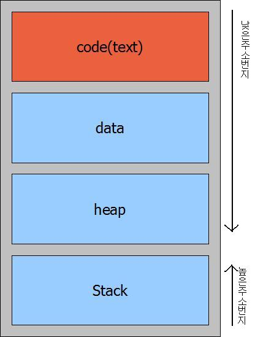
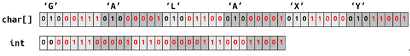
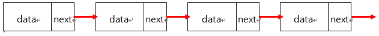

# 1 - STL, 비트 연산, 연결 리스트

<div style="text-align: right"> 24. 04. 20. </div>

## 1. STL : Standard Template Library

### 1. STL

* 라이브러리를 의미

    * Java의 경우 ArrayList, Stack 등

    * 문법이기 때문에 외울 필요가 있음...

* 자료구조를 사용하기 위해 import하여 사용

* 배열 → **Random Access가 되어야 한다**

    * 0 ~ 100번까지의 배열을 만들었을 때, 특정 N번째 위치의 요소를 충분히 빠르게 빼 올 수 있어야 할 것

    * 만약 메모리 상에서 배열이 10 ~ 20번에 연속으로 존재한다면, 2번째 index의 자료를 가져오려면 배열의 첫 번째 위치에서 카운트하여 가져올 수 있다.

    * 그런데 배열이 메모리 상에 떨어져 존재한다면 자료를 가져오기 어려울 것

* Stack : 0 ~ 100번까지의 메모리 중 뒤(위, 100번)에서부터 자료를 쌓음

    * Heap : Stack과 반대로 메모리 중 아래에서부터 자료를 쌓는 것

    * Segment (code(text), data) 위에 heap 및 stack 메모리가 쌓임

        

        | segment | description |
        | :---: | :--- |
        | code(text) 영역 | 프로그램의 code 자체를 구성하는 명령이나 기계어 명령이 존재<br>read only<br>CPU가 읽어들여 수행한다고 하여 text 영역이라고도 부름 |
        | data 영역 | 전역(global)변수, 정적(static)변수, 초기화된 배열과 그 구조가 저장되는 영역<br>프로그램이 실행될 때 생성되고, 종료될 때 시스템에 반환 |
        | heap 영역 | 프로그래머가 필요에 의해 동적으로 할당되는 메모리가 위치하는 영역 |
        | stack 영역 | 지역(local) 변수 및 매개변수(parameter), 복귀 번지(return address) 등이 저장 |
        | |

    * a, b, array, c, d를 쌓았는데 array의 크기를 바꾸고 싶다면?

        * 자료를 전부 밀어버릴 수도 없고, 배열의 크기를 임의로 조정하기 어렵다.

* 동적 할당

    * new 문법

    * 메모리의 다른 부분에 array(5칸)를 배치해 놓고, stack에는 array의 **주소**를 배치하는 것

    * 5칸의 array를 100칸으로 만들고 싶다면?

* ArrayList

    * 배열의 길이가 마음대로 변화되는 배열

        * 배열의 끝에 한 칸을 추가해서 7을 넣는 연산

    * 이렇게 해도 결국 array의 크기를 추가할 수 있는 공간이 없는 경우가 발생할 텐데, 어떻게 해결할 것인가?

        * Random Access 특성을 유지하면서

## 2. ArrayList

* 실제로 값을 넣지 않는 선언을 하더라도, 5칸 정도(예시)의 메모리 공간을 가진 상태로 배열을 만듦

* 배열에 원소를 넣을 때의 시간 복잡도

    * $O(1)$

        * 처음에 원소 3을 배열에 넣음

        * 두 번째로 원소 5를 배열에 넣음

        * ... 5칸의 메모리를 모두 채움

    * 메모리 공간에 원소가 다 찼다면, 기존 길이만큼의 새로운 메모리 공간을 할당해 새로운 원소를 입력함

        * 총 메모리 공간 크기는 10

        * 이 때의 시간 복잡도는 $O(N)$

    * 새로운 메모리 공간이 다 찬다면, 기존 길이만큼의 새로운 메모리 공간을 할당

        * 총 메모리 공간 크기는 20, 40, 80, ...

* 대부분의 add의 과정은 $O(1)$인 것처럼 보이지만, $O(N)$이 되는 경우도 존재한다.

* 초기 메모리 공간 크기가 5이고, 150번 add를 하는 경우를 생각

    | add | 연산 수 |
    | :---: | :---: |
    | 1 | 1 |
    | 2 | 1 |
    | 3 | 1 |
    | 4 | 1 |
    | 5 | 1 |
    | 6 | 1 + 5 |
    | 7 | 1 |
    | ... | ... |
    | 10 | 1 |
    | 11 | 1 + 10 |
    | ... | ... |
    | 20 | 1 |
    | 21 | 1 + 20 |
    | ... | ... |
    | |

    * **150번의 add를 하는 동안 총 연산 수** = 150 + (5 + 10 + 20 + 40 + 80) < 150 + 160

* N번의 add를 하는 동안 총 연산 수는 4 * N보다는 무조건 작을 것이다!! ($O(4N)$ → $O(N)$)

    * → **N번 add의 시간 복잡도가 $O(N)$이니까, 1번 add는 (한 번씩 연산량이 $O(N)$으로 튈 수는 있어도)"평균적"으로 $O(1)$이라고 생각해도 되지 않을까??** 라는 것

* 한 번이 $O(1)$은 아닌데, 전체적으로 볼 때 $O(1)$처럼 작동한다면 **amortized** $O(1)$이라고 표현한다.

    * 예시 - Monotone stack

## 2. 비트 연산

### 1. 논리 연산

* 1 → True, 0 → False

* Java의 경우 true / false와 1 / 0을 구분해서 사용해야 함 (Python은 아님)

* AND, OR, XOR, NOT, Shift 연산

    | 논리 연산 | 설명 |
    | :---: | :--- |
    | AND | 둘 다 true일 때만 true 반환<br>아니면 false 반환 |
    | OR | 둘 중 하나라도 true라면 true 반환<br>아니면 false 반환 |
    | XOR | 둘이 서로 같으면 false, 둘이 서로 다르면 true 반환 |
    | NOT | true → false, false → true |
    | |

* 숫자 12와 10에 대해

    * 1byte 크기로 이진법 표현 (비트 표현) 시 12는 00001100, 10은 00001010

        | 논리 연산 | 비트 연산 표시 | 결과 | 결과 (십진법) | 비고 |
        | :---: | :---: | :---: | :---: | :---: |
        | AND | 12 & 10 | 00001000 | 8 | |
        | OR | 12 \| 10 | 00001110 | 14 | |
        | XOR | 12 ^ 10 | 00000110 | 6 | |
        | NOT | ~10 | 11110101 | - | |
        | Shift << | 10 << 2 | 00101000 | 40 | a << n = a * $(2^n)$ |
        | Shift >> | 10 >> 1 | 00000101 | 5 | a >> n = a * $(2^{-n})$ |
        | |

* 최적화(시간 / 공간복잡도) 중 **공간복잡도(메모리)를 줄이는 데** 활용할 수 있을 것

    * 시간복잡도를 줄이는 데에는 상수 배 차이 (ex. $O(N)$ → $O(N / 64)$)이기 때문에 모든 상황에 대해 유의미하게 줄어드는지는 의문

    * **bit masking** : 어떤 정보를 비트에 저장하는 것

    * array [1, 3, 6, 7, 8]을 사용하는 대신 167이라는 정수 하나(0b 1010 0111)로 상태를 저장할 수 있을 것

        | 연산 | 설명 |
        | :---: | :--- |
        | $x$ & (1 << $i$) | $i$번 비트가 켜져 있는지 확인 |
        | $x$ \|= 1 << $i$ | $i$번 비트를 켜는 연산 |
        | $x$ ^= 1 << $i$ | $i$번 비트를 끄는 연산 |
        | |

    * a ^ a = 0, 3 ^ 3 ^ 5 ^ 7 ^ 5 = 7

* 여러 비트를 사용해 데이터를 저장할 수도 있을 것

    * 사용자가 적절히 끊어 읽으면 됨

    * 알파벳 구분 → 26개 알파벳이 있으므로 5자리의 이진수로 저장이 가능할 것

        

        ```C++
        long long compress(char str[13]) {
            long long res = 0;
            for (size_t i = 0; i < 12; ++i) {
                res = (res << 5) | (str[i] ^ 64)
            }
            return res;
        }
        ```

## 3. 연결 리스트

### 1. Linked List 연결 리스트

* 배열은 기본적으로 Random Access가 가능하다.

* Random Access를 포기하는 대신, 몇몇 부분에서 빨라지는 구성 (trade-off)

* 통상적인 배열은 n번째 요소를 삽입하거나 지우는 데 드는 시간 복잡도가 $O(N)$

    * 지울 요소를 찾는 시간

    * 삭제 시간 ($O(1)$)

    * 삭제 후 뒤에 있는 요소를 땡겨오는 (조회하는) 시간

    * 결국 N개 원소를 모두 보게 되므로 $O(N)$

* Linked List

    * array 내 모든 요소들이 각각 하나의 객체
  
    * 각 객체들은 요소의 값(value)과, 그 다음 값이 누구인지의 정보를 함께 담고 있음

        

    * n번째 요소를 삭제하는 경우, 대신 n - 1번째 요소가 갖고 있느 다음 값 위치 정보를 n + 1번째 요소로 바꿔주면 됨

    * 배열 2개를 하나로 합치는 경우, 마지막 원소의 다음 값 위치 정보를 다른 배열의 첫 번째 요소로 지정해주면 됨

* 결국 순차적으로 데이터를 저장하고자 하는 목적은 기존 배열과 같다.

    * 배열이지만 삽입 / 삭제가 빠르고, 배열 간 접합이나 분리가 빠른 대신, Random Access를 포기(→ 탐색이 느림)한 것!

    * 장 / 단점 및 한계점을 중점으로 이해하는 것이 학습에 도움이 될 것

### 2. Linked List의 분류

* 단순 연결 리스트 (Singly Linked List)

    * 각 노드에서 단방향으로 연결되는 리스트

    * 후행 노드는 쉽게 접근 가능하지만, 선행 노드 접근이 복잡한 단점

* 이중 연결 리스트 (Doubly Linked List)

    * 각 노드에서 양방향(선행, 후행)으로 연결되는 리스트

    * 양방향 접근이 용이하지만, 메모리를 추가적으로 사용

* 원형 연결 리스트 (Circular Linked List)

    * 각 노드에서 단뱡향으로 진행되는 리스트

    * 한 노드에서 모든 노드로 접근이 가능

### 3. Linked List의 동작

* 데이터 삽입

    * 데이터를 삽입하는 부분의 앞 원소가 참조하는 부분을 삽입할 데이터로 변경

    * 삽입하는 데이터가 참조하는 부분을 뒤 원소로 변경

* 데이터 삭제

    * 삭제할 원소의 앞 원소를 불러, 참조하는 부분만 변경

### 4. Linked List 구현

* 동적 할당을 일일이 하기에 느리기 때문에, 문제 풀이를 할 때는 처음부터 메모리 할당을 많이 해 놓고(메모리 풀 방식, memory pool) 그때그때 가져다 쓰는 것이 도움이 될 것

    * Problem Solving(PS) 테크닉적 측면에서의 tip으로, 실제 개발 환경과는 차이가 있다.

    * 다만 Java는 garbage collector 기능이 잘 되어 있음

* 보통 단순 연결 리스트를 만들 때에는 편의를 위해 dummy head를 만들어 사용함 (이중 연결 리스트의 경우 head / tail 2개를 만들어 사용)


    ```C++
    struct Node {
        // 자료
        int data;
        // 다음 노드의 주소(포인터)
        Node* next;
    }

    // 정적 할당(메모리 풀) 방식

    constexpr size_t MAX_NODE = 10000;

    int node_count = 0;
    Node node_pool[MAX_NODE];

    Node* new_node(int data) {
        node_pool[node_count].data = data;
        node_pool[node_count].next = nullptr;

        return &node_pool[node_count++];
    }
    ```

    ```C++
    // 초기화 : dummy node head를 만들어 사용

    Node head;
    
    void init() {
        head.next = nullptr;
    }
    ```

    ```C++
    // 삽입
    // list 맨 앞에 data 추가 : O(1)
    void insert(int x) {
        // x를 linked list node_pool에 입력
        // node 변수에는 현재 node가 들어갈 메모리 위치를 저장하며, 이후 node_count + 1
        Node* node = new_node(x);

        // 새로 생성된 node의 next 변수에 head의 next값 (= null) 입력
        node -> next = head.next;
        // head의 next에는 node 주소를 넣어 연결해 줌
        head.next = node;
    }
    ```

    ```C++
    // 삭제
    // data 값이 없을 경우 아무것도 하지 않고, data값이 여러 개 있을 경우 첫번째 값만 삭제, O(N)

    void remove(int x) {
        Node* prev_ptr = &head;
        while (prev_ptr -> next != nullptr && prev_ptr -> next -> data != x) {
            prev_ptr = prev_ptr -> next;
        }

        if (prev_ptr -> next != nullptr) {
            prev_ptr -> next = prev_ptr -> next -> next;
        }
    }
    ```

    ```C++
    // 탐색, O(N)
    bool find(int x) {
        Node* ptr = head.next;
        while (ptr != nullptr && ptr -> data != x) {
            ptr = ptr -> next;
        }

        return ptr != nullptr;
    }
    ```

    ```C++
    // Singly Linked List 구현
    #include <cstdio>

    struct Node {
        int data;
        Node* next;
    };

    constexpr size_t MAX_NODE = 1000;

    int node_count = 0;
    Node node_pool[MAX_NODE];

    Node* new_node(int data) {
        node_pool[node_count].data = data;
        node_pool[node_count].next = nullptr;

        return &node_pool[node_count++];
    }

    class SinglyLinkedList {
        Node head;

        public:
            SinglyLinkedList() = default;

            void init() {
                head.next = nullptr;
                node_count = 0;
            }

            void insert(int x) {
                Node* node = new_node(x);

                node -> next = head.next;
                head.next = node;
            }

            void remove(int x) {
                Node* prev_ptr = &head;
                while (prev_ptr -> next != nullptr && prev_ptr -> next -> data != x) {
                    prev_ptr = prev_ptr -> next;
                }

                if (prev_ptr -> next != nullptr) {
                    prev_ptr -> next = prev_ptr -> next -> next;
                }
            }

            bool find(int x) const {
                Node* ptr = head.next;
                while (ptr != nullptr && ptr -> data != x) {
                    ptr = ptr -> next;
                }

                return ptr != nullptr;
            }

            void print() const {
                Node* ptr = head.next;
                printf("[List] ");
                while (ptr != nullptr) {
                    printf("%d", ptr -> data)
                    if (ptr -> next != nullptr) {
                        printf(" -> ");
                    }
                    ptr = ptr -> next;
                }
                putchar('\n');
            }
    }

    int main() {
        SinglyLinkedList slist;
        int a, b;
        for (;;) {
            scanf("%d", &a);
            switch (a) {
                case 0:
                    slist.init();
                    slist.print();
                    break;
                case 1:
                    scanf("%d", &b);
                    slist.insert(b);
                    slist.print();
                    break;
                case 2:
                    scanf("%d", &b);
                    slist.remove(b);
                    slist.print();
                    break;
                case 3:
                    scanf("%d", &b);
                    puts(slist.find(b) ? "found" : "not found");
                    break;
                default:
                    return puts("wrong input"), 0;
            }
        }
    }
    ```

## 0. 참고자료

* [변수(전역, 지역, 매개, static) 저장 위치](https://iamnotokay.tistory.com/57)

<script type="text/javascript" src="http://cdn.mathjax.org/mathjax/latest/MathJax.js?config=TeX-AMS-MML_HTMLorMML"></script>
<script type="text/x-mathjax-config">
  MathJax.Hub.Config({
    tex2jax: {inlineMath: [['$', '$']]},
    messageStyle: "none",
    "HTML-CSS": { availableFonts: "TeX", preferredFont: "TeX" },
  });
</script>