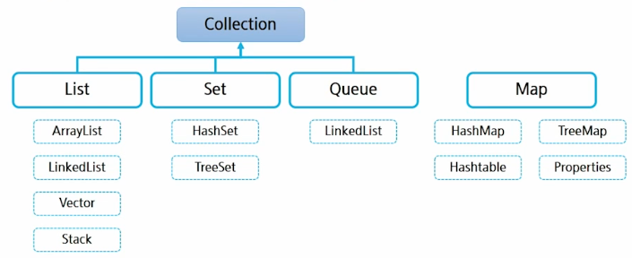

# Java - Collection Framework

## 1. Collection Framework

### 1. Collection Framework

* Collection Framework

    * Java에서, 자료 구조를 다루는 interface 및 class 모음

        * List, Set, Map, Queue, Stack

    * 객체들을 한 곳에 모아 놓고 편리하게 사용할 수 있는 환경 제공

* 정적 자료구조 (static data structure)

    * 고정된 크기의 자료구조 - 메모리를 미리 확보해놓고 다룸

    * 선언 시 크기를 명시하면 바꿀 수 없음

    * 예시 - 배열 (array)

* 동적 자료구조 (dynamic data structure)

    * 요소의 개수에 따라 자료구조의 크기가 동적으로 증가하거나 감소

    * list, stack, queue 등

* 자료구조들의 종류는 결국 어떤 구조에서 얼마나 빨리 원하는 데이터를 찾는가에 따라 결정됨

    * 순서를 유지할 것인가?

    * 중복을 허용할 것인가?

    * 다른 자료구조들에 비해 어떤 장점과 단점들 가지고 있는가?

    * Interface : 완벽하게 추상화된 설계도

    * 자료구조들의 계층 구조

        

* java.util package : 다수의 데이터를 쉽게 처리하는 방법 제공

* Collection Framework 핵심 Interface

    | interface | descriptions |
    | :---: | :--- | 
    | List | 순서가 있는 데이터의 집합, 데이터의 중복 가능<br>ex) 일렬로 줄 서기<br>ArrayList, LinkedList, Vector |
    | Set | 순서를 유지하지 않는 데이터의 집합, 데이터 중복 불가<br>ex) 로또 당첨번호<br>HashSet, TreeSet, ... |
    | Map | key-value 쌍으로 데이터를 관리하는 집합, key의 중복 불가, value는 중복 가능<br>ex) 속성-값<br>HashMap, TreeMap |
    | Queue | 자료가 들어온 순서대로 나가는 자료 구조 (FIFO)<br>LinkedList |
    | |

* Collection Interface

    | 분류 | Collection |
    | :---: | :--- |
    | 추가 | add(E, e) <br>addAll(Collection<? extends E> c) |
    | 조회 | contains(Object o),<br>containsAll(Collction<?> c),<br>equals(),<br>isEmpty(),<br>iterator(),<br>size() |
    | 삭제 | clear(),<br>removeAll(Collection<?> c),<br>retainAll(Collection<?> c), |
    | 수정 | |
    | 기타 | toArray() |
    | |

## 2. List

### 1. List

* 순서가 있고 (→ index가 있고), 중복을 허용 (배열과 유사하지만, 동적이다.)

* 구현 클래스 (구현체)

    * ArrayList

        * 기본적으로 배열로 구현되어 있음

        * 앞에서부터 차근차근 채워나가서, 절반 정도 채워지면 ArrayList가 내부적으로 알아서 배열 크기를 1.5배로 늘려줌

        * 반대로 원소가 빠져나가면줄어들기도 함

    * LinkedList

        * Node로 구성, 각 node들이 link로 연결

        * node의 첫 번째 값이 value, 두 번째 값은 다음 node의 참조값

        * 자료 추가 시 새로 node를 만들어 참조값을 이어 줌

    * Vector

        * ArrayList와 유사하게 동작

        * 내부적으로 알아서 2배로 늘려줌

    ```Java
    import java.util.ArrayList;
    import java.util.List;

    public class ListTest1 {
        public static void main(String[] args) {
            // List
            // 1. 순서가 있다
            // 2. 중복이 허용된다.
            
            List<String> names = new ArrayList<String>();
            
            // 원소 추가
            names.add("현경찬");
            names.add("배태용");
            names.add("양지웅");
            names.add("송창용");
            
            System.out.println(names);
            
            // 비어있는지 체크
            System.out.println(names.isEmpty());
            
            // 삭제
            // 1. index를 이용한 삭제
            names.remove(0);
            System.out.println(names);
            
            // 2. 값을 이용한 삭제
            // list 내 값이 2개 이상 존재한다면 가장 앞의 원소가 삭제된다.
            names.remove("송창용");
            System.out.println(names);
            
            // 3. 전부 삭제
            names.clear();
            System.out.println(names);
            System.out.println(names.isEmpty());
            
            // 삭제할 때 주의점 : 삭제하면 list 크기도 바뀌고.. 각 원소들의 index도 바뀐다.
            names.add("학생1");
            names.add("학생1");
            names.add("학생2");
            System.out.println(names);
            // 학생 1을 다 삭제하고 싶다.

            //  for (int i = 0; i < names.size(); i++) {
            //      if (names.get(i).equals("학생1")) names.remove(i);
            //  }
            //  System.out.println(names);

            // 뒤에서부터 삭제하면 된다!!
            for (int i = names.size() - 1; i >= 0; i--) {
                if (names.get(i).equals("학생1")) names.remove(i);
            }
            System.out.println(names);
        }
    }


    ```