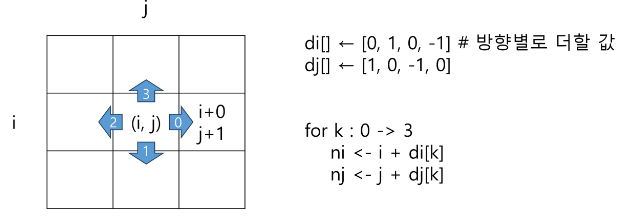
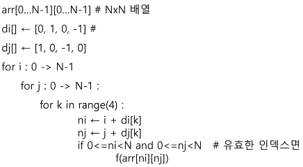

# Algorithm

<div style="text-align: right"> 24. 01. 29. ~ 24. 02. 01. </div>

## 1. 배열 (Array)

### 1. 과정 소개(참고)

  * 학습 내용 - 자료구조와 알고리즘

  * 학습 목표

    * 논리적 사고력 향상

    * 문제 해결 능력 향상

    * 최종 목표는 연습 문제가 아닌 현실 세계 문제(업무적, 기술적)

  * 학습 도구 - Python

### 2. 알고리즘

  * 유한한 단계를 통해 문제를 해결하기 위한 절차나 방법

  * 컴퓨터 용어 - 컴퓨터가 어떤 일을 수행하기 위한 단계적 방법

  * 컴퓨터 분야에서 알고리즘을 표현하는 2가지 방법 - 의사코드(Pseudocode) / 순서도

    

* 알고리즘의 성능

    * 정확성 : 얼마나 정확히 동작하는가

    * 작업량 : 얼마나 적은 연산으로 원하는 결과를 얻어내는가

    * 메모리 사용량 : 얼마나 적은 메모리를 사용하는가

    * 단순성 : 얼마나 단순한가

    * 최적성 : 더 이상 개선의 여지 없이 최적화되었는가

* 시간 복잡도(Time Complexity)

    * 알고리즘의 작업량을 표현 시 사용

    * 실제 걸리는 시간을 측정

    * 실행되는 명령문의 개수를 계산

    * 빅-오(O) 표기법

      * 시간 복잡도 함수 중 가장 큰 영향력을 주는 n에 대한 항만을 표시

      * 계수는 생략해 표기

      * 성능간 대략적인 비교에 유용함

      

### 3. 배열

* 배열

    * 일정한 자료형 변수들을 하나의 이름으로 열거해 사용하는 자료구조

    * 6개의 변수를 사용해야 하는 경우, 이를 배열로 바꾸어 사용하는 예

      * 프로그램 내에서 여러 개의 변수가 필요 시, 일일이 다른 변수명을 이용해 자료에 접근하는 것은 매우 비효율적

      * 배열 사용 시, 하나의 선언을 통해 둘 이상의 변수를 선언 가능

      * 단순히 다수의 변수 선언을 의미하는 것이 아니라, 다수의 변수로는 하기 힘든 작업을 배열을 활용해 쉽게 할 수 있다.

    * 1차원 배열

      별도의 선언 방법이 없으면 변수에 처음 값을 할당할 때 생성
      
      이름 : 프로그램에서 사용할 배열의 이름

      ```python
      # 1차원 배열 선언의 예
      arr = list()
      arr = []
      arr = [1, 2, 3]
      arr= [0] * 10

      arr[0] = 10 # 배열 arr의 0번 원소에 10을 저장하라.
      arr[idx] = 20 # 배열 arr의 idx번 원소에 20을 저장하라.
      ```

### 4. 정렬

* 정렬

    * 2개 이상의 자료를 특정 기준에 의해 오름차순 / 내림차순으로 재배열하는 것

* 정렬 방식의 종류

    * 버블 정렬(Bubble Sort)

    * 카운팅 정렬(Counting Sort)

    * 선택 정렬(Selection Sort)

    * 퀵 정렬(Quick Sort)

    * 삽입 정렬(Insertion Sort)

    * 병합 정렬(Merge Sort)

* 버블 정렬 (Bubble Sort)

    * 인접한 두 개의 원소를 비교하며 자리를 계속 교환하는 방식

    * 정렬 과정
    
      * 첫 번째 원소부터 인접한 원소끼리 계속 자리를 교환하면서 맨 마지막 자리까지 이동한다.

      * 한 단계가 끝나면 가장 큰 원소가 마지막 자리로 정렬된다.

      * 교환하며 자리를 이동하는 모습이 물 위에 올라오는 거품 모양과 같다고 하여 버블 정렬이라도 한다.

    * 시간 복잡도 : $O(n^2)$

      ```python
      # ascending
      for j in range(N - 1, 0, -1):
          for i in range(j):
              if arr[i] > arr[i + 1]:
                  arr[i], arr[i + 1] = arr[i + 1], arr[i]

      # descending
      for j in range(N - 1, 0, -1):
          for i in range(j):
              if arr[i] < arr[i + 1]:
                  arr[i], arr[i + 1] = arr[i + 1], arr[i]
      ```

* 카운팅 정렬 (Counting Sort)

    * 항목들의 순서를 결정하기 위해, 집합에 각 항목이 몇 개씩 있는지 세는 작업을 하여, 선형 시간에 정렬하는 효율적인 알고리즘

    * 제한 사항

        * 정수나, 정수로 표현할 수 있는 자료에 대해서만 적용 가능 : 각 항목의 발생 횟수를 기록하기 위해, 정수 항목으로 인덱스되는 카운트들의 배열을 사용하기 때문

        * 카운트들을 위한 충분한 공간을 할당하려면, 집합 내 가장 큰 정수를 알아야 한다.

    * 시간 복잡도 : $O(n + k)$
        
        * n은 리스트 길이, k는 정수 최대값

    * 각 원소마다 데이터 내 개수를 카운트 후, 각 원소마다 앞에 위치한 항목들의 모든 개수를 반영(더함)

    ```python
    def Counting_Sort(data, temp, k):
        # data : 입력 array (숫자 범위 : 0 ~ k)
        # temp : 정렬된 배열(return)
        # counts : 카운트 배열

        counts = [0] * (k + 1)
        for i in range(0, len(data)):
            counts[data[i]] += 1

        for i in range(1, k + 1):
            counts[i] += counts[i - 1]

        for i in range(len(temp) - 1, -1, -1):
            counts[data[i]] -= 1
            temp[counts[data[i]]] = data[i]

        return temp
    ```

* Baby-gin Game

  * 설명

    * 0 ~ 9 사이의 숫자 카드에서 임의의 카드 6장을 뽑았을 때, 3장의 카드가 연속적인 번호를 갖는 경우를 run, 3장의 카드가 동일한 번호를 갖는 경우를  triplet이라고 한다.

    * 6장의 카드가 run과 triplet으로만 구성된 경우를 baby-gin이라고 한다.

    * 6자리의 숫자를 입력받아 baby-gin 여부를 판단하는 프로그램을 작성하라.

* 완전 검색(Exaustive Search)

  * 문제의 해법으로 생각할 수 있는 모든 경우의 수를 나열해보고 확인하는 기법

  * Brute-force 혹은 generate-and-test 기법이라고도 불림

  * 모든 경우의 수를 테스트 후 최종 해법 도출

  * 일반적으로 경우의 수가 상대적으로 작을 때 유용

  * 모든 경우의 수를 생성하고 테스트하기 때문에 수행 속도는 느리지만, 해답을 찾아내지 못할 확률은 작다.

* 순열 (Permutation)

```python
# {1, 2, 3}을 포함하는 모든 순열을 생성하는 함수
for i1 in range(1, 4):
  for i2 in range(1, 4):
    if i2 != i1:
      for i3 in range(1, 4):
        if i3 != i1 and i3 != i2:
          print(i1, i2, i3)
```

* 탐욕(Greedy) 알고리즘

  * 최적해를 구하는 데 사용되는 근시안적 방법

  * 여러 경우 중 하나를 결정해야 할 때마다, 그 순간에 최적이라고 생각되는 것을 선택해 나가는 방식으로 진행해 최종적인 해답에 도달

  * 각 선택의 시점에서 이루어지는 결정은 지역적으로는 최적이지만, 그 선택들을 계속 수집하여 최종적인 해답을 만들었다고 해도 그것이 최적이라는 보장은 없다.

  * 탐욕 알고리즘의 동작 과정

    * 1. 해 선택 : 현재 상태에서 부분 문제의 최적 해를 구한 뒤, 이를 부분해 집합(Solution Set)에 추가한다.

    * 2. 실행 가능성 검사 : 새로운 부분해 집합이 실행 가능한지 확인한다. (→ 문제의 제약 조건을 위반하지 않는지를 검사한다.)

    * 3. 해 검사 : 새로운 부분해 집합이 문제의 해가 되는지를 확인한다.<br>아직 전체 문제의 해가 완성되지 않았다면 1)의 해 선택부터 다시 시작한다.

### 5. 2차원 배열

* 2차원 배열의 선언

    * 1차원 List를 묶어놓은 List

    * 2차원 이상의 다차원 List는 차원에 따라 index를 선언

    * 2차원 List의 선언 : 세로길이(행의 개수), 가로길이(열의 개수)를 필요로 함

    * Python에서는 데이터 초기화를 통해 변수 선언과 초기화가 가능함

    ```python
    arr = [[0, 1, 2, 3], [4, 5, 6, 7]]

    N = int(input())
    arr [list(map(int, input())) for _ in range(N)]

    N = int(input())
    arr [list(map(int, input().split())) for _ in range(N)]
    ```

* 2차원 배열의 접근

    * 배열 순회

      * n x m 배열의 n * m 개의 모든 원소를 빠짐없이 조사하는 방법

      * 행 / 열 / 지그재그 순회

      ```python
      # 지그재그 순회
      for i in range(n):
        for j in range(m):
          f(array[i][j + (m - 1 - 2 * j) * (i % 2)])
      ```

    * 델타를 이용한 2차 배열 탐색

      * 2차 배열의 한 좌표에서 4방향의 인접 배열 요소를 탐색하는 방법

      * 인덱스 (i, j)인 칸의 상하좌우 칸 (ni, nj)

      

      

      ```python
      N = 5
      arr = [[0] * N for _ in range(N)]
      for i in range(N):
          for j in range(N):
              for di, dj in [[0, 1], [1, 0], [0, -1], [-1, 0]]:
                  ni, nj = i + di, j + di
                  if 0 <= ni < N and 0 <= nj < N:
                      print(arr[ni][nj])
      ```

* 전치 행렬

    ```python
    arr = [[1, 2, 3], [4, 5, 6], [7, 8, 9]]

    for i in range(3):
      for j in range(3):
        if i < j:
          arr[i][j], arr[j][i] = arr[j][i], arr[i][j]
    ```

* 부분집합 합(Subset Sum) 문제

    * 유한 개의 정수로 이루어진 집합이 있을 때, 이 집합의 부분집합 중 그 집합의 원소를 모두 더한 값이 0이 되는 경우가 있는지를 알아내는 문제

    * 완전검색 기법으로 풀기 위해서는, 우선 집합의 모든 부분집합을 생성 후에 각 부분집합의 합을 계산해야 함

    * 주어진 집합의 부분집합을 생성하는 방법?

      ```python
      # {1, 2, 3, 4}의 모든 부분집합을 생성하는 방법

      bit = [0, 0, 0, 0]
      for i in range(2):
          bit[0] = i
          for j in range(2):
              bit[1] = j
              for k in range(2):
                  bit[2] = k
                  for l in range(2):
                      bit[3] = l
                      print_subset(bit)
      ```

    * 비트 연산자

      | 비트 연산자 | 설명 |
      | :---: | :---: |
      | & | 비트 단위로 AND 연산을 한다 |
      | \| | 비트 단위로 OR 연산을 한다 |
      | << | 피연산자의 비트 열을 왼쪽으로 이동시킨다 |
      | >> | 피연산자의 비트 열을 오른쪽으로 이동시킨다 |
      | |

    * <<, >> 연산자
    
      * 1 << n : 각 자리를 왼쪽으로 n번 이동 → 결과적으로 원소가 n개일 경우의 모든 부분집합 수를 의미(2^n)

    * & 연산자

      * i & (1 << j) : i의 j번째 비트가 1인지 아닌지를 검사한다.

    ```python
    # 보다 간결하게 부분집합을 생성하는 방법
    arr = [3, 6, 7, 1, 5, 4]

    n = len(arr)  # n : 원소의 개수

    for i in range(1 << n): # 1 << n : 부분집합 수
        for j in range(n):  # 원소 수만큼 비트를 비교함
            if i & (1 << j):  # i의 j번 비트가 1인 경우
                print(arr[j], end = ', ') # j번 원소 출력
        print()
    print()
    ```

### 6. 검색 (Search)

* 저장되어 있는 자료 중 원하는 항목을 찾는 작업

* 목적하는 탐색 키를 가진 항목을 찾는 것

    * 탐색 키(search key) : 자료를 구별하여 인식할 수 있는 키

* 검색의 종류

    * 순차 검색 (sequential search)

      * 일렬로 되어 있는 자료를 순서대로 검색하는 방법

        * 가장 간단, 직관적, 배열이나 연결 리스트 등 순차구조로 구현된 자료구조에서 원하는 항목을 찾을 때 유용

        * 알고리즘이 단순해 구현이 쉽지만, 검색 대상의 수가 많은 경우에는 수행시간이 급격히 증가

      1. 순차 검색 - 정렬되어 있지 않은 경우

        * 첫 번째 원소부터 순서대로 검색 대상과 키 값이 같은 원소가 있는지 비교하며 찾는다.

        * 키 값이 동일한 원소를 찾으면 그 원소의 인덱스를 반환

        * 자료구조의 마지막에 이를 때까지 검색 대상을 찾지 못하면 검색 실패 반환

        * 찾고자 하는 원소 순서에 따라 비교 횟수 결정

          * 정렬되지 않은 자료에서의 순차 검색의 평균 비교 회수

            $$(1 / n) * (1 + 2 + 3 + ... + n) = (n + 1) / 2$$

          * 시간 복잡도 : $O(n)$

        ```python
        def sequential_search(a, n, key):  # a : 검색 대상 배열, n : len(a), key : 찾고자 하는 값
            i = 0
            while i < n and a[i] != key:
                i += 1

            if i >= n:
                return -1
            else:
                return i
        ```

      2. 정렬되어 있는 경우

        * 검색 과정

          * 자료가 오름차순으로 정렬된 상태에서 검색을 실시한다고 가정

          * 자료를 순차적으로 검색하며 키 값을 비교해, 원소의 키 값이 검색 대상의 키 값보다 크면 찾는 원소가 없다는 것이므로, 더 이상 검색하지 않고 검색을 종료

        * 찾고자 하는 원소 순서에 따라 비교 횟수 결정

          * 정렬이 되어 있으므로, 검색 실패를 반환하는 경우 평균 비교 회수가 반으로 줄어든다.

          * 시간 복잡도 : $O(n)$

        ```python
        def sequential_search2(a, n, key):  # a : 검색 대상 배열, n : len(a), key : 찾고자 하는 값
            i = 0
            while i < n and a[i] < key:
                i += 1

            if i >= n:
                return -1
            else:
                return i
        ```

    * 이진 검색 (binary search)

      * 자료의 가운데에 있는 항목의 키 값과 비교해 다음 검색의 위치를 결정하고 검색을 계속 진행하는 방법

        * 목적 키를 찾을 때까지 이진 검색을 순환적으로 반복 수행함으로써 검색 범위를 반으로 줄여가면서 보다 빠르게 검색 수행

      * 자료가 정렬된 상태여야 한다.

      * 검색 과정

        * 자료의 중앙에 있는 원소를 골라, 찾고자 하는 목표 값과 비교한다.

        * 목표 값이 중앙 원소 값보다 작으면 자료의 왼쪽 반에 대해 새로 검색을 수행하고, 크다면 자료의 오른쪽 반에 대해 새로 검색을 수행한다.

      * 구현

        * 검색 범위의 시작 / 종료점을 이용해 검색을 반복 수행

        * 이진 검색의 경우, 자료에 삽입이나 삭제가 발생했을 때 배열의 상태를 항상 정렬 상태로 유지하는 추가 작업이 필요함

      ```python
      def binarySearch(a, n, key):  # a : 검색 대상 배열, n : len(a), key : 찾고자 하는 값
          start = 0
          end = n - 1

          while start <= end:
              middle = (start + end) // 2
              if a[middle] == key:    # 검색 성공 시
                  return middle
              elif a[middle] > key:   # key보다 검색값이 클 경우, 검색값보다 더 작은 좌측 탐색
                  end = middle - 1
              else:   # key보다 검색값이 클 경우, 검색값보다 더 큰 우측 탐색
                  start = middle + 1
          return -1   # 검색 실패 시

      def binarySearch2(a, start, end, key):  # a : 검색 대상 배열, start, end : 0, len(a) - 1, key : 찾고자 하는 값
          if start > end: # 검색 실패 시 - 재귀함수 break 조건 선행
              return -1
          else:
              middle = (start + end) // 2
              if a[middle] == key:  # 검색 성공 시
                  return middle
              elif a[middle] > key: # key보다 검색값이 클 경우, 검색값보다 더 적은 좌측 탐색
                  return binarySearch2(a, start, middle - 1, key)
              else: # key보다 검색값이 작을 경우, 검색값보다 더 큰 우측 탐색
                  return binarySearch2(a, middle + 1, end, key)
      ```

### 7. 선택 정렬 (Selection Sort)

* Index

    * Database에서, Table에 대한 동작 속도를 높여주는 자료 구조

    * Index의 디스크 저장 공간 크기는 Table보다 작다.
      
      * 보통 Index는 key - field만 갖고 있고, Table의 다른 세부 항목들은 갖고 있지 않기 때문

* 배열을 사용한 인덱스

    * 대량의 데이터를 매번 정렬하면 프로그램의 반응은 느려질 수밖에 없다.

    * 이러한 대량 데이터의 성능 저하 문제를 해결하기 위해 배열 인덱스를 사용할 수 있다.

* 주어진 자료들 중 가장 작은 값의 원소부터 차례대로 선택해 위치를 교환하는 방식의 정렬

* 정렬 과정

    * 주어진 리스트 중 최소값을 찾아, 그 값을 리스트의 맨 앞에 위치한 값과 교환

    * 맨 처음 위치를 제외한 나머지 리스트를 대상으로 과정을 반복

    * 시간 복잡도 : $O(n^2)$

    ```python
    def SelectionSort(a, n):
        for i in range(n - 1):
            min_idx = i
            for j in range(i + 1, n):
                if a[min_idx] > a[j]:
                    min_idx = j
            a[i], a[min_idx] = a[min_idx], a[i]
    ```

* 셀렉션 알고리즘 (Selection Algorithm)

    * 저장되어 있는 자료로부터 k번째로 큰 혹은 작은 원소, 혹은 최대 / 최소 / 중간값을 찾는 방법

    * 시간 복잡도 : $O(kn)$

      * k가 비교적 작을 때 유용

    * 선택 과정

      1. 정렬 알고리즘을 이용해 자료 정렬

      2. 원하는 순서에 있는 원소 가져오기

    ```python
    # 일반적인 셀렉션 알고리즘
    def select(a, k):   # k : 1 ~ n
        n = len(a)
        for i in range(n - 1):
            min_idx = i
            for j in range(i, n):
                if a[min_idx] > a[j]:
                    min_idx = j
            a[i], a[min_idx] = a[min_idx], a[i]
        return a[k - 1]
    ```

### 0. 참고

* 좋은 알고리즘(코드)을 평가하는 척도

* 모든 공통으로 사용하는 컴퓨팅 자원 → CPU + 메모리

* 시간 복잡도 증가 → 계산량이 증가 → CPU 사용이 증가

    * 점근적 표기법

    * 빅-O 표기법 → 최악의 경우(가장 시간이 오래 걸리는 경우를 기준으로 표기하는 방법)

      * 사용하는 데이터 등 요인에 의해 걸리는 시간이 달라지는 경우가 있음

* 알고리즘 문제 유형 중 (컴퓨터에게) 가장 어렵다고 보는 문제

    * 컴퓨터가 일을 많이 해야 하는 문제

    * 최적화 문제 → 최적해를 찾는 문제

* 완전 탐색 → 가능한 경우의 수가 증가하면 시간도 증가

    * 백트래킹 → 좀더 스마트한 완전 탐색

    * 동적계획법 → 좀더 스마트한 완전 탐색

    * 분할 정복

    * 자료구조

    * 탐욕(구현이 어려움) → 많은 경우의 수 중 분기마다 최적의 값을 선택하는 탐색