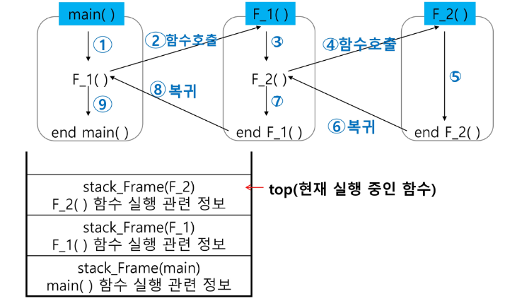
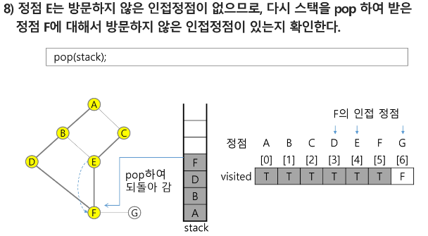

# Algorithm

<div style="text-align: right"> 24. 02. 07. ~  </div>

## 1. Stack

### 1. Stack

  * 스택의 특성

      * 물건을 쌓아 올리듯 자료를 쌓아올린 형태의 자료구조

      * 스택에 저장된 자료는 선형 구조를 갖는다.

        | 구조 | 설명 |
        | :---: | :---: |
        | 선형구조 | 자료 간 관계가 1:1 관계를 갖는다. |
        | 비선형구조 | 자료 간 관계가 1:N 관계를 갖는다.<br>(예: 트리) |
        | |

      * 스택에 자료를 삽입하거나 꺼낼 수 있다.

      * ***후입선출(LIFO : Last-In-First-Out) : 마지막에 삽입한 자료를 가장 먼저 꺼낸다. 스택의 가장 중요한 특성***
      
  * 스택의 구현

      * 스택을 프로그램에서 구현하기 위해 필요한 자료구조와 연산

        * 자료구조 : 자료를 선형으로 저장할 저장소

          * 배열 사용 가능 ***→ 연속적인 메모리 공간에 저장, 미리 메모리 사이즈를 결정해 놓고 사용함.***

          * 저장소 자체를 스택이라 부르기도 한다.

          * 스택에서 마지막 삽입된(가장 최근에 삽입된) 원소 위치를 top 혹은 stack pointer(sp)이라 부른다.

        * 연산

          | 명칭 | 설명 |
          | :---: | :---: |
          | 삽입(push) | 저장소에서 자료를 저장함 |
          | 삭제(pop) | 저장소에서 자료를 꺼낸다<br>꺼낸 자료는 삽입한 자료의 역순으로 |
          | isEmpty | 스택이 공백인지 아닌지 확인하는 연산<br>비었으면 True, 아니면 False |
          | peek | 스택의 top에 있는 원소(item)를 반환 |
          | |

          * 자료구조는 반드시 저장된 데이터를 저장하거나 접근하는(꺼내오는) 기능이 있어야 함 → push, pop과 같은 기능은 반드시 존재

          * 관례적으로 'is'로 시작하는 함수의 반환값은 T / F임

          * 이외 필요한 기능은 상황에 맞춰 직접 만들어 사용

        * 스택의 삽입 / 삭제 과정 : 빈 스택에 원소 A, B, C를 차례로 삽입 후 한번 삭제하는 연산 과정

          

        * 스택의 push 알고리즘

          ```python
          # append method를 통해 list의 마지막에 데이터 삽입
          def push(item):
              s.append(item)

          # list 생성 시 기본 크기가 정해져 있고
          # 추가적인 작업을 통해 list의 지정된 크기를 늘릴 때 연산 시간과 자원이 추가로 걸린다.
          ```

          ```python
          # 스택의 구현
          def push(item, size):
              global top
              top += 1
              if top == size:
                  print('overflow!')
              else:
                  stack[top] = item

          size = 10
          stack = [0] * size
          top = -1

          push(10, size)
          top += 1        # push(20)
          stack[top] = 20 #
          ```

        * 스택의 pop 알고리즘

          ```python
          def pop():
              if len(s) == 0:
                  # underflow
                  return
              else:
                  return s.pop()
          ```

          ```python
          def pop():
              global top
              if top == -1:
                  print('underflow')
                  return 0
              else:
                  top -= 1
                  return stack[top + 1]

          print(pop())
          if top > -1:  # pop()
              top -= 1
              print(stack[top + 1])
          ```

### 2. Stack의 응용 1

  * 스택 구현 고려사항

      * 1차원 배열을 사용해 구현할 경우 ***구현이 용이***하다는 장점, ***스택 크기 변경이 어렵다***는 단점

      * 저장소를 동적으로 할당해 구현 (동적 연결리스트 이용해 구현) → 구현이 복잡하다는 단점, 메모리를 효율적으로 사용한다는 장점. (동적 구현 생략)

  * 응용 1 : 괄호 검사

      * 괄호의 종류 : 대괄호 / 중괄호 / 소괄호

      * 조건

        1. 왼쪽 괄호 개수와 오른쪽 괄호 개수가 같아야 한다.

        2. 같은 괄호에서 왼쪽 괄호는 오른쪽 괄호보다 먼저 나와야 한다.

        3.  괄호 사이에는 포함 관계만 존재

      * 스택을 이용한 괄호 검사

        

        * 문자열에 있는 괄호를 차례대로 조사하며 왼쪽 괄호를 만나면 스택에 삽입, 오른쪽 괄호를 만나면 top 괄호를 삭제 후 오른쪽 괄호와 짝이 맞는지 검사

        * 이 때, 스택이 비어 있으면 조건 1 또는 조건 2에 위배, 괄호의 짝이 맞지 않으면 조건 3에 위배

        * 마지막 괄호까지 조사 후에도 스택에 괄호가 남아 있으면 조건 1에 위배

### 3. Stack의 응용 2

  * Function Call

      * 프로그램에서의 함수 호출과 복귀에 따른 수행 순서 관리

        * 가장 마지막에 호출된 함수가 가장 먼저 실행을 완료하고 복귀하는 후입선출 구조이므로, 후입선출 구조의 스택을 이용해 수행순서 관리

          

        * 함수 호출 발생 시, 호출한 함수 수행에 필요한 지역변수, 매개변수 및 수행 후 복귀할 주소 등의 정보를 스택 프레임(Stack Frame)에 저장해 시스템 스택에 삽입

          

        * 함수 실행이 끝나면 시스템 스택의 top 원소(스택 프레임)를 삭제(pop)하면서 프레임에 저장되어 있던 복귀주소를 확인하고 복귀

        * 함수 호출 / 복귀에 따라 이 과정을 반복하여 전체 프로그램 수행이 종료되면 시스템 스택은 공백 스택이 된다.

          

        * 함수 호출과 복귀에 따른 전체 프로그램의 수행 순서

          

### 4. 재귀호출

  * 필요한 함수가 자신과 같은 경우 자신을 다시 호출하는 구조

  * 함수에서 실행해야 하는 작업의 특성에 따라, 일반적인 호출방식 대신 재귀호출방식을 사용해 함수를 만들면 프로그램의 크기를 줄이고 간단하게 작성
  
  * 예시 1 - factorial

    ```python
    # 재귀호출 예시 - factorial
    #
    # n! = n * (n - 1)!
    #   (n - 1)! = (n - 1) * (n - 2)!
    #   (n - 2)! = (n - 2) * (n - 3)!
    # ...
    #   2! = 2 * 1!
    #   1! = 1
    #
    # 마지막에 구한 하위 값을 이용해 상위 값을 구하는 작업을 반복
    ```

    
    
  * 예시 2 - Fibonacci Numbers
  
    ```python
    # 0과 1로 시작하고, 이전의 두 수 합을 다음 항으로 하는 수열
    def fibo(n):
        if n < 2:
            return n
        else:
            return fibo(n - 1) + fibo(n - 2)
    ```

### 5. Memoization

  * 알고리즘의 효율성 측면에서 재귀함수의 '중복 호출' 문제

    

  * 메모이제이션(Memoization)은 컴퓨터 프로그램을 실행할 때, 이전에 계산한 값을 메모리에 저장해서 매번 다시 계산하지 않도록 하여 전체적인 실행속도를 빠르게 하는 기술 → 동적 계획법의 핵심 기술

  * 피보나치 수를 구하는 알고리즘에서 fibo(n)의 값을 계산하자마자 저장하면(memoize), 실행시간을 $\theta(n)$으로 줄일 수 있다.

    ```python
    # memo를 위한 배열을 할당하고, 모두 0으로 초기화
    # memo[0]을 0으로, memo[1]은 1로 초기화

    def fibo1(n):
        global memo
        if n >= 2 and memo[n] == 0:
            memo[n] = fibo1(n - 1) + fibo1(n - 2)
        return memo[n]

    memo = [0] * (n + 1)
    memo[0] = 0
    memo[1] = 1
    ```

### 6. DP (Dynamic Programming, 동적 계획)

  * 동적 계획 알고리즘

      * 탐욕 알고리즘의 경우와 같이 최적화 문제를 해결하는 알고리즘

      * 먼저 입력 크기가 작은 부분 문제들을 모두 해결한 후 그 해들을 이용해 보다 큰 크기의 부분 문제들을 해결하여, 최종적으로 원래 주어진 입력의 문제를 해결하는 알고리즘

  * Fibonacci Numbers - DP 적용

      * 피보나치 수는 부분 문제의 답으로부터 본 문제의 답을 얻을 수 있음 - 최적 부분 구조로 이루어져 있다.

      1. 문제를 부분 문제로 분할한다.

          ```python
          # fibo(n) = fibo(n - 1) + fibo(n - 2)
          # fibo(n - 1) = fibo(n - 2) + fibo(n - 3)
          # ...
          # fibo(2) = fibo(1) + fibo(0)
          # 따라서, fibo(n)은 fibo(n - 1), fibo(n - 2), ..., fibo(2), fibo(1), fibo(0)의 부분집합으로 나뉨
          ```

      2. 부분 문제로 나누는 일이 끝나면 가장 작은 부분 문제부터 해를 구한다.

      3. 그 결과는 table에 저장하고, table에 저장된 부분 문제의 해를 이용해 상위 문제의 해를 구한다.

          | table index | fibo(index) |
          | :---: | :---: |
          | [0] | 0 |
          | [1] | 1 |
          | [2] | 1 |
          | [3] | 2 |
          | [4] | 3 |
          | ... | ... |
          | [n] | fibo(n) |
          | |

          ```python
          # Fibonacci Numbers의 DP 적용 알고리즘
          def fibo2(n):
              f = [0] * (n + 1)
              f[0] = 0
              f[1] = 1
              for i in range(2, n + 1):
                  f[i] = f[i - 1] + f[i - 2]
              return f[n]
          ```

  * DP의 구현 방식

      * fib1() - recursive 방식

      * fib2() - iterative 방식

  * 재귀 호출 자체의 문제 - 함수의 호출이 많이 일어나, 함수의 호출 ***복귀 시간***이 과도하게 걸릴 수 있음

      * 재귀적 구조는 내부에 시스템 호출 스택을 사용하는 오버헤드가 발생하기 때문

  * 따라서, Memoization을 재귀적 구조에 사용하는 것보다, 반복적 구조로 DP를 구현한 것이 성능면에서 효율적

      ```python
      def f(i, k):
          if i == k:
              print('end')
          else:
              f(i + 1, k)
      f(0, 1000)

      # RecursionError : maximum recursion depth exceeded in comparison
      # 재귀 호출의 깊이(recursion depth)는 생각외로 깊지 않다...
      ```

### 7. DFS (Depth-First Search, 깊이우선탐색)

  * 비선형구조인 그래프 구조는 그래프로 표현된 모든 자료를 빠짐없이 검색하는 것이 중요함

  * 두 가지 방법

      * 깊이 우선 탐색 (DFS, Depth-First Search)

        * 스택을 활용해서 구현할 수도 있다. (스택을 활용해 구현하는 것이 아니다.)

      * 너비 우선 탐색 (BFS, Breadth-First Search)

  * 시작 정점의 한 방향으로 갈 수 있는 경로가 있는 곳까지 깊이 탐색해 가다가 더 이상 갈 곳이 없게 되면, 가장 마지막에 만났던 갈림길 간선이 있는 정점으로 되돌아와 다른 방향의 정점으로 탐색을 계속 반복하여 결국 모든 정점을 방문하는 순회 방법

      * 가장 마지막에 만났던 갈림길의 정점부터 다시 깊이 우선 탐색을 반복해야 하므로 후입선출 구조의 스택 활용

  * DFS 알고리즘

      1. 시작 정점 v를 결정해 방문

      2. 정점 v에 인접한(연결되어 있는) 정점 중에서

        * 방문하지 않은 정점 w가 있으면, 정점 v를 스택에 push하고 정점 w 방문

          * 그리고 w를 v로 하여 다시 2 반복
          
        * 방문하지 않은 정점이 없으면, 탐색의 방향을 바꾸기 위해 스택을 pop하여 받은 가장 마지막 방문 정점을 v로 하여 다시 2를 반복

      3. 스택이 공백이 될 때까지 2를 반복

      ```{:.pseudocode}
      # DFS 알고리즘
      
      visited[], stack[] 초기화
      DFS(v)
          시작점 v 방문;
          visited[v] <- True;
          while {
              if (v의 인접 정점 중 방문하지 않은 정점 w가 있으면)
                  push(v);
                  v <- w; (w에 방문)
                  visited[w] <- True
              else
                  if (스택이 비어있지 않으면)
                      v <- pop(stack);
                  else
                      break
          }
      end DFS()
      ```

      

      

      

      

      

      

      

      
      
      

      

      

      

      
      
      

      

      * 그래프 탐색 시 유향 / 무향에 따라 인접의 정의가 달라짐

        * 유향의 경우, 정방향에 대해 인접하다고 하며 역방향의 경우 인접한 관계라고 하지 않는다.

        * 무향의 경우 방향성과 상관없이 연결되어 있으면 인접한 관계라고 한다.

      * 그래프를 저장한다는 의미

        * 간선들의 정보 저장

        * 각 정점들의 인접 정점들을 저장

### 8. 계산기

* 문자열로 된 계산식이 주어질 때, 스택을 이용해 이 계산식의 값을 계산 가능

* 문자열 수식 계산의 일반적 방법

    1. 중위 표기법의 수식을 후위 표기법으로 변경

    ```{:.pseudocode}
    # 중위표기법 (infix notation)
        → 연산자를 피연산자의 가운데 표기하는 방법 (A + B)

    # 후위표기법 (postfix notation)
        → 연산자를 피연산자 뒤에 표기하는 방법 (AB+)
    ```
    

    * 중위 표기법 → 후위 표기법 변환 방법 1
    
      1. 수식의 각 연산자에 대해 우선순위에 따라 괄호를 사용해 다시 표현

      2. 각 연산자를 그에 대응하는 오른쪽 괄호 뒤로 이동

      3. 괄호 제거

    ```{:.pseudocode}
    # 예) A * B - C / D
        
        1. ( (A * B) - (C / D) )

        2. ( (A B)* - (C D)/ )-
        
        3. AB* CD/ -
    ```

    * 중위 표기법 → 후위 표기법 변환 방법 2 → 스택 이용
    
      1. 입력받은 중위 표기식에서 토큰을 읽는다

      2. 토큰이 피연산자이면 토큰 출력

      3. 토큰이 연산자(괄호 포함)일 때, 이 토큰이 스택의 top에 저장되어 있는 연산자보다 우선순위가 높으면 스택에 push, 그렇지 않으면 스택 top의 연산자의 우선순위가 토큰의 우선순위보다 작을 때까지 스택에서 pop한 후 토큰의 연산자를 push함. 만약 top에 연산자가 없으면 push한다.

      4. 토큰이 오른쪽 괄호 ')'이면 스택 top에 왼쪽 괄호 '('가 올 때까지 스택에 pop 연산을 수행하고 pop한 연산자 출력. 왼쪽 괄호를 만나면 pop만 하고 출력하지 않는다.

      5. 중위 표기식에 더 읽을 것이 없다면 중지하고, 더 읽을 것이 있다면 1부터 다시 반복

      6. 스택에 남아있는 연산자를 모두 pop하여 출력

        * 스택 밖의 왼쪽 괄호는 우선 순위가 가장 높으며, 스택 안의 왼쪽 괄호는 우선 순위가 가장 낮다.

      ```{:.pseudocode}
      icp(in-coming priority)
      isp(in-stack priority)

      if (icp > isp)  push()
      else  pop()
      ```
      | token | isp | icp |
      | :---: | :---: | :---: |
      | ) | - | - |
      | *, / | 2 | 2 |
      | +, - | 1 | 1 |
      | ( | 0 | 3 |
      | |

    2. 후위 표기법의 수식을 스택을 이용해 계산

        1. 피연산자를 만나면 스택에 push한다.

        2. 연산자를 만나면 필요한 만큼의 피연산자를 스택에서 pop하여 연산하고, 연산결과를 다시 스택에 push

        3. 수식이 끝나면, 마지막으로 스택을 pop하여 출력

### 9. 백트래킹 (Backtracking)

* 해를 찾는 도중 막히면(즉, 해가 아니면) 되돌아가서 다시 해를 찾아가는 기법

* 백트래킹 기법은 최적화(optimization) 문제와 결정(decision) 문제를 해결할 수 있다.

* 결정 문제 : 문제의 조건을 만족하는 해가 존재하는지의 여부를 'yes' 또는 'no'로 답하는 문제

    * 미로 찾기

    * n-Queen 문제

    * Map coloring

    * 부분 집합의 합(Subset Sum) 문제 등

* 미로 찾기

    * 입구와 출구가 주어진 미로에서, 입구부터 출구까지의 경로를 찾는 문제

    * 이동 방향은 4방향으로 제한함

      

      

      

      
      
* 백트래킹과 깊이우선탐색의 차이

    * 어떤 노드에서 출발하는 경로가 해결책으로 이어질 것 같지 않으면 더 이상 그 경로를 따라가지 않음으로써 시도 횟수를 줄임 (Prunning 가지치기)

    * 깊이우선탐색이 모든 경로를 추적하는데 비해 백트래킹은 불필요한 경로를 조기에 차단

    * 깊이우선탐색을 가하기에 경우의 수가 너무나 많음 → n! 가지의 경우의 수를 가진 문제에 대해 깊이우선탐색을 가하면 처리 불가능한 문제

    * 백트래킹 알고리즘을 적용하면 일반적으로 경우의 수가 줄어들지만 이 역시 최악의 경우 여전히 지수함수 시간(Exponential Time)을 요하므로 처리 불가능

* 백트래킹 기법

    * 어떤 노드의 유망성을 점검한 후 유망(promising)하지 않다고 결정되면 그 노드의 부모로 되돌아가(backtracking) 다음 자식 노드로 감.

    * 어떤 노드를 방문 시 그 노드를 포함한 경로가 해답이 될 수 없으면 그 노드는 유망하지 않다고 하며, 반대로 해답의 가능성이 있으면 유망하다고 한다.

    * 가지치기(prunning) : 유망하지 않는 노드가 포함되는 경로는 더 이상 고려하지 않는다. → 모든 후보(경우)를 고려하지 않음!

* 백트래킹 알고리즘 절차

    * 상태 공간 트리의 깊이 우선 검색 실시

    * 각 노드가 유망한지 점검

    * 만일 그 노드가 유망하지 않으면, 그 노드의 부모 노드로 돌아가 검색을 계속

* 일반 백트래킹 알고리즘

    ```{:.pseudocode}
    def checknode(v):  # node
        if promising(v):
            if there is a solution at v:
                write the solution
            else:
                for u in each child of v:
                    checknode(u)
    ```

    

    

      * 순수한 dfs - 155 nodes

      * backtracking - 27 nodes

### 10. 부분집합 (Powerset) / 순열 (Permutation)

* 백트래킹 기법으로 powerset 생성

    ```python
    # 각 원소가 부분집합에 포함되었는지를 loop를 이용해 확인하고 부분집합을 생성하는 방법
    bit = [0, 0, 0, 0]
    for i in range(2):
        bit[0] = i  # 0번째 원소
        for j in range(2):
            bit[1] = j  # 1번째 원소
            for k in range(2):
                bit[2] = k  # 2번째 원소
                for l in range(2):
                    bit[3] = l  # 3번째 원소
                    print(bit)  # 생성된 부분집합 출력
    ```

    ```python
    # powerset을 구하는 backtracking 알고리즘
    def backtrack(a, k, input):
        global MAXCANDIDATES
        c = [0] * MAXCANDIDATES

        if k == input:
            process_solution(a, k)  # 답이면 원하는 작업을 한다.
        else:
            k += 1
            ncandidates = construct_candidates(a, k, input, c)
            for i in range(ncandidates):
                a[k] = c[i]
                backtrack(a, k, input)

    def construct_candidates(a, k, input, c):
        c[0] = True
        c[1] = False
        return 2

    MAXCANDIDATES = 2
    NMAX = 4
    a = [0] * NMAX
    backtrack(a, 0, 3)
    ```

* 백트래킹 기법으로 순열 생성

    ```python
    # {1, 2, 3}을 포함하는 모든 순열을 생성하는 함수 - 동일한 숫자가 포함되지 않았을 때
    for i1 in range(1, 4):
        for i2 in range(1, 4):
            if i2 != i1:
                for i3 in range(1, 4):
                    if i3 != i1 and i3 != i2:
                        print(i1, i2, i3)
    ```

    ```python
    # backtracking을 이용해 순열 구하기
    def backtrack(a, k, input):
        global MAXCANDIDATES
        c = [0] * MAXCANDIDATES

        if k == input:
            for i in range(1, k + 1):
                print(a[i], end = ' ')
            print()

        else:
            k += 1
            ncandidates = construct_candidates(a, k, input, c)
            for i in range(ncandidates):
                a[k] = c[i]
                backtrack(a, k, input)

    def construct_candidates(a, k, input, c):
        in_perm = [False] * NMAX
        
        for i in range(1, k):
            in_perm[a[i]] = True

        ncandidates = 0
        for i in range(1, input + 1):
            if in_perm[i] == False:
                c[ncandidates] = i
                ncandidates += 1
        return ncandidates
    ```

    

    

    

### 0. 참고

  * '자료구조' 는 의미상 '데이터 저장소' 의 의미에 더 가까운 경우가 종종 있다.

  * Python 에서의 list는 이미 스택의 대부분 특성(기능)에 해당하는 연산(append, pop 등)이 구현되어 있다.

      * Python 의 기능적 측면이 아닌, '일반적인 자료구조의 관점' 에서 생각할 수 있도록 코딩 시 주의하면 학습에 좋을 것

  * ***연속된 메모리 공간***을 사용한다는 것은 ***index를 사용하는*** 것

      * index를 조작해 데이터를 읽고 / 쓰고 함 → 읽고 / 쓰고 하는 위치를 가리키는 변수가 ***top***


  * 프로그램 실행 시 데이터 저장 공간(RAM 상의 메모리)가 필요한데, 이는 ***운영 체제***가 관리함

      * 실행 시 얼마만큼의 메모리가 필요한지 알고 있다면(사용할 메모리의 크기가 이미 결정되어 있다면), 프로그램 실행 시 자동으로 메모리를 할당할 수 있음 → ***정적 메모리 할당***

      * 반대로, 컴퓨터 프로그램이 실행되는 도중(런타임 도중) 사용할 메모리 공간을 할당하는 것을 ***동적 메모리 할당***

  * token : 컴퓨터의 내부 데이터 표현, 또는 식별 및 컴퓨터가 해석이 가능한 컴퓨터 데이터의 최소 단위

  * 최적화 문제와 결정 문제

      * 결정(decision) 문제: 문제의 조건을 만족하는 해가 존재하는지의 여부를 'Yes' 또는 'No' (혹은 T / F)로 답하는 문제

      * 최적화(optimization) 문제 : 문제의 조건을 만족하는 해가 있다면, 그 중 가장 최적의 해를 찾아 답하는 문제

        * 최적해는 문제의 조건에 해당하는 값이 최대 / 최소인 경우

  * Backtracking

      * 우선 모든 경우를 다 고려하는 경우를 설계(DFS)

      * 이후 가지치기가 가능한 경우를 고려

        * 결국 최악의 경우 모든 경우를 다 고려하게 되겠지만, 평균적으로 연산 시간이 짧아질 것