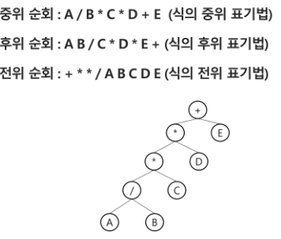
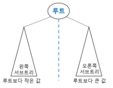
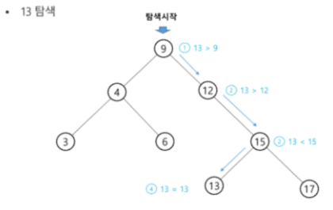
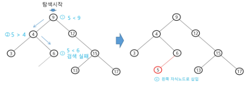
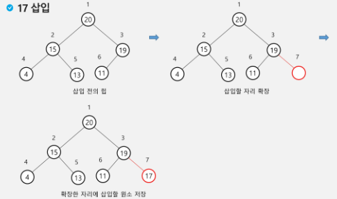
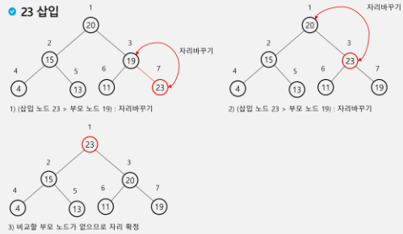
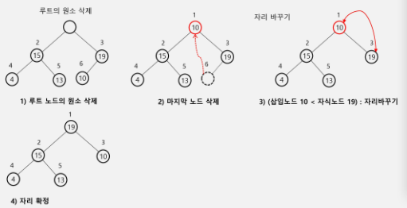

# Algorithm

<div style="text-align: right"> 24. 02. 20. ~ 24. 02. 21. </div>

## 1. Tree

### 1. Tree

* 트리

    * **트리는 그래프의 subset(부분집합)**

        * 트리는 유향 그래프처럼 인접 정점 관계(부모 - 자식 관계)를 저장해 놓고 탐색하는 것과 비슷함

    * 비선형 구조

    * 원소들 간에 1:n 관계를 가지는 자료구조

    * 원소들 간에 계층 관계를 가지는 계층형 자료구조

    * 상위 원소에서 하위 원소로 내려가면서 확장되는 트리(나무) 모양의 구조

* Definition

    * 한 개 이상의 노드로 이루어진 유한 집합이며, 다음 조건을 만족함

        * 노드 중 최상위 노드를 루트(root)라고 한다.

        * 나머지 노드들은 n개의 분리집합 T1, ..., Tn으로 분리될 수 있다. (n >= 0)

    * 이들 T1, ..., Tn은 각각 하나의 트리가 되며(재귀적 정의) 루트의 부 트리(subtree)라고 한다.

        

        

    * 노드 Node - 트리의 원소

        * 트리 T의 노드 : A, B, C, D, E, F, G, H, I, J, K

    * 간선 Edge - 노드를 연결하는 선, 부모 노드와 자식 노드를 연결

    * 루트 노드 Root Node - 트리의 시작 노드

        * 트리 T의 루트노드 : A

    * 형제 노드 Sibling Node - 같은 부모 노드의 자식 노드들

        * B, C, D는 형제 노드

    * 조상 노드 - 간선을 따라 루트 노드까지 이르는 경로에 있는 모든 노드들

        * K의 조상 노드 - F, B, A

    * 서브트리 Subtree - 부모 노드와 연결된 간선을 끊었을 때 생성되는 트리

    * 자손 노드 - 서브트리에 있는 하위 레벨의 노드들

        * B의 자손 노드 - E, F, K

    * 차수 Degree

        * 노드의 차수 : 노드에 연결된 자식 노드의 수

            * B의 차수 = 2, C의 차수 = 1

        * 트리의 차수 : 트리에 있는 노드의 차수 중 가장 큰 값

            * 트리 T의 차수 = 3

        * 단말 노드(leaf node) : 차수가 0인 노드, 자식 노드가 없는 노드

    * 높이

        * 노드의 높이 : 루트에서 노드에 이르는 간선 수, 노드의 레벨

            * B의 높이 = 1, F의 높이 = 2

        * 트리의 높이 : 트리에 있는 노드의 높이 중 가장 큰 값, 최대 레벨

            * 트리 T의 높이 = 3

### 2. 이진 트리

* 이진 트리

    * 모든 노드들이 2개의 서브트리를 갖는 특별한 형태의 트리

    * 각 노드가 자식 노드를 *최대 2개까지만* 가질 수 있는 트리

        * 왼쪽 자식 노드 (left child node) / 오른쪽 자식 노드 (right child node)

            

* 이진 트리의 특성

    * 레벨 i에서의 노드 최대 개수는 $2^i$개

    * 높이가 h인 이진 트리가 가질 수 있는 노드의 최소 개수는 h + 1개가 되며, 최대 개수는 $2^h$ $^+$ $^1 - 1$ 개가 된다.

* 포화 이진 트리 Full Binary Tree

    * 모든 레벨에 노드가 포화 상태로 차 있는 이진 트리

    * 높이가 h일 때, 최대의 노드 개수인 $2^h$ $^+$ $^1 -1$ 의 노드를 가진 이진 트리

    * 루트를 1번으로 하여 $2^h$ $^+$ $^1 -1$ 까지 정해진 위치에 대한 노드 번호를 가짐

* 완전 이진 트리 Complete Binary Tree

    * 높이가 h이고 노드 수가 n개일 때 (단, $2^h$ <= n <= $2^h$ $^+$ $^1 + 1$), 포화 이진 트리의 노드 번호 1번부터 n번까지 빈 자리가 없는 이진 트리

    * 예) 노드가 10개인 완전 이진 트리

        


* 편향 이진 트리 Skewed Binary Tree

    * 높이 h에 대한 최소 개수의 노드를 가지면서 한쪽 방향의 자식 노드만들 가진 이진 트리

        * 왼쪽 / 오른쪽 편향 이진 트리

        

### 3. 이진 트리 - 순회 (Traversal)

* 순회

    * 트리의 각 노드를 중복되지 않게 체계적으로 전부 방문(visit)하는 것

    * 트리는 비선형구조이기 때문에, 선형구조에서와 같이 선후 연결관계를 알 수 없어 특별한 방법이 필요하다.

* 기본 순회 방법 3가지

    * 전위순회 Preorder traversal, VLR

        * 부모노드 방문 후, 자식노드를 좌우 순서대로 방문

    * 중위순회 Inorder traversal, LVR

        * 왼쪽 자식노드, 부모노드, 오른쪽 자식노드 순으로 방문

    * 후위순회 Postorder traversal, LRV

        * 자식노드를 좌우 순서로 방문 후 부모노드로 방문

* 전위순회 Preorder traversal

    **방문 순서대로 처리**

    1. 현재 노드 n을 방문해 처리한다. V

    2. 현재 노드 n의 왼쪽 서브트리로 이동한다. L

    3. 현재 노드 n의 오른쪽 서브트리로 이동한다. R

        ```python
        def preorder_transverse(T): # 전위순회
            if T:                   # T is not None
                visit(T)            # print(T.item)
                preorder_transverse(T.left)
                preorder_transverse(T.right)
        ```

        

* 중위순회 Inorder traversal

    **가장 왼쪽부터 방문해 처리**

    1. 현재 노드 n의 왼쪽 서브트리로 이동한다. L

    2. 현재 노드 n을 방문해 처리한다. V

    3. 현재 노드 n의 오른쪽 서브트리로 이동한다. R

        ```python
        def inorder_transverse(T):
            if T:
                inorder_transverse(T.left)
                visit(T)
                inorder_transverse(T.right)
        ```

        

* 후위순회 Postorder traversal

    **루트를 가장 마지막에 방문**

    1. 현재 노드 n의 왼쪽 서브트리로 이동한다. L

    2. 현재 노트 n의 오른쪽 서브트리로 이동한다. R

    3. 현재 노드 n을 방문해 처리한다. V

        ```python
        def postorder_traverse(T):
            if T:
                postorder_traverse(T.left)
                postorder_traverse(T.right)
                visit(T)
        ```

        

### 4. 이진 트리 표현

* 배열을 이용한 이진 트리 표현

    * 루트의 번호가 1

    * 레벨 n에 있는 노드에 대해 왼쪽부터 오른쪽으로 $2^n$ 부터 $2^n$ $^+$ $^1 - 1$ 까지 번호를 차례로 부여

        

    * 노드 번호의 성질

        * 노드 번호가 i인 노드의 부모 노드 번호 : $i // 2$

        * 노드 번호가 i인 노드의 왼쪽 자식 노드 번호 : $2i$

        * 노드 번호가 i인 노드의 오른쪽 자식 번호 : $2i + 1$

        * 레벨 n의 노드 번호 시작 번호 : $2^n$

        * 높이 h인 이진 트리를 위한 배열 크기 : $2^h$ $^+$ $^1 - 1$

            * h = 0, 1, 2, ...

            * $1 + 2 + 4 + 8 + ... + 2^i = \sum2^i = 2^h$ $^+$ $^1 - 1$

        

        

    * 노드 번호를 배열의 인덱스로 사용
        
        

        

    * 편향 이진 트리의 배열 표현
        


### 5. 수식 트리 (수식 이진 트리, Expression Binary Tree)

* 수식 트리

    * 수식을 표현하는 이진 트리

    * 연산자는 루트 노드 혹은 가지 노드

    * 피연산자는 모두 잎 노드

        

### 6. 이진 탐색 트리

* 이진 탐색 트리

    * 탐색 작업을 *효율적으로* 하기 위한 자료구조

    * 모든 원소는 서로 다른 유일한 키를 갖는다.

    * key(왼쪽 서브트리) < key(루트 노드) < key(오른쪽 서브트리)

    * 왼쪽 서브트리와 오른쪽 서브트리도 이진 탐색 트리이다.

    * 중위 순회 시 오름차순으로 정렬된 값을 얻을 수 있다.

        

        

* 이진 탐색 트리 연산

    * 탐색 연산

        1. 루트에서 시작

        2. 탐색할 키 값 x를 루트 노드의 키 값과 비교

            * 키 값 x = 루트 노드의 키 값인 경우 → 원하는 원소를 찾았으므로 탐색연산 성공

            * 키 값 x < 루트 노드의 키 값인 경우 → 루트 노드의 왼쪽 서브트리에 대해 탐색연산 수행

            * 키 값 x > 루트 노드의 키 값인 경우 → 루트 노드의 오른쪽 서브트리에 대해 탐색연산 수행

        3. 서브트리에 대해 순환적으로 탐색 연산 반복

            

    * 삽입 연산

        1. 먼저 탐색 연산을 수행

            * 삽입할 원소와 같은 원소가 트리에 있으면 삽입할 수 없으므로, 같은 원소가 트리에 있는지 탐색해 확인

            * 탐색에서 탐색 실패가 결정되는 위치가 삽입 위치가 된다.

        2. 탐색 실패한 위치에 원소를 삽입

            

* 이진 탐색 트리 연산의 성능

    * 탐색(searching), 삽입(insertion), 삭제(deletion) 시간은 트리의 높이만큼 시간이 걸린다.

        * $O(h)$, $h$: BST의 깊이

    * 평균의 경우

        * 이진 트리가 균형적으로 생성되어 있는 경우

        * $O(log n)$

    * 최악의 경우

        * 한쪽으로 치우친 경사 이진트리의 경우

        * $O(n)$ - 순차탐색과 시간복잡도가 같다.

        * 이 때문에, 이진 트리를 구현하는 경우 균형잡힌 트리 형상 구현이 중요하다.

    * 검색 알고리즘의 비교

        * 배열에서의 순차 검색 : $O(n)$

        * 정렬된 배열에서의 순차 검색 : $O(n)$

        * 정렬된 배열에서의 이진 탐색 : $O(log n)$

            * 고정 배열 크기와 삽입, 삭제 시 추가 연산 필요
        
        * 이진 탐색 트리에서의 평균 : $O(log n)$

            * 최악의 경우 : $O(n)$

            * 완전 이진 트리 또는 균형 트리로 바꿀 수 있다면 최악의 경우를 없앨 수 있다.

                * 새로운 원소를 삽입 시 삽입 시간을 줄인다.

                * 평균과 최악의 시간이 같다. $O(log n)$

        * Hash 검색 : $O(1)$

            * 추가 저장 공간이 필요


### 7. 힙 (이진 힙, binary heap)

* **완전 이진 트리** / **부모 / 자식 간 관계**

* **완전 이진 트리**에 있는 노드 중 키 값이 가장 큰 / 작은 노드를 찾기 위해 만든 자료구조

    * 최대 힙 (max heap)

        * 키 값이 가장 큰 노드를 찾기 위한 *완전 이진 트리*

        * 부모 노드의 키 값 > 자식 노드의 키 값

        * 루트 노드 : 키 값이 가장 큰 노드

    * 최소 힙 (min heap)

        * 키 값이 작은 큰 노드를 찾기 위한 *완전 이진 트리*

        * 부모 노드의 키 값 < 자식 노드의 키 값

        * 루트 노드 : 키 값이 가장 작은 노드

* 힙 연산 - 삽입

    * 완전 이진 트리에서의 노드 추가

    * 삽입 자리 확장 후, 확장한 자리에 삽입할 원소 저장

    * 1차원 배열(list)에서의 원소 조작을 생각

        * 최대 힙의 경우 - 확장한 자리의 원소보다 부모 노드의 원소가 작다면 자리바꾸기 연산이 필요 없음

        

        * 확장한 자리의 원소가 부모 노드의 원소보다 크다면 자리바꾸기 연산이 필요함

        

* 힙 연산 - 삭제

    * 힙에서는 루트 노드의 원소만들 삭제할 수 있다

        * 최대 힙 : key가 가장 큰 값

    * 루트 노드의 원소를 삭제해 반환한다.

    * 힙의 종류에 따라 최대값 혹은 최소값을 구할 수 있다.

        

* 힙은 우선순위 큐를 구현하는 데 사용