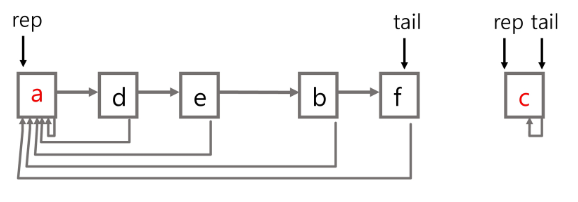

# Algorithm

<div style="text-align: right"> 24. 03. 19. ~ </div>

## 1. 트리

### 1. 트리

* 트리

    * **사이클이 없는 무향 연결 그래프**

        * 사이클 : 방문했던 노드로 다시 돌아오는 다른 경로가 있는 경우

        * 무향 : 간선에 방향이 없다 (양방향)

        * 연결 그래프 : 모든 꼭지점이 서로 갈 수 있는 경로가 있다.

        * *트리는 그래프의 일종이다!*

    * 각 노드는 최대 하나의 부모 노드가 존재할 수 있다.

    * 각 노드는 자식 노드가 없거나 하나 이상 존재할 수 있다.

    * 비선형 구조

        * 원소들 간에 1:n 관계를 가지는 자료 구조

        * 원소들 간에 **계층 관계**를 가지는 계층형 자료구조

    * 한 개 이상의 노드로 이루어진 유한 집합이며 다음 조건을 만족한다.

        1. 노드 중 부모가 없는 노드를 루트(root)

        2. 나머지 노드들은 n개의 분리 집합 T1, ..., Tn으로 분리될 수 있다.

            이들 T1, ..., Tn은 각각 하나의 트리가 되며(재귀적 정의) 루트의 서브트리(subtree)라고 한다.

    * 노드 (node, 정점 (vertex)) : 트리의 원소

    * 간선 : 노드를 연결하는 선

    * 루트 노드 : 트리의 시작 노드

    * 높이

        * 노드의 높이 : 루트에서 노드에 이르는 간선의 수. 노드의 레벨

        * 트리의 높이 : 트리에 있는 노드의 높이 중 가장 큰 값. 최대 레벨

* 이진 트리

    * 모든 노드들이 최대 2개의 서브트리를 갖는 특별한 형태의 트리

    * 각 노드가 자식 노드를 최대 2개까지만 가질 수 있는 트리

        * 왼쪽 자식 노드 (left child node)
        
        * 오른쪽 자식 노드 (right child node)

    * 포화 이진 트리 (Full Binary Tree)

        * 모든 레벨의 노드가 포화 상태로 채워져 있는 이진 트리

    * 완전 이진 트리 (Complete Binary Tree)

        * 높이가 h이고 노드 수가 n개일 때, 포화 이진 트리의 노드 번호 1번부터 n번까지 빈 자리가 없는 이진 트리

    * 편향 이진 트리 (Skewed Binary Tree)

        * 높이 h에 대한 최소 개수의 노드를 가지면서 한쪽 방향의 자식 노드만들 가진 이진 트리

    * 순회 (Traversal)

        * 트리의 각 노드를 중복되지 않게 모두 방문하는 것

        * 전위 순회 (Preorder Traversal, VLR) : 부모 노드 먼저, 그 다음 자손 노드 방문

        * 중위 순회 (Inorder Traversal, LVR) : 왼쪽 자손 노드, 현재 노드, 오른쪽 자손 노드 순으로 방문

        * 후위 순회 (Postorder Traversal, LRV) : 부모 노드보다 자손 노드를 먼저 방문

### 2. 이진 탐색 트리 (BST)

* 이진 탐색 트리

    * 탐색 작업을 효율적으로 하기 위한 자료구조

    * 모든 원소는 서로 다른 유일한 키를 갖는다.

    * key(왼쪽 서브트리) < key(루트 노드) < key(오른쪽 서브트리)

    * 왼쪽 서브트리와 오른쪽 서브트리도 이진 탐색 트리이다.

    * 중위 순회하면 오름차순으로 정렬된 값을 얻을 수 있다.

* 탐색 연산

    * 루트에서 시작

    * 탐색할 키 값을 루트 노드의 키 값과 비교

        * 동일하다면 - 탐색 성공

        * 탐색 값이 루트 노드 키 값보다 작다면 - 루트의 왼쪽 서브트리에 대해 탐색 수행

        * 탐색 값이 루트 노드 키 값보다 크다면 - 루트의 오른쪽 서브트리에 대해 탐색 수행

* 삽입 연산

    * 먼저 탐색 연산을 수행

        * 삽입할 원소와 같은 원소가 트리에 있으면 삽입할 수 없으므로, 같은 원소가 트리에 있는지 탐색하여 확인

    * 탐색 실패가 결정되는 위치가 삽입 위치가 된다. → 탐색 실패 위치에 원소 삽입

* 삭제 연산

* 성능

    * 탐색, 삽입, 삭제 시간은 트리의 높이만큼 시간이 걸린다.

    * 평균의 경우 - 이진 트리가 균형적으로 생성되어 있는 경우 $O(log n)$

    * 최악의 경우 - 편향 트리의 경우 $O(n)$

### 3. 힙 (Heap Tree)

* 힙 (heap)

    * 완전 이진 트리에 있는 노드 중 키 값이 가장 큰 / 작은 노드를 찾기 위해 만든 자료구조

    * 최대 힙 (max heap), 최소 힙 (min heap)

        * 키 값이 가장 큰(작은) 노드를 찾기 위한 완전 이진 트리

        * 부모 노드의 키 값 >(<) 자식 노드의 키 값

        * 루트 노드 : 키 값이 가장 큰(작은) 노드

        * 형제 노드끼리는 관계 제한이 없다.

* 힙의 삽입 연산

    * 힙의 마지막에 원소 삽입

    * 그 후 자리 찾아가기

* 힙의 삭제 연산

    * 루트 노드의 원소 삭제

    * 마지막 노드 삭제 후 루트 노드 자리에 값 부여

    * 그 후 자리 바꾸기 연산 실행
    
    * 힙에서는 루트 원소의 노드만 삭제할 수 있다.

    * 루트 노드의 원소를 삭제 후 반환

    * 힙의 종류에 따라 최대 / 최소값을 구할 수 있다.

* 힙의 활용

    * 힙을 활용하는 대표적인 2가지 예는 특별한 큐의 구현과 정렬이다.

    * 우선순위 큐를 구현하는 가장 효율적인 방법이 힙을 사용하는 것

    * from collections import heapQ

## 2. 그래프

### 1. 그래프

* 아이템(사물 또는 추상적 개념)들과 이들 사이의 연결 관계를 표현

* 그래프는 정점(Vertex)들의 집합과 이들을 연결하는 간선(Edge)들의 집합으로 구성된 자료구조

* 선형 자료구조나 트리 자료구조료 표현하기 어려운 N : N 관계를 가지는 원소들을 표현하기에 용이

* 그래프 유형

    * 무향 그래프 (Undirected Graph)

    * 유향 그래프 (Directed Graph)

    * 가중치 그래프 (Weighted Graph)

    * 사이클이 없는 방향 그래프 (DAG, Directed Acyclic Graph)

    * 완전 / 부분 그래프

        * 완전 그래프 : 정점들에 대해 가능한 모든 간선들을 가진 그래프

        * 부분 그래프 : 원래 그래프에서 일부의 정점이나 간선을 제외한 그래프

* 인접 (Adjacency)

    * 두 개의 정점에 간선이 존재(연결됨)하면 서로 인접해 있다고 한다.

    * 완전 그래프에 속한 임의의 두 정점들은 모두 인접해 있다.

* 그래프 경로

    * 경로 : 간선들을 순서대로 나열한 것

    * 단순경로 : 경로 중 한 정점을 최대한 한번만 지나는 경로

    * 사이클 : 시작한 정점에서 끝나는 경로

* 그래프 표현

    * *간선의 정보를 저장*하는 방식

    * 인접 행렬 (Adjacent Matrix)
    
        * $|V| \times |V|$ 크기의 2차원 배열을 이용해 간선 정보 저장

        * 두 정점을 연결하는 간선의 유무(인접시 1, 그렇지 않으면 0)를 행렬로 표현

        * 무향 그래프의 경우, $i$번째 행의 합 = $j$번째 열의 합 = $V_i$의 차수

        * 유향 그래프의 경우

            * 행 $i$의 합 = $V_i$의 진출 차수

            * 열 $i$의 합 = $V_i$의 진입 차수
        
    * 인접 리스트 (Adjacent List)

        * 각 정점마다 해당 정점으로 나가는 간선의 정보를 저장

    * 간선의 배열

        * 간선(시작 정점, 끝 정점)을 배열에 연속적으로 저장

## 3. Union-Find (Disjoint Set)

### 1. 서로소 집합 (상호배타 집합, Disjoint-sets)

* 서로 중복 포함된 원소가 없는 집합 (교집합이 없음)

* 집합에 속한 하나의 특정 멤버를 통해 각 집합을 구분 → **대표자(representative)**

* 연결 리스트 / 트리를 이용해 상호배타 집합을 표현할 수 있다.

* 상호배타 집합 연산

    * Make-Set($x$) 
    
        * 집합 만들기

        * 대표자 : $x$

    * Find-Set($x$)

        * $x$가 속한 집합을 찾음

        * 그 집합의 **대표자를 return**함

    * Union($x$, $y$)

        * $x$가 대표자인 집합과 $y$가 대표자인 집합을 묶음

### 2. 서로소 집합 표현 - 연결리스트

* 같은 집합의 원소들은 하나의 연결리스트로 관리한다.

* 연결리스트의 맨 앞의 원소를 집합의 대표 원소로 삼는다.

* 각 원소는 집합의 대표원소를 가리키는 링크를 갖는다.


* 연결 리스트 연산 예시

    * Find-Set($e$) → return $a$

    * Find-Set($f$) → return $b$

    * Union($a$, $b$)

    

### 3. 서로소 집합 표현 - 트리

* 하나의 집합(a disjoint set)을 하나의 트리로 표현한다.

* 자식 노드가 부모 노드를 가리키며, 루트 노드가 대표자가 된다.

* 트리 연산 예시

    * Find-Set($a$) ~ Find-Set($f$)

    

    * Union($c$, $d$), Union($e$, $f$)

    

    * Union($d$, $f$)

    

    * Find-Set($d$) → return $c$

    * Find-Set($e$) → return $c$

    ```python
    # 1 ~ 6번까지 노드가 존재
    # 1. make_set
    def make_set(n):
        return [i for i in range(n)]

    # 1 ~ 6번까지 활용하기 위해 (0번은 버림)
    parents = make_set(7)

    # 2. find-set : 대표자를 찾아보자
    # - 부모 노드를 보고, 부모 노드도 연결이 되어 있다면 다시 반복
    # - 언제까지? 자기 자신이 대표인 데이터를 찾을 때까지
    def find_set(x):
        # 기저조건 - 자기 자신이 대표라면
        if parents[x] == x:
            return x

        else:
            return find_set(parents[x])

    # 3. union
    def union(x, y):
        x = find_set(x)
        y = find_set(y)

        # 이미 같은 집합에 속해있다면 return
        if x == y:
            return

        # 다른 집합이라면 합침
        # 예시) 더 작은 루트 노드에 합쳐라!! (문제 조건에 따라 다름)
        if x < y:
            parents[y] = x
        else:
            parents[x] = y

    print(parents)
    union(1, 3)
    union(2, 3)
    union(5, 6)
    print(parents)
    ```

* 상호 배타 집합 연산의 문제점


* 문제점을 해결하기 위한 방법 (연산의 효율을 높이는 방법)

    * Rank를 이용한 Union

        * 각 노드는 자신을 루트로 하는 서브트리의 높이를 Rank라는 이름으로 저장

        * 두 집합을 합칠 때 Rank가 낮은 집합을 Rank가 높은 집합에 붙인다.

    * Path Compression

        * Find-Set을 행하는 과정에서 만나는 모든 노드들이 직접 root를 가리키도록 포인터를 바꾸어 준다.