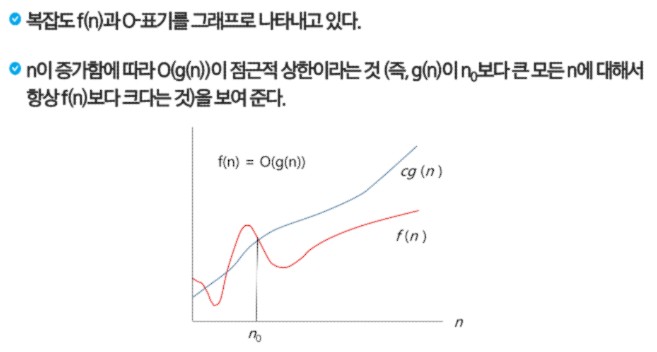
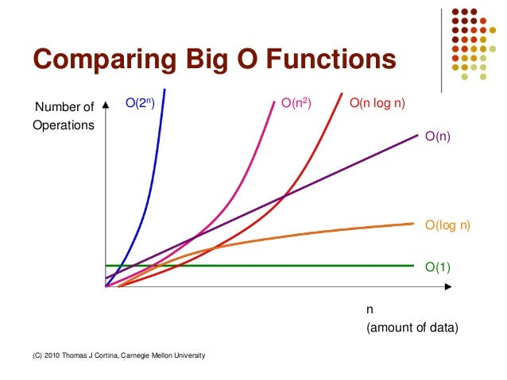

# APS : Algorithm Problem Solving

 24. 02. 22. ~   

## 1. Start

### 1. SW 문제 해결

* SW 문제 해결 역량

    * 무엇인가를 이해하고 역량을 강화하는 방법

    * 문제 해결 과정

        1. 문제를 읽고 이해

        2. 문제를 익숙한 용어로 재정의

        3. 어떻게 해결할지 계획을 세운다

        4. 계획을 검증

        5. 프로그램으로 구현

        6. 어떻게 풀었는지 복기 / 디버깅, 개선 여지 확인

### 2. 복잡도 분석 - 시간 복잡도

* 알고리즘

    * 유한한 단계를 통해 문제를 해결하기 위한 절차나 방법

* 알고리즘의 효율

    * 공간적 효율성

        * 연산량 대비 얼마나 적은 메모리 공간을 요하는가
    
    * 시간적 효율성

        * 연산량 대비 얼마나 적은 시간을 요하는가

    * 복잡도 (Complexity)

        * 효율성을 뒤집어 표현

        * 복잡도가 높을수록 효율성이 저하

        * 시간 복잡도 → 반복문을 얼마나 많이 사용했나??

* 시간적 복잡도 분석

    * 하드웨어 환경, 소프트웨어 환경에 영향

    * 복잡도의 점근적 표기

        * 시간 / 공간 복잡도는 입력 크기에 대한 함수로 표기 - 여러 개의 항을 가지는 다항식

        * 이를 단순한 함수로 표현하기 위해 점근적 표기(Asymptotic Notation)를 사용

        * 입력 크기 n이 무한대로 커질 때의 복잡도를 간단히 표현하기 위해 사용

            * $O$-표기

            * $\Omega$-표기

            * $\Theta$-표기

    * $O$-표기

        * 복잡도의 *점근적 상한*을 나타냄

        * 복잡도가 $f(n) = 2n^2 - 7n + 4$이라면, $f(n)$의 $O$-표기는 $O(n^2)$이다.

        * $f(n)$의 단순화된 표현은 $n^2$이다.

            * 단순화된 함수 $n^2$에 임의의 상수 $c$를 곱한 $cn^2$이 $n$이 증가함에 따라 $f(n)$의 상한이 된다. (단, $c > 0$)

        * 단순히 *실행시간이 $n^2$에 비례*하는 알고리즘이라고 말함

        

        * 자주 사용하는 $O$-표기

            | $O$-Notation | Explanation | Example |
            | :---: | :---: | :---: |
            | $O(1)$ | 상수 시간 (Constant Time) | deque - popleft() |
            | $O(log n)$ | 로그(대수) 시간 (Logarithmic Time) | BinarySearch |
            | $O(n)$ | 선형 시간 (Linear Time) | CountingSort, pop(0) |
            | $O(n log n)$ | 로그 선형 시간 (Log-linear Time) | sort() |
            | $O(n^2)$ | 제곱 시간 (Quadratic Time) | BubbleSort |
            | $O(n^3)$ | 세제곱 시간 (Cubic Time) | |
            | $O(2^n)$ | 지수 시간 (Exponential Time) | |
            | |

            

    * $\Omega$-표기

        * 복잡도의 *점근적 하한*을 나타냄

        * $f(n) = 2n^2 - 7n + 4$이라면, $f(n)$의 $\Omega$-표기는 $O(n^2)$이다.

        * $f(n) = \Omega(n^2)$은 $n$이 증가함에 따라 $2n^2 - 7n + 4$가 $cn^2$보다 작을 수 없다라는 의미
        
            * 이때, $c = 1$

        * $O$-표기 때와 마찬가지로 $\Omega$-표기도 복잡도 다항식의 최고차항만 계수 없이 취하면 됨

        * **최소한 이만한 시간은 걸린다**

    * $\Theta$-표기

        * $O$-표기와 $\Omega$-표기가 같은 경우 사용

        * $f(n) = 2n^2 - 7n + 4$의 경우 $O(n^2) = \Omega(n^2)$이므로, $f(n) = \Theta(n^2)$이다.

        * $f(n)$은 *$n$이 증가함에 따라 $n^2$와 동일한 증가율을 가진다*라는 의미

### 3. 표준 입출력 방법 - sys module (파일 입출력)
### 4. 진수

* 2진수, 8진수, 10진수, 16진수

    * 10진수(DEC) : 사람이 사용하는 진수,  수 하나를 0 ~ 9로 표현

    * 2진수(BIN) : 컴퓨터가 상요하는 진수, 수 하나를 0, 1로 표현

    * 8진수(OCT) : 2진수를 더 가독성 있게 사용

    * 16진수(HEX) : 2진수를 더 가독성 있게 사용, 수 하나를 0, 1, ..., 8, 9, A, B, C, D, E, F로 표현

        * 2진수를 사람이 이해하기 편하도록 10진수로 변환 시 → 인간이 이해하기 편하지만, 연산이 오래 걸림

        * 2진수를 사람이 이해하기 편하도록 16진수로 변환 시 → 인간이 이해하기 어렵지만, 연산이 매우 빠름

    | 2진수 | 10진수 | 16진수 |
    | :---: | :---: | :---: |
    | 0000 | 0 | 0 |
    | 0001 | 1 | 1 |
    | 0010 | 2 | 2 |
    | 0011 | 3 | 3 |
    | 0100 | 4 | 4 |
    | 0101 | 5 | 5 |
    | 0110 | 6 | 6 |
    | 0111 | 7 | 7 |
    | 1000 | 8 | 8 |
    | 1001 | 9 | 9 |
    | 1010 | 10 | A |
    | 1011 | 11 | B |
    | 1100 | 12 | C |
    | 1101 | 13 | D |
    | 1110 | 14 | E |
    | 1111 | 15 | F |
    | |

        * 예시

            * 0xF9 = 15 + 9 = 1111 0101(2)

            * 0xBB3 = 1011 1011 0011(2)

            * 1100101111(2) = 0011 0010 1111(2) = 0x32F

### 5. 비트 연산
### 6. 실수