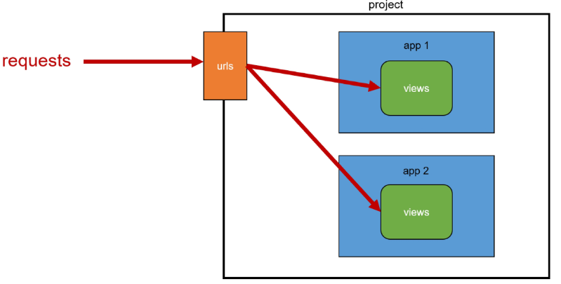
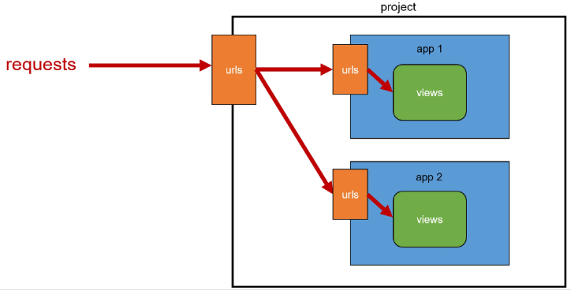
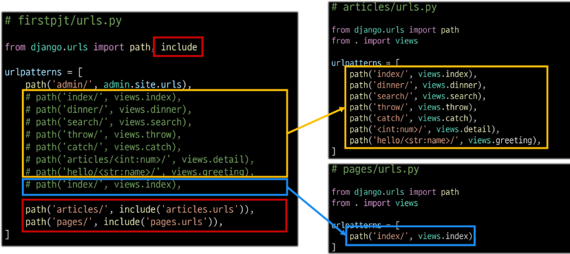
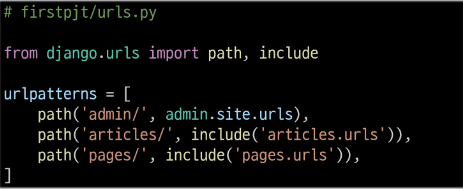
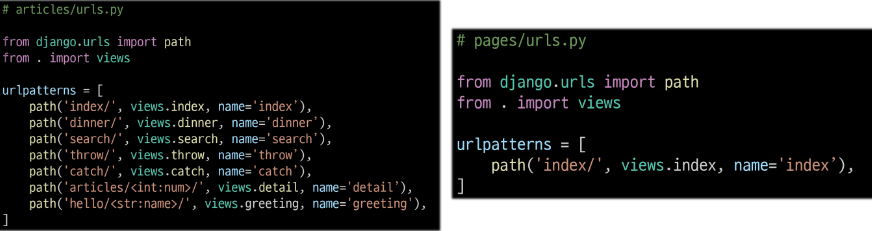
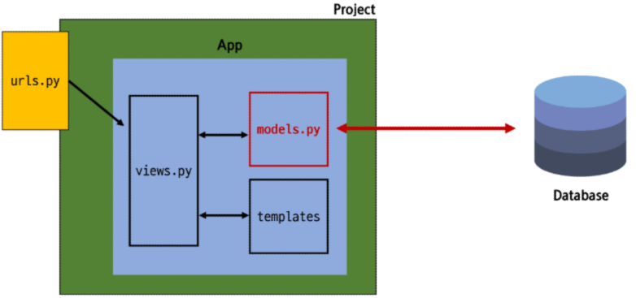
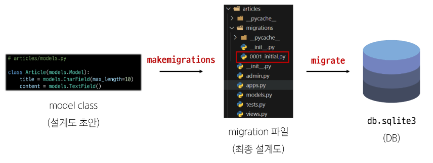
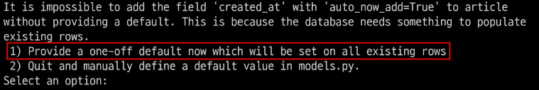
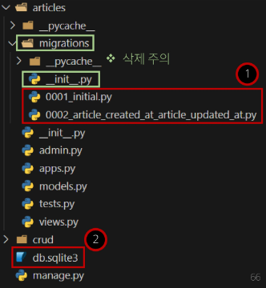

# Django - Model

<div style="text-align: right"> 24. 03. 14. </div>

## 1. Django URLs

### 1. App & URL

* 요청과 응답에서 Django URLs의 역할

    

* 2번째 App 생성 후 발생할 수 있는 문제

    * view 함수 이름이 같거나, 같은 패턴의 URL 주소를 사용하게 되는 경우

* ***URL을 각자 app에서 관리하자*** - 변경된 URL 구조

    

    

* include()

    * PJT 내부 App들의 URL을 참조할 수 있도록 mapping(연결)하는 함수

    * URL의 일치하는 부분까지 잘라내고, 남은 문자열 부분은 후속 처리를 위해 include된 URL로 전달

    * 변경된 PJT의 urls.py

        

### 2. URL 이름 지정

* url 구조 변경에 따른 문제점

    * 기존 'articles/' 주소가 'articles/index/'로 변경됨에 따라 해당 주소를 사용하는 모든 위치를 찾아가 변경해야 함

    * ***URL에 이름을 지어주면 이름만 기억하면 되지 않을까?***

    ```python
    # firstpjt/urls.py
    path('articles/', include('articles.urls'))

    # articles/urls.py
    path('index/', view.index, name='index')
    ```

* Naming URL patterns

    * URL에 이름을 지정하는 것

    * path 함수의 name 인자를 정의해서 사용

    

* URL tag

    * 주어진 URL 패턴의 이름과 일치하는 절대 경로 주소를 반환

    ```python
    
    ```

* URL 이름 공간

    * articles app의 URL 이름과 pages app의 URL 이름이 같은 상황

    * 단순히 이름만으로는 완벽히 분리할 수 없음

    * 이름에 key를 붙이자

    ```python
    # articles/urls.py
    app_name = 'articles'
    urlpatterns = [
        ...,
    ]

    # pages/urls.py
    app_name = 'pages'
    urlpatterns = [
        ...,
    ]
    ```

    * URL tag의 최종 변화
    
        * 마지막으로 URL 태그가 사용하는 모든 곳의 표기 변경

    ```python
    
    ```

## 2. Model

### 1. Model

* Model을 통한 DB 관리

    

* Django Model

    * DB의 table을 정의하고, 데이터를 조작할 수 있는 기능들을 제공

    * Table 구조를 설계하는 **청사진(blueprint)**

* Model Class 작성

    ```python
    # articles/models.py

    class Articles(models.Model):
        # 필드 == column
        # id 필드 : 는 자동으로 생성됨
        # (1)필드 이름, (2)데이터 타입이 필요
        # (3)테이블 필드의 제약 조건(선택 사항) - max_length
        title = models.CharField(max_length = 10)
        content = models.TextField()
    ```

    * 작성한 Model Class는 최종적으로 DB에 다음과 같은 테이블 구조를 만듦

    | id | title | content |
    | :---: | :---: | :---: |
    | .. | .. | .. |
    | .. | .. | .. |
    | |

    * django.db.models 모듈의 Model이라는 부모 클래스를 상속받음

    * Model은 model에 관련된 모든 코드가 이미 작성되어 있는 클래스

    * 개발자는 가장 중요한 테이블 구조를 어떻게 설계할지에 대한 코드만 작성하도록 하기 위한 것 (상속을 활용한 Framework의 기능 제공)

    * 제약 조건

        * 데이터가 올바르게 저장되고 관리되도록 하기 위한 규칙

        * 예시) 숫자만 저장되도록, 문자가 100자까지만 저장되도록 하는 등

### 2. Migrations

* model 클래스의 변경사항(필드 생성, 수정, 삭제 등)을 DB에 최종 반영하는 방법

* Migrations 과정

    

* Migrations 핵심 명령어 2가지

    ```bash
    # model class 기반으로 최종 설계도(migration) 작성
    $ python manage.py makemigrations

    # 최종 설계도를 DB에 전달해 반영
    $ python manage.py migrate
    ```

* 추가 Migrations

    * 이미 생성된 테이블에 필드를 추가해야 한다면?

    1. 추가 모델 필드 작성

    ```python
    # articles/models.py

    class Articles(models.Model):
        title = models.CharField(max_length = 10)
        content = models.TextField()
        created_at = models.DateTimeField(auto_now_add = True)
        update_at = models.DateTimeField(auto_now = True)
    ```

    2. 이미 기존 테이블이 존재하기 때문에 필드를 추가할 때 필드의 기본 값 설정(default)이 필요 → 데이터 무결성의 원칙 때문에 빈 필드(column)를 추가할 수 없음!!!!

        

        * 1. 현재 대화를 유지하면서 직접 기본 값을 입력하는 방법

        * 2. 현재 대화에서 나간 후 models.py에 기본 값 관련 설정을 하는 방법

    3. 추가하는 필드의 기본 값 입력

        * 날짜 데이터 - 직접 입력하기보다 Django가 제안하는 기본 값을 사용하는 것을 권장

        * 아무것도 입력하지 않고 enter를 누르면 Django가 제안하는 기본 값으로 설정됨

    4. migrations 과정 종료 후 2번째 migration 파일이 생성됨

        * Django는 설계도를 쌓아가며 추후 문제가 생겼을 시 되돌릴 수 있도록 함

        * 이전 설계도에 대한 dependency가 있기 때문에 이전 설계도를 함부로 수정 / 삭제하면 안 됨

    5. migrate 후 테이블 필드 변화 확인

### 3. Model Field

* DB 테이블의 필드(열)을 정의하며, 해당 필드에 저장되는 데이터 타입과 제약조건을 정의

    | Model Field | Explanation |
    | :---: | :--- |
    | CharField() | 길이 제한이 있는 문자열을 넣을 때 사용<br>(필드의 최대 길이를 결정하는 max_length는 필수 인자) |
    | TextField() | 글자 수가 많을 때 사용 |
    | DateTimeField() | 날짜와 시간 모두 넣을 때 사용<br>auto_now : 데이터가 저장될 때마다 자동으로 현재 날짜시간 저장<br>auto_now_add : 데이터가 처음 생성될 때만 자동으로 현재 날짜시간 저장 |
    | |

## 3. Admin site
    
### 1. Admin site

* Automatic admin interface

    * Django는 추가 설치 및 설정 없이 자동으로 관리자 인터페이스를 제공 (다른 Framework는 이러한 기능이 거의 없어 직접 구현해야 함)

    * 데이터 확인 및 테스트 등을 진행하는 데 매우 유용

    1. admin 계정 생성

        * email은 선택사항

        ```bash
        $ python manage.py createsuperuser
        ```

    2. admin.py 수정

        ```python
        admin.site.register(Article)
        ```

## 4. 참고

* 데이터베이스 초기화

    1. migration 파일 삭제

    2. db.sqlite3 파일 삭제

        * \_\_init\_\_.py, migrations 폴더 삭제하지 않도록 주의

    

* SQLite

    * 데이터베이스 관리 시스템 중 하나

    * Django의 기본 데이터베이스로 사용됨

    * 파일로 존재하며, 가볍고 호환성이 좋음