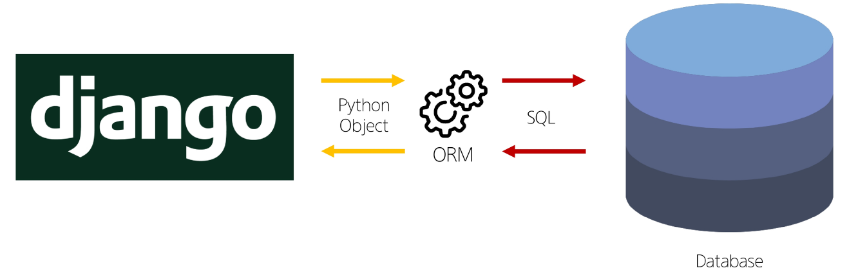
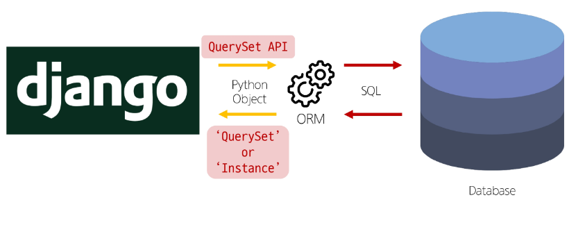
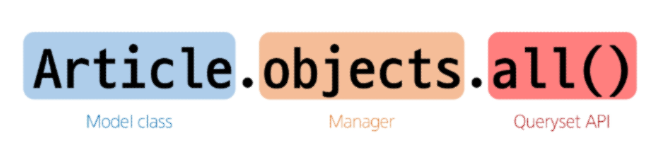
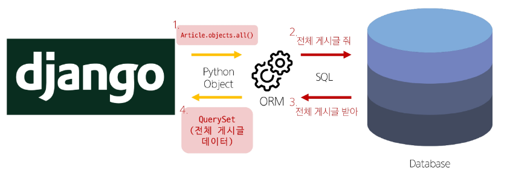
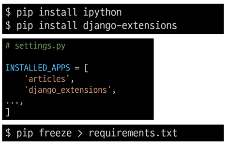

# Django - ORM

<div style="text-align: right"> 24. 03. 25. </div>

## 1. ORM

### 1. ORM (Object-Relational-Mapping)

* 객체 지향 프로그래밍 언어를 사용해 (ex. Python), 호환되지 않는 유형의 시스템 간에 데이터를 변환하는 기술

* ORM의 역할

    

    * Django → Database : QuerySet API

    * Database → Django : QuerySet (다중 데이터) or Instance (단일 데이터)

* QuerySet API

    * ORM에서 데이터를 검색, 필터링, 정렬 및 그룹화하는 데 사용하는 도구

    * API를 사용해 SQL이 아닌 Python 코드로 데이터 처리

    

    

    * Model class (Articles) 부분이 바뀜, Queryset API(Method, all()) 부분은 잘 바뀌지 않음

    * 전체 문구를 ORM이 해석해서 SQL이라는 언어로 번역함

    

    * **1번과 4번을 잘 처리하는 것이 Django ORM의 목적**

* Query

    * 데이터베이스에서, 특정한 데이터를 보여 달라는 요청

    * "쿼리문을 작성한다" : 원하는 데이터를 얻기 위해 데이터베이스에 요청을 보낼 코드를 작성한다.

    * Python으로 작성한 코드가 ORM에 의해 SQL로 변환되어 데이터베이스에 전달되며, 데이터베이스의 응답 데이터를 ORM이 QuerySet이라는 자료 형태로 변환하여 우리에게 전달

* QuerySet

    * 데이터베이스에게서 전달받은 객체 목록 (데이터 모음)
    
        * **순회가 가능한 데이터**로써 1개 이상의 데이터를 불러와 사용할 수 있음

    * Django ORM을 통해 만들어진 자료형

    * 단, 데이터베이스가 단일한 객체를 반환할 때는 QuerySet이 아닌 모델(class)의 인스턴스로 반환됨

* QuerySet API는, Python의 Model Class와 Instance를 활용해, DB에 데이터를 저장, 조회, 수정, 삭제하는 것

    * CRUD - 저장(Create), 조회(Read), 수정(Update), 삭제(Delete)

### 2. QuerySet API

* QuerySet API 실습 사전 준비

    * 외부 라이브러리 설치 및 설정

    

* Django shell

    * Django 환경 안에서 실행되는 python shell

    * 입력하는 QuerySet API 구문이 Django 프로젝트에 영향을 미침

    ```bash
    # 그냥 shell은 쓰기가 어려움
    $ python manage.py shell_plus
    ```

1. Create

    * 데이터 객체를 만드는 (생성하는) 3가지 방법

        1. 

        ```bash
        # 1-1
        >>> article = Article()      # Article(class) 로부터 article(instance) 생성
        >>> article
        <Article: Article object (None)>

        >>> article.title = 'first'  # 인스턴스 변수 (title)에 값을 할당
        >>> article.content = 'django!' # 인스턴스 변수 (content)에 값을 할당

        # 1-2
        # save를 호출하고 확인하면 저장된 것을 확인할 수 있다.
        >>> article.save()
        >>> article
        <Article: Article object (1)>
        >>> article.id
        1
        >>> article.pk
        1
        >>> Article.objects.all()
        <QuerySet [Article: Article object (1)]>

        # 1-3
        # 인스턴스 article을 활용해 인스턴스 변수 활용하기
        >>> article.title
        'first'
        >>> article.content
        'django!'
        >>> article.create_at
        datetime.datetime(2023, 6, 30,  6, 55, 42, 322526, tzinfo=datetime.timezone.utc)
        ```

        2. 

        ```bash
        # save Method를 호출해야 비로소 DB에 데이터가 저장됨
        # 테이블에 한 줄(행, 레코드)이 쓰여진 것

        >>> article = Article(title = 'second', content = 'django!')

        # 아직 저장되어 있지 않음
        >>> article
        <Article: Article object (None)>

        # save를 호출해야 저장됨
        >>> article.save()
        >>> article
        <Article: Article object (2)>
        >>> Article.objects.all()
        <QuerySet [<Article: Article object (1)>, <Article: Article object (2)>]>
        ```

        3. 
        ```bash
        # QuerySet API 중 create() Method 활용
        # 위 2가지 방법과 달리 바로 저장 이후 바로 생성된 데이터가 반환
        
        >>> Article.objects.create(title = 'third', content = 'django!')
        <Article: Article object (3)>
        ```

    * save()

        * 객체를 데이터베이스에 저장하는 method

2. Read

    * 대표적인 조회 메서드

        * Return new QuerySets - all(), filter()

            * Iterable Object 반환 (→ QuerySet 반환)

        * Do not return QuertSets - get()

            * Non-iterable Object 반환 (→ 단일 데이터 반환)

    * all() : *전체 데이터* 조회, QuerySet 반환

    ```bash
    >>> Article.objects.all()
    <QuerySet [<Article: Article object (1)>, <Article: Article object (2)>, <Article: Article object (3)>]>
    ```

    * filter() : *특정 조건 데이터* 조회, QuerySet 반환

    ```bash
    >>> Article.objects.filter(content = 'django!')
    <QuerySet [<Article: Article object (1)>, <Article: Article object (2)>, <Article: Article object (3)>]>
    >>> Article.objects.filter(title = 'abc')
    <QuerySet []>
    >>> Article.objects.filter(title = 'first')
    <QuerySet [<Article: Article object (1)>]>
    ```

    * get() : 단일 데이터 조회 → 조건이 들어갈 수밖에 없음

    ```bash
    # 반환된 데이터를 변수에 넣어 활용할 수 있음!!!
    >>> Article.objects.get(pk = 1)
    <Article: Article object (1)>

    # get()의 특징 - 2가지 예외
    # 1. 객체를 찾을 수 없으면 DoesNotExist 예외 발생
    >>> Article.objects.get(pk = 100)
    DoesNotExist: Article matching query does not exist.

    # 2. 둘 이상의 객체를 찾으면 MultipleObjectsReturned 예외 발생
    >>> Article.objects.get(content = 'django!')
    MultipleObjectsRetrned: get() returned more than one Article -- it returned 2!

    # 위 두 가지 특징을 갖고 있기 때문에, primary key와 같이 고유성(Uniqueness)을 보장하는 조회에서 사용해야 함!!!
    ```

3. Update → 조회가 선행되어야 함

* 데이터 수정

    * 인스턴스 변수 변경 후 save Method 호출

    ```bash
    # 수정할 인스턴스 조회
    >>> article = Article.objects.get(pk = 1)

    # 인스턴스 변수 변경
    >>> article.title = 'byebye'

    # 저장
    >>> article.save()

    # 정상적으로 변경된 것을 확인
    >>> article.title
    'byebye'
    ```

4. Delete → 조회가 선행되어야 함

* 데이터 삭제

    * 삭제하려는 데이터 조회 후 deleta Method 호출

    ```bash
    # 삭제할 인스턴스 조회
    >>> article = Article.objects.get(pk = 1)

    # delete Method 호출 (삭제된 객체가 반환)
    >>> article.delete()
    (1, { 'articles.Article' : 1 })

    # 삭제한 데이터는 더 이상 조회할 수 없음
    >>> Article.objects.get(pk = 1)
    DoesNotExist: Article matching query does not exist.
    ```

* 일반적인 상황에서, 한 번 지워진 PK(Primary Key) 값은 재사용하지 않는다.

    * 새로 생성되는 데이터는 그 다음 PK값을 할당받는다.

### 3. 참고

* Field lookups

    * 특정 레코드에 대한 조건을 설정하는 방법

    * QuerySet Method filter(), exclude() 및 get()에 대한 keyword 인자로 지정

    ```bash
    # Field lookups 예시

    # "content column에 'dja'가 포함된 모든 데이터 조회"
    >>> Article.objects.filter(content = 'dja')
    <QuerySet []>
    >>> Article.objects.filter(content__contains = 'dja')
    <QuerySet [<Article: Article object (1)>, <Article: Article object (2)>, <Article: Article object (3)>]>
    ```

* ORM, QuerySet API를 사용하는 이유

    * DB Query를 추상화하여 Django 개발자가 DB와 직접 상호작용하지 않아도 되도록 함

    * DB와의 결합도를 낮추고, 개발자가 더욱 직관적이고 생산적으로 개발할 수 있도록 도움

* QuerySet API 관련 문서

    * [Django QuerySets API - Official Documents](https://docs.djangoproject.com/en/4.2/ref/models/quertsets/)

    * [Django Queries - Official Documents](https://docs.djangoproject.com/en/4.2/topics/db/queries/)

