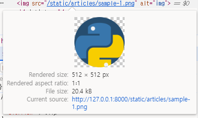
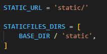
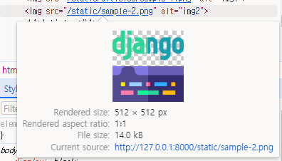
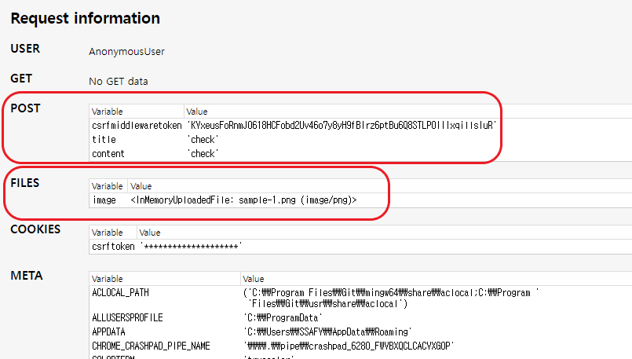
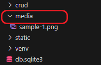
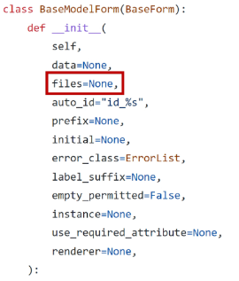

# Django - Static

<div style="text-align: right"> 24. 03. 28. </div>

## 1. Static Files - Web에서 미리 준비해 직접 제공하는 파일

### 1. Static Files

* Static Files (정적 파일)

    * 서버 측에서 변경되지 않고 고정적으로 제공되는 파일

    * 이미지, JS, CSS File 등

* Web Server와 Static Files

    * Web Server의 기본 동작은, *특정 위치(URL)에 있는 자원*을 요청(HTTP request)받아서 응답(HTTP response)을 처리하고 제공하는 것

    

    * 이는 "자원에 접근 가능한 주소가 있다." 라는 의미

    * Web Server는 요청받은 URL로 Server에 존재하는 정적 자원을 제공함

    * *Static File을 제공하기 위한 경로(URL)가 있어야 함*

### 2. Static Files 제공하기

* 2가지 제공 방식 - 기본 경로 / 추가 경로에서 제공하기

    1. Static Files 기본 경로에서 제공하기

        * Static Files 기본 경로 : ***app folder/static/***

        * templates와 똑같이 static folder 밑에 app 이름과 같은 folder를 만들어 넣는다.

        * static tag를 사용해 경로 제공 → built-in tag가 아닌, load가 필요한 tag이기 때문

            ```HTML
            <!-- articles/index.html -->

            

            
            ```

            * Image 요청 URL 주소를 Django가 생성함

            

        * STATIC_URL

            * 기본 경로 및 추가 경로에 위치한 정적 파일을 참조하기 위한 URL

            * **실제 파일이나 디렉토리가 아니며**, 사용자에게 정적 파일을 제공하기 위한 **URL로만 존재**

            ```python
            # settings.py

            STATIC_URL = 'static/'
            ```

            * URL + *STATIC_URL* + **정적 파일 경로**

                * http://127.0.0.1:8000/*static/***articles/sample-1.png**

    2. Static Files 추가 경로

        * STATICFILES_DIRS

            * 정적 파일의 기본 경로 외에 추가적인 경로 목록을 정의하는 리스트
        
            * STATICFILES_DIR에 문자열 값으로 추가 경로 설정

        * 최상단 경로(project, app folder가 위치한 곳)에 static folder을 생성하여 추가 경로로 등록하는 예시

            ```python
            # settings.py

            STATICFILES_DIRS = [
                BASE_DIR / 'static',
            ]
            ```

            

            ```HTML
            <!-- articles/index.html -->

            
            ```

            

        * 물리적으로 경로(폴더)를 새로 생성하는 경우 실시간으로 적용되지 않을 수 있어, Django 서버를 재부팅하는 것을 권장함

### 3. 정리 & 참고

* 정적 파일을 제공하려면 ***요청에 응답하기 위한 URL이 필요!!!!***

* base template을 활용하는 경우

    * extends tag는 항상 최상단에 존재해야 하며, 하나만 존재해야 함

        * 따라서 load tag는 extends tag 밑에 존재해야 한다.

        * 부모 template에서 load를 사용하더라도, 이것이 자식 page까지 상속되지는 않는다. → 자식 page에서 load를 각기 입력해줘야 함

## 2. Media Files - 사용자가 제공하는 파일

### 1. Media Files

* Media Files

    * 사용자가 Web에 업로드하는 (User-Uploaded) Static Files

* ImageField()

    * 이미지 업로드에 사용하는 Model Field

    * 이미지 객체(image object)가 직접 저장되는 것이 아닌, ***이미지 파일의 경로***가 *문자열*로 DB(table)에 저장

        * 이미지 덩어리가 table에 들어갈 수는 없음

        * CharField() 사용

    * *Pillow* 라이브러리 필요

### 2. Media Files 제공하기

* Media Files 제공을 위한 사전 준비 - 2단계

    1. settings.py에 MEDIA_ROOT, MEDIA_URL 설정

    ```python
    # settings.py

    # MEDIA_ROOT : 실제 미디어 파일들이 위치하는 디렉토리의 절대 경로 (물리적 경로)
    # 사용자가 업로드하면 '실제로 파일을 어디에 위치(저장)'시킬 것인가? 를 지정
    MEDIA_ROOT = BASE_DIR / 'media'

    # MEDIA_URL : MEDIA_ROOT에서 '제공되는' 미디어 파일에 대한 '주소'를 생성
    # STATIC_URL과 동일한 역할
    MEDIA_URL = 'media/'
    ```

    2. 작성한 MEDIA_ROOT와 MEDIA_URL에 대한 URL 지정

        * 업로드된 파일을 제공하는 URL == settings.MEDIA_URL

        * 위 URL을 통해 참조하는 파일의 실제 위치 == settings.MEDIA_ROOT

    ```python
    # ☆★☆app이 아닌 project 내 urls.py에 입력!!!!!!☆★☆
    # crud/urls.py

    from django.conf import settings
    from django.conf.urls.static import static

    urlpatterns = [
        ...
    ] + static(settings.MEDIA_URL, document_root=settings.MEDIA_ROOT)

    # urlpatterns 안에 추가할 수도 있음
    # path 함수와 같이 섞여 가시성을 떨어뜨리는 것을 방지하기 위해 밖에 추가
    ```

    

* 이미지 업로드

    1. blank=True 속성을 작성해, 빈 문자열이 저장될 수 있도록 제약 조건 설정

    ```python
    # articles/models.py
    # blank=True 속성을 작성해, 빈 문자열이 저장될 수 있도록 제약 조건 설정
    # 기본적으로 DB는 blank를 허용하지 않음
    # >> 게시글 작성 시 이미지 없이 작성할 수 있도록 설정하는 부분

    class Article(models.Model):
        ...
        image = models.ImageField(blank=True)
    ```

    2. makemigrations (설계도 수정 반영) / migrate (새로운 설계도로 DB 생성) 진행

    3. form 요소의 enctype 속성 추가

    ```HTML
    <!-- articles/create.html -->
    <!-- 기본적으로 text 자료만 보낼 수 있어, image file을 보내기 위해서 추가적인 입력이 필요함 -->

    ...
    <form action="" method="POST" enctype="multipart/form-data">
    ...
    </form>
    ```

    4. view 함수에서 업로드 파일에 대한 추가 코드 작성

    ```python
    # articles/views.py

    def create(request):
        if request.method == "POST":
            form = ArticleForm(request.POST, request.FILES)
    ...
    ```

    

    * 업로드 후 media folder가 최상단에 자동 생성 → settings.py에 입력했던 내용이 실행되었음

    

* 업로드한 이미지 제공

    * 'url' 속성을 통해 업로드 파일의 경로 값을 얻을 수 있음

        * 이미지 데이터가 있는 경우만 이미지를 출력하도록 처리하기

            * 이미지를 업로드하지 않은 게시물은 detail template을 렌더링할 수 없기 때문

            * if문 사용

        * article.image : 업로드 파일의 파일 이름

        * article.image.url : 업로드 파일의 경로

    ```HTML
    <!-- articles/detail.html -->
    
        
    
    ```

* 업로드한 이미지 수정

    * 수정 페이지 form 요소에 enctype 속성 추가

    ```HTML
    <!-- articles/update.html -->

    ...
    <form action="" method="POST" enctype="multipart/form-data">
    ...
    </form>
    ```

    ```python
    # articles/views.py

    def update(request, pk):
        article = Article.objects.get(pk = pk)
        if request.method == "POST":
            form = ArticleForm(request.POST, request.FILES, instance = article)
            ...
    ```

### 3. 참고

* 'upload_to' argument

    * ImageField()의 upload_to 인자를 사용해 미디어 파일 추가 경로 설정

    ```python
    # 1. 기본 경로 설정
    image = models.ImageField(blank=True, upload_to='images/')

    # 2. 업로드 날짜로 경로 설정
    image = models.ImageField(blank=True, upload_to='%Y/%m/%d/')

    # 3. 함수 형식으로 경로 설정
    # Django가 2개 인자를 받도록 결정해 놓았음 (함수 이름은 상관없음)
    # models.py에 함수를 생성 후 class에 활용
    def articles_image_path(instance, filename):
        return f'images/{instance.user.username}/{filename}'

    image = models.ImageField(blank=True, upload_to=articles_image_path)
    ```

* request.FILES가 두번째 위치 인자인 이유

    * ModelForm의 상위 class인 BaseModelForm의 생성자 함수 키워드 인자

    