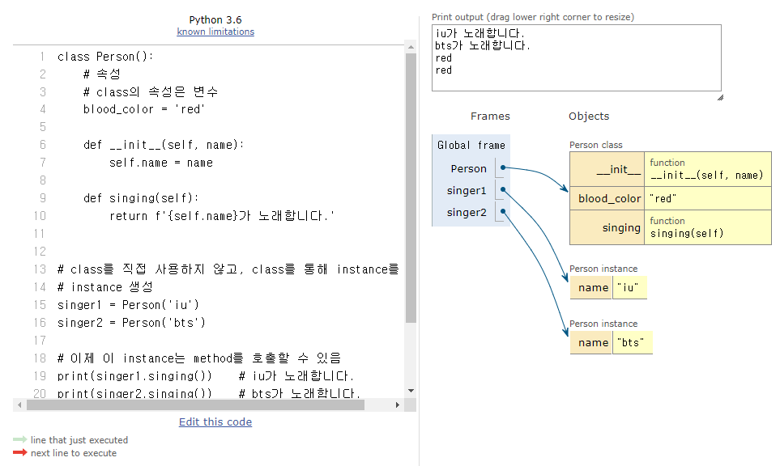

# OOP

<div style="text-align: right"> 24. 01. 24. ~ 24. 01. 25. </div>

## 1. 절차 지향 프로그래밍

  * 절차 지향 프로그래밍 (Procedural Programming)

    * 프로그램을 '데이터'와 '절차'로 구성하는 방식의 프로그래밍 패러다임

    * '데이터'와, 해당 데이터를 처리하는 '함수(절차)'가 분리되어 있으며, 함수 호출의 흐름이 중요

    * 코드의 순차적인 흐름과 함수 호출에 의해 프로그램이 진행

    * 실제로 실행되는 내용이 무엇이 무엇인가가 중요함

    * 데이터를 다시 재사용하거나 하기보다는 처음부터 끝까지 실행되는 결과물이 중요한 방식

  * 소프트웨어 위기 (Software Crisis)

    * 하드웨어의 발전으로 컴퓨터 계산용량과 문제의 복잡성이 급격히 증가함에 따라 소프트웨어에 발생한 충격

## 2. 객체 지향 프로그래밍

  * 객체 지향 프로그래밍 (Object Oriented Programming, **OOP**)

    * 데이터와 해당 데이터를 조작하는 메서드를 *하나의 객체로 묶어(Class)* 관리하는 방식의 프로그래밍 패러다임
    
    | 지향성 | 설명 |
    | :---: | :--- |
    | 절차 지향 | 데이터와 해당 데이터를 처리하는 함수(절차)가 분리<br>함수 호출의 흐름이 중요 |
    | 객체 지향 | 데이터와 해당 데이터를 처리하는 method(메시지)를 하나의 객체(class)로 묶음<br>객체 간 상호작용과 메시지 전달이 중요 |
    | |

## 3. 객체

  * 클래스 (Class)

    * Python에서 타입을 표현하는 방법

      * 객체를 생성하기 위한 설계도(청사진, blueprint)

      * 데이터와 기능을 함께 묶는 방법을 제공

  * 객체 (Object)

    * Class에서 정의한 것을 토대로 메모리에 할당된 것

    * '속성(variable)'과 '행동(method)'으로 구성된 모든 것

    * Class A로 만든 객체를 Class A의 인스턴스(instance)라고도 함

    
  ```python
  name = 'Alice'

  print(type(name)) # <class 'str'>

  # 변수 name의 type은 'str class'이다.
  # 변수 name은 str class의 instance이다.
  # 우리가 사용해왔던 data type은 모두 class였다.
  # str type의 변수는, str class로 만든 'instance'이다.

  lst = [1, 2, 3]
  # list type(class)의 object(instance)
  ```

  * instance와 method

    * instance는 class 내 method를 호출할 수 있음

    ```python
    # class str 내에 upper 함수가 존재함
    # class 안에 존재하는 함수를 method라고 함

    'hello'.upper()

    # 함수 호출 방식이 def와 다름
    # 문자열.대문자로()
    # 객체.행동()
    # instance.method()

    # class list 내 sort 함수

    [1, 2, 3].sort()

    # 리스트.정렬해()
    # 객체.행동()
    # instance.method()
    ```

  * 하나의 객체는 특정 타입의 인스턴스이다.

    * 123, 900, 5는 모두 int의 instance

    * 'hello', 'bye'는 모두 str의 instance

    * [1, 2, 3]은 list의 instance

  * 객체의 특징

    * 타입 (type) : 어떤 연산자(operator)와 조작(method)이 가능한가?

    * 속성 (attribute) : 어떤 상태(데이터)를 가지는가?

    * 조작법 (method) : 어떤 행위(함수)를 할 수 있는가?

  > Python에서의 객체와 클래스<br>
  > 객체(Object) = 속성(Attribute) + 기능(Method)

## 4. 클래스

  * 클래스 (Class) (반복)

    * Python에서 타입을 표현하는 방법

      * 객체를 생성하기 위한 설계도(청사진, blueprint)

      * 데이터와 기능을 함께 묶는 방법을 제공

  * 클래스 구조

  ```python
  # 클래스 정의
  # 클래스 선언 시 Style Guide 상 Pascal case(Upper camel case) 사용이 권장됨
  # 언더바를 붙이지 않고, 키워드마다 대문자를 사용함
  # 별도로 들어오는 값이 없다면 소괄호를 생략 가능

  class Person: 
    pass

  # 클래스를 통해 인스턴스를 찍어냄
  # 인스턴스 생성
  iu = Person()

  # 메서드 호출
  iu.메서드()

  # 속성(변수) 접근
  iu.attribute
  ```

  * 클래스 기본 활용

    * 생성자 함수 (\_\_init\_\_(self, name))

      * \_\_init\_\_ (생성자 함수) : 객체를 생성할 때 자동으로 호출되는 특별한 메서드

      * 생성자 함수를 통해 인스턴스를 생성하고 필요한 초기값을 설정

    * 인스턴스 변수

      * 인스턴스(객체)마다 별도로 유지되는 변수

      * 인스턴스마다 독립적인 값을 가지며(서로 공유하지 않음), 인스턴스가 생성될 때마다 초기화됨

    * 클래스 변수(클래스 속성)

      * 클래스 내부에 선언된 변수

      * 클래스로 생성된 모든 인스턴스들이 공유하는 변수

    * 인스턴스 메서드

      * 각각의 인스턴스에서 호출할 수 있는 메서드

      * 인스턴스 변수에 접근하고 수정하는 등의 작업을 수행

    ```python
    class Person():
        # 클래스 변수(속성)
        blood_color = 'red'

        # 생성자 함수
        def __init__(self, name):
            # 인스턴스 변수
            self.name = name

        # 인스턴스 메서드
        def singing(self):
            return f'{self.name}가 노래합니다.'
    
    # class를 직접 사용하지 않고, class를 통해 instance를 생성
    # instance 생성
    singer1 = Person('iu')
    singer2 = Person('bts')

    # 이제 이 instance는 method를 호출할 수 있음
    print(singer1.singing())    # iu가 노래합니다.
    print(singer2.singing())    # bts가 노래합니다.

    # 속성 접근
    print(singer1.blood_color)  # red
    print(singer2.blood_color)  # red
    ```

  * 인스턴스와 클래스 간의 이름 공간(namespace)

    * 클래스를 정의하면, 클래스와 해당하는 이름 공간 생성

    * 인스턴스를 만들면, 인스턴스 객체가 생성되고 독립적인 이름 공간 생성

    * 인스턴스에서 특정 속성에 접근하면, 인스턴스 → 클래스 순으로 탐색

  

  * 독립적인 이름공간을 가지는 이점

    * 각 인스턴스는 *독립적인 메모리 공간*을 가지며, 클래스와 다른 인스턴스 간에는 *서로의 데이터나 상태에 직접적인 접근이 불가능*함

    * *객체 지향 프로그래밍의 중요한 특성* 중 하나로, 클래스와 인스턴스를 모듈화하고 각각의 객체가 독립적으로 동작하도록 보장

    * 이를 통해 클래스와 인스턴스는 다른 객체들과의 상호작용에서 서로 충돌이나 영향을 주지 않으면서 독립적으로 동작할 수 있음

    * 코드의 가독성, 유지보수성, 재사용성을 높이는 데 도움

  ```python
  class Person():
    name = 'unknown'

    def talk(self):
        print(self.name)

  p1 = Person()
  p1.talk()   # 변수 입력이 없음 → instance가 속해 있던 class 내에서 변수를 찾아 실행한다.

  p2 = Person()
  p2.name = 'Kim'
  p2.talk()   # name을 선언하며 class를 통해 instance 생성 → 별도의 name 존재, class 변수로 접근할 수 없음

  print(Person.name)
  print(p1.name)
  print(p2.name)

  # 기본적으로 생성된 instance는 class와 독립적 공간 → 별도의 행동 가능
  p2.ssafy = 11
  print(p2.ssafy)
  ```
## 5. 인스턴스 변수와 클래스 변수

  * 인스턴스가 생성될 때마다 클래스 변수가 늘어나도록 설정할 수 있음

  ```python
  class Person:
    # 클래스 변수
    count = 0

    def __init__(self, name):
      # 인스턴스가 생성될 때마다(= __init__ 함수가 호출될 때마다) 클래스 변수 count가 변동
      self.name = name
      Person.count += 1

  person1 = Person('iu')
  person2 = Person('bts')
  ```

  * 클래스 변수를 변경할 때는 항상 *클래스.클래스변수* 형식으로 변경

  ```python
  class Circle():
      
      pi = 3.14

      def __init__(self, r):
          self.r = r

  c1 = Circle(5)
  c2 = Circle(10)

  print(Circle.pi)  # 3.14
  print(c1.pi)  # 3.14  → pi값이 c1에게 없어, class Circle로 거슬러 올라가 찾음
  print(c2.pi)  # 3.14
  print()

  c2.pi = 5
  print(Circle.pi)  # 3.14
  print(c1.pi)  # 3.14
  print(c2.pi)  # 5
  # c2 인스턴스 변수 pi를 할당
  # c2 인스턴스 변수가 기존에 존재했던 것이 아니기 때문에 c2 인스턴스 변수를 변경하는 것이 아니고, 
  # 인스턴스가 생성된 class Ciecle의 변수를 변경하는 것도 아님
  ```

## 6. 메서드

  * 메서드 종류

    * 인스턴스 메서드

    * 클래스 메서드

    * 정적 메서드

  * 인스턴스 메서드 (Instance method)

    * 클래스로부터 생성된 각 인스턴스에서 호출할 수 있는 메서드  

    * 인스턴스의 상태를 조작하거나 동작을 수행

      * 클래스를 조작하지 않음

    * 인스턴스 메서드의 구조

      * 클래스 내부에 정의되는 메서드의 기본

      * 반드시 첫 번째 매개변수로 인스턴스 자신(self)을 전달받음

      ```python
      class MyClass:

        def instance_method(self, arg1, ...):
          pass
      ```

      * self 동작 원리

      ```python
      # upper 메서드를 사용해 문자열 'hello'를 대문자로 변경
      'hello'.upper()

      # 하지만, 실제 Python 내부 동작은 다음과 같이 이루어진다.
      str.upper('hello')

      # str 클래스가 upper 메서드를 호출했고
      # 그 첫번째 인자로 문자열 인스턴스가 들어간 것

      # 인스턴스 메서드의 첫번째 매개변수가 반드시 인스턴스 자기 자신인 이유

      # 'hello'.upper() 은 str.upper('hello')를 객체 지향 방식의 메서드로 호출하는 표현(단축형 호출)

      # 'hello'라는 문자열 객체가 단순히 어딘가의 함수로 들어가는 인자가 아닌, 객체 스스로 메서드를 호출하여 코드를 동작하는 객체 지향적 표현이다.
      ```

  * 생성자 메서드 (Constructor method)

    * 인스턴스 객체가 생성될 때 자동으로 호출되는 메서드

    * 인스턴스 변수들의 초기값을 설정

    ```python
    class Person:
      
      def __init__(self):
        print('인스턴스가 생성되었습니다.')

    person1 = Person()  # 인스턴스가 생성되었습니다.
    ```

    ```python
    class Person:

      def __init__(self, name):
        print(f'인스턴스가 생성되었습니다. {name}')

    person1 = Person('지민')  # 인스턴스가 생성되었습니다. 지민
    ```

  * 클래스 메서드 (Class method)

    * 클래스가 호출하는 메서드

    * 클래스 변수를 조작하거나, 클래스 레벨의 동작을 수행

    * 클래스 메서드 구조

      * @classmethod 데코레이터를 사용해 정의

      * 호출 시, 첫번째 인자로 호출하는 클래스(cls)가 전달됨

      ```python
      class MyClass:

        # @classmethod 데코레이터를 사용해 정의
        # 이게 없으면 아래 def는 인스턴스 메서드가 된다
        # def 함수를 기능적으로 +@해주는 함수라고 생각
        @classmethod
        # 호출 시, 첫번째 인자로 호출하는 클래스(cls)가 전달됨
        def class_method(cls, arg1, ...):
          pass
      ```

      ```python
      class Person:
        count = 0

        def __init__(self, name):
          self.name = name
          Person.count += 1

        @classmethod
        def number_of_population(cls):
          print(f'인구수는 {cls.count}입니다.')

      person1 = Person('iu')
      person2 = Person('bts')

      Person.number_of_population() # 인구수는 2입니다.
      ```

  * 스태틱 메서드 (정적 메서드, Static method)
  
    * 클래스 / 인스턴스와 상관없이 독립적으로 동작하는 메서드

    * 반드시 첫번째 인자로 클래스 / 인스턴스를 자기 자신으로 받는 클래스 / 인스턴스 메서드와 별개로, 이런 규칙을 따르지 않는 일반 함수가 필요할 때가 있음. 이 때 사용함

    * 주로 클래스와 관련이 있지만, 인스턴스와 상호작용이 필요하지 않은 경우에 사용

    * 스태틱 메서드 구조

      * @staticmethod 데코레이터를 사용해 정의

      * 호출 시 필수적으로 작성해야 할 매개변수가 없음

      * 즉, 객체 상태나 클래스 상태를 수정할 수 없으며, 단지 기능(행동)만을 위한 메서드로 사용

      ```python
      class MyClass:

        @staticmethod
        def static_method(arg1, ...):
          pass
      ```

      ```python
      class StringUtils:
        @staticmethod
        def reverse_string(string):
          return string[::-1]

        @staticmethod
        def capitalize_string(string):
          return string.capitalize()

      text = 'hello, world'

      # static method는 반드시 class로 호출함
      reversed_text = StringUtils.reverse_string(text)
      print(reversed_text)  # dlrow, olleh

      capitalized_text = StringUtils.capitalize_string(text)
      print(capitalized_text) # Hello, world
      ```

## 7. 메서드 정리

| Method | Explanation |
| :---: | :--- |
| 인스턴스 메서드 | 인스턴스의 상태를 변경하거나, 해당 인스턴스의 특정 동작을 수행 |
| 클래스 메서드 | 인스턴스의 상태에 의존하지 않는 기능을 정의<br>클래스 변수를 조작하거나 클래스 레벨의 동작을 수행 |
| 스태틱 메서드 | 클래스 및 인스턴스와 관련이 없는 일반적인 기능 수행 |
| |

| 각자의 역할 | |
| :---: | :---: |
| 클래스가 사용해야 할 것 | 클래스 메서드<br>스태틱 메서드 |
| 인스턴스가 사용해야 할 것 | 인스턴스 메서드 |
| |

  * *사용할 수 있는 것*이 아님에 유의

```python
class MyClass:

  def instance_method(self):
    return 'instance method', self

  @classmethod
  def class_method(cls):
    return 'class method', cls

  @ staticmethod
  def static_method():
    return 'static method'

instance = MyClass()

print(MyClass.instance_method(instance))  # ('instance method', <__main__.MyClass object at 0x...028F10>)
# instance에 MyClass()를 할당했기 때문에 문법적으로(구조상으로, 기능적으로) 문제는 없으나, 하지 말자는 것
# 클래스는 모든 메서드를 호출할 수 있음, <하지만 클래스는 클래스 메서드와 스태틱 메서드만 사용하도록 한다.>

print(MyClass.class_method())  # ('class method', <class '__main__.MyClass'>)
# 인스턴스는 모든 메서드를 호출할 수 있음, <하지만 인스턴스는 인스턴스 메서드만 사용하도록 한다.>

print(MyClass.static_method())  # static method
```

  * 프로그래밍 언어에 따라, 이를 막아놓은(문법적으로 빡빡한) 경우도 있음

  * Python은 이를 막아놓지는 않아, 경우에 따라 좀 더 유연한 코딩이 가능하게 함

## 8. 참고 문서

  * 매직 메서드 (스페셜 메서드)

    * 굳이 따지면, 인스턴스 메서드에 속함

    * 일반적인 인스턴스 메서드와 달리 특정 상황에 자동으로 호출되는 메서드, 직접 사용할 일은 많지 않음

    * Double underscore(\_\_)가 있는 메서드는 특수한 동작을 위해 만들어진 메서드

    * 무조건 첫 번째 인자로 자기 자신을 받음

    ```python
    class Circle:

      def __init__(self, r):
        self.r = r

      def area(self):
        return 3.14 * self.r * self.r

      # 인스턴스를 print할 때 유용하게 사용 가능
      def __str__(self):
        return f'[원] radius: {self.r}'

    c1 = Circle(10)
    c2 = Circle(1)

    print(c1) # [원] radius: 10
    print(c2) # [원] radius: 1
    ```

  * 데코레이터 (decorator)

    * 다른 함수의 코드를 유지한 채로 수정하거나 확장하기 위해 사용되는 함수

    ```python
    def my_decorator(func):
      def wrapper():
        # 함수 실행 전에 수행할 작업
        print('함수 실행 전')
        # 원본 함수 호출
        result = func()
        # 함수 실행 후에 실행할 작업
        print('함수 실행 후')
        return result
      return wrapper
    ```

    ```python
    @my_decorator
    def my_function():
      print('원본 함수 실행')

    my_function()

    """
    함수 실행 전
    원본 함수 실행
    함수 실행 후
    """
    ```