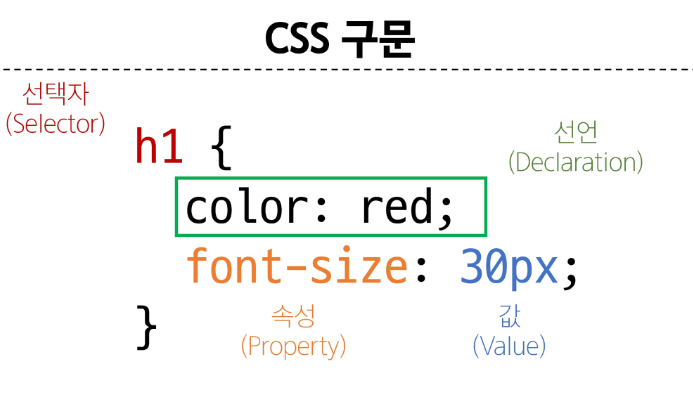

# Web - HTML & CSS

<div style="text-align: right"> 24. 03. 06. ~   </div>

## 1. Web

### 1. Web

* Web

    * Web site, Web application 등을 통해, 사용자들이 정보를 검색하고 상호 작용하는 기술

* Web site

    * 인터넷에서 여러 개의 Web page가 모인 것

    * 사용자들에게 정보나 서비스를 제공하는 공간

* Web page

    * HTML, CSS 등의 웹 기술을 이용해 만들어진, "Web site"를 구성하는 하나의 요소

    * Web page의 구성 요소

        * HTML - "Structure"

        * CSS - "Styling"

        * Javascript(JS) - "Behavior"

### 2. Web 구조화 - HTML

* HTML (HyperText Markup Language)

    * Web page의 *의미*와 *구조*를 정의하는 언어 (프로그래밍 언어는 아님)

* Hypertext (→ Link, Hyperlink)

    * Web page에서 다른 페이지로 연결하는 링크

    * 참조를 통해 사용자가 한 문서에서 다른 문서로 즉시 접근할 수 있는 텍스트

* Markup Language

    * 태그 등을 이용해 문서나 데이터의 구조를 명시하는 언어

    * HTML, Markdown 등

* HTML 구조

    ```HTML
    <!DOCTYPE html>
        <!--해당 문서가 html 문서라는 것을 나타냄-->

    <html></html>
        <!--전체 페이지의 콘텐츠를 포함-->

    <title></title>
        <!--브라우저 탭 및 즐겨찾기 시 표시되는 제목으로 사용-->

    <!--여는 태그 - 닫는 태그가 쌍으로 존재함-->
    ```

    ```HTML
    <!--Ctrl + Shift + i-->
    <!DOCTYPE html>
    <html lang="en">
    <head>        <!--머리 부분 - HTML 설정에 관한 코드, 사용자에게 보여지지 않음-->
        <meta charset="UTF-8">
        <title>My page</title>
    </head>
    <body>        
        <p>This is my page</p>
    </body>
    </html>
    ```

    * HTML 요소 (Element)

        ```HTML
        <p>My cat is very grumpy</p>
        ```

        * Opening tag - Closing tag

        * 하나의 요소는 여는 태그와 닫는 태그, 그리고 그 안의 내용으로 구성됨

        * 닫는 태그는 태그 이름 앞에 슬래시(/)가 포함되며, 닫는 태그가 없는 태그도 존재

    * HTML 속성 (Attributes)

        ```HTML
        <p class="editor-note">My cat is very grumpy</p>
        ```

        * 규칙

            * 속성은 요소 이름과 속성 사이에 공백이 있어야 함

            * 하나 이상의 속성들이 있는 경우엔 속성 사이에 공백으로 구분함

            * 속성 값은 열고 닫는 따옴표로 감싸야 함

        * 목적

            * 나타내고 싶지는 않지만 추가적인 기능, 내용을 담고 싶을 때 사용

            * CSS에서 해당 요소를 선택하기 위한 값으로 활용

## 2. CSS

* CSS (Cascading Style Sheet)

    * Web page의 디자인과 레이아웃을 구성하는 언어

* CSS의 구조

    ```html
    <!-- 선택자(Selector) / 선언(Declaration) / 속성(Property) / 값(Value) -->
    h1{
        color: red;
        font-size: 30px;
    }
    ```

    

* CSS 적용 방법

    * Inline Style : HTML 요소 안에 style 속성 값으로 작성

    * Internal Style : Head tag 안에 style tag에 작성

    * External Style : 별도의 CSS 파일 생성 후 HTML Link tag를 사용해 불러오기

## 3. CSS Selector

* CSS Selector

    * HTML 요소를 선택해 스타일을 적용할 수 있도록 하는 선택자

* 종류

    * 기본 선택자

        * 전체("*") 선택자 : HTML 모든 요소를 선택

        * 요소(tag) 선택자 : 지정한 모든 태그를 선택

        * 클래스(class) 선택자 ('.' (dot)) : 주어진 클래스 속성을 가진 모든 요소를 선택

        * 아이디(id) 선택자 ('#') : 주어진 아이디 속성을 가진 요소 선택

            * 문서에는 주어진 아이디를 가진 요소가 하나만 있을 것을 권장함

        * 속성(att) 선택자 등

    * 결합자(Combinators)

        * 자손 결합자 (" " (space)) : 첫 번째 요소의 자손 요소들 선택

        * 자식 선택자 (">") : 첫 번째 요소의 직계 자식만 선택

* 명시도 Specificity

    * 결과적으로 요소에 적용할 CSS 선언을 결정하기 위한 알고리즘

    * CSS Selector에 가중치를 계산해 어떤 스타일을 적용할지 결정

        * 동일한 요소를 가리키는 2개 이상의 CSS 규칙이 있는 경우, 가장 높은 명시도를 가진 Selector가 승리하여 스타일이 적용

    * Cascade 계단식

        * 부득이하게 한 요소에 동일한 가중치를 가진 선택자가 적용될 때, CSS에서 마지막에 나오는 선언이 적용됨 (이 경우에는 선언 순서가 중요함)

    * 명시도가 높은 순

        1. Importance

            * !important
            
                * 다른 우선순위 규칙보다 우선하여 적용하는 키워드

                * Cascade 구조를 무시하고 강제로 스타일을 적용하는 방식이므로, 사용을 권장하지 않음

        2. Inline Style

        3. 선택자 (Selector)

            * id 선택자 (가장 높음) > class 선택자 > 요소 선택자 (가장 낮음)

        4. Source code 선언 순서

    ```CSS
    <!-- Cascade 예시 -->
    h1 {
      color: red;
    }

    h1 {
      color: purple;
    }

    <!-- 흐름상 가장 마지막에 선택된 purple 적용 -->
    ```

    ```CSS
    <!-- 동일한 h1 태그에 다음과 같이 스타일이 작성된다면, h1 태그 내용의 색은 red가 적용됨 -->
    <!-- 가중치가 요소 선택자(tag selector)인 h1보다 클래스 선택자(class selector)인 .make-red가 더 높기 때문 -->
    .make-red {
      color: red;
    }

    h1 {
      color: purple;
    }
    ```

    * 속성은 되도록 class만 사용할 것

        * id, 요소 선택자 등 여러 선택자들과 함께 사용할 경우, 우선순위 규칙에 따라 예기치 못한 스타일 규칙이 적용되어 전반적인 유지보수가 어려워짐

        * 문서에서 단 한번 유일하게 적용될 스타일의 경우에만 **id 선택자** 사용을 고려

## 4. CSS 상속

* 기본적으로 CSS는 상속을 통해 부모 요소의 속성을 자식에게 상속해 재사용성을 높임

    | | |
    | :---: | :---: |
    | 상속되는 속성 | Text 관련 요소<br>(font, color, text-align), opacity, visibility 등 |
    | 상속되지 않는 속성 | Box model 관련 요소(width, height, border, box-sizing, ...)<br>position 관련 요소(position, top/right/bottom/left, z-index) 등 |
    | |

* CSS 상속 여부는 MDN 문서에서 확인하기

## 5. 참고

* HTML 관련 사항

    * 요소(tag) 이름은 대소문자를 구분하지 않지만 "소문자" 사용을 권장

    * 속성의 따옴표는 작은따옴표 / 큰따옴표를 구분하지 않지만 "큰따옴표" 사용을 권장

    * HTML은 프로그래밍 언어와 달리 Error를 반환하지 않기 때문에 작성에 주의 필요

* CSS

    * CSS Inline Style은 사용하지 말 것

        * CSS와 HTML 구조 정보가 혼합되어 작성되기 때문에 코드를 이해하기 어렵게 만듦

    * CSS의 모든 속성을 외우는 것이 아님

        * 자주 사용되는 속성은 그리 많지 않으며, 주로 활용되는 속성 위주로 사용하다 보면 자연스럽게 익히게 됨

        * 그 외 속성들은 개발하며 필요할 때마다 검색해서 활용

    * 속성은 되도록 'class'만 사용할 것 (내용중복)

        * id, 요소 선택자 등 여러 선택자들과 함께 사용할 경우, 우선순위 규칙에 따라 예기치 못한 스타일 규칙이 적용되어 전반적인 유지보수가 어려워지기 때문

        * 문서에서 단 한번 유일하게 적용될 스타일의 경우에만 **id 선택자** 사용을 고려
    
## 0. 참고 문서

* [MDN : Web에 대한 표준 문서 제공](https://developer.mozilla.org/ko/)

* [그림으로 보는 명시도](https://specifishity.com/)

* [명시도 계산기](https://specificity.keegan.st/)