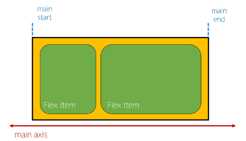
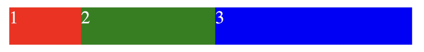

# Web - CSS Layout

<div style="text-align: right"> 24. 03. 07. </div>

## 1. CSS Box Model

### 1. CSS Box Model

* CSS Box Model

    * 모든 HTML 요소를 사각형 박스로 표현하는 개념

        * 원은 네모 박스를 깎은 것

* CSS Box Model의 구성 요소

    

    * 내용 Content

        * **Width, Height는 Content 영역의 크기를 나타냄** 
        
        * 시각적으로 보이는 Box의 영역 크기는 Border(Content + Padding)

        * **Box-sizing 속성**

        ```CSS
        * {
          box-sizing: border-box;  <!--content-box가 아닌 border-box로 바꿔줌-->
        }
        
        ```

    * 안쪽 여백 Padding

    * 테두리 Border

    * 외부 간격 Margin

    

* Box Type - Block & Inline

    ```CSS
    .index {
      display: block;
    }

    .index {
      display: inline;
    }
    ```

    * Normal Flow

        * CSS를 적용하지 않았을 경우 Web page 요소가 기본적으로

            * Inline type은 우측으로

            * Block type은 아래로 배치된다.

        

        * Block type 특징

            * 항상 새로운 행으로 나뉨

            * width와 height 속성을 사용해 너비 / 높이 지정 가능

            * 기본적으로 width 속성을 지정하지 않으면 box는 inline 방향으로 사용 가능한 공간을 모두 차지함 (너비를 사용가능한 공간의 100%로 채우는 것)

            * \<h1~6\> \<p\> \<div\> 등

        * Inline type 특징

            * 새로운 행으로 나뉘지 않음

            * width와 height 속성을 사용할 수 없음

            * 수직 방향

                * padding, margins, borders가 적용되지만 다른 요소를 밀어낼 수는 없음

            * 수평 방향

                * padding, margins, borders가 적용되어 다른 요소를 밀어낼 수 있음

            * \<a\>, \, \<span\>

            

            * text-align에 있어 text box뿐만이 아닌 margin 등에 대해서도 생각할 필요가 있다.

    * 기타 display 속성

        * Inline-Block

            * inline과 block 요소 사이의 중간 지점을 제공하는 display 값

            * block 요소의 특징을 가짐

                * width 및 height 속성을 가짐

                * padding, margin 및 border로 인해 다른 요소가 밀려남

            * 요소가 줄바꿈되는 것을 원하지 않으면서 너비와 높이를 적용하고 싶은 경우에 사용

        * None

            * 요소를 화면에 표시하지 않고, 공간조차 부여되지 않음

* 참고

    * shorthand 속성 - 'border'

        * border-width, border-style, border-color를 한번에 설정하기 위한 속성

            ```CSS
            <!-- 작성 순서는 영향을 주지 않음 -->

            border = 2px solid black
            ```

    * shorthand 속성 - 'margin' & 'padding'

        * 4방향의 속성을 각각 지정하지 않고 한번에 지정할 수 있는 속성

            ```CSS
            /* 4개 - 상우하좌 */
            margin: 10px 20px 30px 40px;
            padding: 10px 20px 30px 40px;

            /* 3개 - 상/좌우/하 */

            /* 2개 - 상하/좌우 */

            /* 1개 - 공통 */
            ```

    * Margin collapsing 마진 상쇄

        * 두 block type 요소의 margin top과 bottom이 만나 더 큰 margin으로 결합되는 현상

        * Web 개발자가 layout을 더욱 쉽게 관리할 수 있도록 함

        * 각 요소에 대한 상/하 margin을 각각 설정하지 않고 한 요소에 대해서만 설정하기 위함

        

## 2. CSS Position

### 1. CSS Layout

* CSS Layout

    * 각 요소의 위치와 크기를 조정해 Web page의 디자인을 결정하는 것

    * Display, Position, Float, Flexbox 등

### 2. CSS Position

* CSS Position

    * 요소를 Normal Flow에서 제거하여 다른 위치로 배치하는 것

        * 다른 요소 위에 올리기, 화면의 특정 위치에 고정시키기 등

    * Position 이동 방향

        

    * Position 유형별 특징

        | Position | Explanation |
        | :---: | :--- |
        | static | 기본값<br>요소를 Normal FLow에 따라 배치 |
        | absolute | 요소를 Normal Flow에서 제거<br>가장 가까운 relative 부모 요소를 기준으로 이동<br>문서에서 요소가 차지하는 공간이 없어짐 |
        | relative | 요소를 Normal Flow에 따라 배치<br>자기 자신을 기준으로 이동<br>요소가 차지하는 공간은 static일 때와 같음 |
        | fixed | 요소를 Normal Flow에서 제거<br>현재 화면 영역(viewport)을 기준으로 이동<br>문서에서 요소가 차지하는 공간이 없어짐 |
        | sticky | 요소를 Normal Flow에 따라 배치<br>요소가 일반적인 문서 흐름에 따라 배치되다가 스크롤이 특정 임계점에 도달하면 그 위치에서 고정됨(fixed)<br>만약 다음 sticky 요소가 나오면 다음 sticky 요소가 이전 sticky 요소의 자리를 대체함<br>    ▶ 이전 sticky 요소가 고정되어 있던 위치와 다음 sticky 요소가 고정되어야 할 위치가 겹치게 되기 때문 |
        | | 


        * 상하좌우, Z축 (요소들을 겹치기 위해) 총 5방향으로 움직일 수 있다

        ```
        * 상대 위치(relative position) : 자신의 정적 위치(static position)을 기준으로 이동

        * 절대 위치(absolute position) : 자신의 고정 위치가 없음 → 이동 시 자신의 static이 아닌 부모(단, 부모가 static이면 안 됨 → 부모 설정에도 신경써야 함)를 찾아감
        
        * 고정 위치(fixed position) : 페이지가 아닌 우리가 보는 화면 기준으로 위치를 벗어나지 않음(고정)

        ```
        
        * z-index

            * 요소가 겹쳤을 때 어떤 요소 순으로 위에 나타낼지 결정

            * 정수 값을 사용해 Z축 순서를 지정

            * 더 큰 값을 가진 요소가 작은 값의 요소를 덮음

* Position의 역할

    * 전체 page에 대한 layout을 구성하는 것이 아닌, **page 특정 항목의 위치를 조정**하는 것

### 3. CSS Flexbox

* CSS Flexbox

    * 요소를 행과 열 형태로 배치하는 1차원 layout 방식

        * Position은 하나씩 가지고 와서 붙이는 느낌

* Flexbox 구성 요소

    

    * 행과 열에 대한 축 - Main / Cross Axes

        

        * Main Axis (주축)

            * Flex item들이 배치되는 기본 축

            * Main start에서 시작하여 Main end 방향으로 배치 (기본값 기준)

        

        * Cross Axis (교차축)

            * Main Axis에 대해 수직인 축 (세로축이 아님)

            * Cross start에서 시작해 Cross end 방향으로 배치 (기본값 기준)

    

    * Flex Container : 모든 요소들의 부모 역할 (가장 중요)

        * display: flex; 혹은 display: inline-flex; 가 설정된 부모 요소

        * 이 컨테이너의 1차 자식 요소들이 Flex Item이 됨
        
    * Flex Item

        * Flex Container 내부에 layout되는 항목

    ```CSS
    <style>
    .container {
      height: 500px;
      border: 1px solid black;
      display: flex;
      /* flex-direction: row; */
      /* flex-direction: row-reverse; */
      /* flex-direction: column; */
      /* flex-direction: column-reverse; */

      /* flex-wrap: nowrap; */
      flex-wrap: wrap;

      /* justify : Main axis */
      /* justify-content: flex-start; */
      /* justify-content: center; */
      /* justify-content: flex-end; */

      /* align : Cross axis */
      /* align-content: flex-start; */
      /* align-content: center; */
      /* align-content: flex-end; */

      /* item들이 1줄인 경우에만 정렬에 align-items 사용 가능 */
      /* align-items: center; */

    }

    .post {
      background-color: grey;
      border: 1px solid black;
      margin: 0.5rem;
      padding: 0.5rem;
    }

    /* 개별 item을 따로 움직여주고 싶을 때 - 부모 flex container을 따르지 않는 유일한 예외 */
    /* 교차축 기준으로 혼자 움직임 */
    .item1 {
      align-self: flex-start;
    }

    .item2 {
      align-self: flex-end;
    }
    </style>
    ```

    * 목적에 따른 속성 분류

        | 배치 | 공간 분배 | 정렬 |
        | :---: | :---: | :---: |
        | flex-direction<br>flex-wrap | justify-content<br>align-content | align-items<br>align-self |
        | |

        | justify | align |
        | :---: | :---: |
        | 주 축 | 부 축 |
        | |

        | content | items | self |
        | :---: | :---: | :---: |
        | 여러 줄 | 한 줄 | 요소 한 개 |
        | |

    * flex-grow

        * **남는 행 여백**을 비율에 따라 각 flex item에 분배

            * item이 container 내에서 확장하는 비율을 지정

        * flex-grow의 반대는 flex-shrink

        

        

        ```CSS
          <style>
            .container {
              width: 100%;
              display: flex;
            }

            .item {
              height: 100px;
              color: white;
              font-size: 3rem;
            }

            /* flex-grow 주의 */
            .item-1 {
              background-color: red;
              flex-grow: 1;
            }

            .item-2 {
              background-color: green;
              flex-grow: 2;
            }

            .item-3 {
              background-color: blue;
              flex-grow: 3;
            }
          </style>
        ```

    * flex-basis

        * flex item의 초기 크기 값을 지정

        * flex-basis와 width 값을 동시에 적용한 경우 flex-basis가 우선

### 4. Flex-Wrap 응용

* 반응형 레이아웃

    * 다양한 디바이스와 화면 크기에 자동으로 적응하여 콘텐츠를 최적으로 표시하는 Web layout 방식

    

    ```CSS
    <style>
      .card {
        width: 80%;
        border: 1px solid black;
        display: flex;
        flex-wrap: wrap;
      }

      img {
        width: 100%;
      }

      .thumbnail {
        flex-basis: 700px;
        flex-grow: 1;
      }

      .content {
        flex-basis: 350px;
        flex-grow: 1;
      }
    </style>
    ```