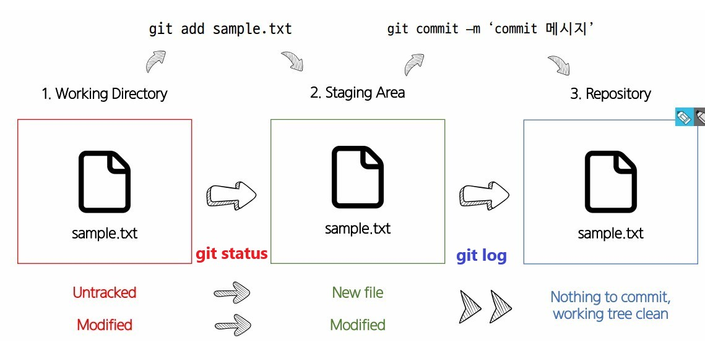

# SSAFY 11기 스타트캠프

 24. 01. 02. ~ 24. 01. 12 

* **Markdown**
  * 일반 텍스트로 문서를 작성하는 간단한 방법
  * 주로 개발자들이 텍스트와 코드를 출력해 문서화하기 위해 사용
  * 작성된 Markdown 문서는 다른 프로그램에 의해 변환되어 출력됨
  * HTML의 light한 버전, 개발자들이 많이 사용하는(텍스트, 코드 등 기술문서)문서 format으로, 문법이 간단해 작성하기 편하고 pdf 등 다른 파일로 변환하기 용이함
    * HTML : Hyper Text Markup Language

* **CLI**
  * **C**ommand **L**ine **I**nterface
  * 명령어를 통해 사용자와 컴퓨터가 상호작용하는 방식
  * CLI는 GUI에 비해 사용하기 어렵지만 단계가 적고 성능을 상대적으로 더 적게 소모
  * 수많은 서버/개발 시스템이 CLI를 통한 조작 환경을 제공
    * GUI : Graphic User Interface

* 분산버전관리시스템 **Git**
  * 변경된 이력(version history)을 기록/추적
  * **최종본**에 해당하는 마지막 파일과, **변경 이력**만 저장
  * 분산
    * 중앙 집중식
      * 버전은 중앙 서버에 저장
      * 중앙 서버에서 파일을 가져와 다시 중앙에 업로드
      * 리스크 관리가 힘듬
    * **분산식**
      * 버전을 여러 개의 복제된 저장소에 저장 및 관리
        * 중앙 서버에 의존하지 않고도 동시에 다양한 작업을 수행할 수 있음
        * 개발자들 간의 작업 충돌을 줄여주고 개발 생산성 향상
      * 중앙 서버의 장애나 손실에 대비해 백업/복구 용이
      * 인터넷에 연결되지 않은 환경에서도 작업을 계속할 수 있음
        * 변경 이력과 코드를 로컬 저장소에 기록하고, 나중에 중앙 서버로 동기화
  * Git의 3가지 영역
    * **Working Directory**
      * 실제 작업중인 파일들이 위치하는 영역
    * **Staging Area**
      * Working Directory에서 변경된 파일 중, 다음 버전에 포함시킬 파일들을 선택적으로 추가하거나 제외할 수 있는 중간 준비 영역
    * **Repository**
      * 버전(commit) 이력과 파일들이 영구적으로 저장되는 영역
      * Commit
        * 변경된 파일들을 저장하는 행위
        * 'snapshot'이라고도 함, 'version'과 거의 일치하는 개념
  * 원격 저장소
    * 코드와 버전 관리 이력을 온라인상의 특정 위치에 저장해, 여러 개발자가 협업하고 코드를 공유할 수 있는 저장 공간
    * GitLab, GitHub, Bitbucket 등

    

    | Terminal Command | Comments |
    | --- | --- |
    | git init | 터미널이 가리키는 타겟 위치에 git 저장소(Working Directory) 생성 |
    | git add | 파일에 변동사항이 발생 시 변동사항 저장 |
    | git status | Working Directory와 Staging Area의 상태 |
    | git add <file>... | Working Directory에 새로 생성한/변동사항이 있는 파일을 Staging Area에 추가 |
    | git config | Commit 작성자 설정, --global로 설정 후 앞으로 재입력하지 않음 |
    | git commit | Staging Area에 있는 파일을 저장소에 기록 → 해당 시점의 버전을 생성하고 변경 이력을 남기는 것 |
    | git log | commit 내역(이력)을 보기 |
    | git remote add origin (remote_repo_url) | Local data를 remote에 저장하기 위해, 어디로 보내야 하는지 원격 저장소 정보(주소 및 이름) 등록 필요시 사용하는 명령어, 로컬 저장소에 원격 저장소 주소 추가 |

* **기타 용어 정리**
  * Application
    * 고유한 기능을 가진 모든 소프트웨어
  * ChatGPT
    * Generative / Pretrained / Transformer
    * 텍스트 기반으로 질문/요청에 대해 결과값을 생성/응답
    * 질문하기(prompting)
  * Interface
    * 사용자가 기기를 쉽게 동작시키는 데 도움을 주는 시스템
    * 서로 다른 두 개의 시스템 사이에서 정보나 신호를 주고받는 접점
    * 예시
      * 컴퓨터의 키보드, 마우스, 모니터
      * TV의 리모콘
      * 자동차의 악셀, 브레이크, 페달
      * 스마트폰의 터치스크린 등
  * UI
    * User Interface
    * 사용자와 SW 간 상호 작용 시스템
    * 예시
      * ATM의 언어 선택 화면, 인출 및 입금 옵션 등
      * 브라우저의 탭, 뒤로 가기 버튼, 스크롤 등
      * 스마트폰 앱의 스와이프 제스처, 아이콘, 푸시 알림 등
  * API
    * Application Programming Interface
    * 두 SW가 서로 통신할 수 있게 하는 메커니즘
    * 예시
      * 기상 데이터가 들어가 있는 기상청의 시스템 ↔ 스마트폰의 날씨 앱, 웹사이트의 날씨 정보 등 다양한 기상 서비스들
        * 서버 ↔ 클라이언트 간에 **정해진 형태(약속)**로 요청을 보내고, **정해진 형태**로 응답을 보냄
        * 서버에 요청 시 **API Key**와 **URL 주소**가 필요함
        * 

