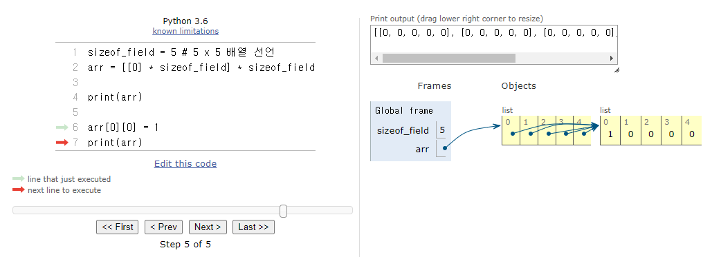
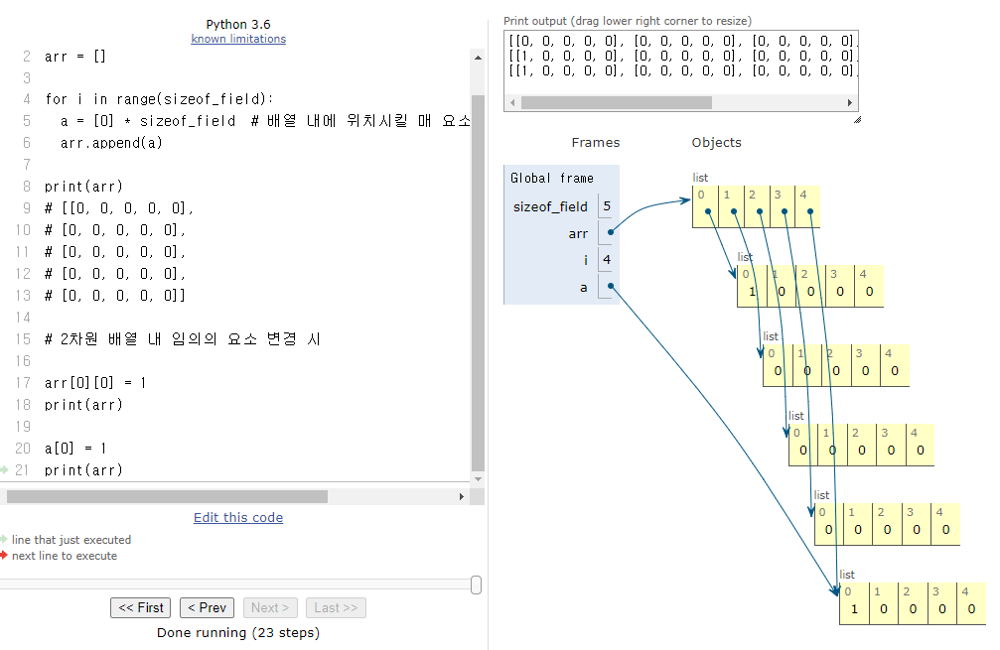
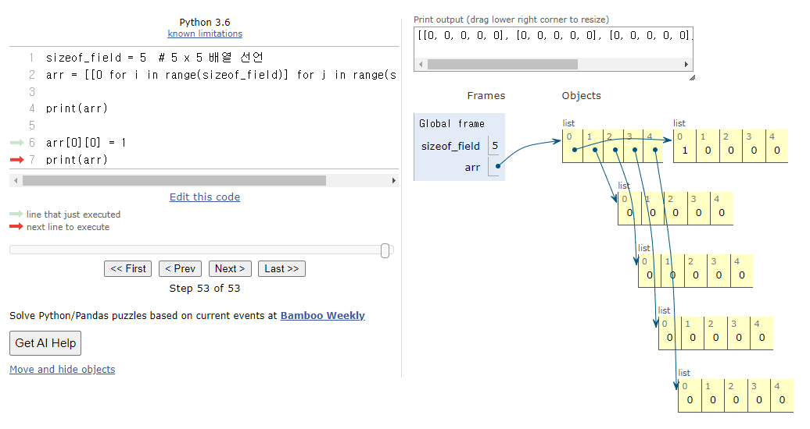

# 2차원 배열 선언하기 - Shallow Copy Problem

## [BAEKJOON #2563](https://www.acmicpc.net/problem/2563) - 24. 01. 23.

* 문제

    가로, 세로의 크기가 각각 100인 정사각형 모양의 흰색 도화지가 있다. 이 도화지 위에 가로, 세로의 크기가 각각 10인 정사각형 모양의 검은색 색종이를 색종이의 변과 도화지의 변이 평행하도록 붙인다. 이러한 방식으로 색종이를 한 장 또는 여러 장 붙인 후 색종이가 붙은 검은 영역의 넓이를 구하는 프로그램을 작성하시오.

* 입력

    첫째 줄에 색종이의 수가 주어진다. 이어 둘째 줄부터 한 줄에 하나씩 색종이를 붙인 위치가 주어진다. 색종이를 붙인 위치는 두 개의 자연수로 주어지는데 첫 번째 자연수는 색종이의 왼쪽 변과 도화지의 왼쪽 변 사이의 거리이고, 두 번째 자연수는 색종이의 아래쪽 변과 도화지의 아래쪽 변 사이의 거리이다. 색종이의 수는 100 이하이며, 색종이가 도화지 밖으로 나가는 경우는 없다

* 출력

    첫째 줄에 색종이가 붙은 검은 영역의 넓이를 출력한다.


## 예시 1. 1차원 배열 선언

```python
row = 10
arr = [0] * rows

print(arr)
# [0, 0, 0, 0, 0, 0, 0, 0, 0, 0]
```

## 예시 2. 2차원 배열 선언에서의 문제 - shallow copy

```python
# 1차원 배열 선언과 같은 방식으로 2차원 배열을 선언하면 문제가 발생할 수 있다.

sizeof_field = 5  # 5 x 5 배열 선언
arr = [[0] * sizeof_field] * sizeof_field

print(arr)
# [[0, 0, 0, 0, 0],
# [0, 0, 0, 0, 0],
# [0, 0, 0, 0, 0],
# [0, 0, 0, 0, 0],
# [0, 0, 0, 0, 0]]

# 2차원 배열 내 임의의 요소 변경 시

arr[0][0] = 1
print(arr)
# [[1, 0, 0, 0, 0],
# [1, 0, 0, 0, 0],
# [1, 0, 0, 0, 0],
# [1, 0, 0, 0, 0],
# [1, 0, 0, 0, 0]]

# Python에서는 * 연산자를 이용해 배열을 선언하게 되면 얕은 복사(Shallow Copy)가 진행되어, 배열 내 요소들이 모두 같은 객체를 가리키게 된다.
# → 이 방식으로 2차원 배열을 선언하고 요소를 변경하게 되면 다른 요소들도 영향받게 된다.
```




```python
# 1. for문 활용 - 문제 발생 소지가 있음

sizeof_field = 5  # 5 x 5 배열 선언
arr = []

for i in range(sizeof_field):
  a = [0] * sizeof_field  # 배열 내에 위치시킬 매 요소마다 새로운 배열을 선언
  arr.append(a)

print(arr)
# [[0, 0, 0, 0, 0],
# [0, 0, 0, 0, 0],
# [0, 0, 0, 0, 0],
# [0, 0, 0, 0, 0],
# [0, 0, 0, 0, 0]]

# 2차원 배열 내 임의의 요소 변경 시

arr[0][0] = 1
print(arr)
# [[1, 0, 0, 0, 0],
# [0, 0, 0, 0, 0],
# [0, 0, 0, 0, 0],
# [0, 0, 0, 0, 0],
# [0, 0, 0, 0, 0]]

# 마지막으로 선언한 요소 a가 arr의 마지막 요소와 같은 객체를 가리키고 있어, a가 변경되면 arr의 마지막 요소도 같이 변경된다.

a[0] = 1
print(arr)
# [[1, 0, 0, 0, 0],
# [0, 0, 0, 0, 0],
# [0, 0, 0, 0, 0],
# [0, 0, 0, 0, 0],
# [1, 0, 0, 0, 0]]

# for문 반복 후 a를 한번 더 선언하는 방식 등으로 arr 내 객체와 연결되지 않게 하면 될 것.
```


```python
# 2. list comprehension 활용

sizeof_field = 5  # 5 x 5 배열 선언
arr = [[0 for i in range(sizeof_field)] for j in range(sizeof_field)]

print(arr)
# [[0, 0, 0, 0, 0],
# [0, 0, 0, 0, 0],
# [0, 0, 0, 0, 0],
# [0, 0, 0, 0, 0],
# [0, 0, 0, 0, 0]]

# 2차원 배열 내 임의의 요소 변경 시

arr[0][0] = 1
print(arr)
# [[1, 0, 0, 0, 0],
# [0, 0, 0, 0, 0],
# [0, 0, 0, 0, 0],
# [0, 0, 0, 0, 0],
# [0, 0, 0, 0, 0]]
```


## 완성 코드

```python
import sys

n = int(input())

sizeof_field = 100  # 100 x 100 면적의 도화지
sizeof_paper = 10 # 10 x 10 면적의 색종이

field = [[0 for i in range(sizeof_field)] for j in range(sizeof_field)]

# shallow copy problem이 야기되는 2차원 배열 선언 방식
# field = [[0] * sizeof_field] * sizeof_field

for i in range(n):
    x, y = list(map(int, sys.stdin.readline().split()))

    for paper_x in range(x, sizeof_paper + x):
        for paper_y in range(y, sizeof_paper + y):
            if field[paper_x][paper_y] < 1:
                field[paper_x][paper_y] = 1

area = 0
for i in range(sizeof_field):
    area += field[i].count(1)

print(area)
```

## 참고 : A = copy.deepcopy(a)
## [BAEKJOON #17143](https://www.acmicpc.net/problem/17143) - 24. 03. 05.

```python
import copy
import sys

def func(col):
    global field, ret

    def shark_move(shark):                  # 상어의 움직임 및 포식을 표현(field_func에서 상어의 위치에 상어의 번호 입력)
        n, r, c, s, d, z = shark
        cnt = s

        if d == 1:
            dir = -1
            while cnt > 0:
                if (r == 0 and dir == -1) or (r == R - 1 and dir == 1):
                    dir *= -1
                r += dir
                cnt -= 1
            d = 1 if dir == -1 else 2

        elif d == 2:
            dir = 1
            while cnt > 0:
                if (r == 0 and dir == -1) or (r == R - 1 and dir == 1):
                    dir *= -1
                r += dir
                cnt -= 1
            d = 2 if dir == 1 else 1

        elif d == 3:
            dir = 1
            while cnt > 0:
                if (c == 0 and dir == -1) or (c == C - 1 and dir == 1):
                    dir *= -1
                c += dir
                cnt -= 1
            d = 3 if dir == 1 else 4

        elif d == 4:
            dir = -1
            while cnt > 0:
                if (c == 0 and dir == -1) or (c == C - 1 and dir == 1):
                    dir *= -1
                c += dir
                cnt -= 1
            d = 4 if dir == -1 else 3

        if field_func[r][c]:
            if sharks[field_func[r][c]][5] > z:     # 상어 크기 비교해서 포식 표현
                living_shark[n] = 0
                return
            else:
                living_shark[field_func[r][c]] = 0
                field_func[r][c] = n
                return [n, r, c, s, d, z]
        else:
            field_func[r][c] = n
            return [n, r, c, s, d, z]

    field_func = [[0] * C for _ in range(R)]        # 새로이 field 배열을 만들어서 deepcopy해 줄 것

    for r in range(R):
        if field[r][col] > 0:
            ret += sharks[field[r][col]][5]
            living_shark[field[r][col]] = 0
            break

    for shark in sharks[1:]:                        # sharks 배열 내 0번째 dummy 요소는 제외
        if living_shark[shark[0]]:
            v = shark_move(shark)
            if v:
                sharks[v[0]] = v

    field = copy.deepcopy(field_func)               # global variable field를 함수 내에서 새로이 만든 field_func로 대체


R, C, M = map(int, sys.stdin.readline().split())    # 행, 열 크기, 상어 마릿수
sharks = [[]]                                       # 상어의 번호를 1부터 붙여주고, 이를 index로 사용하기 위해 0번째 빈 list를 넣어줌
field = [[0] * C for _ in range(R)]                 # 수조

for n in range(1, 1 + M):
    r, c, s, d, z = map(int, sys.stdin.readline().split())
    sharks.append([n, r - 1, c - 1, s, d, z])       # 상어 번호를 추가하고, 행 / 열을 조정하여 sharks 배열에 입력
    field[r - 1][c - 1] = n

living_shark = [1] * (1 + M)                        # 상어가 잡아먹히거나 낚시꾼에 잡히면 0으로 만들 것

ret = 0                                             # 낚시꾼에게 잡힌 상어의 크기 합산

for c in range(C):
    func(c)

print(ret)
```